# Introduction to Oracle Machine Learning AutoML UI

## Introduction

This lab walks you through the steps to create an AutoML experiment, edit and adjust experiment settings, view and deploy OML models.

Estimated Time: 15 minutes

### About Oracle Machine Learning AutoML UI

Oracle Machine Learning AutoML UI (OML AutoML UI) is a no-code user interface supporting automated machine learning for both data scientist productivity and non-expert user access to powerful in-database algorithms. Like the OML4Py AutoML API, it accelerates machine learning projects by giving quick feedback on data set suitability for producing useful models – alleviating much of the drudgery of the machine learning process.
Oracle Machine Learning AutoML UI automates model building with minimal user input – you just have to specify the data and the target in what’s called an experiment and the tool does the rest. However, you can adjust some settings, such as the number of top models to select, the model selection metric, and even specific algorithms.
With a few clicks, you can generate editable _starter_ notebooks. These notebooks contain data selection, building the selected model – including the settings used to produce that model – and scoring and evaluation code – all in Python using OML4Py. You can build on this _generated notebook_ to apply your own domain expertise to augment the solution. Similarly, you can deploy models from OML AutoML UI as REST endpoints to Oracle Machine Learning (OML) Services in just a few clicks.

### Objectives

In this lab, you will learn how to:
* Access Oracle Machine Learning AutoML UI
* Create an experiment
* Edit and adjust experiment settings
* View the leaderboard and other settings
* Deploy a model to Oracle Machine Learning Services
* View Oracle Machine Learning Models menu with deployed metadata and REST endpoint
* Create a notebook for the top model
* View generated notebook and individual paragraphs

### Prerequisites

This lab assumes you have:
* An Oracle Machine Learning account
* All previous labs successfully completed

## Task 1: Access Oracle Machine Learning AutoML UI

To access AutoML UI, you must sign into the Oracle Machine Learning User Interface, which also includes Oracle Machine Learning notebooks, on Autonomous Database:

1. Sign into Oracle Machine Learning user interface (following Lab1, Task 1 instructions).

2. On your Oracle Machine Learning user interface home page, click **AutoML** in the Quick Actions section.

	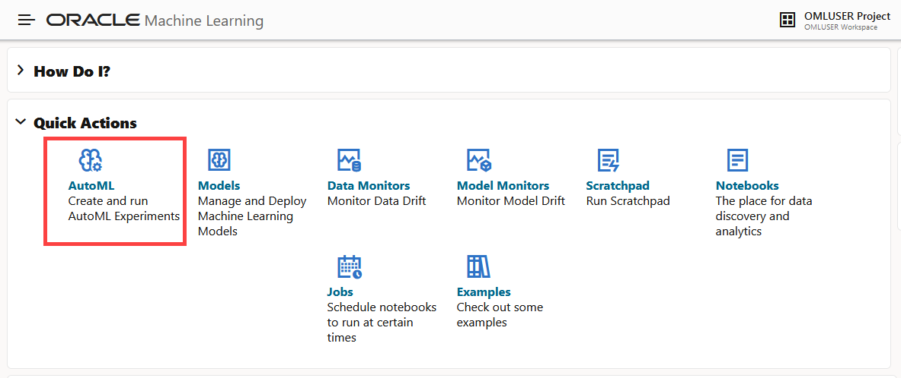

	Alternatively, you can click the Cloud menu icon 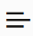 on the top left corner of the home page to open the left navigation menu. Click **AutoML Experiments**. This opens the AutoML Experiments page.

	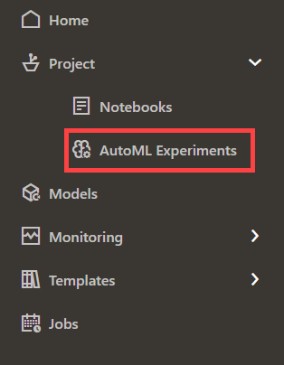

## Task 2: Create and Run an AutoML UI Experiment

An Experiment is as a work unit that contains the definition of data source, prediction target, and prediction type along with optional settings. After an Experiment runs successfully, it presents you a list of machine learning models in the leader board. You can select any model for deployment, or use it to create a notebook based on the selected model.
When creating an Experiment, you must define the data source and the target of the experiment.

When creating an experiment, you must specify the data source and the target of the experiment. An AutoML experiment can process columns with data type ``VARCHAR2`` greater than 4K , ``CHAR``, ``CLOB``, ``BLOB``, and ``BFILE`` as text. Note that columns with data type ``VARCHAR2`` less than 4K are considered as categorical.

To create an Experiment:

1. Click **AutoML** on your Oracle Machine Learning user interface home page. Alternatively, you can go to the left navigation menu at the upper left corner of the page and click **AutoML Experiments**. The AutoML Experiments page opens.

	

2. Click **Create**. The Create Experiments page opens.

	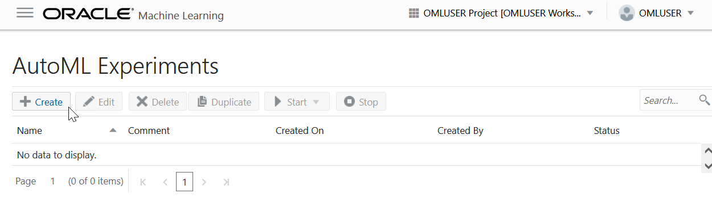

3. In the **Name** field, enter **Customers 360**.

4. In the **Comments** field, enter comments, if any.

5. In the **Data Source** field, click the search icon to open the Select Table dialog. On the Select Table dialog, the OMLUSER schema is selected by default. On the right pane, click **CUSTOMERS360** from the list of tables. Click **OK**.

	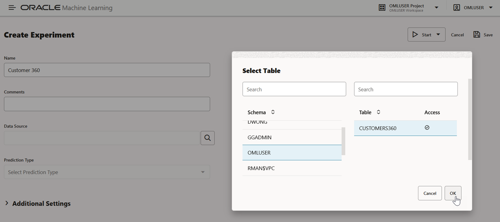

6. In the **Predict** drop-down list, select the column **AFFINITY_CARD** from the ``CUSTOMERS360`` table. You can also type the column name and the column names are filtered for easier selection. This is the target for your prediction.

7. In the **Prediction Type** field, the prediction type is automatically selected based on target field data type and cardinality. In this lab, **Classification** is automatically selected.	The supported prediction types are:

	* Classification: For non-numeric data type, Classification is selected by default. Classification may be selected for small cardinality numeric data as well.
	* Regression: For numeric data type, Regression is selected by default.

8. In the **Case ID** field, select **CUST_ID**. For easier selection, you can also type the column name and the column names are filtered. The Case ID helps in data sampling and dataset split to make the results reproducible between experiments. It also aids in reducing randomness in the results. This is an optional field.

	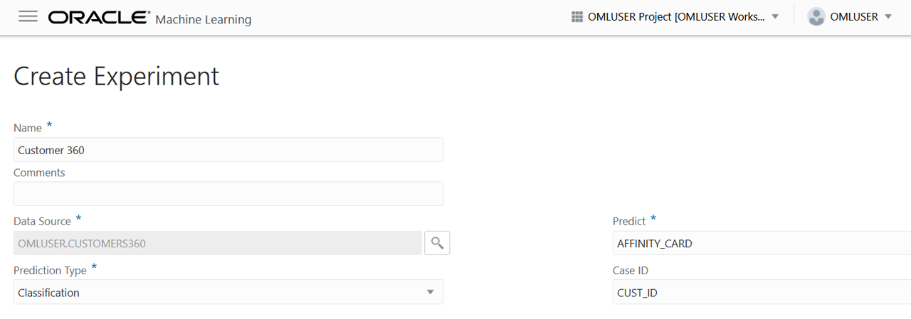

9. To adjust additional settings of this experiment, expand the **Additional Settings** section on the Experiments page, and make the following changes:

	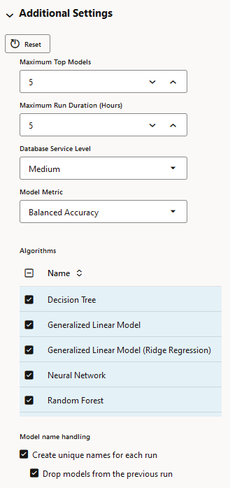

10. **Maximum Top Models:** Click the down arrow and set it to 3. This is the maximum number of top models to create. The default is 5 models. Fewer models built results is less time and the experiment will complete sooner.

11. **Maximum Run Duration:** This is the maximum time for which the experiment will be allowed to run. Retain the default entry 8. If you do not enter a time, then the experiment will be allowed to run up to the default, which is 8 hours am extreme upper bound.

12. **Database Service Level:** This is the database connection service level and query parallelism level. Default is **Low**. Change this to **Medium**.

	*  **High** level gives the greatest parallelism but significantly limits the number of concurrent jobs.
	*  **Medium** level enables some parallelism but allows greater concurrency for job processing.

	> **Note:** Changing the database service level setting on the Always Free Tier will have no effect since there is a 1 OCPU limit. However, if you increase the OCPUs allocated to your autonomous database, then you can increase the Database Service Level to Medium or High.

13. Leave the default algorithms selected. 

14. Under **Model Name Handling**, select:

	* **Create unique names for each run:** Select this option to generate model names that are unique. Selecting this option also gives you the choice to select or deselect the option Drop models from the previous run.
	* **Drop models from the previous run:** Select this option to drop the models that were generated in the prior experiment runs. Deselect this option to retain the models that were generated in the prior runs. These models are available in the user schema.

15. Now scroll up the page, and click **Start.** Click **Faster Results** to trigger the AutoML UI experiment to run.

	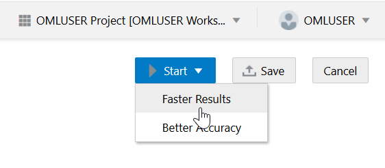

	Note the following about the two options:

	* **Faster Results:** Select this option if you want to get candidate models sooner, possibly at the expense of accuracy. This option works with a smaller set of pipeline combinations and hence yields faster results.
	* **Better Accuracy:** Select this option if you want more pipeline combinations to be tried for possibly more accurate models. A pipeline is defined as an algorithm, selected data feature set, and set of algorithm hyperparameters.

> **Note:** This option works with the broader set of hyperparameter options recommended by the internal meta-learning model. Selecting Better Accuracy will take longer to run your experiment, but may provide models with more accuracy.

This completes the task of creating an experiment.
When an experiment starts running, the status is displayed in a progress bar. When an experiment runs, it starts to show the results in the Leader Board. Click **Details** next to the **Stop** button to view the experiment run details, as shown in the screen shot.

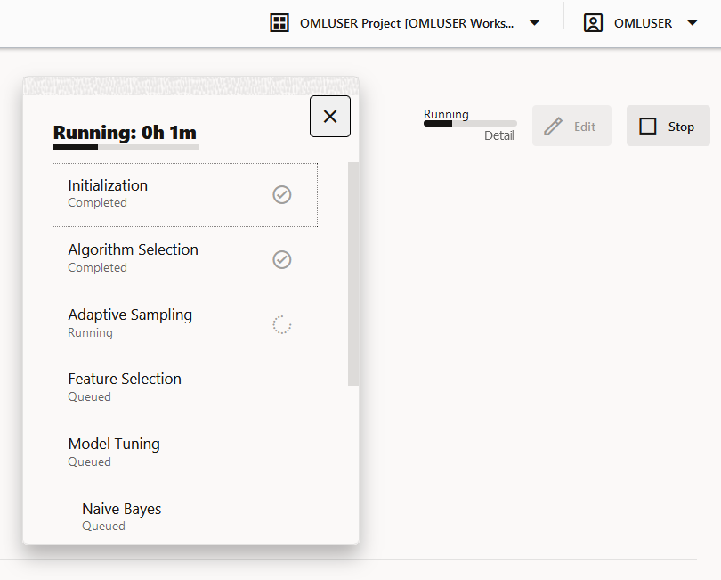

## Task 3: View an AutoML UI Experiment
The Leader Board displays the top performing models relative to the model metric selected along with the algorithm and accuracy. Here,  you will view the additional metrics Precision, Recall, ROC AUC for the models:

1. Scroll down the Customer 360 experiments page to view the Leader Board section. The top three algorithms for this experiment are Naïve Bayes, Random Forest and Support Vector Machine (Linear).

	>**Note:** Only when the experiment is completed, can you perform any of these actions listed here, including metrics 	selection.

	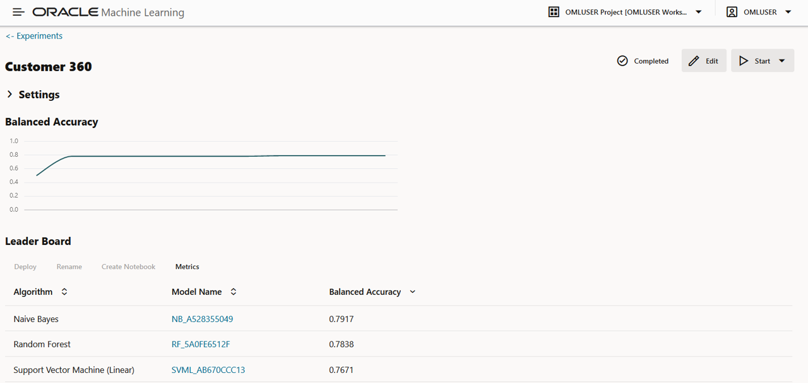

2. Click on the Naive Bayes model row, and not on the model. This highlights the model row in blue. Click **Metrics**. The **Select Additional Metrics** dialog opens.

	> **Note:** The additional metrics can be selected once the experiment has completed.

	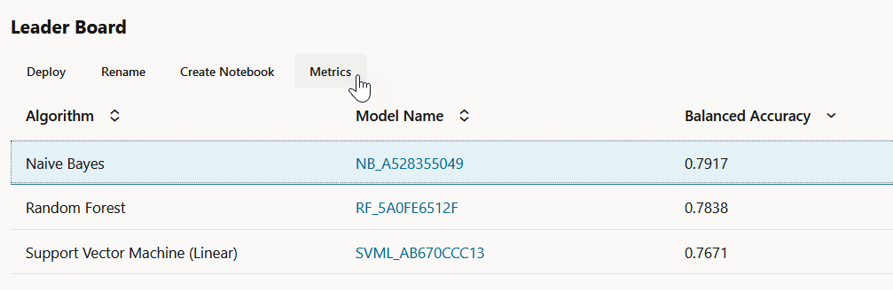

3. In the Select Additional Metrics dialog, click **Precision, Recall, ROC AUC**, and then click the close icon to close the dialog.

	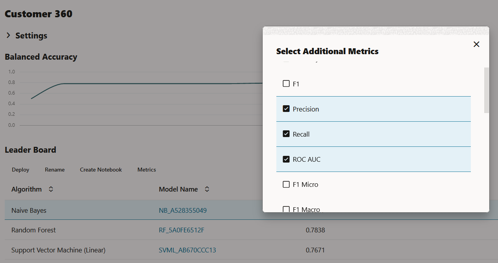

	The Leader Board now displays the selected metrics, as shown in the screenshot here. You can sort the rows by clicking the triangle to the right of each column name.

	

4. Click on any row in the Leader Board to enable the options - **Deploy, Rename**, and **Create Notebook**. Note that these options are greyed out if you do not click on the rows.

5. Click on the Naïve Bayes model row (and not on the model), and then click **Rename**. In the Rename Model dialog, enter `NB_Customer360` to rename the auto generated model name for Naive Bayes. Click **OK**.  	

	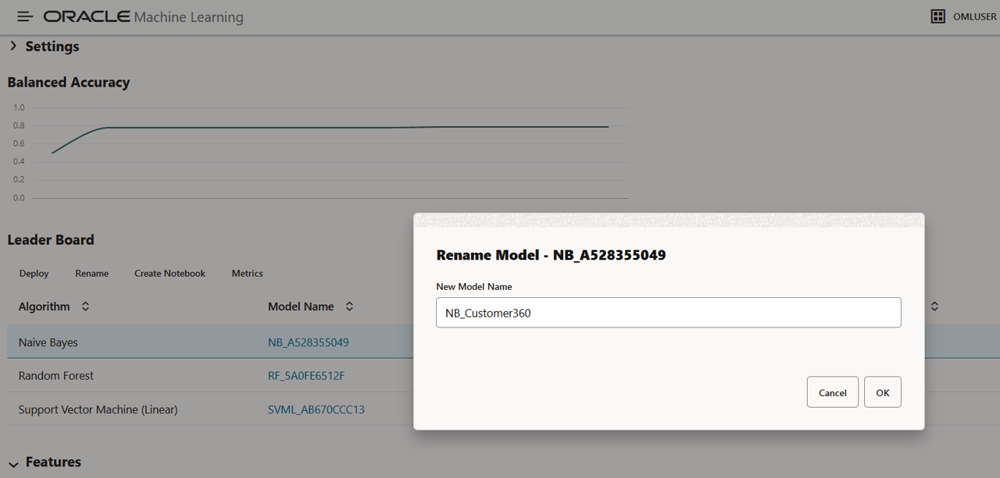

6. Click **OK**. A confirmation message is displayed once the renaming is complete.

	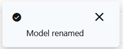

	The leader board refreshes to display the renamed model.

	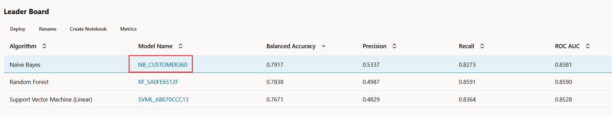

7. Click on any model name to view the model details in the Model Detail dialog. Click **Prediction Impacts** and **Confusion Matrix** tab in the dialog to view the respective details, as shown in the screenshots below:

	* **Prediction Impact:** Displays the importance of the attributes in terms of the target prediction of the models. In this lab, the attribute HOUSEHOLD_SIZE has the highest impact on target prediction. Move your cursor over the prediction impact chart for each attribute to view the values.

		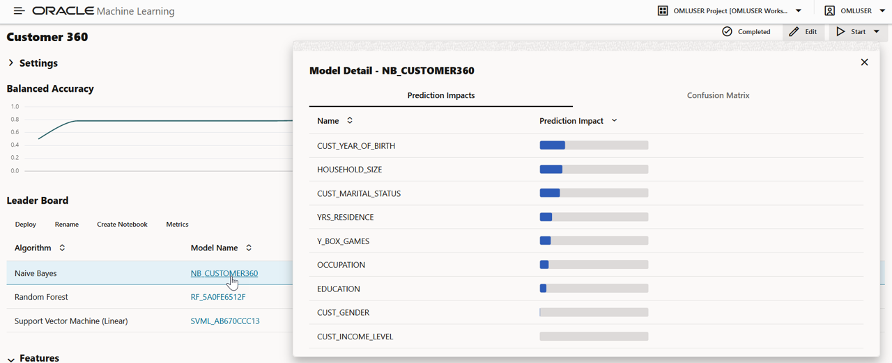

	* **Confusion Matrix:** Characterizes the accuracy of a model, including the types of errors made. It is computed by OML AutoML UI on a random subset of the original data (based on the cross-validation process) to help assess the model quality. Because our target is binary, the results are classified into true positive (actual = predicted = 1), true negative (actual = predicted = 0), false positive (actual = 0, predicted = 1) and false negative (actual = 1, predicted = 0).

		> Note: The values shown here represent percentages of the test data that correspond to each of the confusion matrix entries.

		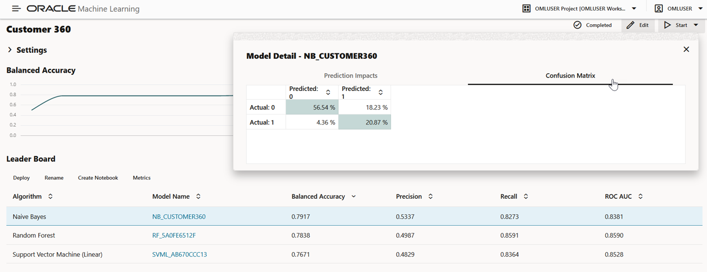

8. To go back to the AutoML Experiments page, scroll up the page and click **<-Experiments**.

	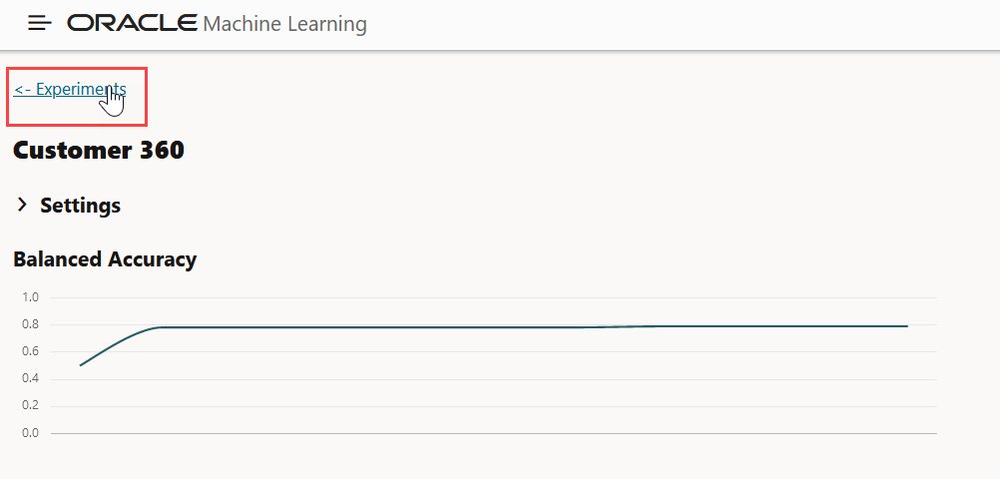

	Alternatively, you can click the Cloud menu icon 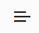 on the top left corner of the experiment page and click **AutoML Experiments** on the left navigation menu.

## Task 4: Deploy a Top Model to Oracle Machine Learning Services

When you deploy a model using the Oracle Machine Learning AutoML UI, you create an Oracle Machine Learning Services endpoint for scoring. Oracle Machine Learning Services extends Oracle Machine Learning functionality to support model deployment and model lifecycle management for in-database OML models through REST APIs.

> **Note:** Through Oracle Machine Learning AutoML UI, you can deploy in-database models only, not ONNX-format models.

To deploy a model:  

1. Go to the AutoML Experiments page by clicking the Cloud menu icon  on the top left corner of the page to open the left navigation pane, and then clicking **AutoML Experiments.**  Alternatively, you can also click **<-Experiments** to directly open the **AutoML Experiments** page.  

	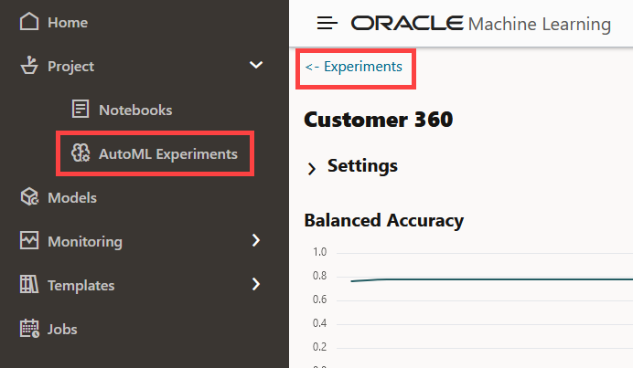

2. On the AutoML Experiments page, click on the **Customer 360** experiment to open it.

	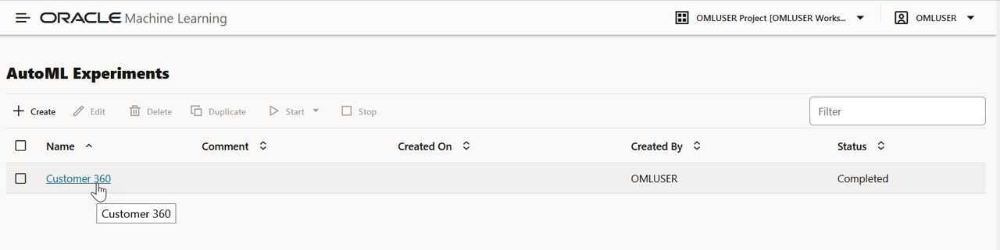

3. Scroll down to the Leader Board of the experiment, click on the **NB_CUSTOMER360** model row. Clicking on a model row enables all the Leader Board options - Deploy, Rename, Create Notebooks, and Metrics. Click **Deploy**. The Deploy Model dialog opens.

	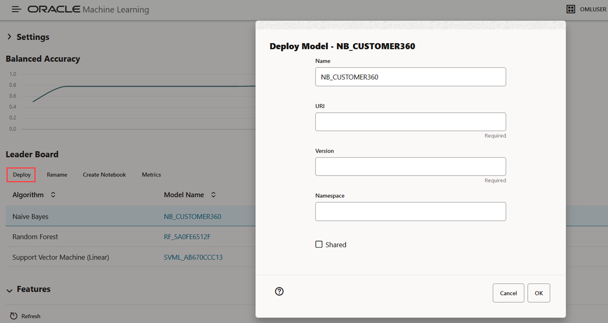

	> **Note:** You can also deploy a model from the Models page. You can access the Models page from the home page and the left navigation menu.  

4. In the Deploy Models dialog, enter the following details:
-  In the **Name** field, the model name is displayed here by default. In this example, the name `NB_CUSTOMER360` is displayed. This is the name that you renamed in the previous step.
	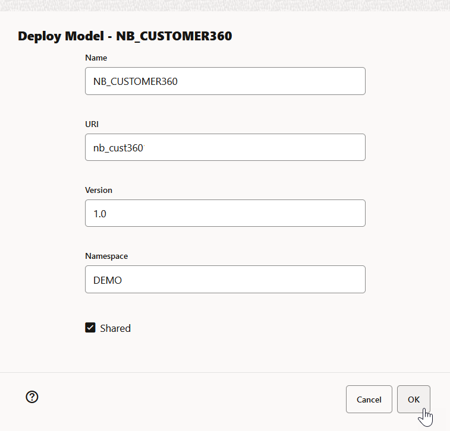

-  In the **URI** field, enter **nb_cust360**. The URI must be alphanumeric, and the length must be max 200 characters.

-  In the **Version** field, enter **1.0**. The version must be in the format ``xx.xx`` where x is a number.

-  In the **Namespace** field, enter **DEMO**. This is the name for the model namespace. You can specify any name here to create different namespaces.

	> **Note:** Namespace is case sensitive.

-  Click **Shared** to allow users with access to the database schema to view and deploy the model.

-  Click **OK**. After a model is successfully deployed, a confirmation message is displayed stating that _The selected model has been deployed successfully_, as shown in the screenshot below. The deployed model is listed under Deployments.

	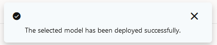

This completes the task of deploying the top model Naïve Bayes to Oracle Machine Learning Services.

## Task 5: View Oracle Machine Learning Models with Deployed Metadata and REST Endpoint

The deployed models are listed under **Deployments** on the Models page. To view the metadata of the deployed model **NaiveBayes_CUST360**:

1. To go to Deployments, click the Cloud menu icon  to open the left navigation menu. Click  **Models**. Alternatively, you can click **Models** on the Oracle Machine Learning UI home page.

  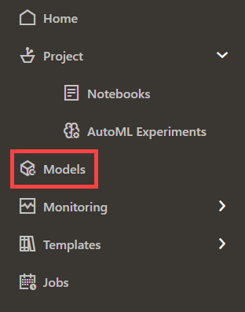

2. On the Models page, click **Deployments**.

	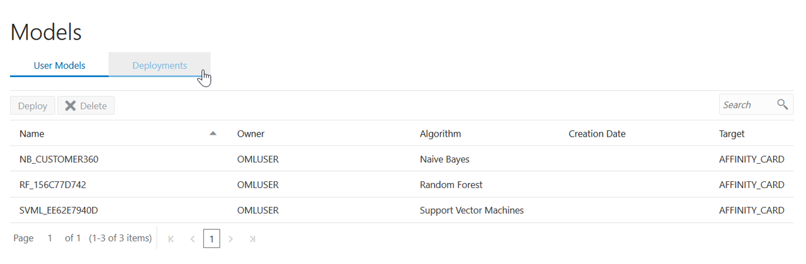

2. The deployed model **NB_CUSTOMER360** is listed along with the metadata - Shared, version, namespace, owner, deployed date and URI under **Deployments** on the Models page.

	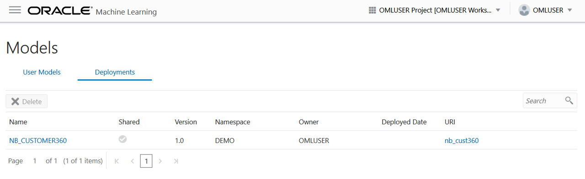

3. To view the metadata of the deployed model, click the name of the deployed model `NaiveBayes_CUST360`.  The model metadata is listed in the **Model metadata for NaiveBayes_CUST360** dialog.

	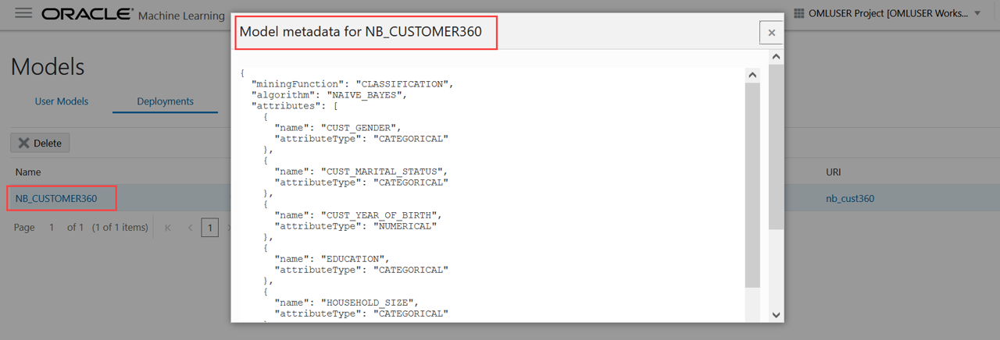

4. To view the entire JSON of the REST endpoint, click the URI `nb_cust360`. All details of the deployed model are listed in the **OPEN API Specification for NaiveBayes_CUST360** dialog, as shown in the screenshot. Scroll down to view all details of the endpoint.

	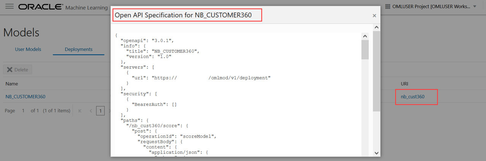

This completes the task of viewing the metadata of the deployed model, and its endpoint.

## Task 6: Create a Notebook for the Top Model

You can create notebooks based on the top models produced in the experiment. This provides the code to build a model with the same settings for the selected model. This option is helpful if you want to use the code to re-create a similar machine learning model. To create a notebook:

1. Click the Cloud menu icon  on the top left corner of your page to open the left navigation menu, and click **AutoML Experiments**.

	

2. On the AutoML Experiments page, click the **Customers 360** experiment.  

	

2. Scroll down to the Leader Board, click on the Naïve Bayes model row. Clicking on a model row enables all the Leader Board options - Deploy, Rename, Create Notebooks, and Metrics. Click **Create Notebook**. The Create Notebook dialog opens.

 	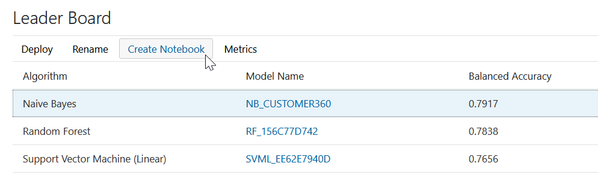

3. In the Create Notebook dialog, the experiment name is displayed in the **Notebook Name** field with the suffix (1). Retain this name and click **OK**.

	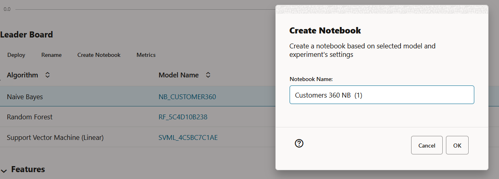

4. Click **OK**. The message _Notebook Customers 360 NB (1) successfully created_ is displayed once the notebook is created successfully.

	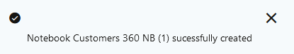

	The notebook is created, and is listed on the Notebooks page.

This completes the task of creating the notebook **Customer 360 NB (1)** based on the Naive Bayes model that is created by the AutoML experiment **Customers 360**.

## Task 7: View Generated Notebook and Individual Paragraphs

To view the generated notebook Customer 360:

1. Click the Cloud menu icon  on the top left corner of the page to open the left navigation menu. Click **Notebooks**.

	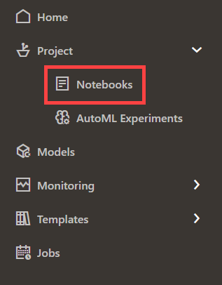

2. The Notebooks page opens with all the notebooks listed in it. Click the **Customer 360 NB (1)** notebook to open it.

 	<if type="livelabs"> 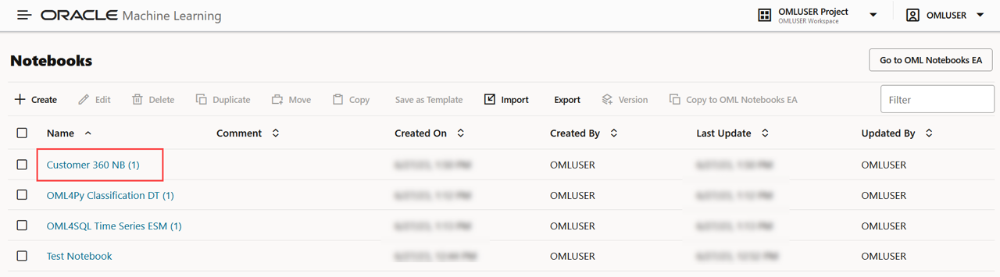 </if>

	<if type="freetier"> 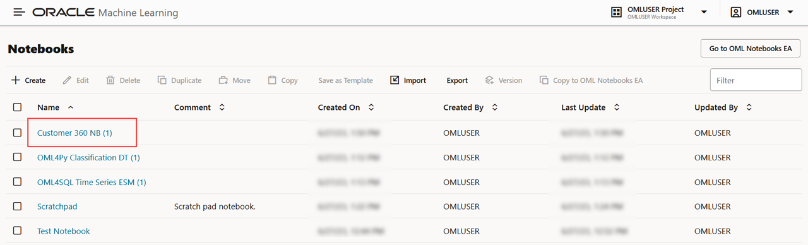 </if>

3. The generated notebook _Customer 360 NB (1)_  opens in the notebook editor. Click the gear icon on the upper right corner of the notebook to view and set the interpreter binding order.

	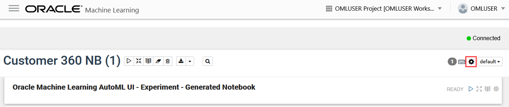

	Change the order of the interpreter bindings by clicking and dragging an entry above or below others (turns from white to blue). You can also deselect a binding to disable it (turns from blue to white). This does not require dragging the enabled interpreters above the disabled ones.

	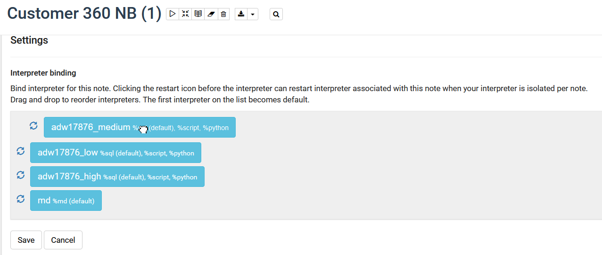

4. Click **Save**. Clicking **Save** records the changes and hides the interpreter settings. You can verify it again by clicking the gear icon 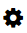. This completes the task of changing the interpreter binding order.

	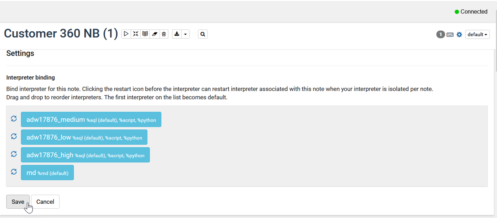

5. Scroll up to the notebooks toolbar, and click the **Run All** icon to run all the paragraphs in the notebook.

	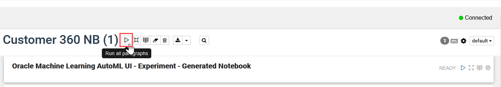

6. In the Run All confirmation dialog, click **OK**.  

	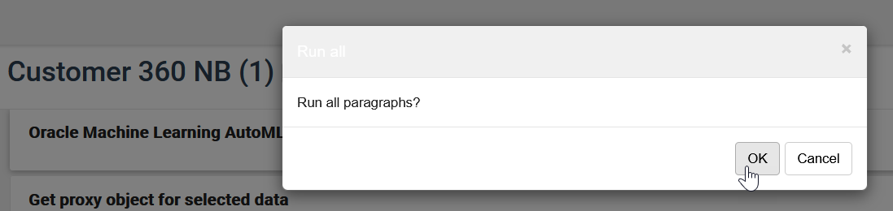

7. Scroll down to view all the paragraphs in the notebook:

* The paragraph titled _Oracle Machine Learning AutoML UI - Experiment - Generated Notebook_ contains the experiment metadata.

	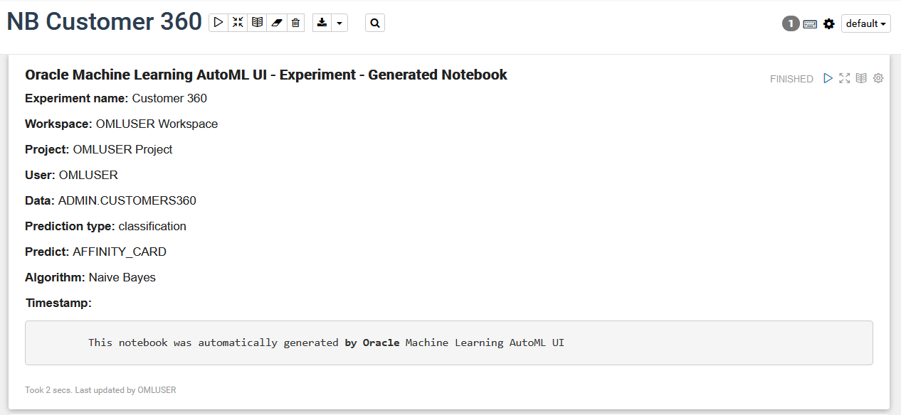

* The paragraph titled _Get proxy object for selected data_ contains the code to get the proxy object for the data used in the experiment, which is the Customers360 table here. The paragraph titled _Prepare Training Data_ contains the code to prepare the training data.

	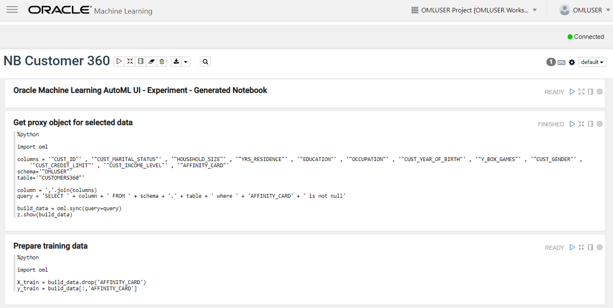

* The paragraph titled _Build Model_ contains the code to build the model. In this lab, it is the Naive Bayes model. The settings used to produce the model using AutoML are provided here in the ``nb_settings`` variable. The paragraph titled _Show Model Details_ contains the code to view the model details.

	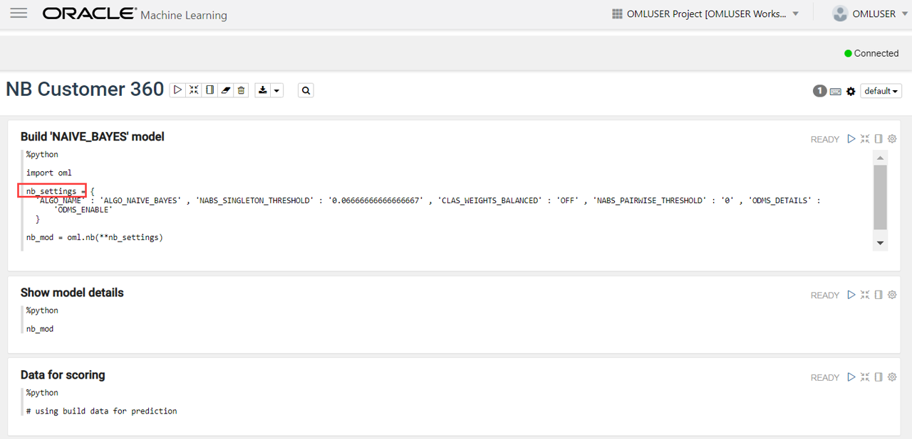

* The paragraph titled _Data for Scoring_ contains the code to score the data, and the paragraph _Show model quality metric_ contains the code to view the model quality metric.

	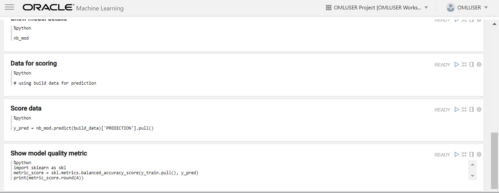

This completes the task of creating a notebook based on a model and viewing the paragraphs contained in it.
You may now **proceed to the next lab**.

## Learn More

* [About Oracle Machine Learning AutoML UI](https://docs.oracle.com/en/database/oracle/machine-learning/oml-automl-ui/index.html)
* [Blog: Oracle Machine Learning AutoML UI](https://blogs.oracle.com/machinelearning/post/introducing-oml-automl-user-interface)

## Acknowledgements

* **Author** - Moitreyee Hazarika, Principal User Assistance Developer, Database User Assistance Development
* **Contributors** -  Mark Hornick, Senior Director, Data Science and Machine Learning; Marcos Arancibia, Senior Principal Product Manager, Machine Learning; Sherry LaMonica, Consulting Member of Tech Staff, Machine Learning
* **Last Updated By/Date** - Moitreyee Hazarika, June 2025
