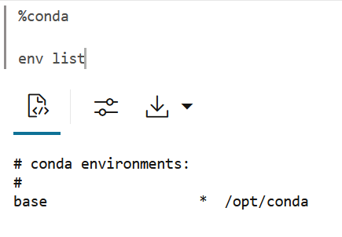
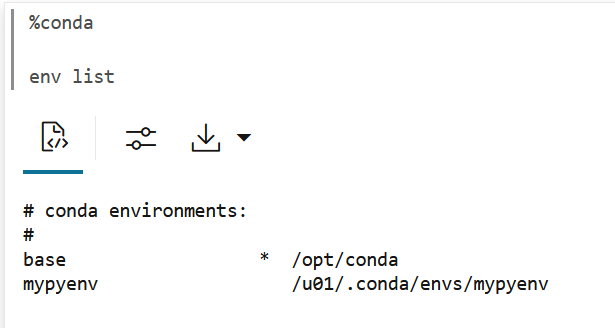
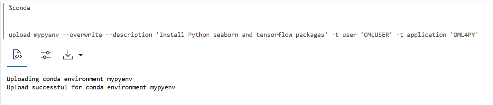
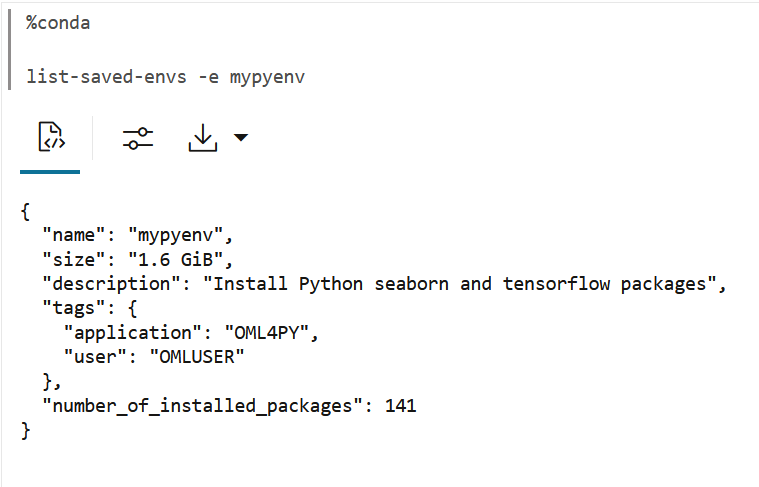
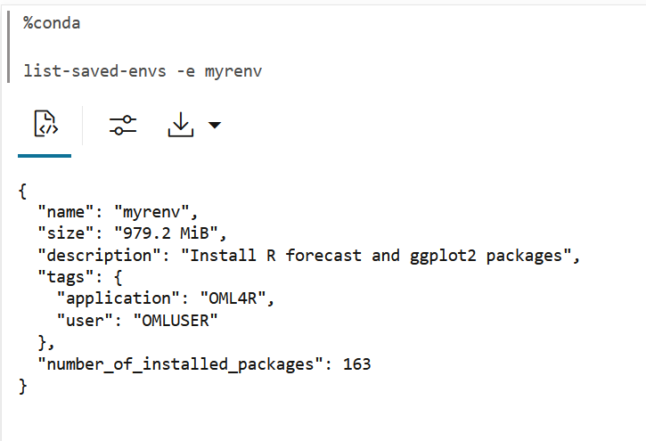
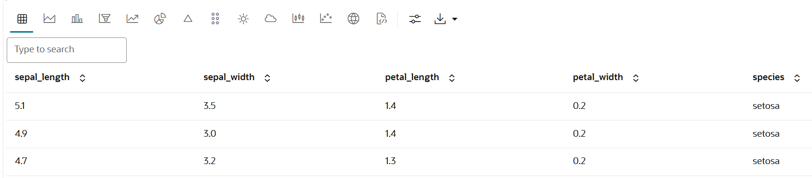

# Introduction to the Conda Environments in Oracle Machine Learning Notebooks

## Introduction

This lab walks you through the steps to use the Conda environments in Oracle Machine Learning Notebooks.

Estimated Time: 15 minutes

### About Conda

Conda is an open source package and environment management system that enables the use of virtual environments containing third-party R and Python packages. Oracle Machine Learning Notebooks provide a Conda interpreter to install third-party Python and R packages in a Conda environment for use within OML Notebooks sessions, as well as within OML4R and OML4Py embedded execution invocations. With Conda environments, you can perform the following:
* Install and update packages and their dependencies
* Switch between environments to use project-specific packages

The Conda environments and package installation are done by the administrator (ADMIN role). You can then download and activate the environment in an OML notebook, logged in as a user with the OML_DEVELOPER role.

> *Note:* Conda environments can be used with OML4Py and OML4R embedded execution from the Python, R, SQL, and REST APIs.


### Objectives

In this lab, you will learn how to:
* Create a Conda environment for Python with `tensorflow` and `seaborn` packages (ADMIN role)
* Create a Conda environment for R with `ggplot2` and `forecast` packages (ADMIN role)
* Upload the Conda environments to an Object Storage bucket associated with the ADB (ADMIN role)
* Download, activate, and use the Conda environment for Python (OML_DEVELOPER role)
* Download, Activate, and use the Conda environment for R (OML_DEVELOPER role)

### Prerequisites

This lab assumes:
* An Oracle Machine Learning account
* OML administrator role (ADMIN)
* A separate non-administrator user account with the developer role (OML_DEVELOPER)
* Access to Oracle Machine Learning USER account

## Task 1: Create a Conda Environment for Python and Install Python Packages

This task demonstrates how to create a Conda environment called `mypyenv` for Python packages, with Python 3.12 that is compatible with OML4Py. Here, you will also install the Python packages - _tensorflow_ and _seaborn_ from the _conda-forge_ channel.

* Conda channels are the locations where packages are stored. They serve as the base for hosting and managing packages. Conda packages are downloaded from remote channels, which are URLs to directories containing conda packages. The conda command searches a set of channels. By default, packages are automatically downloaded and updated from the default channel.
* The _conda-forge_ channel is a community channel made up of thousands of contributors, and is free for all to use. You can modify what remote channels are automatically searched.

>*Note:* You must be signed in as ADMIN user to create the Conda environment and upload it to Object Storage.


To create a Conda environment:

1. Run the following command to list the environments that are available by default. Conda contains default environments with some core system libraries and conda dependencies. The active environment is marked with an asterisk (*). Run the following command to list the available environments.
	```
	<copy>
	%conda

	env list
	</copy>
	```


	The command returns the list of following environments:
	

2. Now, run the following command to create an environment by the name `mypyenv` from the conda forge channel and also install the Python packages _tensorflow_ and _seaborn_:

	>*Note:* In this example, we are using the _conda-forge_ channel to install the Python packages.

	```
	<copy>
	%conda

	create -n mypyenv -c conda-forge --strict-channel-priority python=3.12.1 pandas==2.1.1 numpy==1.26.4 seaborn tensorflow

	</copy>
	```
	In this command:
	* ``-n`` : This is the name of the environment. In this example, it is _mypyenv_.
	* ``-c`` : This is the channel name. In this example, it is _conda-forge_
	* ``--override-channels`` : This argument ensures that the system does not search default, and requires a channel to be mentioned.
	* ``--strict-channel-priority`` : This argument ensures that packages in lower priority channels are not considered if a package with the same name appears in a higher priority channel. In this example, the priority is given to python 3.12, tensorflow, and seaborn


	The command returns the following message once it creates the environment and installs the listed package. Scroll down the paragraph to view the complete details.

	

3. Now, verify the environment that you created. Run the following command once again to view the list of environments. Note that the _mypyenv_ environment is listed in the output.

	```
	<copy>

	%conda

	env list
	</copy>
	```

	

	>*Note:* The _mypyenv_ environment is not yet active. The active environment is marked with an asterisk (*), and in this list, it is present against the base environment /opt/conda.

4. Now, run the following command to activate the environment _mypyenv_.
	```
	<copy>
	%conda

	activate mypyenv
	</copy>
	```
	


5. Now, run the command to list the environment once again to view the list of active environments. Note that the asterisk (*) is now present against the _mypyenv_ environment.  

	```
	<copy>
	env list
	</copy>
	```
	
The asterisk (*) next to the environment name confirms the activation. This completes the task of creating, activating and verifying a Conda environment.
## Task 2: Create a Conda Environment for R and Install R Packages
In this task, you will create a Conda environment called _myrenv_ for R packages, with R-4.0.5 for OML4R compatibility, and install the forecast and ggplot2 packages.

>*Note:* You must be signed in as ADMIN user to create the Conda environment and upload it to Object Storage.

To create a Conda environment named _myrenv_ with R-4.0.5 for OML4R compatibility and install the _forecast_ and _ggplot2_ packages:

1. Run the following command to create the environment for R by the name _myrenv_ and also install the packages _forecast_ and _ggplot2_:

	>*Note:* In this example, we are using the _conda-forge_ channel to install the R packages.

	```
	<copy>
	%conda

	create -n myrenv -c conda-forge --override-channels --strict-channel-priority r-base=4.0.5 r-forecast r-ggplot2
	</copy>
	```
	In this command:
	* ``-n`` : This is the name of the environment. In this example, it is _myrenv_.
	* ``-c`` : This is the channel name. In this example, it is _conda-forge_
	* ``--override-channels`` : This argument ensures that the system does not search default, and requires a channel to be mentioned.
	* ``--strict-channel-priority`` : This argument ensures that packages in lower priority channels are not considered if a package with the same name appears in a higher priority channel. In this example, the priority is given to R-4.0.5, forecast, and ggplot2.

	>*Note:* You must set ``r-base`` to ``4.0.5`` for compatibility with the R version you are using in your notebooks.

	The command returns the following:

	
	>*Note:* In this example, we are using the _conda-forge_ channel to install the R packages.

2. Now let's verify the Conda environment for R that you just created. Run the following command in a %conda paragraph to view the list of environments.

	```
	<copy>
	env list
	</copy>
	```
	
	Note that the _myrenv_ environment is now listed along with the _mypyenv_ in the output. Note that the asterisk (*) is against the _mypyenv_, indicating that this environment is active currently.

## Task 3: Upload the Conda environments to an Object Storage bucket associated with the Autonomous Database
In this task, you will upload the environments _mypyenv_ and _myrenv_ to the Object Storage bucket associated with the Autonomous Database instance using the `upload` command. You will provide environment descriptions and tags, one for the user name and one for the application name. You will also overwrite any environment with the same name if it exists.

The application tag is required for use with embedded execution. For example, OML4Py embedded Python execution works with Conda environments containing the OML4PY tag.

>*Note:* There is one Object Storage bucket for each data center region. The Conda environment is saved to a folder in Object Storage corresponding to the tenancy and database. The folder is managed by Autonomous Database and is only available to users through OML Notebooks. There is an 8G maximum size for a single Conda environment, and no size limit on Object Storage.


1. Run the following command to upload the mypyenv to the Object Storage bucket associated with the ADB.
	```
	<copy>
	upload mypyenv --overwrite --description 'Install Python seaborn and tensorflow packages' -t user 'OMLUSER' -t application 'OML4PY'
	</copy>
	```
	

	In this command, you use the `upload` command and provide the following:
	* ``--description:`` a description of your task.
	*	``-t :`` A tag for the user 'OMLUSER' and for the application 'OML4PY'

2. Now, run the following command to view the list of saved environments in mypyenv:

	```
	<copy>
	list-saved-envs -e mypyenv
	</copy>
	```

	The command returns the following:

	

3. Now upload the myrenv to the object storage by running the following command in a Conda paragraph:

	```
	<copy>
	%conda

	upload myrenv --overwrite --description 'Install R forecast and ggplot2 packages' -t user 'OMLUSER' -t application 'OML4R'
	</copy>
	```
	The command returns the following:
	

4. Again, run the following command to view the list of saved environments in myrenv:

	```
	<copy>
	%conda

	list-saved-envs -e myrenv
	</copy>
	```

	The command returns the following:

	

This completes the task of uploading the Python and R environments _mypyenv_ and _myrenv_ to the Object Storage associated with the ADB. The environments are now available for you to download and use. The environments will remain in the Object Storage until it is deleted.

## Task 4: Download, Activate and Use the Conda Environment for Python

The steps in task 4 must be performed as the non-ADMIN OML user with the `OML_DEVELOPER` role. Here, you will download and activate the Conda environment for Python.

1. Run the following command in a %conda paragraph to download and activate the Python conda environment _mypyenv_:  

	```
	<copy>
	%conda

	download mypyenv

	activate mypyenv
	</copy>
	```


	

2. Run the following command in a ``%python`` paragraph to import the python libraries.

	```
	<copy>
	%python

	import keras
	from keras.models import Sequential
	from keras.layers import Dense
	from keras.optimizers import Adam

	import seaborn as sns
	import pandas as pd
	import numpy as np

	from sklearn.metrics import classification_report, confusion_matrix

	</copy>
	```
	

	Once the command runs successfully, the libraries are ready for use.

3. In another %python paragraph, run the following command to load the iris data:

	```
	<copy>
	%python

	import ssl
	ssl._create_default_https_context = ssl._create_unverified_context

	df = sns.load_dataset("iris")
	z.show(df)
	</copy>
	```
	

	After you run the command successfully, the iris dataset is displayed.

	


4. Plot the relationship pairwise

	```
	<copy>
	%python

	sns.set(style="ticks")
	sns.set_palette("husl")
	sns.pairplot(df.iloc[:,0:6], hue="species")
	</copy>

	```
	
	Scroll down to view the output:
	


## Task 5: Download, Activate and Use the Conda environment for R

The steps in task 5 must be performed as the non-ADMIN OML user with the `OML_DEVELOPER` role. Here, you will download and activate the Conda environment for R.

1. Run the following in a %conda paragraph to download and activate the R environment for Conda _myrenv_:

	```
	<copy>
	%conda

	download myrenv

	activate myrenv
	</copy>
	```

	
	Scroll down the paragraph to check the activation status, as shown here:

	


2. Run the following command in a ``%conda`` paragraph to list the packages available in the R environment:
	```
	<copy>
	%conda

	list
	</copy>
	```
	

	Scroll down to check the R packages ggplot2 and forecast. These packages are listed, as shown in the screenshot here:
	
3. Run the following to load the R libraries and suppress warnings in an %r paragraph.  The libraries are now ready for use.
	```
	<copy>
	%r

	options(warn=-1)
	options(ore.warn.order=FALSE)

	library(ggplot2)
	library(forecast)
	</copy>
	```
	

## Learn More

* [Oracle Machine Learning UI](https://docs.oracle.com/en/database/oracle/machine-learning/oml-notebooks/)


## Acknowledgements

* **Author** -  Moitreyee Hazarika, Principal User Assistance Developer, Database User Assistance Development
* **Contributors** -   Mark Hornick, Senior Director, Data Science and Machine Learning; Marcos Arancibia Coddou, Product Manager, Oracle Data Science; Sherry LaMonica, Consulting Member of Tech Staff, Machine Learning
* **Last Updated By/Date** - Moitreyee Hazarika, June 2025
