# Use the OML Monitoring Functionality to monitor your data and machine learning models
## Introduction

This lab demonstrates how to use the OML monitoring feature. OML monitoring provides you with the functionality to monitor your data as well as monitor your machine learning models. 

*Data Monitoring* evaluates how your data evolves over time. It helps you with insights on trends and multivariate dependencies in the data. It also warns you about data drift.

Data drift occurs when data diverges from the original baseline data over time. Data drift can happen for a variety of reasons, such as a changing business environment, evolving user behavior and interest, data modifications from third-party sources, data quality issues, or issues with upstream data processing pipelines.

*Model monitoring* allows you to monitor the quality of model predictions over time and helps you with insights on the causes of model quality issues.

In this workshop, you will learn how to:
* Create a data monitor to monitor your data
* Create a model monitor to monitor your machine learning models


### Estimated Time
This lab takes approximately 30 minutes to complete.

### Prerequisites

* Access to your Oracle Machine Learning user interface

In this lab, you will learn how to create a data monitor and a model monitor. The use case here uses the  `HOUSEHOLD_POWER_BASE` and `HOUSEHOLD_POWER_NEW` dataset which includes various consumption metrics of a household for the year 2007. The goal is to understand if and how household consumption has changed over the year.

## Task 1: Load Dataset for Data Monitoring

Before you begin with data and model monitoring, you must first load these datasets - `HOUSEHOLD_POWER_BASE` and `HOUSEHOLD_POWER_NEW` in your schema. 
The dataset comprises the following columns:

* `DATES` — Contains the date in yyyy:mm:dd format.
* `TIMES` - Contains the timestamp in hh:mm:ss format.
* `GLOBAL_ACTIVE_POWER` — This is the household global minute-averaged active power (in kilowatt).
* `GLOBAL_REACTIVE_POWER` — This is the household global minute-averaged reactive power (in kilowatt).
* `VOLTAGE` — This is the Minute-averaged voltage (in volt).
* `GLOBAL_INTENSITY` — This is the household global minute-averaged current intensity (in ampere).
* `SUB_METERING_1` — This is the energy sub-metering No. 1 (in watt-hour of active energy). It corresponds to the kitchen.
* `SUB_METERING_2` — This is the energy sub-metering No. 2 (in watt-hour of active energy). It corresponds to the laundry room.
* `SUB_METERING_3` — This is the energy sub-metering No. 2 (in watt-hour of active energy). It corresponds to an electric water heater and air conditioner.

To create the datasset:
1. Create a notebook and in a `%script` paragraph, run the following pl/sql script to create the `HOUSEHOLD_POWER_BASE` dataset:

    ```
    <copy>
    %script

    DECLARE
        uri_data        VARCHAR2(1000) := 'https://objectstorage.us-sanjose-1.oraclecloud.com/n/adwc4pm/b/OML_public_data/o/household_power_base.csv';
        csv_format      VARCHAR2(1000) := '{"dateformat":"YYYY-MM-DD", "skipheaders":"1", "delimiter":",", "ignoreblanklines":"true", "removequotes":"true", "blankasnull":"true", "trimspaces":"lrtrim", "truncatecol":"true", "ignoremissingcolumns":"true"}';
    BEGIN
        BEGIN
            EXECUTE IMMEDIATE 'DROP TABLE EXT_HOUSEHOLD_POWER_BASE';
            EXECUTE IMMEDIATE 'DROP TABLE HOUSEHOLD_POWER_BASE';
        EXCEPTION
            WHEN OTHERS THEN NULL;
        END;

        -- Create the external table
        DBMS_CLOUD.CREATE_EXTERNAL_TABLE(
            TABLE_NAME => 'EXT_HOUSEHOLD_POWER_BASE',
            FILE_URI_LIST => uri_data,
            FORMAT => csv_format,
            COLUMN_LIST => 'DATES TIMESTAMP (6), 
                            TIMES VARCHAR2(50 BYTE), 
                            GLOBAL_ACTIVE_POWER BINARY_DOUBLE, 
                            GLOBAL_REACTIVE_POWER BINARY_DOUBLE, 
                            VOLTAGE BINARY_DOUBLE, 
                            GLOBAL_INTENSITY BINARY_DOUBLE, 
                            SUB_METERING_1 BINARY_DOUBLE, 
                            SUB_METERING_2 BINARY_DOUBLE, 
                            SUB_METERING_3 BINARY_DOUBLE');

        -- Create the target table
        EXECUTE IMMEDIATE 'CREATE TABLE HOUSEHOLD_POWER_BASE AS 
                        SELECT DATES, TIMES, GLOBAL_ACTIVE_POWER, GLOBAL_REACTIVE_POWER, 
                                VOLTAGE, GLOBAL_INTENSITY, SUB_METERING_1, SUB_METERING_2, SUB_METERING_3 
                        FROM EXT_HOUSEHOLD_POWER_BASE';
    END;

    </copy>
    ```

2. In another `%script` paragraph, run the following pl/sql script to create the `HOUSEHOLD_POWER_NEW` dataset:

    ```
    <copy>
    %script

    DECLARE
        uri_data        VARCHAR2(1000) := 'https://objectstorage.us-sanjose-1.oraclecloud.com/n/adwc4pm/b/OML_public_data/o/household_power_new.csv';
        csv_format      VARCHAR2(1000) := '{"dateformat":"YYYY-MM-DD", "skipheaders":"1", "delimiter":",", "ignoreblanklines":"true", "removequotes":"true", "blankasnull":"true", "trimspaces":"lrtrim", "truncatecol":"true", "ignoremissingcolumns":"true"}';
    BEGIN
        BEGIN
            EXECUTE IMMEDIATE 'DROP TABLE EXT_HOUSEHOLD_POWER_NEW';
            EXECUTE IMMEDIATE 'DROP TABLE HOUSEHOLD_POWER_NEW';
        EXCEPTION
            WHEN OTHERS THEN NULL;
        END;

        DBMS_CLOUD.CREATE_EXTERNAL_TABLE(
            TABLE_NAME => 'EXT_HOUSEHOLD_POWER_NEW',
            FILE_URI_LIST => uri_data,
            FORMAT => csv_format,
            COLUMN_LIST => 'DATES TIMESTAMP (6), 
                            TIMES VARCHAR2(50 BYTE), 
                            GLOBAL_ACTIVE_POWER BINARY_DOUBLE, 
                            GLOBAL_REACTIVE_POWER BINARY_DOUBLE, 
                            VOLTAGE BINARY_DOUBLE, 
                            GLOBAL_INTENSITY BINARY_DOUBLE, 
                            SUB_METERING_1 BINARY_DOUBLE, 
                            SUB_METERING_2 BINARY_DOUBLE, 
                            SUB_METERING_3 BINARY_DOUBLE');

        EXECUTE IMMEDIATE 'CREATE TABLE HOUSEHOLD_POWER_NEW AS 
                        SELECT DATES, TIMES, GLOBAL_ACTIVE_POWER, GLOBAL_REACTIVE_POWER, 
                                VOLTAGE, GLOBAL_INTENSITY, SUB_METERING_1, SUB_METERING_2, SUB_METERING_3 
                        FROM EXT_HOUSEHOLD_POWER_NEW';
    END;

    </copy>
    ```
This completes the task of creating the dataset. 

## Task 2: Create a Data Monitor

In this lab, you will learn how to create a data monitor. Data Monitoring allows you to detect data drift over time. On the Data Monitor page, you can create, run, and track data monitors and the results. To monitor data and detect data drift, you must create a data monitor. 

To create a data monitor:

1. On the Oracle Machine Learning UI homepage, click **Data Monitors**. This opens the Data Monitors page. 

    

    Alternatively, you may open the Data Monitor page from the left navigation menu. Click on the  icon to open the left navigation menu, expand **Monitoring** and then click **Data** to open the Data Monitors page. 

    

2. On the Data Monitors page, click **Create** to open the New Data Monitor page.

    

3. On the New Data Monitor page, enter the following details:

    
4. **Monitor Name:** Enter a name for the data monitor. In this example, let's enter `Monitor power consumption`.
5. **Comments:** Enter comments. This is an optional field.
6. **Baseline Data:** This is a table or view that contains baseline data to monitor. Click the search icon to open the Select Table dialog. In the Select Table dialog, under Schema, scroll to select the schema `OMLUSER`. Under Table, select the table `HOUSEHOLD_POWER_CONSUMPTION_BASE`.
    
    
    > **Note:** The supported data types for data monitoring are `NUMBER`, `BINARY_DOUBLE`, `FLOAT`, `BINARY_FLOAT`, `VARCHAR2`, `CHAR`, `NCHAR`, and `NVARCHAR2` with length `<=4000`. 
7. **New Data:** This is also a table or view with new data to be compared against the table that you have selected in the Baseline Data field. Click the search icon to open the Select Table dialog. Here, once again select the `OMLUSER` schema, and then the table `HOUSEHOLD_POWER_CONSUMPTION_NEW`. 
    
    >**Note:** The New Data field can have multiple periods in it, and new data can get added to it as well. 
    
    
8. **Crosstab:** Select an attribute from the drop-down list. This attribute in the baseline and new data acts as an anchor or target for bi-variate analysis of your data. Select `GLOBAL_ACTIVE_POWER`.
9. **Case ID:** This is an optional field. Enter a case identifier for the baseline and new data to improve the repeatability of the results. Let's leave it blank. 
10. **Time Column:** This is the name of a column storing time information in the New Data table or view. Select the column `DATES` from the drop-down list.
        
    > **Note:**  If the Time Column is blank, the entire `New Data` is treated as one period. 
11. **Analysis Period:** This is the length of time for which data monitoring is performed on the New Data. Select the analysis period for data monitoring. The options are Day, Week, Month, Year.
12. **Start Date:** This is the start date of your data monitor schedule. If you do not provide a start date, the current date will be used as the start date. 
13. **Repeat:** This value defines the number of times the data monitor run will be repeated for the frequency defined. Enter a number between 1 and 99. For example, if you enter 2 in the Repeat field here, and Minutes in the Frequency field, then the data monitor will run every 2 minutes.
14. **Frequency:** This value determines how frequently the data monitor run will be performed on the New Data. Select a frequency for data monitoring. The options are Minutes, Hours, Days, Weeks, Months. For example, if you select Minutes in the Frequency field, 2 in the Repeat field, and 5/30/23 in the Start Date field, then as per the schedule, the data monitor will run from 5/30/23 every 2 minutes. 
15. Click **Recompute:** Select this option to recompute the analysis for the already computed time period. By default, Recompute is disabled.
    * When _enabled_, the data drift analysis is performed for the time period specified in the Start Date field and the end time. The analysis will overwrite the already existing results for the specified time period. This means that the analysis will be computed for the time period with new data other than the current data. New analysis results may overlap with the existing results depending on the selected frequency.
    * When _disabled_, the data for the time period that is present in the results table will be retained as is. Only the new data for the most recent time period will be considered for analysis, and the results will be added to the results table.
16. Click **Additional Settings** to expand this section and provide advanced settings for your data monitor:
    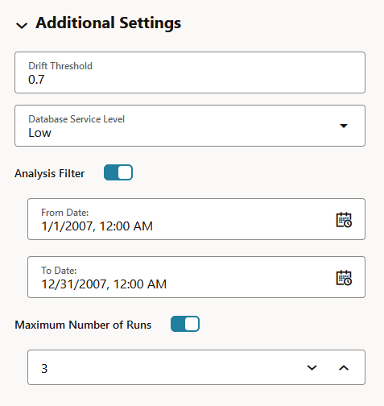
    * **Drift Threshold:** Drift captures the relative change in performance between the baseline data and the new data period. Based on your specific machine learning problem, set the threshold value for your data drift detection. This may require adjusting after you see how your specific data behaves. The default is 0.7. 
    * **Database Service Level:** This is the Autonomous Database service levels - Low, Medium, High. The default is Low. Service level Medium provides more resources to the data monitor run compared to Low. Service level High provides more resources to the data monitor run compared to Medium.
    * **Analysis Filter:** Enable this option if you want the data monitoring analysis for a specific time period. Move the slider to the right to enable it, and then select a date in From Date and To Date fields respectively. By default, this field is disabled.
    * **Maximum Number of Runs:** This is the maximum number of times the data monitor can be run according to this schedule. The default is 3. 
17. The **Features** grid displays the list of features to monitor. Here, you can select or deselect features to include or exclude from monitoring. By default, all features are selected. Feature statistics are provided if the selected data is a table and has RDBMS statistics automatically gathered by Autonomous Database. Oracle Machine Learning Services calculates the statistics on the first run for both, tables and views, and the computations are displayed here after the first run. The statistics are updated by subsequent runs.

18.Now scroll up to the page and on the top right corner, click **Save.** This completes the task of creating a data monitor and takes you to the Data Monitors page. 

19. On the Data Monitors page, click to select the monitor that you just created, and then click **Start**. 
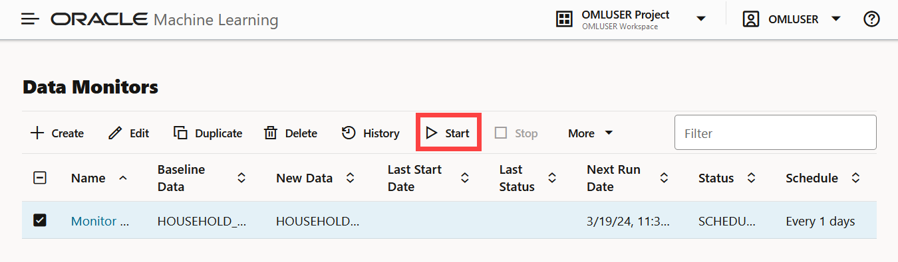    

20. After the data monitor runs successfully, the Last Status shows as SUCCEEDED. Click on the checkbox against the data monitor name to view the data drift on the lower pane of the page. You may also hover your cursor over the grapg to view the data monitoring details. 


This completes the task of creating and running a data monitor. 

## Task 2.1: View Data Monitor Results

After your data monitor runs successfully, data monitoring results are available for review. The _Data Monitor Results_ page displays the information on the selected data monitor. To view data monitor results:

1. On the Data Monitors page, click on the checkbox against the data monitor name to view the drift on the lower pane of the page. The X axis depicts the analysis period, and the Y axis depicts the data drift values. The red horizontal dotted line is the threshold value, and the metric line depicts the data drift value for each point in time for the analysis period. Hover your mouse over the line to view the data drift values. 
    

2. On the Data Monitors page, click on the data monitor name that you created _Monitor power consumption_. This opens the Data Monitor Results page.  
    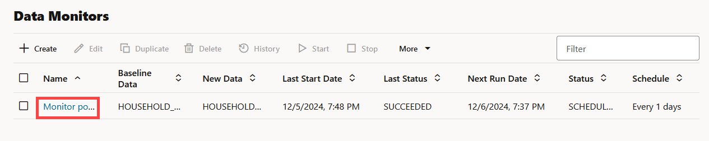

    The **Data Monitor Results** page Here, the data monitor settings and all statistical computations on the monitored features are available. comprises these sections:    
    * **Name** — The name of the monitor is displayed at the top of the page. As seen in this screenshot, the monitor name _Monitor power consumption_ is displayed at the top. To return to the Data Monitors page, click **Data Monitors** on the top left. 
    

    * **Settings** — Click on the arrow against **Settings** to expand this section and view the data monitor settings. You also have the option to edit the data monitor settings by clicking **Edit** on the top right corner of the page. 
    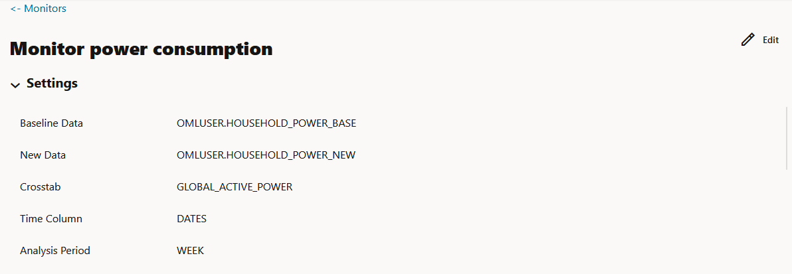
    * **Data Drift** — Drift displays the details of data drift for each monitored feature. Here, the data drift computed by the data monitor _Monitor power consumption_ is shown. 
    

        The X axis depicts the analysis period, and the Y axis depicts the data drift values. The horizontal dotted line is the threshold value, and the line depicts the data drift value for each point in time for the analysis period. Hover your mouse over the line to view the data drift values. 
    * **Features** — This section displays the monitored features along with the computed statistics. 

        

        The value in the **Importance** column indicates how impactful the feature has been on data drift over a specified time period. Hover your cursor to view the computed summary values for each monitored feature. 


3. In the **Features** section, click on any monitored feature to view other computations such as Metric, Statistics, Distribution, and Distribution with Crosstab Column. In the screenshot here, the monitored feature `GLOBAL_INTENSITY` is selected. 
    
    The computations include: 
* **Metric:** Click on the Metric drop-down list to view the computed metrics.
    
    * **Population Stability Index (PSI):** This is a measure of how much a population has shifted over time or between two different samples of a population in a single number. The two distributions are binned into buckets, and PSI compares the percents of items in each of the buckets.
        
        PSI is computed as:

         `PSI = sum((Actual_% - Expected_%) x ln (Actual_% / Expected_%))`

        The interpretation of PSI value is:           
            
           - `0.1 <= PSI < 0.2` implies moderate population change
           - `PSI >= 0.2` implies significant population change
           - `PSI < 0.1` implies no significant population change  
     * **Jenson Shannon Distance (JSD):** This is a measure of the similarity between two probability distributions. JSD is the square root of the Jensen-Shannon Divergence which is related to the Kullbach-Leibler Divergence (KLD). JSD is computed as: 

        This is a measure of the similarity between two probability distributions. JSD is the square root of the Jensen-Shannon Divergence which is related to the Kullbach-Leibler Divergence (KLD). 
        
        JSD is computed as: 

        `SD(P || Q)= sqrt(0.5 x KLD(P || M) + 0.5 x KLD(Q || M))`

        Where, 
        * P and Q are the 2 distributions
        * `M = 0.5 x (P + Q)`
        * `KLD(P || M) = sum(Pi x ln(Pi / Mi))`
        * `KLD(Q || M) = sum(Qi x ln(Qi / Mi))`

* **Statistics:** Data drift is quantified using these statistical computations. By default, statistics are displayed for three selected periods. You can add or remove the default time periods here. To remove a given time period, click on the **Select Time Periods** field and click X on the date that you want to remove. To add a different time period, click on the **Select Time Periods** field and select from the available dates. If you do not wish to view the computations for baseline, deselect the **Show Baseline** field. This is applicable for the distribution computation also. 
    
* **Distribution:** The feature distribution chart with legend displays bins of feature for selected periods and the baseline (optional). If you wish to view the distribution chart for a different time period, click on the **Select Time Periods** field under **Statistics** to add or remove dates. If you do not wish to view the computations for baseline, deselect the **Show Baseline** field.   
    
* **Distribution with Crosstab Column:** This is a heat map that indicates the density of distribution for the selected crosstab and the feature column. The selected crosstab in this data monitor is `GLOBAL_ACTIVE_POWER`, and the selected monitored feature here is `GLOBAL_INTENSITY`. The cell in red denotes highest density. Select the date for which you want to view the distribution from the drop-down list. 
    > **Note:** In data drift monitoring, nulls are tracked separately as `number_of_missing_values`. 

    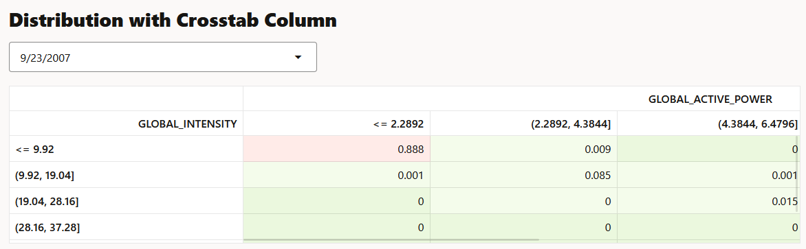

This completes the task of viewing the data monitor details and statistical computations of the monitored data.

## Task 2.2: View Data Monitor History

1. The History page displays the runtime details of data monitors.
    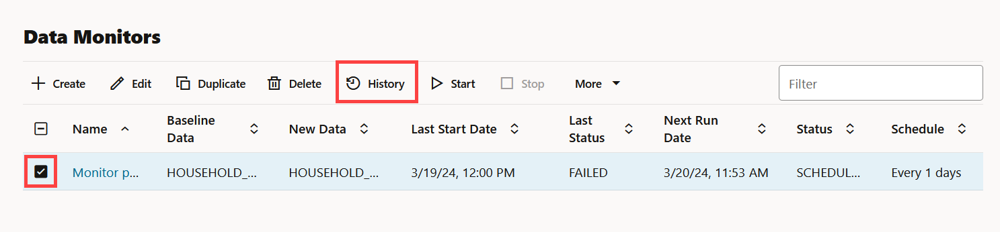
2. Select a data monitor and click History to view the runtime details. The history page displays the following information about the data monitor runtime: 
    

    * **Actual Start Date:** This is the date when the data monitor actually started.
    * **Requested Start Date:** This is the date entered in the **Start Date** field while creating the data monitor.
    * **Status:** The statuses are SUCCEEDED and FAILED.        
    * **Detail:** If a data monitor fails, the details are listed here. Click on the error link to view the error details, as shown in the screenshot here. Click X to exit.
        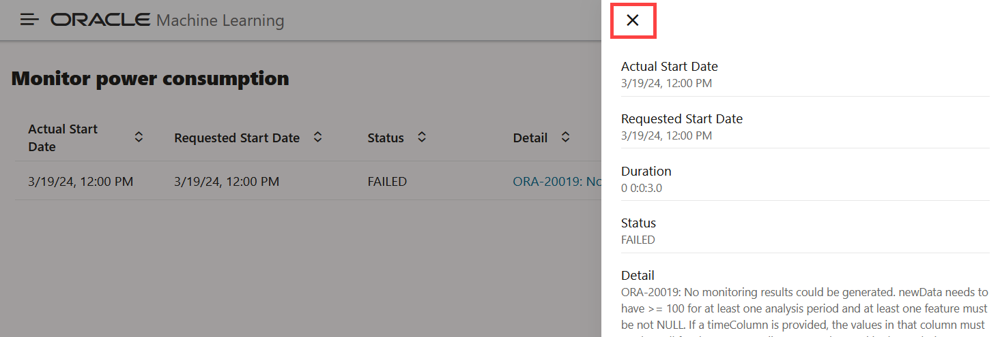
    * **Duration:** This is the time taken to run the data monitor.

3. Click **Data Monitors** to return to the Data Monitors page. 

This completes the task of viewing the data monitor runtime history.

## Task 3: Create a Model Monitor

A model monitor helps you monitor several compatible models and compute the model drift metric. Compatible models refer to those models that are trained on the same target and using the same mining function. The model drift chart consists of multiple series of data drift points, one for each monitored model. 

>**Note:** To monitor models, you must first have models deployed.

To create a model monitor:
We will begin by creating an AutoML Experiment to create and deploy a few machine learning models. We will use these models for monitoring.  

1. Follow the steps in _Lab 5 Introduction to Oracle Machine Learning AutoML UI_ to:
    * Create an AutoML UI Experiment: Follow the steps in _Lab 5 Task 2: Create an Experiment_ to create an AutoML experiment by the name `Prediction of Global Active Power`. Use the following parameters:
        * **Data Source:** `HOUSEHOLD_POWER_BASE`
        * **Predict:** `GLOBAL_ACTIVE_POWER`
        * **Prediction Type:** `Regression`
        
    * Deploy the machine learning models: After the experiment `Prediction of Global Active Power` runs successfully, follow the steps in _Lab 5 Task 3: Deploy a Top Model to Oracle Machine Learning Services_ to deploy each of the models built by the experiment to OML Services. 
        

2. Let's begin with creating a model monitor. Click on the  icon to open the left navigation menu. Expand **Monitoring** and then click **Models** to open the Model Monitors page. 
    

    Alternatively, on the Oracle Machine Learning UI homepage, you can click **Model Monitors** to open the Model Monitors page.
    

2. On the Model Monitors page, click **Create** to open the New Model Monitor page.
    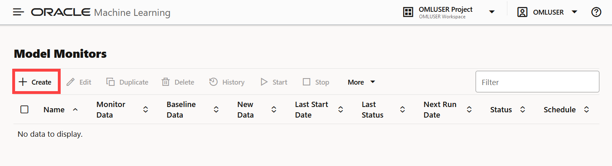

3. On the New Model Monitor page, enter the following details:

    
    * **Monitor Name:** Enter a name for the model monitor. In this lab, the name `Power Consumption` is used.
    * **Comment:** Enter comments. This is an optional field.
    * **Baseline Data:** This is a table or view with new data to be compared against the baseline data. Click the search icon to open the Select Table dialog. Under Schema, select `OMLUSER`, and under Table, select the table `HOUSEHOLD_POWER_BASE`. This table contains the data for the year 2007.
     
    * **New Data:** This is a table or view with new data to be compared against the baseline data. Click the search icon to open the Select Table dialog. Under Schema, select `OMLUSER`, and under Table, select the table `HOUSEHOLD_POWER_NEW`. This table contains the data for the year 2008.
     
    * **Case ID:** Enter `GLOBAL_REACTIVE_POWER`. This entry serves as a case identifier for the baseline and new data to improve the repeatability of the results. This is an optional field. 
    * **Time Column:** This is the name of a column storing time information in the New Data table or view. Select `DATES` from the drop-down list.
    * **Analysis Period:** This is the length of time for which model monitoring is performed on the New Data. Select `Week` from the drop-down list. The options are Day, Week, Month, Year. 
    * **Start Date:** This is the start date of your model monitor schedule. If you do not provide a start date, the current date will be used as the start date.
    * **Repeat:** This value defines the number of times the model monitor run will be repeated for the frequency defined. Enter `1` in this field..
    * **Frequency:** This value determines how frequently the model monitor run will be performed on the New Data. Select `Days` in this field. The options are Minutes, Hours, Days, Weeks, Months. In this lab, you have entered `1` in the **Repeat** field, and `Days` in the **Frequency** field. The **Start Date** field has 3/18/24. This means that as per the schedule, the model monitor will run from 3/18/24 once every day.
    * **Mining Function:** The available mining functions are Regression and Classification. Select a function as applicable. In this example, `Regression` is selected.
    * **Target:** Select an attribute from the drop-down list. In this example, `GLOBAL_ACTIVE_POWER` is used as the target for regression models.
    When you provide a value in the **Mining Function** and **Target** fields, the models that have been deployed are obtained and is displayed in the Models section on the Model Monitor page.
    * **Recompute:** Select this option to update the already computed periods. This means that only time periods not present in the output result table will be computed. By default, Recompute is disabled. 
    * **Monitor Data:** Select this option to enable data monitoring for the specified data. When enabled, a data monitor is also created along with the model monitor to compute the Predictive Feature Impact versus Drift Feature Impact in the model specific results. Select this option.
4. Click **Additional Settings** to expand this section and provide advanced settings for your model monitor:

    
    * **Metric:** Depending on the mining function selected in the **Mining Function** field on the Create Model Monitor page, the applicable metrics are listed. Click on the drop-down list to select a metric. Select `Mean Squared Error`.    
    * **Drift Threshold:** Drift captures the relative change in performance between the baseline data and the new data period. Based on your specific machine learning problem, set the threshold value for your model drift detection. The default is `0.7`. Retain the default value here. 
    * **Database Service Level:** This is the service level for the job, which can be LOW, MEDIUM, or HIGH. Retain the default value `Low` here as well. 
    * **Analysis Filter:** Enable this option if you want the model monitoring analysis for a specific time period. Move the slider to the right to enable it, and then select a date in From Date and To Date fields respectively. By default, this field is disabled.
    * **Maximum Number of Runs:** This is the maximum number of times the model monitor can be run according to this schedule. The default is `3`. Let's retain the default value. 
5. In the **Models** section, select all the four models that you deployed.  

    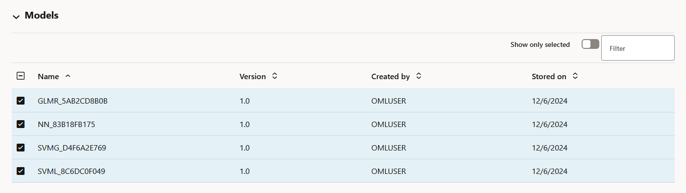

    > **Note:** If you drop any models, you must redeploy the models. Models are not schema-based models, but models deployed to OML Services.

6. Click **Save** on the top right corner of the page. This takes you back to the Model Monitors page. 
       >**Note:** On the Model Monitors page, you must select the model monitor and click **Start** to begin model monitoring. 

7. On the Model Monitors page, select the model monitor that you just created, and click **Start**.

    * Once the running is completed, it shows the Last Status as SUCCEEDED, and the Status as SCHEDULED.    

        
    * Click on the checkbox against the model name to view the model drift on the lower pane of the page.     
        

    * Click on the ellipsis to view the details of the data monitor. Click **Results** to view the data monitoring results. Click **Settings** to view the data monitor settings.
         


This completes the task of creating and running a model monitor.


## Task 3.1: View Model Monitor Results

After your model monitor runs successfully, you can view the model monitoring results. 
1. On the Model Monitors page, click on the checkbox against the model monitor name to view the model drift on the lower pane of the page.

2. On the Model Monitors page, click on the model monitor name to view other details on the **Model Monitor Results** page. 


The **Model Monitor Results** page lists all the models that are monitored by the monitor. 
The Model Monitor Results page comprises these sections: 

* **Name** —  The name of the monitor is displayed at the top of the page. As seen in this screenshot, the monitor name _Power consumption_ is displayed at the top.

* **Settings** — The Settings section displays the model monitor settings. Click on the arrow against Settings to expand this section. You have the option to edit the model monitor settings by clicking Edit on the top right corner of the page. 
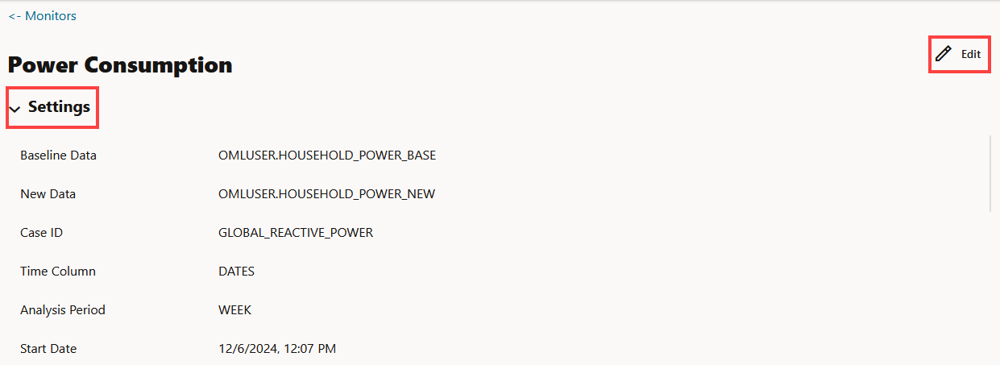
* **Models** — The models `GLMR_5AB2CD8B0B`, `NN_83B18FB175`, `SVMG_D4F6A2E769`, and `SVML_8C6DC0F049` monitored by the _Power consumption_ monitor are listed in the **Models** section. By default, the details of all the monitored models are displayed. You can choose to view the details of one monitor at a time by deselecting the other monitors.  

You can choose to view and compare the results of one or more monitored models by deselecting the ones that you want to exclude. You can also view the results of each feature of the model by clicking on the model. These results — Feature Impact chart, Prediction Distribution, and Predictive Impact versus Drift Importance chart are displayed on a separate pane that slides in. The Predictive Impact versus Drift Importance chart is computed only if the Monitor Data option is selected while creating the model monitor. 
* **Model Drift** — The Model Drift section is displayed just below the Models section. Model drift is the percentage change in the performance metric between the baseline period and the new period. A negative value indicates that the new period has a better performance metric which could happen due to noise.

The X axis depicts the analysis period, and the Y axis depicts the drift values. The horizontal dotted line represents the drift threshold settings that each monitor gets by default. The default covers the typical use case. However, you can choose to customize it based on specific use case. The line depicts the drift value for each point in time for the analysis period. Hover your mouse over the line to view the drift values. 
A drift above the threshold indicates significant change in model predictions. Exceeding the threshold suggests rebuilding and redeploying your model may be necessary. 
If the drift is below the threshold, it indicates that there are insufficient changes in the data to warrant further investigation or action. That is, possibly rebuilding a machine learning model using this data.
If you want to view the drift details of one model at a time, click on the model name on the right to select or deselect it, as shown here.

* **Metric** — This Metric section displays the computed metrics for the selected models. The computed metric is plotted along the y axis, and the time period is plotted along the x axis. In this example, the metric R2 or R-squared is displayed for all the five models. Hover your cursor on other points on the line to view the details of the computed metric. The value of `R2` for all the models is equal to `1`. This indicates that all the five models are good fit for the data.
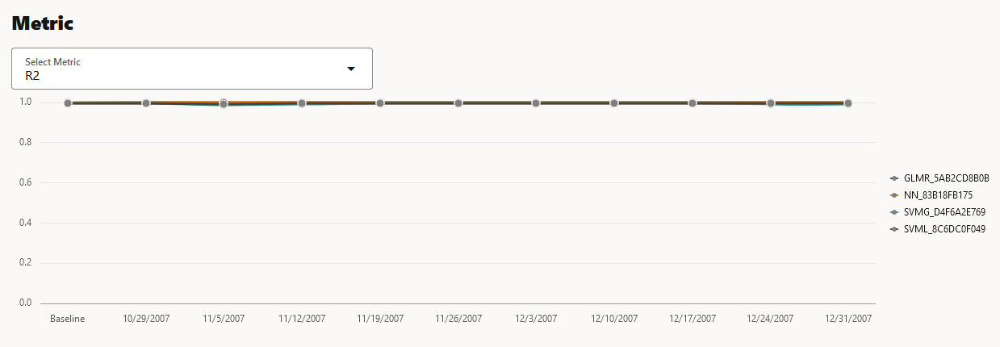 

    The computed metrics for **Regression** are:

    * **R2** — A statistical measure that calculates how close the data are to the fitted regression line. In general, the higher the value of R-squared, the better the model fits your data. The value of R2 is always between 0 to 1, where:
        * `0` indicates that the model explains none of the variability of the response data around its mean.
        * `1` indicates that the model explains all the variability of the response data around its mean.
    * **Mean Squared Error** — This is the average of the squared difference of predicted and true targets.
    * **Mean Absolute Error** — This is the average of the absolute difference of predicted and true targets.
    * **Median Absolute Error** — This is the median (middle number) of the absolute difference between predicted and true targets.


* **Prediction Statistics** — Scroll further down to view the Prediction Statistics section. The computed prediction statistic is plotted along the y axis, and the time period is plotted along the x axis. In the screenshot here, the Population Stability Index for the Neural Network model `NN_2C1F017882` is displayed. Hover your cursor on other points on the line to view the computed metric. 


Click on the drop-down list to view all the prediction statistics. The statistics of the predictions of the model vary according to the type of model.
For **Regression**, the computed prediction statistics are: 

* **Population Stability Index** — This is a measure of how much a population has shifted over time or between two different samples of a population in a single number. The two distributions are binned into buckets, and PSI compares the percents of items in each of the buckets. PSI is computed as

    `PSI = sum((Actual_% - Expected_%) x ln (Actual_% / Expected_%))`
    
    The interpretation of PSI value is:
    * `PSI < 0.1` implies no significant population change
    * `0.1 <= PSI < 0.2` implies moderate population change
    * `PSI >= 0.2` implies significant population change
    
* Min — This is the lowest value of the computed statistics for the analysis period.
* Mean — This is the average value of the computed statistics for the analysis period.
* Max — This is the highest value of the computed statistics for the analysis period.
* Standard Deviation — This is the value that shows how much variation from the mean exists.

**Model Monitor Details:**

You can view the details of each feature of the model by clicking on the model name. These details include:
   * **Feature Impact**
   * **Prediction Distribution** and 
   * **Predictive Impact versus Drift Importance**

In the **Models** section on the Model Monitors Results page, click on the model `NN_2C1F017882`. The details of this model are displayed on a separate pane that slides in, as shown in the screenshot here: 

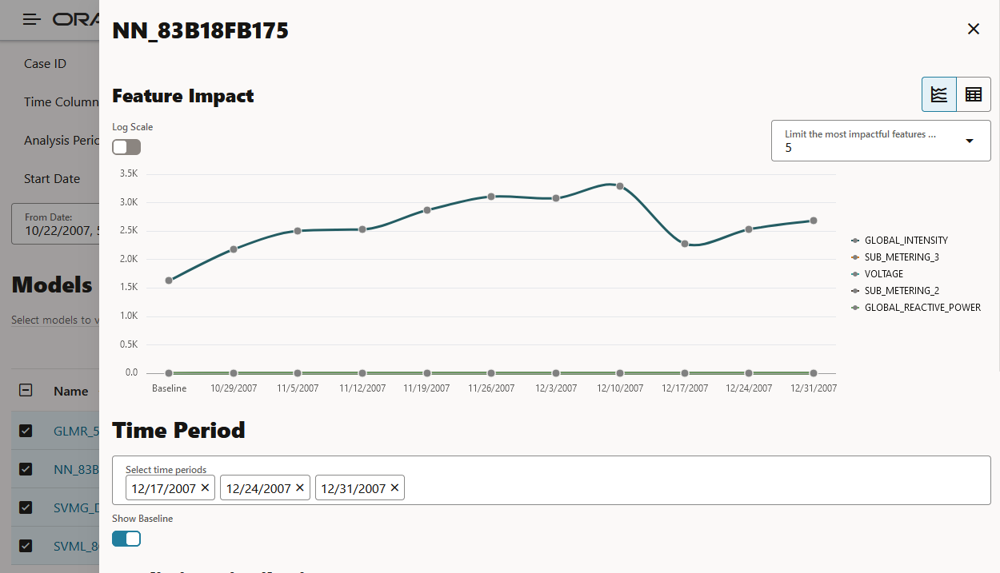

By default, statistics are displayed for three selected periods. You can add or remove the default time periods here. To remove a given time period, click on the **Select Time Periods** field and click X on the date that you want to remove. To add a different time period, click on the **Select Time Periods** field and select from the available dates. If you do not wish to view the computations for baseline, deselect the **Show Baseline** field. This is applicable for the distribution computation also. 
The computed details of the model features are:

* **Feature Impact** — The Feature Impact chart computes the impact of each feature in the model for the specified time. The chart also gives you the option to view the feature impact on a linear scale as well as on a logarithmic scale. Hover your mouse over the chart to view the details - Feature Name, Date, and Feature Impact.

    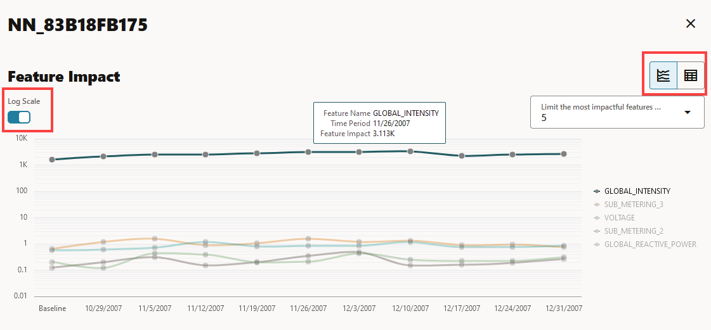
    * Click **Log Scale** to view the feature impact computation on a logarithmic scale.
    * Click  to view the feature impact computation in a line graph.
    * Click  to view the feature impact computation in a tabular format.
    * Click **Limit the most impactful features to** drop down list to select a value.

    In this screenshot, the feature `GLOBAL_INTENSITY`, that is, the global minute-averaged current intensity of the household electric consumption is seen to have the maximum impact on the model `NN_83B18FB175` as compared to the other features. 

    Click X on the top right corner of the pane to exit. 

* **Prediction Distribution** — Scroll down to view the Prediction Distribution. Prediction Distribution is plotted for each analysis period. The Baseline data is displayed, if selected. The bins are plotted along X-axis, and the values are plotted along the Y-axis. Hover your mouse over each histogram to view the computed details. Click X on the top right corner of the pane to exit. 
    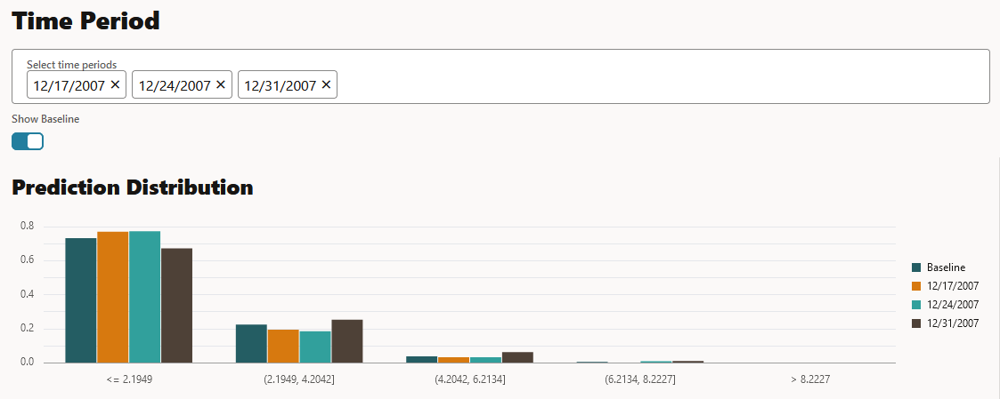

    In the **Time Period** field, click to select more time period to view prediction distribution, or click X over a selected time period to remove it.

    

* **Predictive Impact vs Drift Importance** — Scroll further down the pane to view the Prediction Impact versus Drift Importance chart. This chart helps in understanding how the most impactful features drift over time. Drift Feature Importance is plotted along the Y-axis and Prediction Feature Impact is plotted along the X-axis. Click X on the top right corner of the pane to exit. 
    > **Note:** The Prediction Impact vs Drift Importance chart is computed only if you select the **Monitor Data** option while creating the model monitor. 

    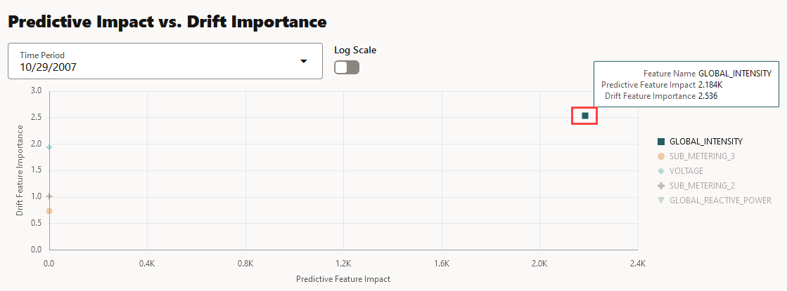
    In this screenshot, you can see that the feature `GLOBAL_INTENSITY` has the maximum impact on the selected predictive model `NN_83B18FB175` as compared to the other features - `SUB_METERING_3`, `GLOBAL_REACTIVE_POWER`, `VOLTAGE`, and `SUB-METERING_1`. 

This completes the task of viewing the model monitor details and statistical computations of the monitored model.

## Task 3.2: View Model Monitor History

The History page displays the runtime details of the model monitors.

1. On the Model Monitors page, select a model monitor and click **History** to view the runtime details. This opens the History page.  

    

2. On the History page, the following information about the model monitor runtime is displayed:
    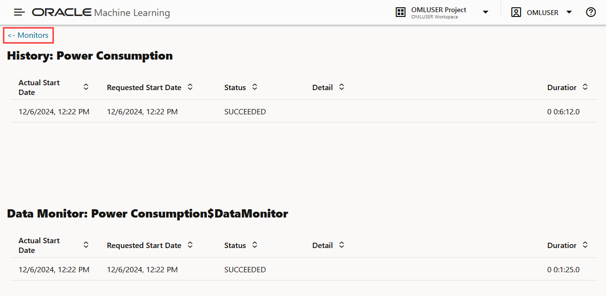

    * **Actual Start Date:** This is the date when the model monitor actually started.
    * **Requested Start Date:** This is the date entered in the Start Date field while creating the model monitor.
    * **Status:** The statuses are SUCCEEDED and FAILED.
    * **Detail:** If a model monitor fails, the details are listed here.
    * **Duration:** This is the time taken to run the model monitor.

   Since you selected **Monitor Data** option while creating the model monitor, the Data Monitor results are also displayed in the lower pane of this page. 

3. Click **Monitors** to return to the Model Monitors page. 

This completes the task of viewing the model monitor runtime history.

You may now **proceed to the next lab.**


## Acknowledgements

* **Author** : Moitreyee Hazarika, Principal User Assistance Developer, Database User Assistance Development

* **Contributors:** Mark Hornick, Sr. Director, Data Science / Machine Learning PM; Marcos Arancibia Coddou, Product Manager, Oracle Data Science; Sherry LaMonica, Consulting Member of Tech Staff, Machine Learning

* **Last Updated By/Date**: Moitreyee Hazarika, June 2025
