# Visualize Data in Oracle Machine Learning Notebooks 

## Introduction

This lab walks you through the steps to visualize your data by using the rich visualization features available in Oracle Machine Learning Notebooks.

### About Visualizations in Oracle Machine Learning Notebooks

Oracle Machine Learning Notebooks offer rich visualization capabilities of your data. The visualizations depend on the type of your dataset. 

Estimated Time: 15 minutes

### Objectives

In this lab, you will learn how to visualize your data in:
* Tables
* Bar Charts
* Funnel Charts
* Line Charts
* Area Charts
* Pyramid Charts
* Pie-charts
* Box Plots
* Scatter Plots

### Prerequisites

This lab assumes you have:
* An Oracle Machine Learning account
* Access to Oracle Machine Learning User Interface

## Task 1: Visualize Data in a Table

A table is an arrangement of information or data in rows and columns. Using OML Notebooks, you can create database tables, and also view the information in a tabular format. 

**Dataset:** `CUSTOMER_INSURANCE_LTV`. In this example, we will use the example template notebook _OML-Run-me-first_.

1. On the Oracle Machine Learning UI homepage, click **Examples.** 
	
	Or, open the left navigation menu by clicking the Cloud menu icon click  on the top left corner of the page. Click **Templates** and then click **Examples.** 
	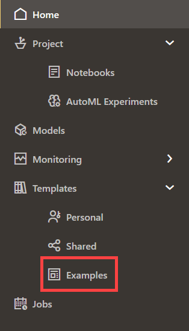

2. The _OML-Run-Me-First_ example template is listed. If you are unable to view it, type the name in the **Filter** field. 

	

3. Click on the `OML Run-me-first tile` (and not on the name) to highlight it in blue. Then click the **Create Notebook** icon. 

	

4. In the Create Notebook Dialog, click **OK.**

	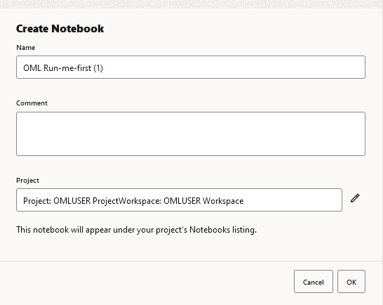

5. Click **Open Notebook** in the confirmation dialog to open the notebook.

	

6. Click the Run Paragraphs icon  in the notebook to run all the paragraphs. This will also create the `CUSTOMER_INSURANCE_LTV` table. Click **Confirm** in the Confirmation dialog. 


7. To view the data in a table format, run the following script in a SQL paragraph:

	```
	<copy>

	%sql

	SELECT * FROM OMLUSER.CUSTOMER_INSURANCE_LTV
	</copy>
	```
	The script presents the data in a tabular format as shown in the screenshot:
	
	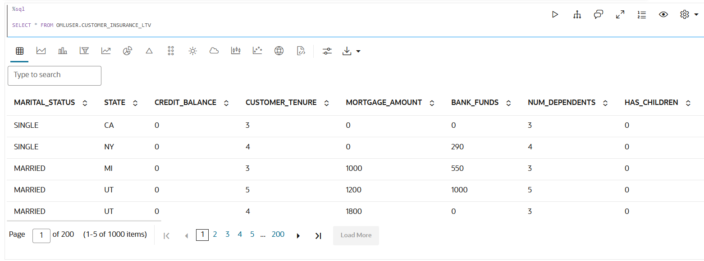


8. In this table, you can customize your views and settings:

	* Sort the columns in ascending or descending order: Click on the down arrow or up arrow against the columns to sort the data in ascending or descending order. 
	
	* Use the horizontal scroll bar to scroll horizontally to view the columns on the right.

		
	* Filter specific search terms. In the **Search** field, type the entry or term that you are looking for. In this example, the term `Single` is entered. All the rows that contain the term SINGLE in the column `MARITAL_STATUS` are filtered for display.
	
		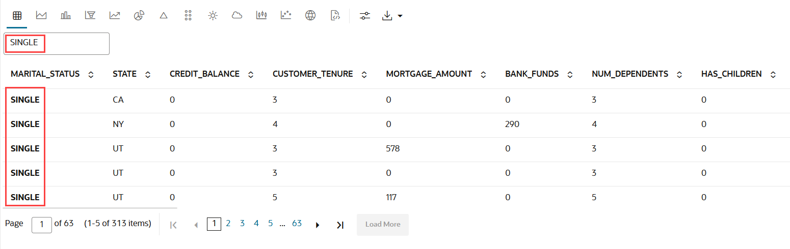

	> **Note:** Rows that do not contain this term are hidden from the view and the remaining rows highlight the location of the search term within the row.

	* By default, 5 rows are displayed. If you want to view more rows or customize the table settings, click on the Settings icon  to open the Settings dialog.


	* In the Settings dialog, you can edit the following:

		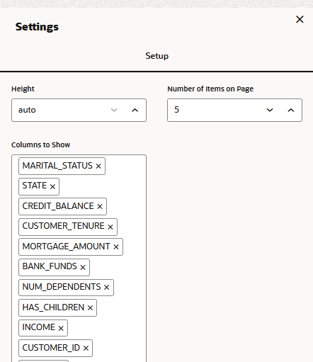

		* **Height:** This parameter changes the height of the visualization. Click on the up or down arrow to increase or decrease the visualization height. 


		* **Number of Items on Page:** Click on the up or down arrow, as applicable, to set the number of rows to be displayed on the page. By default, 5 rows are displayed.


		* **Columns to Display:** By default, all the columns are listed. If you want to remove any column from displaying, click on the X in the column name. To view the column again, click inside the **Columns to Show** field. The hidden columns are displayed. Click on the column that you want to view again. In this example the column MARITAL_STATUS was removed. Clicking on the **Columns to Show** field displays it; click on it to include in the display.

This completes the task of creating a table, and visualizing the data in it. 

## Task 2: Visualize Data in a Bar Chart

A bar graph is a graphical representation of data in rectangular bars. The length or height  of the bars, depending on the horizontal or vertical orientation, depict the dataset distribution. One axis represents a category, while the other represents values or counts.

**When to use this chart:** Use bar charts to show a distribution of data points, and perform a comparison of metric values across different subgroups of your data. 

**Dataset:** `CUSTOMER_INSURANCE_LTV`. In this example, we will use the example template notebook OML-Run-me-first.

To visualize data in a bar chart:

1. In the OML-Run-Me-First notebook, go to the paragraph where you viewed the `CUSTOMER_INSURANCE_LTV.` Click on the bar chart icon.

	

2. By default, it shows CREDIT_BALANCE along the Y-axis and the data is grouped by `MARITAL_STATUS` along the X-axis. 

	

3. Click on the Settings icon  to get a different view of this data. Under Setup:

	

	* In **Series to Show:** Select `CREDIT_BALANCE`, `MORTGAGE_AMOUNT`, and `BANK_FUNDS`.

	* In **Group By:** Select `MARITAL_STATUS`

4. The average of `CREDIT_BALANCE`, `MORTGAGE_AMOUNT`, and `BANK_FUNDS` are each represented by adjacent bar charts, and the bar charts are grouped by `MARITAL_STATUS` - single, married, divorced, widowed, and others. The bar chart now looks like this, as shown in the screenshot below:

	

5. Once again, click on the Settings icon  and click **Customization:**

	

	* **Coordinate System:** The coordinate system of the chart. Supported Values: Polar Coordinates, Cartesian Coordinates. Click Cartesian Coordinates

	* **Layout:** The chart orientation. Either horizontal or vertical.

	* **Stack:** Defines whether the data items are stacked or not. Click Stacked.

	* **Sorting:** Specifies the sorting of the data. It should only be used for pie charts, bar/line/area charts with one series, or stacked bar/area charts. Sorting will not apply when using a hierarchical group axis. Click Ascending. 

	* **Zoom:** Specifies the zoom and scroll behavior of the chart. Live behavior means that the chart will be updated continuously as it is being manipulated, while "delayed" means that the update will wait until the zoom/scroll action is done. While "live" zoom and scroll provides the best end user experience, no guarantees are made about the rendering performance or usability for large data sets or slow client environments. If performance is an issue, "delayed" zoom and scroll should be used instead.

	The bar chart now presents the data in a stacked manner, and in ascending order, as shown in the screenshot below:

	

	This completes the task of visualizing your data in a bar chart, and customizing its output.

## Task 3: Visualize Data in a Funnel Chart

A funnel chart is a graphical representation that resembles the shape of a funnel where each segment gets progressively narrower. The segments are arranged vertically and depict a hierarchy. Within the funnel chart, each segment corresponds to a step or stage in a sequential process.

**When to use this chart:** Use this chart to visualize a linear sequential process, mostly in business and sales contexts. For example, you can use a funnel chart to track the sales process, order fulfillment, website visitor trends, and so on.   

**Dataset:** `CUSTOMER_INSURANCE_LTV`. In this example, we will use the example template notebook OML-Run-me-first.

To view the data in a funnel chart:
1. In the OML-Run-Me-First notebook, go to the paragraph where you viewed the `CUSTOMER_INSURANCE_LTV.` Click on the Funnel chart icon.

	

2. The data is displayed as below:

	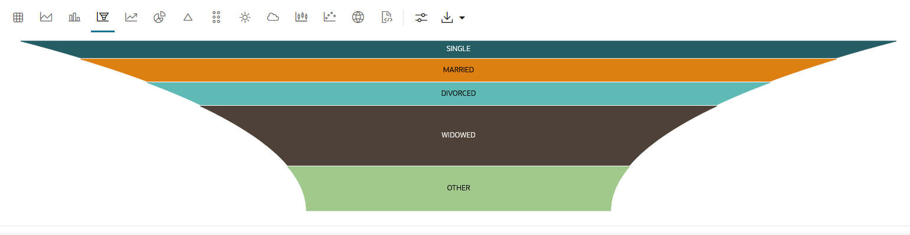

3. Hover your cursor to view the series that is plotted in the funnel chart for each of the 5 groups.

4. Let's compare a few attributes `CREDIT_BALANCE`, `MORTGAGE_AMOUNT` and `INCOME` of the same groups. Click Settings  and edit the following:

	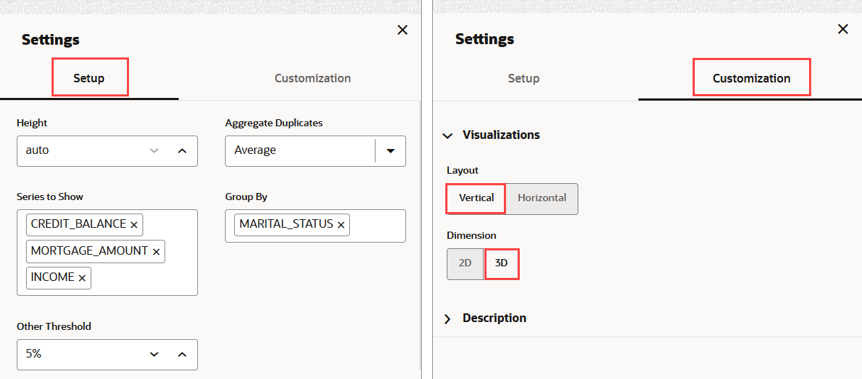

5. The three series are displayed in three funnel charts for each of the 5 groups. 

	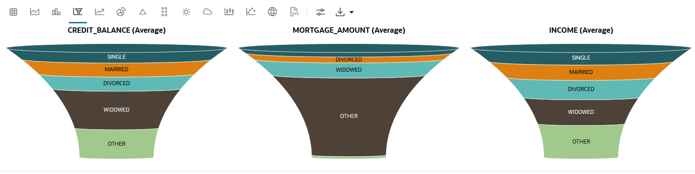


## Task 4: Visualize Data in a Pyramid Chart

Pyramid charts present your data in a distinctive triangular configuration, horizontally segmented into partitions. Each segment in the pyramid charts represents points or steps in ascending or descending order. 

**When to use this chart:**  Use this chart to depict hierarchical structures and the relative proportions of different values. They are typically used for displaying demographic data, market segmentation, or organizational structures. In any case, the data must have a progressive order. 

**Dataset:** `CUSTOMER_INSURANCE_LTV`. In this example, we will use the example template notebook OML-Run-me-first.

To visualize data in a Pyramid Chart:

1. In the OML-Run-Me-First notebook, go to the paragraph where you viewed the `CUSTOMER_INSURANCE_LTV.`

2. Click on the pyramid chart icon.

	

3. Click the Settings icon . Under **Setup:**

	* **Aggregate Duplicates:** Select **Average.**
	* **Series to Show:** Select **`INCOME`** and **`MORTGAGE_AMOUNT`.**
	* **Group By:** Select **`MARITAL_STATUS`**
	* Click the settings icon. Under Customization expand Visualization and click click 3D under Dimension
	* Under **Setup,** change Group By to **GENDER.** 

	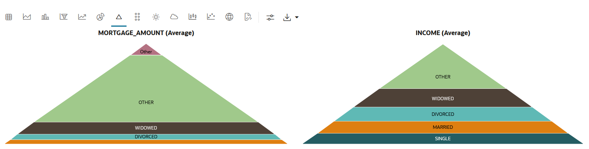

	* Once again, click the Settings icon . Under **Customization,** expand **Visualization** and click **3D** under **Dimension.**

	

	* Open the Settings dialog again, and under **Setup** change **Group By** to **GENDER.**

	

	The pyramid chart shows a clear correlation between the two genders, and their income level and mortgage amount. For both the categories, the average income and mortgage amount taken is higher for Females.


## Task 5: Visualize Data in a Scatter Plot
Scatter plots represent the relationship between two numeric variables in a data set. It represents data points on a two-dimensional plane and show how much one variable is affected by another. The independent variable is plotted on the X-axis, while the dependent variable is plotted on the Y-axis. You can display points by one or more grouping variables such that each group has a distinct color and shape. 

**When to use this chart:** Use the scatter plot when you have paired numerical data, and you want to determine the relationship between the related variables in certain scenarios, identifying correlations and trends (linear and non-linear relationships), detecting outliers, understanding data distribution, identifying groupings or clusters of data. Scatter plots can also be useful when comparing multiple datasets where each datasets values are represented as a different group. Scatter plots are also useful for evaluating regression models by plotting, e.g., actual versus predicted values. 

**Dataset:** `CUSTOMER_INSURANCE_LTV`. In this example, we will use the example template notebook OML-Run-me-first.

To visualize data in a scatter Plot: 

1. In the OML-Run-Me-First notebook, go to the paragraph where you viewed the `CUSTOMER_INSURANCE_LTV.` Click on the Scatter plot icon. A default scatter plot is shown that you will customize in the next step. 

	

2. Click the settings icon. In the Settings dialog, under **Setup:**
* **Series to Show on X-axis:** Click and select `INCOME`.
* **Series to Show on Y-axis:** Click and select `MORTGAGE_AMOUNT`.
* **Group By:** Select `MARITAL_STATUS`.
3. Under **Customization:** 
* **Visualization:** Retain the default settings.  
* **Description:** Under **Title**, enter `Scatter plot to show the correlation between income and mortgage amount.` 

	
 The scatter plot shows a strong correlation between Income and Mortgage amount in the income range 50k to 80k.

## Task 6: Visualize Data in a Line Chart
A line chart is a graphical representation used to display data points connected by straight lines.

**When to use this chart:** Use this chart to visualize trends, changes, and relationships in data over a continuous period.

**Dataset:**  `SH.SALES` table. The `SALES` table that is present in the `SH` schema. 

1. In a sql paragraph in your notebook, run the following command:

	```
	<copy>
	%sql
	select * from SH.SALES
	</copy>
	```

2. By default, the dataset is displayed in a table. Click on the line chart icon.

	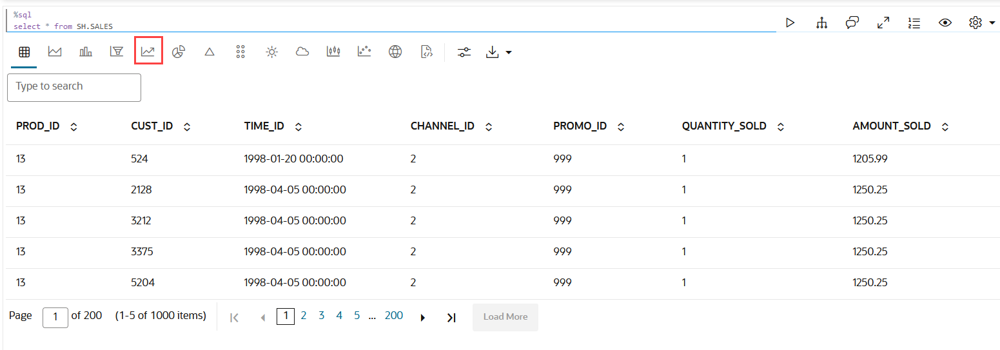

3. By default, the line chart shows the average amount sold from the year 1998 till 2001, as shown in the screenshot below. 

	

	Click on the Settings icon  to view the attributes that are plotted along the X and Y axis.  The dates on which the product was sold from the year 1998 till 2001 are plotted along the X-axis. Corresponding to each sale date, the average of the amount sold is plotted along the Y-axis.

4. Click on the Settings icon  and edit the following:
	Under **Setup:**
	* **Aggregate Duplicate:** Decides what should happen with values that are within the same group. Select **Sum.** This will show the sum of the amount sold for the product with PROD_ID 13, from 1998 to 2001. 
    * **Series to Show:** All fields in the result-set that are of type number can be selected. Selecting multiple fields will add additional diagrams to the visualization. Select **AMOUNT SOLD.**
    * **Group By:** All fields in the result-set can be selected. The more groups exist, the more the dataset shrinks since it collects all fields and concatenates same values. Select **TIME_ID.**

	Under **Customization:**
	* **X-axis:** Enter `Time: 1998 - 2001`. The dates on which the product was sold from the year 1998 till 2001 are plotted along the X-axis. 
	* **Y-axis:** Enter `Amount Sold`. Corresponding to each sale date, the sum of the amount sold is plotted along the Y-axis.
	* **Description:** Enter `Sales trend of product ABC` 
	
	The line chart now displays the sum of the amount sold from the year 1998 to 2001, as shown below. Hover your cursor over the highest point in the line chart to view the values. You can see that on 5/30/2000, the product recorded the highest sale in terms of the sum of the amount sold. 

	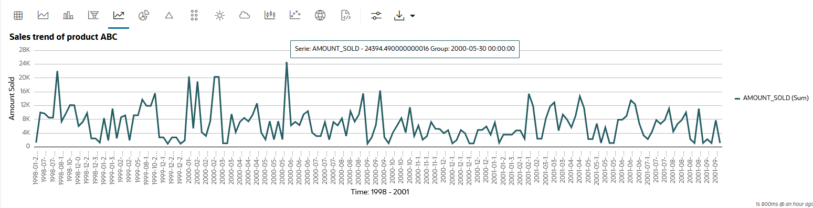

## Task 7: Visualize Data in an Area Chart
An area chart uses lines to connect the data points and fills the area below these lines to the x-axis. Each data series contributes to the formation of a distinct shaded region. This emphasizes its contribution to the overall trend. As the data points fluctuate, the shaded areas expand or contract. 

**When to use this chart:** Use this chart to gain visual insight into the changes within the dataset.

**Dataset:** `SH.SALES` table. The `SALES` table that is present in the `SH` schema. 

To visualize your data in an area chart: 

1. In another `%sql` paragraph, run the following script:

	```
	<copy>
	SELECT
  		TIME_ID,
  		-- Use MAX(TOTAL_SOLD) to handle cases with duplicate TIME_ID and CHANNEL_ID
  		MAX(CASE WHEN CHANNEL_ID = 2 THEN TOTAL_SOLD ELSE NULL END) AS Channel_2,
  		MAX(CASE WHEN CHANNEL_ID = 4 THEN TOTAL_SOLD ELSE NULL END) AS Channel_4,
  		MAX(CASE WHEN CHANNEL_ID = 3 THEN TOTAL_SOLD ELSE NULL END) AS Channel_3,
  		MAX(CASE WHEN CHANNEL_ID = 9 THEN TOTAL_SOLD ELSE NULL END) AS Channel_9
	FROM (SELECT TIME_ID, CHANNEL_ID, sum(AMOUNT_SOLD) TOTAL_SOLD
      FROM SH.SALES
      	WHERE TIME_ID >= TO_DATE('2001-09-01', 'YYYY-MM-DD')
      	GROUP BY TIME_ID, CHANNEL_ID
      	ORDER BY TIME_ID)
	GROUP BY TIME_ID
	ORDER BY TIME_ID

	</copy>
	```
	This script groups the data by `TIME_ID` and `CHANNEL_ID`. It presents the data from 2001-09-01 and later. It shows the value for TOTAL_SOLD for each of the four channels grouped by `CHANNEL_2,` `CHANNEL_3,` `CHANNEL_4` and `CHANNEL_9.` 

2. The data from the SALES table is now presented for the following columns - `TIME_ID,` `CHANNEL_2,` `CHANNEL_3,` `CHANNEL_4` and `CHANNEL_9.` 

	

3. Now, click on the the Area chart icon  in the tool bar to visualize the data in an area chart. 

	

3. Click on the Settings icon  to open the Settings dialog. Under Setup:

	* **Series to Show:** Click to add `CHANNEL_3,` `CHANNEL_4` and `CHANNEL_9.` 
	* **Group By:** Retain the default, that is, `TIME_ID.`
	* **Aggregate Duplicates:** Retain the default, that is, `SUM.`

	Click on Customization and under **Visualization,** click **Stacked.**
	The area chart is now presented as shown in the screenshot. 

	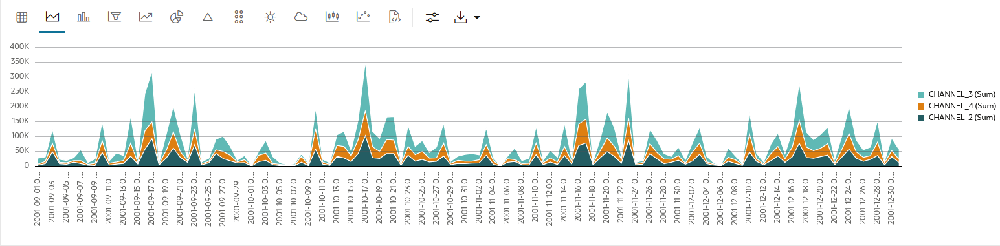

 
## Task 8: Visualize Data in a Pie Chart

A pie chart is a graphical representation of data in a circular form, with each slice of the circle representing a fraction that is a proportionate part of the whole.

**When to use this chart:** Use this chart to visualize the numerical proportion of the parts to the whole. 

**Dataset:** The `IRIS` dataset contains 3 classes (three different Iris species - Setosa, Versicolor, and Virginica) along with 50 samples each, and four numeric properties about those classes: Sepal Length, Sepal Width, Petal Length, and Petal Width. 

To visualize data in a pie chart
1. Run the following script in an R paragraph to create the Iris dataset:

	```
	<copy>
	%r
	library(ORE)

	if (ore.exists("IRIS_R")) ore.drop(table="IRIS_R")

	ore.create(iris, table = "IRIS_R", overwrite=TRUE)

	ore.exec("ANALYZE TABLE IRIS_R COMPUTE STATISTICS")

	z.show(cat("Shape:", dim(IRIS_R)))

	</copy>
	```

2. Run the following SQL command to view the dataset.

	```
	<copy>
	%sql
	select * from OMLUSER.IRIS_R
	</copy>

	```
	


3. By default, the dataset is displayed in a table. Click on the pie chart icon . 

	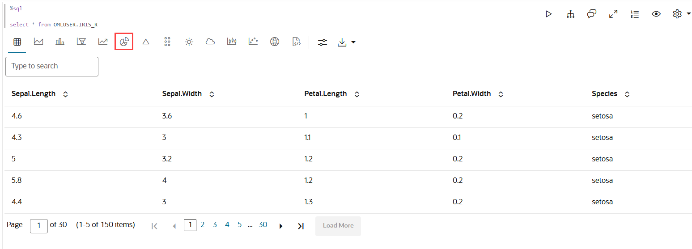

4. The data is now displayed in a pie chart. By default, the pie chart shows the average of the sepal length for each of the three species of iris. It also shows a 5% threshold for others.  
	

5. Click on the settings icon . In the Settings dialog, click **Customization.** 
	* **Variant:** click **Donut.** 
	* **Inner Radius:** Click the up arrow and set it to **40.**
	* **Label:** Type `Sepal Length of the 3 iris species.` 
	* Close the dialog. The data is now rendered in a donut chart, as shown below:

	

6. Once again, click on the Settings icon . In the Settings dialog, 

	* **Setup:** Under **Series to Show**, select **Petal Length** while retaining **Sepal Length.** 
	
7. Click **Customization:** 
	* Under **Variant,** click **Pie.**
	* Under **Dimension,** click **3D.**
	* Under **Sorting,** click **Ascending.**
	
	The data is now displayed in two 3D pie charts, one showing the average sepal length, and the other showing the average petal length for each of the three species of the iris flower.  

	


## Task 9: Visualize Data in a Box Plot
A box plot provides an overview of data distributions in numeric data. It provides general information about the symmetry, skewness, variance, and outliers in a dataset. The box plot uses boxes and lines to depict the data distribution. The box plot has the following components:


* Central Box - Inter-quartile range and quartiles:
    * Q1 (First Quartile): This is the value below which 25% of the data falls. It represents the boundary between the lowest 25% and highest 75% of values.
    * Q3 (Third Quartile): This represents the value below which 75% of the data falls, serving as a border between the lowest 75% and highest 25% of values.
    * Interquartile Range (IQR): The IQR is the range in which the central 50% of the values fall. IQR = Q3 - Q1
 * Whiskers: The whiskers of the box plot extend from the central box to the minimum and maximum data values that are not considered outliers. They provide a graphical representation of the majority of the data's distribution.
* Outliers: Outliers are data points that deviate significantly from other data points, typically due to data variability or errors. An outlier is plotted as a dot beyond the ends of the whiskers of a box plot.
* Median: The median is the value that divides the dataset into two halves, with 50% of the values falling below it and 50% falling above it. In the box plot, a line or a mark inside the central frame represents the median.

**When to use this chart:** Use this chart to show distributions of numeric data, especially if you want to compare them between multiple groups. 

**Dataset:** The `IRIS` dataset contains 3 classes (three different Iris species - Setosa, Versicolor, and Virginica) alongwith 50 samples each, and four numeric properties about those classes: Sepal Length, Sepal Width, Petal Length, and Petal Width.


1. We have already created the `IRIS_R` dataset in Task 8. 

3. Click the box plot icon .

	


4. The dataset is now displayed in a box plot. 

	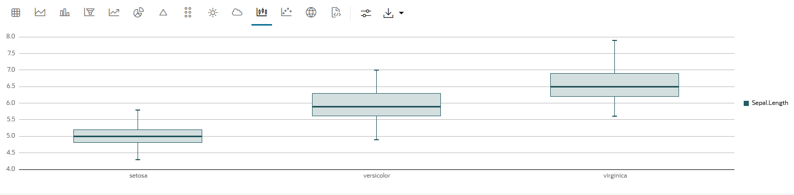
	As you can see, by default the data is grouped by the 3 species (classes) - Setosa, Versicolor, and Virginca along the X-axis, and the sepal length along the Y axis. Hover your cursor over each box plot to view the count.

5. Click on Settings to view how the data is plotted. Under **Setup**, go to **Series to Show,** and click to add the other three numeric properties - Sepal Width, Petal Length, and Petal Width.
	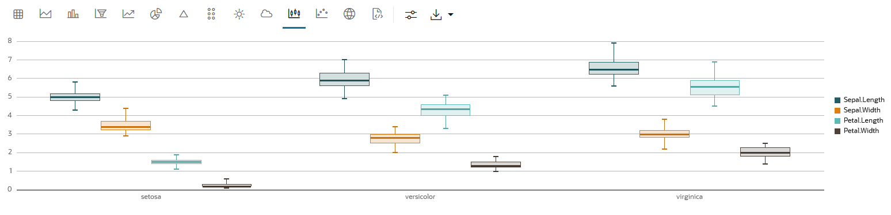

6. Under Settings, click **Customizations,** edit the following settings:
	* **Visualization:** Click **Show Outliers.**
	* **X-Axis:** In the **Text** field, enter `Iris Species.` **Color:** Enter **rgb(7, 17, 215, 0.88)**
	* **Y-Axis:** In the **Text** field, enter `Petal & Sepal Properties.` **Color:** Enter **rgb(7, 17, 215, 0.88)**
	* **Description:** Enter the following - `Box Plot of the Iris flower dimension`. 
	* **Color:** Enter **rgb(241, 8, 24)**
	* Once done, close the dialog. 

	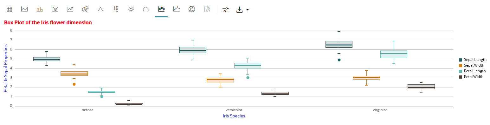

7. The box plot now displays the dataset as below: 

	a) Hover your cursor over each box plot to view the values. In the screenshot here, the cursor is over the Sepal Length series for the species Virginica. The length ranges from `5.6` to `7.9`. There is also an outlier for this, and it is indicated by the dot below the box plot whisker. 
	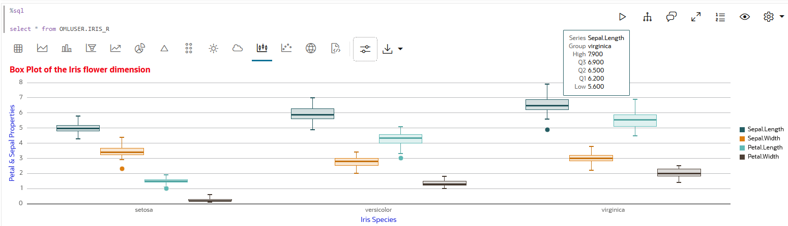

	b) Hover your cursor over the dot that indicates the outlier for the group virginica. It shows the outlier value at `4.9` for Virginica sepal length. This means that in the species Virginica, there are sepals whose length is significantly below the lower count `(5.6)`.

	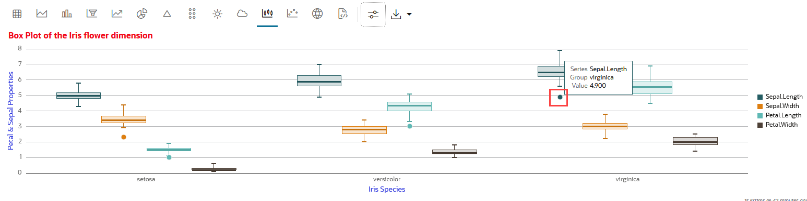


## Learn More

* [Oracle Machine Learning UI](https://docs.oracle.com/en/database/oracle/machine-learning/oml-notebooks/)


## Acknowledgements

* **Author** -  Moitreyee Hazarika, Principal User Assistance Developer, Database User Assistance Development
* **Contributors** -   Mark Hornick, Senior Director, Data Science and Machine Learning; Marcos Arancibia Coddou, Product Manager, Oracle Data Science; Sherry LaMonica, Consulting Member of Tech Staff, Machine Learning
* **Last Updated By/Date** - Moitreyee Hazarika, June 2025
