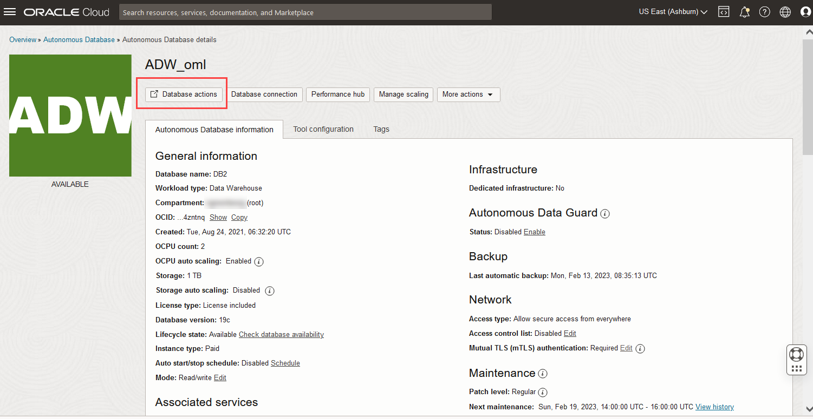
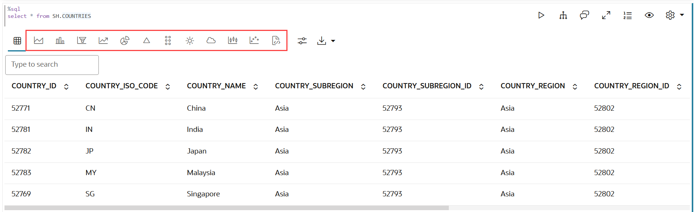
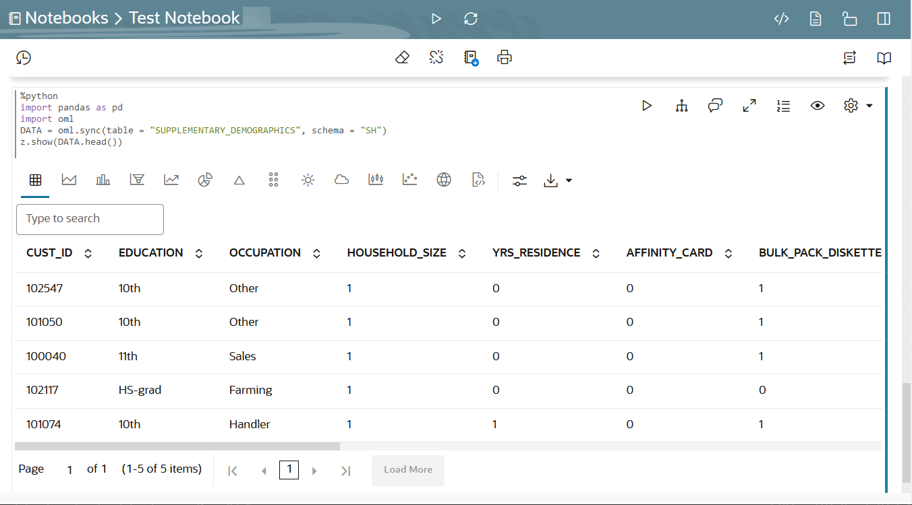
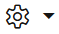
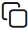
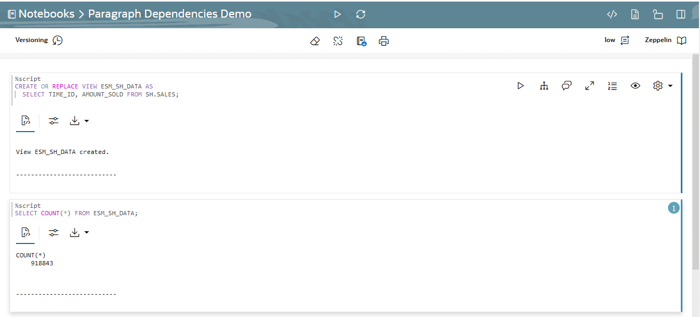
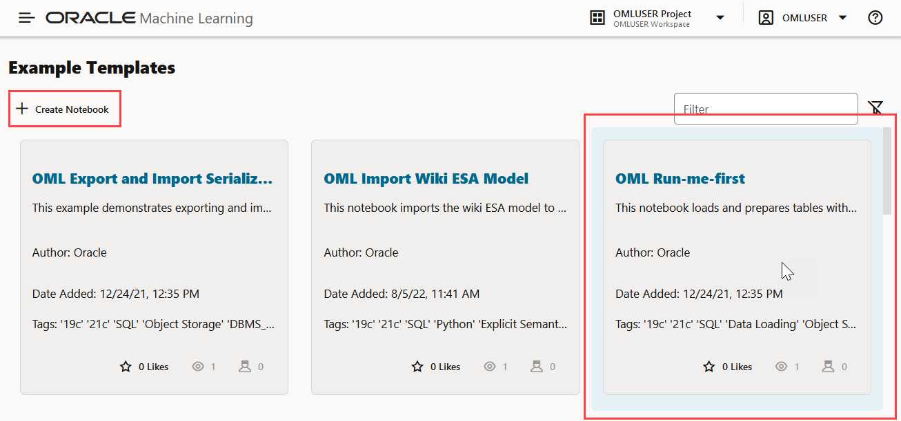
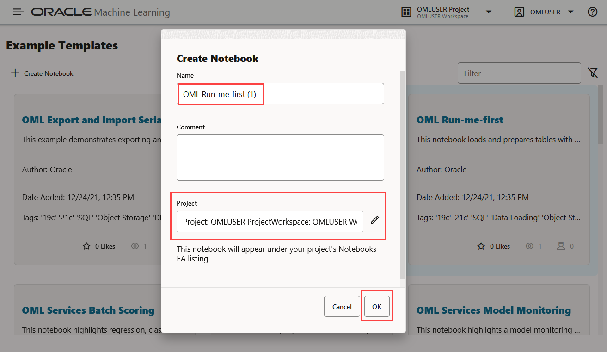
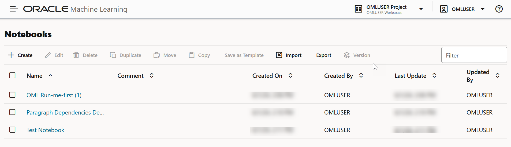

# Introduction to Oracle Machine Learning Notebooks 

## Introduction

This lab walks you through the steps to sign into Oracle Machine Learning UI, create an Oracle Machine Learning (OML) notebook from scratch using the enhanced notebook environment, and explore the features.

Estimated Time: 15 minutes

### About Oracle Machine Learning Notebooks

Oracle Machine Learning Notebooks Early Adopter (EA) is an enhanced web-based notebook platform for data engineers, data analysts, R and Python users, and data scientists. You can write code, text, create visualizations, and perform data analytics and machine learning modeling. You can also leverage third-party packages from the R and Python ecosystems. In Oracle Machine Learning, notebooks are organized in projects, and projects within a workspace. You can create, edit, delete, copy, move, and version notebooks, and even save notebooks as private or sharable templates.

To support data science team collaboration, you can post  and respond to comments on individual paragraphs within a notebook and share notebooks as templates.
The Oracle Machine Learning Notebook EA provides:
* Faster notebook loading time than the original notebook interface.
* The Oracle look and feel as it based on the Oracle Redwood theme.
* Enriched visualization in its line chart, area chart, bar chart, pyramid chart, pie chart, donut chart, funnel chart, tag Cloud, treemap diagram, sunburst diagram, scatter plot, box plot.
* Comments in notebook paragraphs to support team collaboration.
* Paragraph Dependencies, which allows you to add runtime sequence dependencies between paragraphs. The child paragraph automatically run after the parent paragraph is run.
* Simplified service level selection of High, Medium, Low through drop-down menu.
* Layout style of Zeppelin or Jupyter notebook interfaces.
* On-page versioning, viewing of version history, and version comparison.

### Objectives

In this lab, you will learn how to:
* Access the enhanced notebook environment
* Create and run a Notebook EA
* Edit notebooks
* Create notebook versions
* View version history and compare notebook versions
* Create paragraph dependencies, and run the paragraphs based on paragraph dependency order

### Prerequisites

This lab assumes you have:
* An Oracle Machine Learning account
* Access to Oracle Machine Learning USER account.

## Task 1: Sign into Oracle Machine Learning User Interface

A notebook is a web-based interface for data analysis, data discovery, data visualization, and collaboration. You create and run notebooks using Oracle Machine Learning Notebooks, which is accessed through the Oracle Machine Learning user interface on Oracle Autonomous Database.

<if type="freetier">

1. Sign into your OCI account, click the Cloud menu on the left to open the left navigation pane, and click **Oracle Database**. On the right pane under Autonomous Database, click **Autonomous Data Warehouse**.

	

2. The Autonomous Database dashboard lists all the databases that are provisioned in the tenancy. Click the Oracle Autonomous Database that you have provisioned.

          	  

3. On your Oracle Autonomous Database instance page, click **Database Actions**. The Launch DB Actions dialog opens. Wait till the Database Actions opens.

	

4. On the Database Actions page, go to the **Development** tab and click **Oracle Machine Learning**. This opens the Oracle Machine Learning sign in page.

	

5. Enter your user credentials and click **Sign in**.

	> **Note:** The credential is what you have defined while creating the Oracle Machine Learning user.

	

	This opens the Oracle Machine Learning user interface home page.
	
</if>

<if type="livelabs">
1. On your workshop page, click **Launch Workshop** under **My Reservations**.

   

2. On the **Get Started - LiveLabs login** page, click **View Login Info** at the top left.

	

3. In the panel that opens with the **Reservation Information**, click at the bottom of the panel on the **OML Notebooks** link.

	

4. In the page that opens, enter your user credentials and click **Sign in**. This opens the Oracle Machine Learning user interface home page.

	> **Note:** The username is `OMLUSER`, and password is `AAbbcc123456`.

	

</if>
This completes the task of accessing Oracle Machine Learning user interface.

## Task 2: Access Oracle Machine Learning Notebook 

You can access the Notebooks EA page from the left navigation pane of Oracle Machine Learning Notebook UI, or from the Notebooks listing page.
To access the Notebooks page:
1. Go to the Oracle Machine Learning UI left navigation pane, and click **Notebooks EA** under Projects.

	

	Alternatively, you can click **Notebooks** under Quick Actions on the home page to open the Notebooks page. On the Notebooks page, click **Go to OML Notebooks EA** to open the Notebooks listing page.
		

2. This opens the OML Notebooks EA (Early Adopter) page.

	

Here, you have the option to:
* **Create:** Click Create to create a new notebook.
* **Edit:** Click on a notebook row to select it and click **Edit.** You can edit the notebook name, and add comments in the Edit Notebook dialog box.
* **Delete:** Click on a notebook row to select it and click **Delete.**
* **Duplicate:** Click on a notebook row to select it , and click **Duplicate.** This creates a copy of a notebook, and the duplicate copy of the is listed on the Notebooks page with the suffix `_1` in the notebook name.
* **Save as Template:** To save a notebook as a template, select the notebook and click **Save as Template.** In the Save as Template dialog, you can define the location of the template to save it in Personal or Shared under Templates.
* **Import:** To import a notebook, click **Import.** The following notebook formats are supported for import - ``.json`` , ``.zpln`` (Zeppelin notebook), ``.ipynb`` (Jupyter notebook) and ``.dsnb`` (native). Select the project and workspace in which to import the notebook.
* **Export:** To export a notebook, click **Export.** You can export Notebooks Early Adopter in the `.dsnb` format, Zeppelin format (`.json` ) file and in Jupyter format (`.ipynb`), and later import them in to the same or a different environment. You can also export the notebook in HTML format, and optionally exclude paragraph code, results, and timestamps.
* **Version:** To create versions of a notebook, select it and click **Version.** The Versions page for that particular notebook opens. Here, you can create a new version of the notebook by clicking **+Version.** The Create Version dialog opens. Enter a name of the notebook version, a description, and click **OK.** The new version of the notebook gets created by the same name with a suffix `_2` for the second version. For subsequent versions, suffix (number) increments by one. To revert to an older version by clicking Revert Version. You also have the option to delete any version of the notebook. Click **Back to Notebooks** to go to the OML Notebooks EA (Early Adopter) page.

## Task 3: Create a notebook and define paragraphs using the md, SQL, PL/SQL, Python, and R Interpreters

In this task, you will create a new notebook, and add paragraphs to connect to the Markdown, SQL, Script, Python, and R interpreters. Interpreters are independent backend engines. R and Python engines are stateful while the notebook is open, and database objects are valid for the duration the database connection is active. You can change the interpreter by explicitly specifying one of `%script`, `%python`, `%sql` , `%r` , `%md`, or `%conda` to connect to the respective interpreter.

To learn about Conda, refer to [Use the Conda Interpreter in a Notebook Paragraph](https://docs.oracle.com/en/database/oracle/machine-learning/oml-notebooks/omlug/notebooks.html#GUID-0AAB3590-4422-450D-BE91-4EC435FD4254)

1. On the Notebooks EA (Early Adopter) page, click **Create.**
		
2. In the Create Notebook dialog, enter the name `Test Notebook EA` in the **Name** field and click **OK.** The notebook is created and it opens in the notebook editor.
		

	You can now use the **Test Notebook EA** to create a Markdown paragraph, SQL paragraph, Python, R and Conda paragraphs.   

### Task 3.1: Use the Markdown interpreter and display static html from Markdown plain text

In this task, you will use the Markdown interpreter, and display the formatted text in the output of the markdown paragraph.
>*Note:* The first time a given interpreter type is accessed, the interpreter is started, which may take a few seconds to initialize and establish a connection to the database. Subsequent uses of the interpreter in later paragraphs will be immediate.

1. In the first paragraph, type `%md` and press Enter.
2. Type the following:
	* To format the text in bold, type the text Hello World inside a double asterisk pair, and press Enter.
	* To format the text in italics, type the text Hello World either inside an asterisk pair or an underscore pair, and click the Run

	Alternatively, you may copy the code and paste it in the notebook just below %md, and click the Run icon run icon as shown in the screenshot:
	```
	<copy>
	**Hello World**
  *Hello World*
  _Hello World_
	</copy>
	```

	After running the paragraph, the output is displayed, and a new paragraph is automatically created. Also, you can manually create additional paragraphs.
	

3. Hover your cursor over the lower border of the paragraph and click  to add another Markdown paragraph.

	

4. To display the text in a bulleted list, prefix * (asterisk) to the text Hello World We welcome you, as shown in the screenshot below.

	```
	<copy>
	* Hello World
	* We welcome you
	</copy>

	```
5. Add another Markdown paragraph. Here, you will use Markdown tags to display the text in heading 1 (H1), heading 2 (H2) and heading 23 (H3). For H1, H2, and H3, add one, two, and three hashes before the text Hello World respectively.

	```
	<copy>
	# Hello World
	# Hello World
	### Hello World
	</copy>

	```
6. Now, scroll up the notebook and click the Run All icon present in the notebook toolbar, as shown in the screenshot here.

	

7. A message appears asking you to confirm whether to run all the paragraphs of the notebook. Click **Confirm.**
	

	The two paragraphs run and the output is displayed in the respective paragraphs, as shown in the screenshot.
		
This completes the task of using the Markdown interpreter to generate HTML in your notebook. 
### Task 3.2: Use the SQL Interpreter and run SQL Statements

Let’s create another paragraph to use the SQL interpreter and run SQL statements:

>*Note:* The first time a given interpreter type is accessed, the interpreter is started, which may take a few seconds to initialize and establish a connection to the database. Subsequent uses of the interpreter in later paragraphs will be immediate.

1. To create a SQL paragraph, hover your cursor over the lower border of the paragraph and click on the **Add sql Paragraph** icon to add a SQL paragraph.

	

	You may also choose to click on the Add Paragraph icon  to manually create a new paragraph. Then type  ``%sql``  and press Enter to call the SQL interpreter.

2. Type the following command and click the run icon .

	```
	<copy>
	select * from SH.COUNTRIES
	</copy>
	```

	* The command returns the COUNTRIES table present in the SH schema in a tabular format, as shown in the screenshot. You can also view the data in various visual format by clicking on any of the chart icons, as highlighted in the screenshot here:
	

	* Click on the histogram icon to view the table in a histogram. Hover your cursor over each bar to view the details for each country:
	
	* You can adjust the settings and visual output by clicking on the **Settings** icon on the paragraph toolbar, highlighted in red. Clicking the settings icon opens the **Settings** dialog. Here, click on the **Setup** tab to customize the output to view.
	
	* Click on each of the fields to choose various output options. In this customized output, the COUNTRY REGION ID and COUNTRY NAME in the **Series to Show** and **Group By** fields respectively. The histogram now shows an additional series - country region and the full name of the country along with the country code.
	
	* Click on the **Height** field and enter values as applicable to adjust the setting to allow scrolling and limit vertical height of the result.
	
	* Click on the **Customization** tab in the **Settings** dialog to customize the visualization. Here, the layout of the histogram is changed to horizontal and the color is changed to red for the series COUNTRY NAME.
	

This completes the task of connecting to the SQL interpreter and running SQL commands in your notebook. 
### Task 3.3: Use the PL/SQL Interpreter and run PL/SQL Scripts

In this task, you will create another paragraph to call the PL/SQL interpreter and run PL/SQL scripts:

1. To create a PL/SQL paragraph, hover your cursor over the lower border of the paragraph and click on the **Add sql Script Paragraph** icon to add a PL/SQL paragraph.
	

2. Type the following command and click the run icon. Alternatively, you can press Shift+Enter keys to run the paragraph.

	```
	<copy>
	CREATE TABLE small_table
	(
	NAME VARCHAR(200),
	ID1 INTEGER,
	ID2 VARCHAR(200),
	ID3 VARCHAR(200),
	ID4 VARCHAR(200),
	TEXT VARCHAR(200)
	);

	BEGIN
	FOR i IN 1..100 LOOP
	INSERT INTO small_table VALUES ('Name_'||i, i,'ID2_'||i,'ID3_'||i,'ID4_'||i,'TEXT_'||i);
	END LOOP;
	COMMIT;
	END;
	</copy>
	```
	The PL/SQL script successfully creates the table SMALL_TABLE. The PL/SQL script in this example contains two parts:
	* The first part of the script contains the SQL statement CREATE TABLE to create a table named small_table. It defines the table name, table column, data types, and size. In this example, the column names are NAME, ID1, ID2, ID3, ID4, and TEXT.

	* The second part of the script begins with the keyword BEGIN. It inserts 100 rows into the table small_table


	
This completes the task of connecting to the PL/SQL interpreter and running PL/SQL scripts in your notebook.  
### Task 3.4: Use the Python Interpreter and run Python Statements
Let’s create another paragraph to call the Python interpreter and run Python statements:

1. To connect to the Python interpreter, hover your cursor over the lower border of the paragraph and click on the **Add OML4Py Paragraph** icon.
	

2. Type the following command and click the run icon.

	```
	<copy>
	import pandas as pd
	import oml
	DATA = oml.sync(table = "SUPPLEMENTARY_DEMOGRAPHICS", schema = "SH")
	z.show(DATA.head())
	</copy>
	```
	The z.show command displays the SUPPLEMENTARY_DEMOGRAPHICS table present in the SH schema, as shown in the screenshot here. Use the z.show command to display Python objects, proxy object content, and to display the desired data in the notebook. You will learn more about z.show in the lab on Oracle Machine Learning for Python.

	

This completes the task of connecting to the Python interpreter and running Python commands in your notebook.
### Task 3.5: Use the R Interpreter and run R Statements
Oracle Machine Learning for R (OML4R) makes the open source R scripting language and environment ready for the enterprise and big data. OML4R integrates R with Oracle Autonomous Database. It allows you to run R commands and scripts for statistical, machine learning, and visualization analyses on database tables and views using R syntax.

In this task, you will use the R interpreter and run R statements:

* Import R Libraries
* Create a database table
* Explore and visualize the data

>*Note:* The ORE library is pre-loaded and available.

1. To connect to the R interpreter, hover your cursor over the lower border of the paragraph and click on the **Add OML4R Paragraph** icon.
	
2. To import R Libraries, run the following command:

 	```
	<copy>
	%r
	library(ORE)
	library(lattice)

	options(ore.warn.order=FALSE)
	</copy>
	```
	

3. In this step, we load the IRIS data from a R data.frame into the database by using the `ore.push` function. This function creates the temporary table `IRIS_TMP` and returns a proxy object to which the variable IRIS_TMP is assigned. Run the following command:

	```
	<copy>
	%r
	IRIS_TMP <- ore.push(iris)
	dim(IRIS_TMP)
	colnames(IRIS_TMP)
	z.show(head(IRIS_TMP,10))
	</copy>
	```
	

	Scroll down to view the table:
	

4. Run the following command to visualize the data in a histogram. In the histogram, the sepal length of the flower is plotted along the X-axis, and the frequency or count of the iris flower is plotted along the y-axis.   	

	```
	<copy>
	%r

	hist(IRIS_TMP$Sepal.Length, col="darkred")
	</copy>
	```

	
5. Run the following command to visualize the attribute distribution of the sepal length of the iris flower in a boxplot. The boxplot shows the distribution in quartiles.

	```
	<copy>
	%r

	boxplot(IRIS_TMP$Sepal.Length, horizontal=TRUE, notch=TRUE, col="darkgreen",
		        showmeans=TRUE, xlab="cm", main="Distribution of IRIS Attributes")
	</copy>					
	```

	

This completes the task of connecting to the R interpreter and running R commands in your notebook.


## Task 4: Work with notebook features

Upon creating a notebook, it opens automatically, presenting you with a single paragraph using the default ``%sql`` interpreter. You can change the interpreter by explicitly specifying one of ``%script``, ``%python``, ``%sql`` , ``%r`` , ``%md``, or ``%conda`` to connect to the respective interpreter.

To learn about Conda, refer to [Use the Conda Interpreter in a Notebook Paragraph](https://docs.oracle.com/en/database/oracle/machine-learning/oml-notebooks/omlug/notebooks.html#GUID-0AAB3590-4422-450D-BE91-4EC435FD4254)

By default, you are assigned into a project. Select the project that contains the notebook you want to use.

To edit an existing notebook:

1. On the Oracle Machine Learning Notebook Early Adopter page, click the notebook name that you want to open. The selected notebook opens in the edit mode. In this lab, you click the **Notebook EA Demo**.

2. 2.	When the notebook is open, you can use the following notebook features from the  toolbars:


* Click  to run all paragraphs in the notebook.
* Click  to invalidate and reset the notebook session.
* Click  to create a new version this notebook, or to view the earlier versions of the notebook.

	- **Create Version:** Click this option to create a new version of this notebook. You have the option to provide a new name for the version, and a description about it. When you create a new notebook version, the paragraph results of each run session are stored in the versioned notebook. When you restore a notebook, its paragraph results are also restored. You can also create notebook versions from the editor. For more information, see Work with Notebook Versions in the Notebook Editor.

	- **View Version History:** Click this option to view the earlier versions of the notebook. You have the option to restore any earlier version, compare versions, and delete any earlier version that you created.

	>**Note:**  You can also create notebook versions, view version history, and delete older versions from the Versions option on Notebooks page option on the Notebooks page.

* Click  to clear paragraph results.
* Click  clear paragraph dependencies to clear paragraph dependencies.
* Click  export notebook early adopter to export the notebook. You can export the notebook as a ``.dsnb`` file (Early Adopter notebook), ``.zpln`` file (Zeppelin notebook) and ``.ipynb`` file (Jupyter notebook). You have these additional settings while exporting a notebook:

	- **Exclude code:** Click to exclude the code in the notebook paragraphs. The exported notebook will only contain the paragraph outputs.
	- **Exclude results:** Click to exclude the paragraph output. The exported notebook will only contain the codes in the paragraphs.
	- **Exclude timestamps:** Click to exclude the timestamps from each paragraph.
	- **Export Type:** Select an option from the drop-down list. The supported types are Native (.dsnb), Zeppelin, Zupyter, and HTML.
* Click  to print the notebook. You can also print the notebook in PDF format.
* Click  to hide the code of all paragraphs in the notebook.
* Click  to hide the results of all the paragraph in the notebook.
* Click   to enable read-only mode for this notebook.
	>**Note:** The read-only mode is available only for the Oracle Machine Learning Notebook Early Adopter.

* Click  to open the settings option in the side panel. The settings option in the side panel are the same settings option available in the paragraph.
	- This is the screenshot of the settings option on the side panel that open when you click the Show Panel icon. Note that the settings option in the paragraph is hidden when the side panel is open. Click the close icon on the panel to close the pane.
	
	- Once you close the edit pane on the right, the settings option in the paragraph are displayed, as shown in the screenshot here.
	

* Click  to change the interpreter binding to either low, medium, or high.
* Click  Zeppelin to switch the Early Adopter notebook to either Zeppelin or Jupyter notebook.


### Paragraph level features:
* Click  to run the selected paragraph.
* Click  to enter into Dependency Mode. In Dependency Mode, you select and deselect paragraphs to add or remove them as dependents.

	>**Note:** The Paragraph Dependencies feature allows you to add dependencies between paragraphs. The dependents of a paragraph automatically run after the original paragraph is run.

* Click   to open the Comments dialog. Type in your comments here, and press Enter to add the comment. You can also delete any comments by clicking the corresponding **Delete** icon. Click the comments icon to close the dialog. You can provide comments for each paragraph in a notebook. Paragraphs with comments are indicated by a green dot on the comments icon.
* Click  to view the notebook paragraph in full screen mode. To view the paragraph in the normal mode, click the collapse icon.
* Click  to show line numbers in the paragraph.
* Click  to view the paragraph title, code, results, and the paragraph settings.
* Click  to:
	- **Move up:** Click  to move the paragraph up in the notebook.
	- **Move down:** Click  to move the paragraph down in the notebook.
	- **Run all Above:** Click  to run all the paragraphs above the current paragraph.
	- **Run all Below:** Click  to run all the paragraphs below the current paragraph.
	- **Clear results:** Click  to clear the paragraph results.
	- **Open as Embedded Window:** Click  to view the current paragraph separately in your browser.
	- **Clone Paragraph:** Click  to clone the paragraph. The paragraph is cloned in the same notebook.
	- **Disable Run:** Click  to disable running of the paragraph. To enable run, go to **Settings** and click **Enable Run.**
	- **Delete Paragraph:** Click  to delete the paragraph.
* Click HTML to view the paragraph in HTML format.
* Click Text to view the paragraph in text format.
* Click Settings to adjust settings of the notebook paragraph output. This setting is specifically applicable to visualizations in graphs, charts, vertical height of paragraph output etc.
* Click download-as to download the paragraph as a text file, or as ``.png`` or ``.svg`` files, as applicable, for paragraphs that contains graphs or charts as output.

## Task 5: Create Paragraph Dependencies and Run Paragraphs as per Dependency Order

Paragraph Dependencies allow you to add dependencies between paragraphs. The dependent paragraphs automatically run after the original paragraph is run, according to the order of dependency.
To create paragraph dependencies:
1. On the Notebooks EA Page, click **Create**.
2. In the Create Notebooks dialog, enter the name _Paragraph Dependencies Demo_ in the **Name** field and click **OK.** The notebook is created and it opens in the notebook editor.
3. On the notebook, hover your cursor over the lower border of the paragraph and click the + icon to add a paragraph. Or, click on the **Add SQL Paragraph** icon to call the PL/SQL interpreter.
	
4. In the first paragraph, copy and paste the following PL/SQL script. This script creates the view ESM_SH_DATA from the SALES table present in the SH schema.
	```
	<copy>
	CREATE OR REPLACE VIEW ESM_SH_DATA AS
	  SELECT TIME_ID, AMOUNT_SOLD FROM SH.SALES;
	</copy>
	```

5. In the second paragraph, copy and paste the following SQL script. This script gives a count of the record present in the view ESM_SH_DATA.

	```
	<copy>
	SELECT COUNT(*) FROM ESM_SH_DATA;

	</copy>
	```

6. In the third paragraph, copy and paste the following SQL script to review the data in a tabular format.

	```
	<copy>
	SELECT * FROM ESM_SH_DATA
	FETCH FIRST 10 ROWS ONLY;

	</copy>
	```

7. Go to the first paragraph and click on the **Enter Dependency Mode** icon.
	

	The message appears: _You are selecting dependents for this paragraph._

8. Click on the second and third paragraph to add them as dependents of paragraph one.

	>**Note:** The order of paragraph dependency is based on the order of your click.

	

9. Click **Save.**
	

	Once the dependent paragraphs are defined and saved, it is indicated by the numbers as shown in the screenshot here:
	
10. Now, go to the first paragraph and click the run icon . After the first paragraph starts successfully, the subsequent dependent paragraphs start to run according to the order of dependency.
	
	This screenshot shows the successful run of paragraph 1 and 2 (dependent paragraph 1):
	

	This screenshot shows the successful run of paragraph 3 (dependent paragraph 2):
	


## Task 6: Create Notebook Versions

By creating versions of your notebook, you can archive your work in a notebook.
You can create versions of notebooks on the notebooks page, as well as in the notebook editor. In this example, the _Paragraph Dependencies Demo_ notebook is used to create versions of it.

>**Note:** A versioned notebook is non-editable. If you want to make any changes to a particular version of a notebook, you must restore that version to edit it.

**Prerequisites:** The _Paragraph Dependencies Demo_ notebook. This notebook is created as part of Task 5 of this lab.

### Task 6.1: Create Versions on the Notebooks EA Page
In this task, you will create Version 1 of the _Paragraph Dependencies Demo_ notebook.
1. On the Notebooks EA page, select the _Paragraph Dependencies Demo_ notebook to enable all the edit options.
	
2. Click **Version** to go to the versions page for this notebook.
	
3. On the Versions page for this notebook, click **Versions** to open the Create Versions dialog.
	

3. In the Create Versions dialog:
	* **Name:** Enter _Version 1_ for the new version of this notebook
	* **Descriptions:** Enter comments, if any.
	* Click **OK.** Once the notebook version is created, it is listed on the Versions - Notebook Versioning Demo page.

	
4. On the _Paragraph Dependencies Demo_ page, select **Version 1** of the notebook version that you just created to enable all the available options.
	* Click **Delete** to delete the selected version of the notebook.
	* Click **Restore Version** to restore the selected version of the notebook.
5. Click **Back to Notebooks** to go back to the Notebooks page.
	

### Task 6.2: Create Versions in the Notebooks EA Editor
By creating versions of your notebook, you can archive your work in a notebook. You can create versions of an open notebook, as well as on the notebooks listing page. In this example:

* The original notebook _Paragraph Dependencies Demo_, is edited to add a script to build a machine learning model.
* The notebook _Paragraph Dependencies Demo_ is then versioned as **Version 2** to archive the code to build the machine learning model.
* The **Version 2** and **Version 1** of the _Paragraph Dependencies Demo_ notebook are compared using the **Compare Versions** feature.


>**Note:** A versioned notebook is non-editable. If you want to make any changes to a particular version of a notebook, you must restore that version to edit it.

To create a new notebook version and view version history:
1. On the Notebooks EA page, click on the _Paragraph Dependencies Demo_ notebook to open it in the notebook editor.
	> **Note:**  **Version 1** of this notebook is already created as part Task 6.1 in this lab. It contains the archived code to create the view ESM_SH_DATA, count the number of records, and view the data. Clicking on the notebook opens the original editable version.

	

2. Now, edit the notebook to add a script to build a machine learning model. On the notebook, hover your cursor over the lower border of the third paragraph, and click the **Add SQL Script Paragraph**  to call the PL/SQL Interpreter.

	

3. Copy and paste the following script to the new paragraph. This script builds a machine learning model using the ESM algorithm.

	```
	<copy>
		BEGIN DBMS_DATA_MINING.DROP_MODEL('ESM_SALES_FORECAST_1');
	EXCEPTION WHEN OTHERS THEN NULL; END;
	/
	DECLARE
	    v_setlst DBMS_DATA_MINING.SETTING_LIST;
	BEGIN

	    v_setlst('ALGO_NAME')            := 'ALGO_EXPONENTIAL_SMOOTHING';
	    v_setlst('EXSM_INTERVAL')        := 'EXSM_INTERVAL_QTR'; -- accumulation int'l = quarter
	    v_setlst('EXSM_PREDICTION_STEP') := '4';                 -- prediction step = 4 quarters
	    v_setlst('EXSM_MODEL')           := 'EXSM_WINTERS';      -- ESM model = Holt-Winters
	    v_setlst('EXSM_SEASONALITY')     := '4';                 -- seasonal cycle = 4 quarters    

	    DBMS_DATA_MINING.CREATE_MODEL2(
	        MODEL_NAME          => 'ESM_SALES_FORECAST_1',
	        MINING_FUNCTION     => 'TIME_SERIES',
	        DATA_QUERY          => 'select * from ESM_SH_DATA',
	        SET_LIST            => v_setlst,
	        CASE_ID_COLUMN_NAME => 'TIME_ID',
	        TARGET_COLUMN_NAME  =>'AMOUNT_SOLD');
	END;
	</copy>
	```
4. Now, archive this notebook along with the code to build the machine learning model by versioning it. On the top left corner of the notebook editor, click the Versioning icon.

	

5. The options to **Create Version** and **View Version History** opens. Click **Create Version**.

	

6. In the New Version dialog:

	* **Name:** Here, the name Version 2 is taken by default. Let's retain this name.
	* **Description:** Enter notes, if any.
	* Click **Create.**
	
	* A message is displayed confirming the creation of the new version.
	

### Task 6.3: View Version History and Compare Notebook EA Versions
To view the version that you created in Task 6.2:

1. Click the versioning icon, and then click **View Version History**.
	

2. On the right pane of the notebook editor, the Version History panel opens.
	
3. Hover your cursor over any notebook version and click on it to enable the available options. You can perform the following tasks in the Version History panel. On the Version History pane on the right:
	
	* Click the open version icon to open the selected version. Clicking on any versioned notebook opens the notebook in read-only mode, as versioned notebooks are non-editable.
	
	To view the current editable version, click View current version of the notebook.
	
	* Click **Delete** to delete the selected version.
	* Click **Compare Versions** to compare the current version of the notebook with another version.
	
	You can select other available versions from the drop-down list. In this example, **Version 2** of the notebook, which is under Current State is compared with **Version 1**. The new additions are highlighted in green, as shown in the screenshot here.
	
	* Click **Cancel** to exit the dialog.
	* Click **Restore** to restore the selected version.
	>**Note:** Restoring a selected version of the notebook will discard all the unversioned changes, if any.

## Task 7: Create a Notebook using a Template Example

In this step, you will learn how to create a notebook based on a template example.

1. Go to the left navigation menu, expand **Templates**, and then click **Examples** to open the Example Templates page.
	
2. Search for the example template _OML Run-me-first_, and click on the grey box to select the notebook. Once you select it, it is highlighted indicated by the blue border. Then click **Create Notebook**.  
	
3. The Create Notebook dialog opens. By default, it adds **(1)** to the original example template name, and selects the current project and workspace you are signed in to. Let's retain the defaults here. You have the option to change them. Click **OK**.   
	
4. A message appears stating that the notebook has been created and will appear under the Notebook EA Listing.  Click **Open Notebook**.
	

5. The Notebooks EA Listing page opens. Click on the notebook to open it.
	

	Alternatively, you can open the left navigation menu, and click **Projects** and then **Notebooks EA** to open the Notebooks page. The notebook is listed on this page. Access the notebook that you just created.

This completes the task of creating a notebook from a template example.


## Learn More

* [Oracle Machine Learning UI](https://docs.oracle.com/en/database/oracle/machine-learning/oml-notebooks/)


## Acknowledgements

* **Author** -  Moitreyee Hazarika, Principal User Assistance Developer, Database User Assistance Development
* **Contributors** -   Mark Hornick, Senior Director, Data Science and Machine Learning; Marcos Arancibia Coddou, Product Manager, Oracle Data Science; Sherry LaMonica, Consulting Member of Tech Staff, Machine Learning
* **Last Updated By/Date** - Moitreyee Hazarika, March 2024
