# Introduction to Oracle Machine Learning Notebooks 

## Introduction

This lab walks you through the steps to sign into Oracle Machine Learning UI, create an Oracle Machine Learning (OML) notebook from scratch using the notebook environment, and explore the features.

Estimated Time: 15 minutes

### About Oracle Machine Learning Notebooks

Oracle Machine Learning Notebooks is a web-based notebook platform for data engineers, data analysts, R and Python users, and data scientists. You can write code, text, create visualizations, and perform data analytics and machine learning modeling. You can also leverage third-party packages from the R and Python ecosystems. In Oracle Machine Learning, notebooks are organized in projects, and projects within a workspace. You can create, edit, delete, copy, move, and version notebooks, and even save notebooks as private or sharable templates.

To support data science team collaboration, you can post  and respond to comments on individual paragraphs within a notebook and share notebooks as templates.
The Oracle Machine Learning Notebooks provides:
* Faster notebook loading time than the original notebook interface.
* The Oracle look and feel as it based on the Oracle Redwood theme.
* Enriched visualization in its line chart, area chart, bar chart, pyramid chart, pie chart, donut chart, funnel chart, tag Cloud, treemap diagram, sunburst diagram, scatter plot, box plot.
* Comments in notebook paragraphs to support team collaboration.
* Paragraph Dependencies, which allows you to add runtime sequence dependencies between paragraphs. The child paragraph automatically run after the parent paragraph is run.
* Simplified service level selection of High, Medium, Low through drop-down menu.
* Layout style of Zeppelin or Jupyter notebook interfaces.
* On-page versioning, viewing of version history, and version comparison.

### Objectives

In this lab, you will learn how to:
* Access the notebook environment
* Create and run a Notebook
* Edit notebooks
* Create notebook versions
* View version history and compare notebook versions
* Create paragraph dependencies, and run the paragraphs based on paragraph dependency order

### Prerequisites

This lab assumes you have:
* An Oracle Machine Learning account
* Access to Oracle Machine Learning USER account.

## Task 1: Sign into Oracle Machine Learning User Interface

A notebook is a web-based interface for data analysis, data discovery, data visualization, and collaboration. You create and run notebooks using Oracle Machine Learning Notebooks, which is accessed through the Oracle Machine Learning user interface on Oracle Autonomous Database.

<if type="freetier">

1. Sign into your OCI account, click the Cloud menu on the left to open the left navigation pane, and click **Oracle Database**. On the right pane under Autonomous Database, click **Autonomous Data Warehouse**.

	

2. The Autonomous Database dashboard lists all the databases that are provisioned in the tenancy. Click the Oracle Autonomous Database that you have provisioned.

          	  

3. On your Oracle Autonomous Database instance page, click the **Database Actions** pull-down menu, and then select the option `View all database actions`. Wait till the Database Actions opens.

	

4. On the Database Actions page, go to the **Development** tab and click **Oracle Machine Learning**. This opens the Oracle Machine Learning sign in page.

	

5. Enter your user credentials and click **Sign in**.

	> **Note:** The credential is what you have defined while creating the Oracle Machine Learning user.

	

	This opens the Oracle Machine Learning user interface home page.
	
</if>

<if type="livelabs">
1. On your workshop page, click **Launch Workshop** under **My Reservations**.

   

2. On the **Get Started - LiveLabs login** page, click **View Login Info** at the top left.

	

3. In the panel that opens with the **Reservation Information**, click at the bottom of the panel on the **OML Notebooks** link.

	

4. In the page that opens, enter your user credentials and click **Sign in**. This opens the Oracle Machine Learning user interface home page.

	> **Note:** The username is `OMLUSER`, and password is `AAbbcc123456`.

	

</if>
This completes the task of accessing Oracle Machine Learning user interface.

## Task 2: Access Oracle Machine Learning Notebook 

You can access the Notebooks page from the left navigation pane of Oracle Machine Learning Notebook UI, or from the Notebooks listing page.
To access the Notebooks page:
1. Go to the Oracle Machine Learning UI left navigation pane, and click **Notebooks** under Projects.

	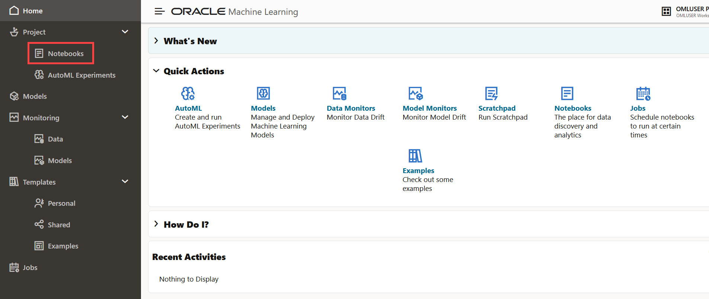

	Alternatively, you can click **Notebooks** under Quick Actions on the home page to open the Notebooks page. 

2. This opens the OML Notebooks page.

	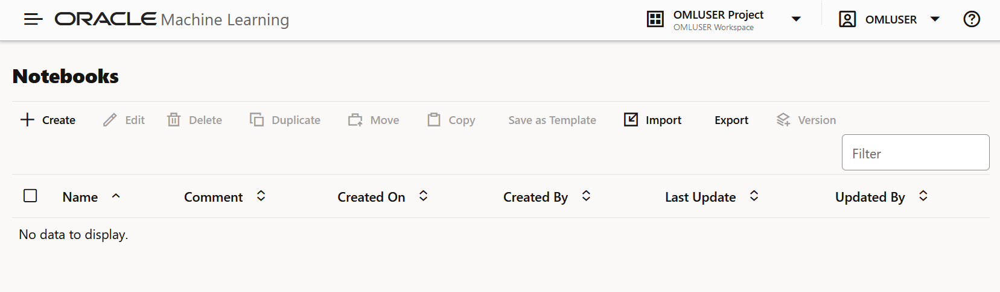

Here, you have the option to:
* **Create:** Click Create to create a new notebook.
* **Edit:** Click on a notebook row to select it and click **Edit.** You can edit the notebook name, and add comments in the Edit Notebook dialog box.
* **Delete:** Click on a notebook row to select it and click **Delete.**
* **Duplicate:** Click on a notebook row to select it , and click **Duplicate.** This creates a copy of a notebook, and the duplicate copy of the is listed on the Notebooks page with the suffix `_1` in the notebook name.
* **Save as Template:** To save a notebook as a template, select the notebook and click **Save as Template.** In the Save as Template dialog, you can define the location of the template to save it in Personal or Shared under Templates.
* **Import:** To import a notebook, click **Import.** The following notebook formats are supported for import - ``.json`` , ``.zpln`` (Zeppelin notebook), ``.ipynb`` (Jupyter notebook) and ``.dsnb`` (native). Select the project and workspace in which to import the notebook.
* **Export:** To export a notebook, click **Export.** You can export Noteboooks in the `.dsnb` format, Zeppelin format (`.json` ) file and in Jupyter format (`.ipynb`), and later import them in to the same or a different environment. You can also export the notebook in HTML format, and optionally exclude paragraph code, results, and timestamps.
* **Version:** To create versions of a notebook, select it and click **Version.** The Versions page for that particular notebook opens. Here, you can create a new version of the notebook by clicking **+Version.** The Create Version dialog opens. Enter a name of the notebook version, a description, and click **OK.** The new version of the notebook gets created by the same name with a suffix `_2` for the second version. For subsequent versions, suffix (number) increments by one. To revert to an older version by clicking Revert Version. You also have the option to delete any version of the notebook. Click **Back to Notebooks** to go to the OML Notebooks page.

## Task 3: Create a notebook and define paragraphs using the md, SQL, PL/SQL, Python, and R Interpreters

In this task, you will create a new notebook, and add paragraphs to connect to the Markdown, SQL, Script, Python, and R interpreters. Interpreters are independent backend engines. R and Python engines are stateful while the notebook is open, and database objects are valid for the duration the database connection is active. You can change the interpreter by explicitly specifying one of `%script`, `%python`, `%sql` , `%r` , `%md`, or `%conda` to connect to the respective interpreter.

To learn about Conda, refer to [Use the Conda Interpreter in a Notebook Paragraph](https://docs.oracle.com/en/database/oracle/machine-learning/oml-notebooks/omlug/notebooks.html#GUID-0AAB3590-4422-450D-BE91-4EC435FD4254)

1. On the Notebooks page, click **Create.**
		
2. In the Create Notebook dialog, enter the name `Test Notebook` in the **Name** field and click **OK.** The notebook is created and it opens in the notebook editor.
		

	You can now use the **Test Notebook** to create a Markdown paragraph, SQL paragraph, Python, R and Conda paragraphs.   

### Task 3.1: Use the Markdown interpreter and display static html from Markdown plain text

In this task, you will use the Markdown interpreter, and display the formatted text in the output of the markdown paragraph.
>*Note:* The first time a given interpreter type is accessed, the interpreter is started, which may take a few seconds to initialize and establish a connection to the database. Subsequent uses of the interpreter in later paragraphs will be immediate.

1. In the first paragraph, type `%md` and press Enter.
2. Type the following:
	* To format the text in bold, type the text Hello World inside a double asterisk pair, and press Enter.
	* To format the text in italics, type the text Hello World either inside an asterisk pair or an underscore pair, and click the Run

	Alternatively, you may copy the code and paste it in the notebook just below %md, and click the Run icon run icon as shown in the screenshot:
	```
	<copy>
	**Hello World**
  *Hello World*
  _Hello World_
	</copy>
	```

	After running the paragraph, the output is displayed, and a new paragraph is automatically created. Also, you can manually create additional paragraphs.
	

3. Hover your cursor over the lower border of the paragraph and click  to add another Markdown paragraph.

	

4. To display the text in a bulleted list, prefix * (asterisk) to the text Hello World We welcome you, as shown in the screenshot below.

	```
	<copy>
	* Hello World
	* We welcome you
	</copy>

	```
5. Add another Markdown paragraph. Here, you will use Markdown tags to display the text in heading 1 (H1), heading 2 (H2) and heading 23 (H3). For H1, H2, and H3, add one, two, and three hashes before the text Hello World respectively.

	```
	<copy>
	# Hello World
	# Hello World
	### Hello World
	</copy>

	```
6. Now, scroll up the notebook and click the Run All icon present in the notebook toolbar, as shown in the screenshot here.

	

7. A message appears asking you to confirm whether to run all the paragraphs of the notebook. Click **Confirm.**
	

	The two paragraphs run and the output is displayed in the respective paragraphs, as shown in the screenshot.
		
This completes the task of using the Markdown interpreter to generate HTML in your notebook. 
### Task 3.2: Use the SQL Interpreter and run SQL Statements

Let’s create another paragraph to use the SQL interpreter and run SQL statements:

>*Note:* The first time a given interpreter type is accessed, the interpreter is started, which may take a few seconds to initialize and establish a connection to the database. Subsequent uses of the interpreter in later paragraphs will be immediate.

1. To create a SQL paragraph, hover your cursor over the lower border of the paragraph and click on the **Add sql Paragraph** icon to add a SQL paragraph.

	

	You may also choose to click on the Add Paragraph icon  to manually create a new paragraph. Then type  ``%sql``  and press Enter to call the SQL interpreter.

2. Type the following command and click the run icon .

	```
	<copy>
	select * from SH.COUNTRIES
	</copy>
	```

	* The command returns the COUNTRIES table present in the SH schema in a tabular format, as shown in the screenshot. You can also view the data in various visual format by clicking on any of the chart icons, as highlighted in the screenshot here:
	

	* Click on the histogram icon to view the table in a histogram. Hover your cursor over each bar to view the details for each country:
	
	* You can adjust the settings and visual output by clicking on the **Settings** icon on the paragraph toolbar, highlighted in red. Clicking the settings icon opens the **Settings** dialog. Here, click on the **Setup** tab to customize the output to view.
	
	* Click on each of the fields to choose various output options. In this customized output, the COUNTRY REGION ID and COUNTRY NAME in the **Series to Show** and **Group By** fields respectively. The histogram now shows an additional series - country region and the full name of the country along with the country code.
	
	* Click on the **Height** field and enter values as applicable to adjust the setting to allow scrolling and limit vertical height of the result.
	
	* Click on the **Customization** tab in the **Settings** dialog to customize the visualization. Here, the layout of the histogram is changed to horizontal and the color is changed to red for the series COUNTRY NAME.
	

This completes the task of connecting to the SQL interpreter and running SQL commands in your notebook. 
### Task 3.3: Use the PL/SQL Interpreter and run PL/SQL Scripts

In this task, you will create another paragraph to call the PL/SQL interpreter and run PL/SQL scripts:

1. To create a PL/SQL paragraph, hover your cursor over the lower border of the paragraph and click on the **Add sql Script Paragraph** icon to add a PL/SQL paragraph.
	

2. Type the following command and click the run icon. Alternatively, you can press Shift+Enter keys to run the paragraph.

	```
	<copy>
	CREATE TABLE small_table
	(
	NAME VARCHAR(200),
	ID1 INTEGER,
	ID2 VARCHAR(200),
	ID3 VARCHAR(200),
	ID4 VARCHAR(200),
	TEXT VARCHAR(200)
	);

	BEGIN
	FOR i IN 1..100 LOOP
	INSERT INTO small_table VALUES ('Name_'||i, i,'ID2_'||i,'ID3_'||i,'ID4_'||i,'TEXT_'||i);
	END LOOP;
	COMMIT;
	END;
	</copy>
	```
	The PL/SQL script successfully creates the table SMALL_TABLE. The PL/SQL script in this example contains two parts:
	* The first part of the script contains the SQL statement CREATE TABLE to create a table named small_table. It defines the table name, table column, data types, and size. In this example, the column names are NAME, ID1, ID2, ID3, ID4, and TEXT.

	* The second part of the script begins with the keyword BEGIN. It inserts 100 rows into the table small_table


	
This completes the task of connecting to the PL/SQL interpreter and running PL/SQL scripts in your notebook.  
### Task 3.4: Use the Python Interpreter and run Python Statements
Let’s create another paragraph to call the Python interpreter and run Python statements:

1. To connect to the Python interpreter, hover your cursor over the lower border of the paragraph and click on the **Add OML4Py Paragraph** icon.
	

2. Type the following command and click the run icon.

	```
	<copy>
	import pandas as pd
	import oml
	DATA = oml.sync(table = "SUPPLEMENTARY_DEMOGRAPHICS", schema = "SH")
	z.show(DATA.head())
	</copy>
	```
	The z.show command displays the SUPPLEMENTARY_DEMOGRAPHICS table present in the SH schema, as shown in the screenshot here. Use the z.show command to display Python objects, proxy object content, and to display the desired data in the notebook. You will learn more about z.show in the lab on Oracle Machine Learning for Python.

	

This completes the task of connecting to the Python interpreter and running Python commands in your notebook.
### Task 3.5: Use the R Interpreter and run R Statements
Oracle Machine Learning for R (OML4R) makes the open source R scripting language and environment ready for the enterprise and big data. OML4R integrates R with Oracle Autonomous Database. It allows you to run R commands and scripts for statistical, machine learning, and visualization analyses on database tables and views using R syntax.

In this task, you will use the R interpreter and run R statements:

* Import R Libraries
* Create a database table
* Explore and visualize the data

>*Note:* The ORE library is pre-loaded and available.

1. To connect to the R interpreter, hover your cursor over the lower border of the paragraph and click on the **Add OML4R Paragraph** icon.
	
2. To import R Libraries, run the following command:

 	```
	<copy>
	%r
	library(ORE)
	library(lattice)

	options(ore.warn.order=FALSE)
	</copy>
	```
	

3. In this step, we load the IRIS data from a R data.frame into the database by using the `ore.push` function. This function creates the temporary table `IRIS_TMP` and returns a proxy object to which the variable IRIS_TMP is assigned. Run the following command:

	```
	<copy>
	%r
	IRIS_TMP <- ore.push(iris)
	dim(IRIS_TMP)
	colnames(IRIS_TMP)
	z.show(head(IRIS_TMP,10))
	</copy>
	```
	

	Scroll down to view the table:
	

4. Run the following command to visualize the data in a histogram. In the histogram, the sepal length of the flower is plotted along the X-axis, and the frequency or count of the iris flower is plotted along the y-axis.   	

	```
	<copy>
	%r

	hist(IRIS_TMP$Sepal.Length, col="darkred")
	</copy>
	```

	
5. Run the following command to visualize the attribute distribution of the sepal length of the iris flower in a boxplot. The boxplot shows the distribution in quartiles.

	```
	<copy>
	%r

	boxplot(IRIS_TMP$Sepal.Length, horizontal=TRUE, notch=TRUE, col="darkgreen",
		        showmeans=TRUE, xlab="cm", main="Distribution of IRIS Attributes")
	</copy>					
	```

	

This completes the task of connecting to the R interpreter and running R commands in your notebook.


## Task 4: Work with Notebook Features

Upon creating a notebook, it opens automatically, presenting you with a single paragraph using the default ``%sql`` interpreter. You can change the interpreter by explicitly specifying one of ``%script``, ``%python``, ``%sql`` , ``%r`` , ``%md``, or ``%conda`` to connect to the respective interpreter.

To learn about Conda, refer to [Use the Conda Interpreter in a Notebook Paragraph](https://docs.oracle.com/en/database/oracle/machine-learning/oml-notebooks/omlug/notebooks.html#GUID-0AAB3590-4422-450D-BE91-4EC435FD4254)

By default, you are assigned into a project. Select the project that contains the notebook you want to use.

To edit an existing notebook:

1. On the Oracle Machine Learning Notebook page, click the notebook name that you want to open. The selected notebook opens in the edit mode. In this lab, you click the **Notebook Demo**.

2. When the notebook is open, you can use the following notebook features from the  toolbars:


* Click  to run all paragraphs in the notebook.
* Click  to invalidate and reset the notebook session.
* Click  to create a new version this notebook, or to view the earlier versions of the notebook.

	- **Create Version:** Click this option to create a new version of this notebook. You have the option to provide a new name for the version, and a description about it. When you create a new notebook version, the paragraph results of each run session are stored in the versioned notebook. When you restore a notebook, its paragraph results are also restored. You can also create notebook versions from the editor. For more information, see Work with Notebook Versions in the Notebook Editor.

	- **View Version History:** Click this option to view the earlier versions of the notebook. You have the option to restore any earlier version, compare versions, and delete any earlier version that you created.

	>**Note:**  You can also create notebook versions, view version history, and delete older versions from the Versions option on Notebooks page option on the Notebooks page.

* Click  to clear paragraph results.
* Click  clear paragraph dependencies to clear paragraph dependencies.
* Click  export notebook to export the notebook. You can export the notebook as a ``.dsnb`` file (OML Notebook), ``.zpln`` file (Zeppelin notebook) and ``.ipynb`` file (Jupyter notebook). You have these additional settings while exporting a notebook:
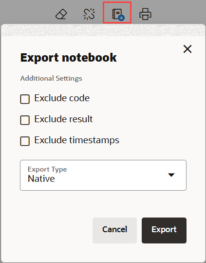
	- **Exclude code:** Click to exclude the code in the notebook paragraphs. The exported notebook will only contain the paragraph outputs.
	- **Exclude results:** Click to exclude the paragraph output. The exported notebook will only contain the codes in the paragraphs.
	- **Exclude timestamps:** Click to exclude the timestamps from each paragraph.
	- **Export Type:** Select an option from the drop-down list. The supported types are Native (.dsnb), Zeppelin, Zupyter, and HTML.
* Click  to print the notebook. You can also print the notebook in PDF format.
* Click  to hide the code of all paragraphs in the notebook.
* Click  to hide the results of all the paragraph in the notebook.
* Click   to enable read-only mode for this notebook.
	>**Note:** The read-only mode is available only for the Oracle Machine Learning Notebooks.

* Click  to open the settings option in the side panel. The settings option in the side panel are the same settings option available in the paragraph.
	- This is the screenshot of the settings option on the side panel that open when you click the Show Panel icon. Note that the settings option in the paragraph is hidden when the side panel is open. Click the close icon on the panel to close the pane.
	
	- Once you close the edit pane on the right, the settings option in the paragraph are displayed, as shown in the screenshot here.
	

* Click  to change the interpreter binding to either low, medium, or high.
* Click  Zeppelin to switch the OML Notebook to either Zeppelin or Jupyter notebook.


### Paragraph level features:
* Click  to run the selected paragraph.
* Click  to enter into Dependency Mode. In Dependency Mode, you select and deselect paragraphs to add or remove them as dependents.

	>**Note:** The Paragraph Dependencies feature allows you to add dependencies between paragraphs. The dependents of a paragraph automatically run after the original paragraph is run.

* Click   to open the Comments dialog. Type in your comments here, and press Enter to add the comment. You can also delete any comments by clicking the corresponding **Delete** icon. Click the comments icon to close the dialog. You can provide comments for each paragraph in a notebook. Paragraphs with comments are indicated by a green dot on the comments icon.
* Click  to view the notebook paragraph in full screen mode. To view the paragraph in the normal mode, click the collapse icon.
* Click 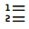 to show line numbers in the paragraph.
* Click  to view the paragraph title, code, results, and the paragraph settings.
* Click  to:
	- **Move up:** Click  to move the paragraph up in the notebook.
	- **Move down:** Click  to move the paragraph down in the notebook.
	- **Run all Above:** Click  to run all the paragraphs above the current paragraph.
	- **Run all Below:** Click  to run all the paragraphs below the current paragraph.
	- **Clear results:** Click  to clear the paragraph results.
	- **Open as Embedded Window:** Click  to view the current paragraph separately in your browser.
	- **Clone Paragraph:** Click  to clone the paragraph. The paragraph is cloned in the same notebook.
	- **Disable Run:** Click  to disable running of the paragraph. To enable run, go to **Settings** and click **Enable Run.**
	- **Delete Paragraph:** Click  to delete the paragraph.
* Click HTML to view the paragraph in HTML format.
* Click Text to view the paragraph in text format.
* Click Settings to adjust settings of the notebook paragraph output. This setting is specifically applicable to visualizations in graphs, charts, vertical height of paragraph output etc.
* Click download-as to download the paragraph as a text file, or as ``.png`` or ``.svg`` files, as applicable, for paragraphs that contains graphs or charts as output.

## Task 5: Create Paragraph Dependencies and Run Paragraphs as per Dependency Order

Paragraph Dependencies allow you to add dependencies between paragraphs. The dependent paragraphs automatically run after the original paragraph is run, according to the order of dependency.
To create paragraph dependencies:
1. On the Notebooks page, click **Create**.
2. In the Create Notebooks dialog, enter the name _Paragraph Dependencies Demo_ in the **Name** field and click **OK.** The notebook is created and it opens in the notebook editor.
3. On the notebook, hover your cursor over the lower border of the paragraph and click the + icon to add a paragraph. Or, click on the **Add SQL Paragraph** icon to call the PL/SQL interpreter.
	
4. In the first paragraph, copy and paste the following PL/SQL script. This script creates the view ESM_SH_DATA from the SALES table present in the SH schema.
	```
	<copy>
	CREATE OR REPLACE VIEW ESM_SH_DATA AS
	  SELECT TIME_ID, AMOUNT_SOLD FROM SH.SALES;
	</copy>
	```

5. In the second paragraph, copy and paste the following SQL script. This script gives a count of the record present in the view ESM_SH_DATA.

	```
	<copy>
	SELECT COUNT(*) FROM ESM_SH_DATA;

	</copy>
	```

6. In the third paragraph, copy and paste the following SQL script to review the data in a tabular format.

	```
	<copy>
	SELECT * FROM ESM_SH_DATA
	FETCH FIRST 10 ROWS ONLY;

	</copy>
	```

7. Go to the first paragraph and click on the **Enter Dependency Mode** icon.
	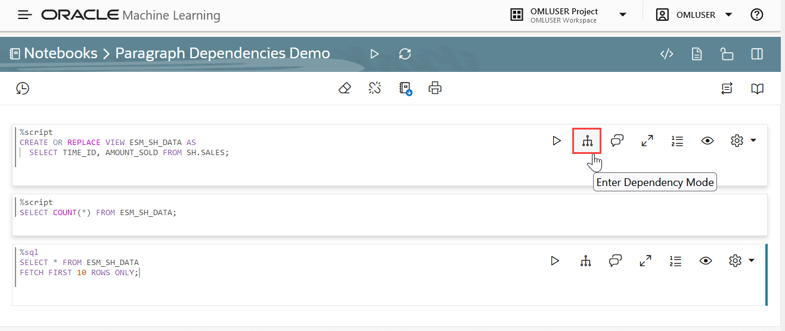

	The message appears: _You are selecting dependents for this paragraph._

8. Click on the second and third paragraph to add them as dependents of paragraph one.

	>**Note:** The order of paragraph dependency is based on the order of your click.

	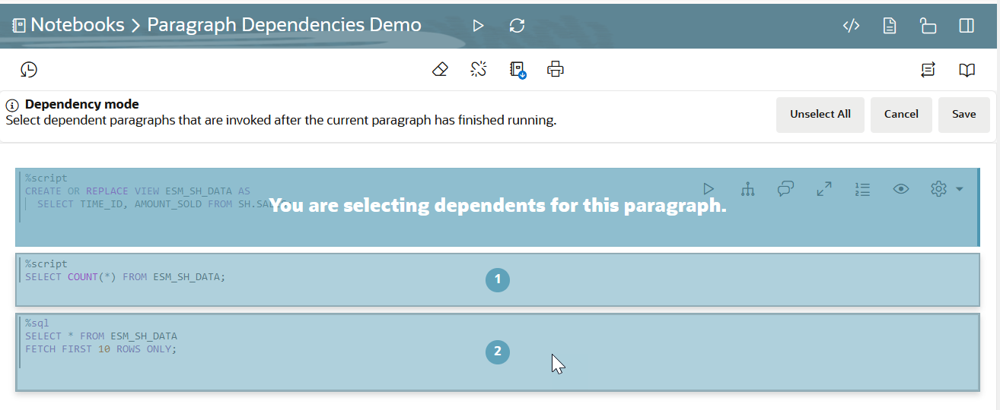

9. Click **Save.**
	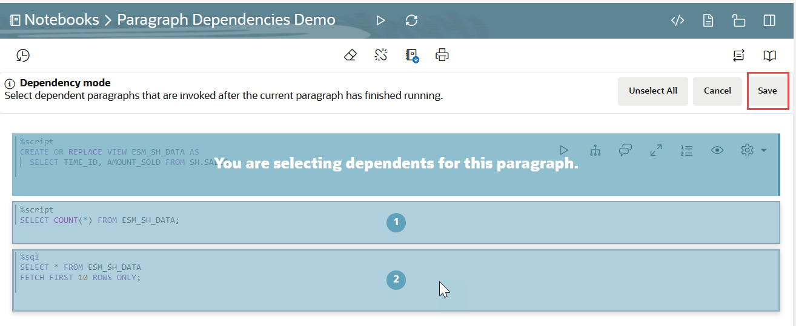

	Once the dependent paragraphs are defined and saved, it is indicated by the numbers as shown in the screenshot here:
	
10. Now, go to the first paragraph and click the run icon . After the first paragraph starts successfully, the subsequent dependent paragraphs start to run according to the order of dependency.
	
	This screenshot shows the successful run of paragraph 1 and 2 (dependent paragraph 1):
	

	This screenshot shows the successful run of paragraph 3 (dependent paragraph 2):
	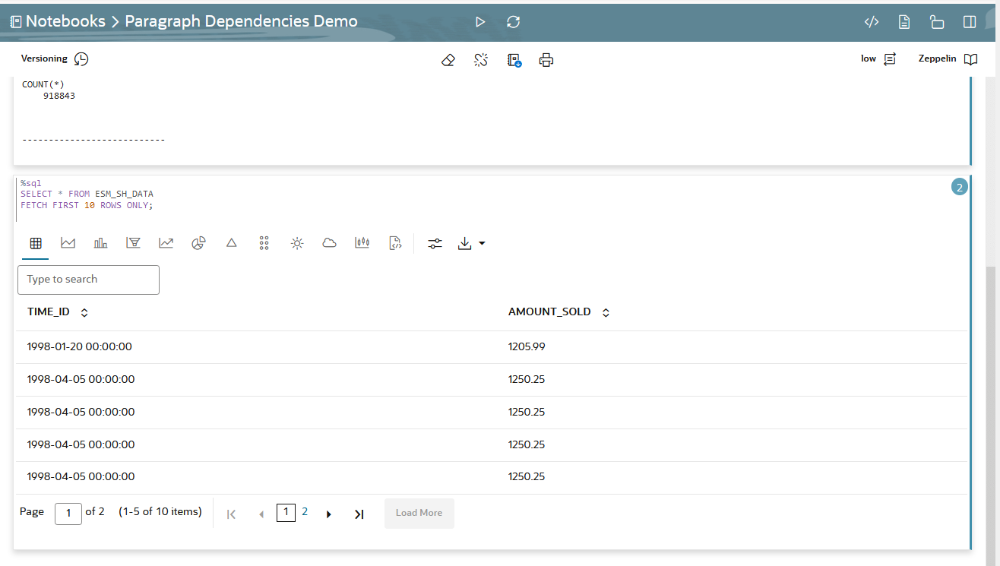


## Task 6: Create Notebook Versions

By creating versions of your notebook, you can archive your work in a notebook.
You can create versions of notebooks on the notebooks page, as well as in the notebook editor. In this example, the _Paragraph Dependencies Demo_ notebook is used to create versions of it.

>**Note:** A versioned notebook is non-editable. If you want to make any changes to a particular version of a notebook, you must restore that version to edit it.

**Prerequisites:** The _Paragraph Dependencies Demo_ notebook. This notebook is created as part of Task 5 of this lab.

### Task 6.1: Create Versions on the Notebooks page
In this task, you will create Version 1 of the _Paragraph Dependencies Demo_ notebook.
1. On the Notebooks page, select the _Paragraph Dependencies Demo_ notebook to enable all the edit options.
	
2. Click **Version** to go to the versions page for this notebook.
	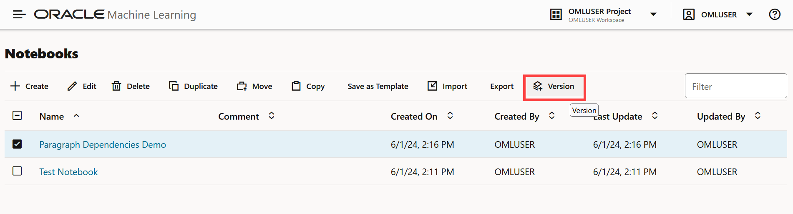
3. On the Versions page for this notebook, click **Versions** to open the Create Versions dialog.
	

3. In the Create Versions dialog:
	* **Name:** Enter _Version 1_ for the new version of this notebook
	* **Descriptions:** Enter comments, if any.
	* Click **OK.** Once the notebook version is created, it is listed on the Versions - Notebook Versioning Demo page.

	
4. On the _Paragraph Dependencies Demo_ page, select **Version 1** of the notebook version that you just created to enable all the available options.
	* Click **Delete** to delete the selected version of the notebook.
	* Click **Restore Version** to restore the selected version of the notebook.
5. Click **Back to Notebooks** to go back to the Notebooks page.
	

### Task 6.2: Create Versions in the Notebooks Editor
By creating versions of your notebook, you can archive your work in a notebook. You can create versions of an open notebook, as well as on the notebooks listing page. In this example:

* The original notebook _Paragraph Dependencies Demo_, is edited to add a script to build a machine learning model.
* The notebook _Paragraph Dependencies Demo_ is then versioned as **Version 2** to archive the code to build the machine learning model.
* The **Version 2** and **Version 1** of the _Paragraph Dependencies Demo_ notebook are compared using the **Compare Versions** feature.


>**Note:** A versioned notebook is non-editable. If you want to make any changes to a particular version of a notebook, you must restore that version to edit it.

To create a new notebook version and view version history:
1. On the Notebooks page, click on the _Paragraph Dependencies Demo_ notebook to open it in the notebook editor.
	> **Note:**  **Version 1** of this notebook is already created as part Task 6.1 in this lab. It contains the archived code to create the view `ESM_SH_DATA`, count the number of records, and view the data. Clicking on the notebook opens the original editable version.

	

2. Now, edit the notebook to add a script to build a machine learning model. On the notebook, hover your cursor over the lower border of the third paragraph, and click the **Add SQL Script Paragraph**  to call the PL/SQL Interpreter.

	

3. Copy and paste the following script to the new paragraph. This script builds a machine learning model using the ESM algorithm.

	```
	<copy>
		BEGIN DBMS_DATA_MINING.DROP_MODEL('ESM_SALES_FORECAST_1');
	EXCEPTION WHEN OTHERS THEN NULL; END;
	/
	DECLARE
	    v_setlst DBMS_DATA_MINING.SETTING_LIST;
	BEGIN

	    v_setlst('ALGO_NAME')            := 'ALGO_EXPONENTIAL_SMOOTHING';
	    v_setlst('EXSM_INTERVAL')        := 'EXSM_INTERVAL_QTR'; -- accumulation int'l = quarter
	    v_setlst('EXSM_PREDICTION_STEP') := '4';                 -- prediction step = 4 quarters
	    v_setlst('EXSM_MODEL')           := 'EXSM_WINTERS';      -- ESM model = Holt-Winters
	    v_setlst('EXSM_SEASONALITY')     := '4';                 -- seasonal cycle = 4 quarters    

	    DBMS_DATA_MINING.CREATE_MODEL2(
	        MODEL_NAME          => 'ESM_SALES_FORECAST_1',
	        MINING_FUNCTION     => 'TIME_SERIES',
	        DATA_QUERY          => 'select * from ESM_SH_DATA',
	        SET_LIST            => v_setlst,
	        CASE_ID_COLUMN_NAME => 'TIME_ID',
	        TARGET_COLUMN_NAME  =>'AMOUNT_SOLD');
	END;
	</copy>
	```
4. Now, archive this notebook along with the code to build the machine learning model by versioning it. On the top left corner of the notebook editor, click the Versioning icon.

	

5. The options to **Create Version** and **View Version History** opens. Click **Create Version**.

	

6. In the New Version dialog:

	* **Name:** Here, the name Version 2 is taken by default. Let's retain this name.
	* **Description:** Enter notes, if any.
	* Click **Create.**
	
	* A message is displayed confirming the creation of the new version.
	

### Task 6.3: View Version History and Compare Notebooks Versions
To view the version that you created in Task 6.2:

1. Click the versioning icon, and then click **View Version History**.
	

2. On the right pane of the notebook editor, the Version History panel opens.
	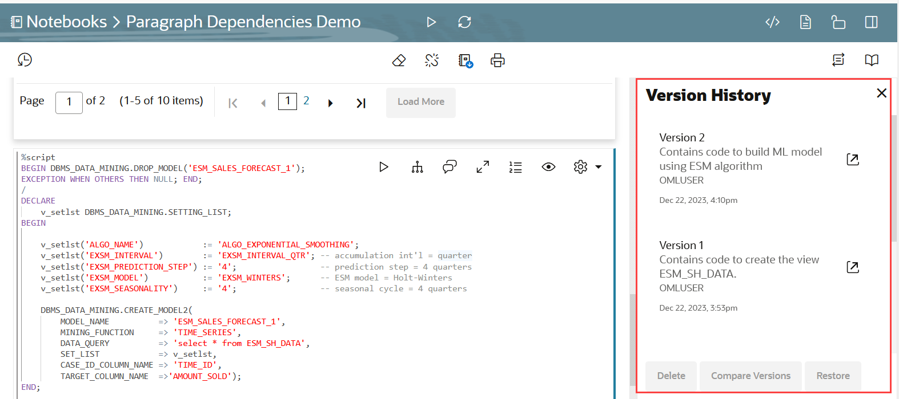
3. Hover your cursor over any notebook version and click on it to enable the available options. You can perform the following tasks in the Version History panel. On the Version History pane on the right:
	
	* Click the open version icon to open the selected version. Clicking on any versioned notebook opens the notebook in read-only mode, as versioned notebooks are non-editable.
	
	To view the current editable version, click View current version of the notebook.
	
	* Click **Delete** to delete the selected version.
	* Click **Compare Versions** to compare the current version of the notebook with another version.
	
	You can select other available versions from the drop-down list. In this example, **Version 2** of the notebook, which is under Current State is compared with **Version 1**. The new additions are highlighted in green, as shown in the screenshot here.
	
	* Click **Cancel** to exit the dialog.
	* Click **Restore** to restore the selected version.
	>**Note:** Restoring a selected version of the notebook will discard all the unversioned changes, if any.

## Task 7: Create a Notebook using a Template Example

This task demonstrates how to create notebooks based on Example templates. You will learn how to:
* Create the OML4Py Classification notebook based on the OML4Py Classification DT example template. The template builds and applies the classification Decision Tree algorithm to build a classification model based on the relationships between the predictor values and the target values. The template uses the Sales History (`SH`) schema.
* Create the Time Series notebook based on the OML4SQL Time Series ESM example template. This template forecasts sales by using the Exponential Smoothing Algorithm for Time Series Data. It also used the `Sales` table in the SH schema.

### Task 7.1: Create an OML4Py Notebook using the Classification DT Template Example

This step demonstrates how to create the OML4Py Classification notebook based on the OML4Py Classification DT (Decision Tree) Example template:

1. Go to the Examples page by clicking the Cloud menu icon   on the top left corner of the page to open the left navigation menu. On the left navigation menu, click **Templates** and then click **Examples**.

	

  Alternatively, on the Oracle Machine Learning home page, click **Examples** in the Quick Actions section to go Examples.

	


2. Navigate to the **OML4Py Classification DT** example template notebook. You can search for the notebook by typing in keywords in the search box on the upper right corner of the page. Click on the grey box around the notebook. This highlights the notebook and enables the **Create Notebook** button. Click **Create Notebook**.

	

3. The Create Notebook dialog opens. The Name field displays the same name as the template with the suffix `(1)`. You can edit this name. In this example, we will retain the auto-generated name `OML4PY Classification DT (1)`. Click **OK**.

	> **Note:** In the Project field, the current user, project and workspace is selected by default. You have the option to choose a different project or a workspace by clicking the edit icon here.  

	

4. Once the notebook is created, the message _Notebook "OML4PY Classification DT (1)" created in project "OMLUSER Project"_ is displayed, as shown in the screenshot. The notebook is now available on the Notebooks page. You may also click **Open Notebook** in the message dialog to open the notebook directly from here.

	

5. To view the notebook that you just created, click the Cloud menu icon  on the top left corner of the page to open the left navigation menu. Click **Notebooks** to go to the Notebooks page.

	

6. The OML4PY Classification DT (1) notebook is now listed on the Notebooks page, as shown in the screenshot. Click it to open the notebook in the Notebooks editor. Note that you will run this notebook in the subsequent steps.

	
	

This completes the task of creating a notebook from an Example template.

### Task 7.2: Create a Time Series Notebook using the OML4SQL Time Series Template Example

These steps demonstrate how to create the Time Series notebook based on the Example template:

7. Click the Cloud menu icon  on the top left corner of the page to open the left navigation menu. Click **Examples** under Templates to open the Examples page. 

	

If you choose to go to the home page, then click **Home** on the left navigation pane, and then click **Examples**.	

8. Navigate to the **OML4SQL Time Series ESM** example template notebook. You may type ESM in the search box on the upper right corner of the page to get a list of the ESM-related notebooks. Click the grey box around the notebook. This highlights the notebook and enables the **Create Notebook** button. Click **Create Notebook**.

	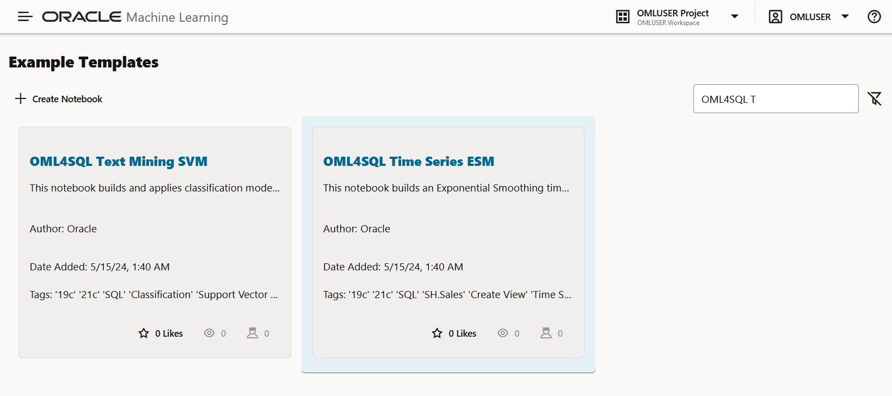

9. The Create Notebook dialog opens. By default, the **Name** field displays the same name as the template with the suffix `(1)`. You can edit this field. In this example, we will retain the auto-generated name **OML4SQL Time Series ESM (1)** and click **OK**.

	> **Note:** In the Project field, the current user, project and workspace is selected by default. You have the option to choose a different project or a workspace by clicking the edit icon here.  

	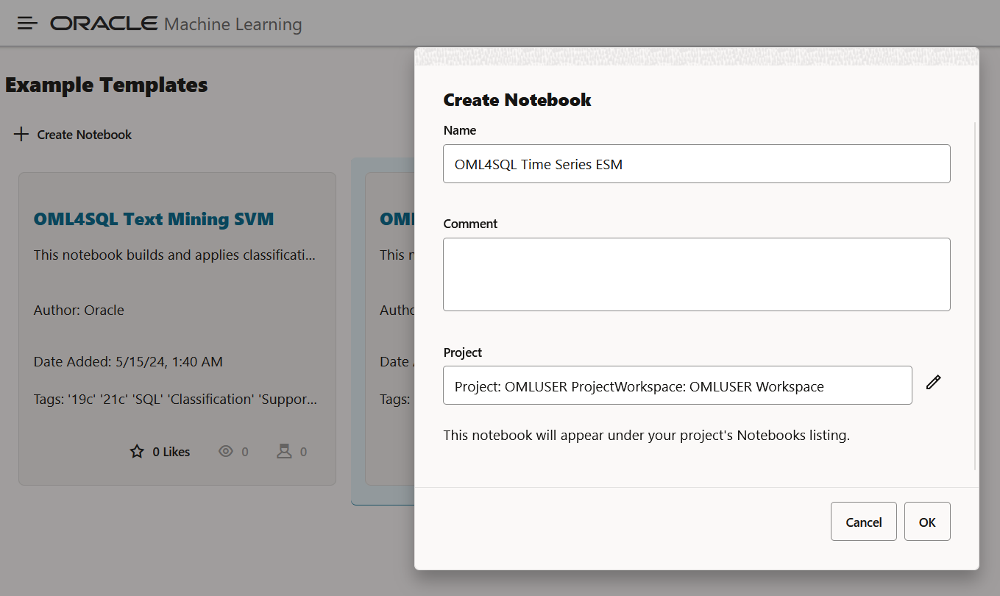

10. Once the notebook is created, the message _Notebook "OML4SQL Time Series ESM (1)" created in project "OMLUSER Project"_ is displayed. The notebook is now available on the Notebooks page. You may also click **Open Notebook** in the message dialog to open the notebook directly from here.

	

11. To view the notebook, click the Cloud menu icon  on the top left corner of the page to open the left navigation menu. Click **Notebooks** to go to the Notebooks page.

	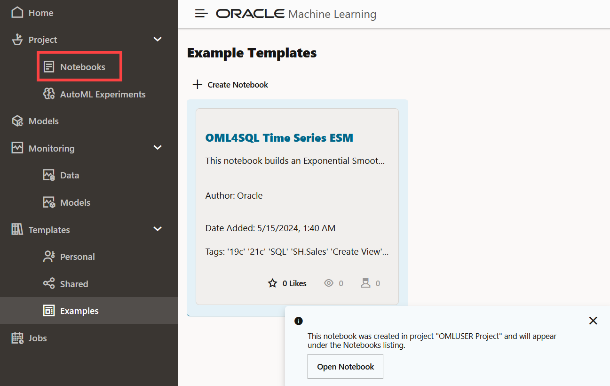


12. The notebook **Notebook "OML4SQL Time Series ESM (1)** is now listed on the Notebooks page, as shown in the screenshot. Click on the notebook to open it in the Notebooks editor and work on it.

	


This completes the task of creating the Time Series notebook from the OML4SQL Time Series ESM Example template.

## Task 8: Change Notebook Service Level

Notebook type corresponds to the ADB service levels — low, medium, high and gpu. These service levels affect parallelism in the database. The notebook type that is set for a notebook applies to all the paragraphs in that notebook. For the notebooks in Oracle Machine Learning UI, you use the following interpreters:

* SQL interpreter for SQL statements
* PL/SQL  interpreter for PL/SQL scripts/statements
* Python interpreter to process Python scripts
* R interpreter to run R commands and scripts
* md (MarkDown) interpreter for plain text formatting syntax so that it can be converted to HTML.


	> **Note:** The service level that is set for a notebook applies to all the paragraphs in that notebook. 

In this step, you learn how to change the notebook service levels:
1. Go to the Notebooks page by clicking the Cloud menu icon on  the top left corner of the page. On the left navigation menu, click **Notebooks**.
	

	

2. On the Notebooks page, click on the **OML4PY Classification_DT (1)** notebook to open it in the Notebook editor.

	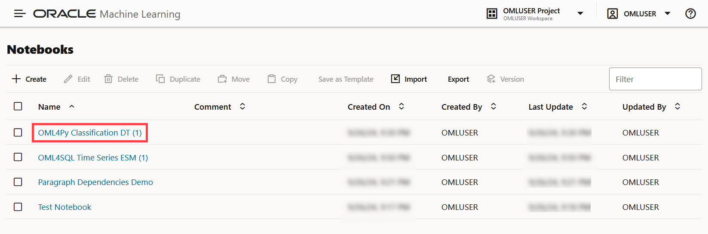
	

3. Click on the **Update Notebook Type** icon on the top right corner. The available notebook types are displayed. The current notebook type is indicated by a tick mark, and is also displayed next to the **Update Notebook Type** icon. 

	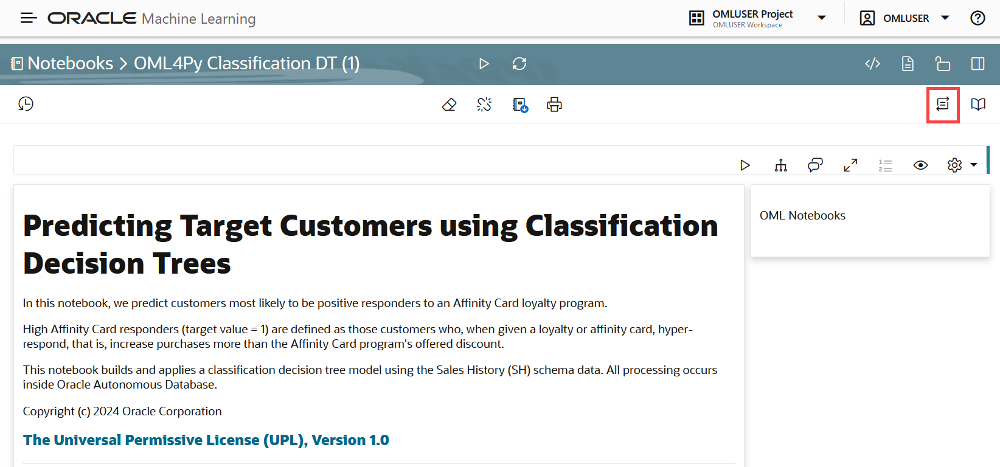

	The Notebook Types (ADB service levels) are: 

	* **low** — Provides the least level of resources for in-database operations, typically serial (non-parallel) execution. It supports the maximum number of concurrent in-database operations by multiple users. The interpreter with low priority is listed at the top of the interpreter list, and hence, is the default.
	* **medium** — Provides a fixed number of CPUs to run in-database operations in parallel, where possible. It supports a limited number of concurrent users, typically 1.25 times the number of CPUs allocated to the pluggable database.
	* **high** — Provides the highest level of CPUs to run in-database operations in parallel, up to the number of CPUs allocated to the pluggable database. It offers the highest performance, but supports the minimum number of concurrent in-database operations, typically 3.
	* **gpu** — Provides GPU compute capabilities in a notebook through the Python interpreter with the database service level set to high. The notebook memory setting is 32 GB (DDR4), by default. It is extensible up to 200 GB.

	

4. To change the notebook type, click on the type that you want to select. In this example, let's click high. A confirmation message is displayed stating: `Notebook Type is updated to "high".`

	

	> **Note:** The updated notebook type is applicable to all the paragraphs in the notebook. You cannot change the notebook type at the paragraph level.

	This completes the task of changing notebook service level.


## Task 9: Create Jobs to Schedule Notebook Run

Jobs allow you to schedule the running of notebooks. On the Jobs page, you can create jobs, duplicate jobs, start and stop jobs, delete jobs, and monitor job status by viewing job logs, which are read-only notebooks. In this lab, you will learn how to create a job to schedule the running of the notebook Classification_DT.

To create a job:

1. Click the Cloud menu icon  on the top left corner of the page to open the left navigation menu, and click **Jobs** to go to the Jobs page. 

	

You can also go to Jobs from the Oracle Machine Learning home page by clicking **Jobs**.


2. On the Jobs page, click **Create**. The Create Job dialog opens.

	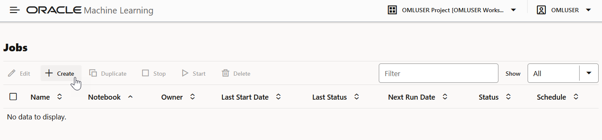

3. In the **Name** field, enter `Job1`. The number of characters in the job name must not exceed 128 bytes.

	

4. In the **Notebook** field, click the search icon. This opens the Search Notebook dialog. In the Search Notebook dialog, navigate through the OMLUSER workspace and OMLUSER project, select `OML4PY Classification_DT (1)`, and click **OK**.

	> **Note:** Only notebooks that are owned by the user or shared are available for selection.

	
	

5. In the **Start Date** field, click the date-time editor to set the date and time for your job to commence. You can select the current date or any future date and time. Based on the selected date and time, the next run date is computed.

6. Select **Repeat Frequency** and enter **3**, and select **Days** to set the repeat frequency and settings. You can set the frequency in minutes, hours, days, weeks, and months.

7. Expand **Advanced Settings**, and specify the following settings:

	

	* **Maximum Number of Runs:** Select **3**. This specifies the maximum number of times the job must run before it is stopped. When the job reaches the maximum run limit, it will stop.  

	* **Timeout in Minutes:** Select **60**. This specifies the maximum amount of time a job should be allowed to run.

	* **Maximum Failures Allowed:** Select **3**. This specifies the maximum number of times a job can fail on consecutive scheduled runs. When the maximum number of failures is reached, the next run date column in the Jobs UI will show an empty value to indicate the job is no longer scheduled to run. The Status column may show the status as `Failed`.

		> **Note:** Select **Automatic Retry** if you do not wish to specify the maximum failures allowed manually.  

8. Click **OK**. The job is now listed on the Jobs page with the status SCHEDULED.

	

9. Click on the job row to enable the options to either **Edit**, **Duplicate**, **Start**, or **Delete** the selected job.

	


## Task 10: Visualize your Data in OML Notebooks

## Visualiza Data in a Table

A table is an arrangement of information or data in rows and columns. Using OML Notebooks, you can create database tables, and also view the information in a tabular format. 

**Dataset:** `CUSTOMER_INSURANCE_LTV`
In these examples, we will use the example template notebook OML-Run-me-first.

1. On the OML UI homepage, click **Examples.** 

	Or, open the left navigation menu by clicking the Cloud menu icon click . Click **Templates** and then click **Examples.** 

2. The OML-Run-Me-First example is listed. If you are unable to view it, type the name in the Filter field. 

3. Click on the `OML Run-me-first tile` (and not on the name) to highlight it in blue. Then click the Create Notebook icon. 

4. In the Create Notebook Dialog, click **OK.**

5. Click **Open Notebook** in the confirmation dialog to open the notebook.


6. Click the Run Paragraph icon in the notebook to run all the paragraphs. This will also create the CUSTOMER_INSURANCE_LTV:


7. To view the data in a table format, run the following script:

	```
	<copy>
	<code>

	%sql

	SELECT * FROM OMLUSER.CUSTOMER_INSURANCE_LTV
	</code>
	</copy>
	```
8. The script presents the data in a tabular format as shown in the screenshot:


9. In this table, you can customize your views and settings.
	a) Sort the columns in ascending or descending order: Click on the down arrow or up arrow against the columns to sort the data in ascending or descending order. 


	b) Use the horizontal scroll bar to scroll horizontally to view the columns on the right.


	c) Filter specific search terms. In the Search field, type the entry or term that you are looking for. In this example, the term "Single" is entered. All the rows that contain the term SINGLE in the column `MARITAL_STATUS` are filtered for display.
	
	**>>Note:** Rows that do not contain this term are hidden from the view and the remaining rows highlight the location of the search term within the row


	d) By default, 5 rows are displayed. If you want to view more rows or customize the table settings, click on the Settings icon  to open the Settings dialog.


	e) In the Settings dialog, you can edit the following:


		* **Height:** This parameter changes the height of the visualization. Click on the up or down arrow to increase or decrease the visualization height. 


		* **Number of Items on Page:** Click on the up or down arrow, as applicable, to set the number of rows to be displayed on the page. By default, 5 rows are displayed.


		* **Columns to Display:** By default, all the columns are listed. If you want to remove any column from displaying, click on the X in the column name. To view the column again, click inside the Columns to Show field. The hidden columns are displayed. Click on the column that you want to view again. In this example the column MARITAL_STATUS was removed. Clicking on the Columns to Show field displays it; click on it to include in the display. 


## Visualiza Data in an Area Chart
An area chart uses lines to connect the data points and fills the area below these lines to the x-axis. Each data series contributes to the formation of a distinct shaded region. This emphasizes its contribution to the overall trend. 

As the data points fluctuate, the shaded areas expand or contract. The shaded regions in an area chart imply significant meaning.

**When to use this chart:** Use this chart to gain visual insight into the changes within the dataset.

**Dataset:** CUSTOMER_INSURANCE_LTV

Let's use the previous example to explore the area chart. 

1. To view the data in an area chart icon, click the area chart icon. 

2. The data in the CUSTOMER_INSURANCE_LTV table is now presented in an area chart. 

3. In the Settings dialog, under Setup, you can change the entries in these fields to view the data

	* Series to Show field: Lists the values of the column CREDIT_BALANCE. This value is plotted against the y-axis. You can change the entry in this field to view the data. You can select an additional entry also. Let's change the values in the Series to Show and select BANK_FUNDS and MORTGAGE_AMOUNT.  The area chart is now a stacked chart, and shows the average of BANK_FUNDS and MORTGAGE_AMOUNT along the Y-axis. The data is grouped by MARITAL_STATUS (along the x-axis).

	* Group By field. Lists the values of the column MARITAL_STATUS. This value is plotted along the x-axis. You can select an additional entry also.

	* Height: Click on the up or down arrow, as applicable, to increase or decrease the paragraph height

	* Aggregate Duplicates: Displays the statistical computations of the selected columns in the Series to Show and Group By fields. You can choose to view any one of the following computations in the graphical output - Average, Sum, Maximum, Minimum, Last, and Count. 

4. Under Customization in the Settings dialog, you can customize the following parameters of the graph: 

* Visualizations: 
	 **Cartesian Coordinate:** By default, the data points of the area chart are plotted on a cartesian coordinate grid.  A cartesian coordinate is a system in which the location of a point is given by coordinates that represent its distances from perpendicular lines that intersect at a point called the origin. You can view the same data points on a polar coordinate grid as well.

	**Polar Coordinates:** Polar Coordinates do not apply to time-oriented data
	**Orientation:** The chart orientation. Either horizontal or vertical.
	**Stack:** Defines whether the data items are stacked. Supported Values: on, off.
	**Sorting:** Specifies the sorting of the data. It should only be used for pie charts, bar/line/area charts with one series, or stacked bar/area charts.
 
* Series: Click Series to expand the options of the series.
    * Line Type: Use this option to redefine the look of the lines in the chart. The available types are Straight, Curved, Stepped, and Center Stepped.
    * Fill Color: Use this option to fill in the color of the series element in the chart.
    * Pattern: Use this option to fill the pattern of the series element in the chart.
    * Border Width: Use this option to edit the border width of the series element in pixels.
    * Border Color: Use this option to edit the border color of the series element.

* X-Axis: Expand this field to edit texts and visual settings related to the X-axis. You can enter a name for the X-axis in the Title field, and edit the color and font size under Text. 
 You can also edit the X-axis line color and width in the fields under Line. 
 * Y-Axis: Expand this field to edit the texts and visual settings related to the Y-axis. You can enter a name for the Y-axis in the Text field, and edit the color and font size. You can also edit the Y-axis line color and width. 

 * Description: In the description field, you can provide a name for the chart, subtitles and footnote for the chart. 


### Visualiza Data in a Bar Chart

A bar graph is a graphical representation of data in rectangular bars. The length or height  of the bars, depending on the horizontal or vertical orientation, depict the dataset distribution. One axis represents a category, while the other represents values or counts.

**When to use this chart:** Use bar charts to show a distribution of data points, and perform a comparison of metric values across different subgroups of your data. 

**Dataset:** CUSTOMER_INSURANCE_LTV

To visualize data in a bar chart:

1. Click on the bar chart icon.

2. By default, it shows CREDIT_BALANCE along the Y-axis and the data is grouped by Profession along the X-axis. 


3. Click on the Settings icon to get a different view of this data. Under Setup:

	a) In **Series to Show**, select CREDIT_BALANCE, MORTGAGE_AMOUNT, and BANK_FUNDS.

	b) In **Group By**, select MARITAL_STATUS

4. The average of CREDIT_BALANCE, MORTGAGE_AMOUNT, and BANK_FUNDS are each represented by adjacent bar charts, and the bar charts are grouped by MARITAL_STATUS - single, married, divorced, widowed, and others. The bar chart now looks like this, as shown in the screenshot below:


5. Once again, click on the Settings icon and click Customization:

	a) **Coordinate System:** The coordinate system of the chart. Supported Values: Polar Coordinates, Cartesian Coordinates. Click Cartesian Coordinates

	b) **Layout:** The chart orientation. Either horizontal or vertical.

	c) **Stack:** Defines whether the data items are stacked or not. Click Stacked.

	d) **Sorting:** Specifies the sorting of the data. It should only be used for pie charts, bar/line/area charts with one series, or stacked bar/area charts. Sorting will not apply when using a hierarchical group axis. Click Ascending. 

	e) **Zoom:** Specifies the zoom and scroll behavior of the chart. Live behavior means that the chart will be updated continuously as it is being manipulated, while "delayed" means that the update will wait until the zoom/scroll action is done. While "live" zoom and scroll provides the best end user experience, no guarantees are made about the rendering performance or usability for large data sets or slow client environments. If performance is an issue, "delayed" zoom and scroll should be used instead.

The bar chart now presents the data in a stacked manner, and in ascending order, as shown in the screenshot below:


### Visualiza Data in a Funnel Chart

A funnel chart is a graphical representation that resembles the shape of a funnel where each segment gets progressively narrower. The segments are arranged vertically and depict a hierarchy. Within the funnel chart, each segment corresponds to a step or stage in a sequential process.

**When to use this chart:* Use this chart to visualize a linear sequential process, mostly in business and sales contexts. For example, you can use a funnel chart to track the sales process, order fulfillment, website visitor trends, and so on.   

**Dataset:** CUSTOMER_INSURANCE_LTV 

To view the data in a funnel chart:
1. Click on the Funnel chart icon

2. The data is displayed as below:


3. Hover your cursor to view the series that is plotted in the funnel chart for each of the 5 groups.


4. Let's compare a few attributes CREDIT_BALANCE, MORTGAGE_AMOUNT and INCOME the same groups. Click Settings and edit the following:


5. The three series are displayed in three funnel charts for each of the 5 groups. 


### Visualiza Data in a Line Chart
A line chart is a graphical representation used to display data points connected by straight lines.

When to use this chart: Use this chart to visualize trends, changes, and relationships in data over a continuous period.

For visualizing data in a line chart, we'll use the SALES table that is present in the SH schema. 

About the dataset: The sales dataset comprises 

1. In a sql paragraph in your notebook, run the following command:

	<copy>
	<code>
	%sql
	select * from SH.SALES
	</code>
	</copy>

2. By default, the dataset is displayed in a table. Click on the line chart icon.

3. By default, the Line chart shows the average amount sold from the year 1998 till 2001, as shown in the screenshot below. Click on the Settings icon to view the attributes that are plotted along the X and Y axis.  The dates on which the product was sold from the year 1998 till 2001 are plotted along the X-axis. Corresponding to each sale date, the average of the amount sold is plotted along the Y-axis.

4. Click on the Settings icon and edit the following:
	Under **Setup:**
	a) **Aggregate Duplicate:** Decides what should happen with values that are within the same group. Select Sum. This will show the sum of the amount sold for the product with PROD_ID 13, from 1998 to 2001. 
    b) **Series to Show:** All fields in the result-set that are of type number can be selected. Selecting multiple fields will add additional diagrams to the visualization. Select AMOUNT SOLD.
    c) **Group By:** All fields in the result-set can be selected. The more groups exist, the more the dataset shrinks since it collects all fields and concatenates same values. Select TIME_ID

	Under **Customization:**
	a) X-axis: Enter Time: 1998 - 2001. The dates on which the product was sold from the year 1998 till 2001 are plotted along the X-axis. 
	b) Y-axis: Enter Amount Sold. Corresponding to each sale date, the sum of the amount sold is plotted along the Y-axis.
	c) Description: Enter Sales trend of product ABC 
	
	The Line chart now displays the sum of the amount sold from the year 1998 to 2001, as shown below. Hover your cursor over the highest point in the line chart to view the values. You can see that on 5/30/2000, the product recorded the highest sale in terms of the sum of the amount sold. 


. 
### Visualiza Data in a Pie Chart

A pie chart is a graphical representation of data in a circular form, with each slice of the circle representing a fraction that is a proportionate part of the whole.

**When to use this chart:** Use this chart to visualize the numerical proportion of the parts to the whole. 

**About the data set:** The iris data set contains 3 classes (three different Iris species - Setosa, Versicolor, and Virginica) along with 50 samples each, and four numeric properties about those classes: Sepal Length, Sepal Width, Petal Length, and Petal Width.

To visualize data in a pie chart
1. Run the following script in an R paragraph to create the Iris dataset:


2. Run the following SQL command to view the dataset.


3. By default, the dataset is displayed in a table. Click on the pie chart icon. 


4. The data is now displayed in a pie chart. By default, the pie chart shows the average of the sepal length for each of the three species of iris. It also shows a 5% threshold for others.  


5. Click on the settings icon. In the Settings dialog, click Customization. 
	* Under Variant, click Donut. 
	* Inner Radius: Click the up arrow and set it to 40
	* Label: Type Sepal Length of the 3 iris species.   Close the dialog. The data is now rendered in a donut chart, as shown below:

6. Once again, click on the settings icon. In the Settings dialog, 

	a) **Setup:** Under Series to Show, select Petal Length while retaining Sepal Length. 
	b) **Customization:** Under Variant, click Pie.
	c) **Customization:** Under Dimension, click 3D
	d) **Customization:** Under Sorting, click Ascending.
	
	The data is now displayed in two 3D pie charts, one showing the average sepal length, and the other showing the average petal length for each of the three species of the iris flower.  
7. 

### Visualiza Data in Pyramid Chart

Pyramid charts present your data in a distinctive triangular configuration, horizontally segmented into partitions. Each segment in the pyramid charts represents points or steps in ascending or descending order. 

**When to use this chart:**  Use this chart to depict hierarchical structures and the relative proportions of different values. They are typically used for displaying demographic data, market segmentation, or organizational structures. In any case, the data must have a progressive order. 

To visualize data in a pyramid chart, let's use the CUSTOMER_INSURANCE_LTV table. 

1. In the OML-Run-Me-First notebook, go to the paragraph where you viewed the CUSTOMER_INSURANCE_LTV.

2. Click on the pyramid chart icon.


3. Click the settings icon. Under Setup:

	a) Aggregate Duplicates: Select Average
	b) Series to Show: Select INCOME and MORTGAGE_AMOUNT
	c) Group By: Select MARITAL_STATUS

	d) Click the settings icon. Under Customization expand Visualization and click click 3D under Dimension

	e) Under Setup, change Group By to GENDER. 

	The pyramid chart shows a clear correlation between the two genders, and their income level and mortgage amount. For both the categories, the average income and mortgage amount taken is higher for Females.


### Visualiza Data in a Box Plot
A box plot provides an overview of data distributions in numeric data. It provides general information about the symmetry, skewness, variance, and outliers in a dataset. The box plot uses boxes and lines to depict the data distribution. The box plot has the following components:


* Central Box - Inter-quartile range and quartiles:
    * Q1 (First Quartile): This is the value below which 25% of the data falls. It represents the boundary between the lowest 25% and highest 75% of values.
    * Q3 (Third Quartile): This represents the value below which 75% of the data falls, serving as a border between the lowest 75% and highest 25% of values.
    * Interquartile Range (IQR): The IQR is the range in which the central 50% of the values fall. IQR = Q3 - Q1
 * Whiskers: The whiskers of the box plot extend from the central box to the minimum and maximum data values that are not considered outliers. They provide a graphical representation of the majority of the data's distribution.
* Outliers: Outliers are data points that deviate significantly from other data points, typically due to data variability or errors.
* Median: The median is the value that divides the dataset into two halves, with 50% of the values falling below it and 50% falling above it. In the box plot, a line or a mark inside the central frame represents the median.

**When to use this chart:** Use this chart to show distributions of numeric data, especially if you want to compare them between multiple groups. 

To visualize data in a box plot, let's consider the iris data set.

**About the data set:** The iris data set contains 3 classes (three different Iris species - Setosa, Versicolor, and Virginica) alongwith 50 samples each, and four numeric properties about those classes: Sepal Length, Sepal Width, Petal Length, and Petal Width.


1. Run the following script in an R paragraph to create the Iris dataset:

%r

library(ORE)

if (ore.exists("IRIS_R")) ore.drop(table="IRIS_R")

ore.create(iris, table = "IRIS_R", overwrite=TRUE)

ore.exec("ANALYZE TABLE IRIS_R COMPUTE STATISTICS")

z.show(cat("Shape:", dim(IRIS_R)))


2. Run the following SQL command to view the dataset. 


3. By default, the dataset is displayed in a table. Click the box plot icon


4. The dataset is now displayed in a box plot. 


	As you can see, by default the data is grouped by the 3 species (classes) - Setosa, Versicolor, and Virginca along the X-axis, and the sepal length along the Y axis. Hover your cursor over each box plot to view the count.

5. Click on Settings to view how the data is plotted. Under Settings > Setup > Series to show, click to add the other three numeric properties.


6. Under Settings > Customizations, edit the following settings:
	a) Visualization: Click Show Outliers
	b) X-Axis: Text Enter Iris Species; Color enter 7, 17, 215, 0.88
	c) Y-Axis: Text Enter Petal & Sepal Properties; Color: Enter 7, 17, 215, 0.88
	d) Once done, close the dialog. 


7. The box plot now displays the dataset as below: 

	a) Hover your cursor over each box plot to view the values. In the screenshot here, the cursor is over the Sepal Length series for the species Virginica. The length ranges from 5.6 to 7.9. There is also an outlier for this, and it is indicated by the dot below the box plot whisker. 


	b) Hover your cursor over the dot that indicates the outlier for the group virginica. It shows the outlier value at 4.9 for Virginica sepal length. This means that in the species Virginica, there are sepals whose length is significantly below the lower count (5.6).


### Visualiza Data in a Scatter Plot
Scatter plots represent the relationship between two numeric variables in a data set. It represents data points on a two-dimensional plane and show how much one variable is affected by another. The independent variable is plotted on the X-axis, while the dependent variable is plotted on the Y-axis. You can display points by one or more grouping variables such that each group has a distinct color and shape. 

**When to use this chart:** Use the scatter plot when you have paired numerical data, and you want to determine the relationship between the related variables in certain scenarios, identifying correlations and trends (linear and non-linear relationships), detecting outliers, understanding data distribution, identifying groupings or clusters of data. Scatterplots can also be useful when comparing multiple datasets where each datasets values are represented as a different group. Scatterplots are also useful for evaluating regression models by plotting, e.g., actual versus predicted values, 

**Dataset:** CUSTOMER_INSURANCE_LTV.

To visualize data in a scatter plot, we will use the table CUSTOMER_INSURANCE_LTV. For this, we will use the example template OML-Run-me-first notebook.  

1. Click on the Scatter plot icon. A default scatter plot is shown that you will customize in the next step. 

2. Click the settings icon. In the Settings dialog, under Setup:

a) **Series to show on X-axis:** Click and select INCOME.
b) **Series to show on Y-axis:** Click and select MORTGAGE_AMOUNT.
c) **Group By:** Select MARITAL_STATUS
d) Click **Customization.** Under Visualization, retain the default settings.  Under **Description,** under Title Setup, enter Scatter plot to show the correlation between income and mortgage amount. 
The scatter plot shows a strong correlation between Income and Mortgage amount in the income range 50k to 80k.


This completes the task of creating a job. You may now **proceed to the next lab**.

## Learn More

* [Oracle Machine Learning UI](https://docs.oracle.com/en/database/oracle/machine-learning/oml-notebooks/)


## Acknowledgements

* **Author** -  Moitreyee Hazarika, Principal User Assistance Developer, Database User Assistance Development
* **Contributors** -   Mark Hornick, Senior Director, Data Science and Machine Learning; Marcos Arancibia Coddou, Product Manager, Oracle Data Science; Sherry LaMonica, Consulting Member of Tech Staff, Machine Learning
* **Last Updated By/Date** - Moitreyee Hazarika, October 2024
