# Create and Run Notebooks in Oracle Machine Learning User Interface

## Introduction

This lab walks you through the steps to sign into Oracle Machine Learning UI, create an Oracle Machine Learning (OML) notebook from scratch using the notebook environment, and explore the features.

Estimated Time: 15 minutes

### About Oracle Machine Learning Notebooks

Oracle Machine Learning Notebooks is a web-based notebook platform for data engineers, data analysts, R and Python users, and data scientists. You can write code, text, create visualizations, and perform data analytics and machine learning modeling. You can also leverage third-party packages from the R and Python ecosystems. In Oracle Machine Learning, notebooks are organized in projects, and projects within a workspace. You can create, edit, delete, copy, move, and version notebooks, and even save notebooks as private or sharable templates.

To support data science team collaboration, you can post  and respond to comments on individual paragraphs within a notebook and share notebooks as templates.
The Oracle Machine Learning Notebooks provides:
* Faster notebook loading time than the original notebook interface.
* The Oracle look and feel as it based on the Oracle Redwood theme.
* Enriched visualization in its line chart, area chart, bar chart, pyramid chart, pie chart, donut chart, funnel chart, tag Cloud, treemap diagram, sunburst diagram, scatter plot, box plot.
* Comments in notebook paragraphs to support team collaboration.
* Paragraph Dependencies, which allows you to add runtime sequence dependencies between paragraphs. The child paragraph automatically run after the parent paragraph is run.
* Simplified service level selection of High, Medium, Low through drop-down menu.
* Layout style of Zeppelin or Jupyter notebook interfaces.
* On-page versioning, viewing of version history, and version comparison.

### Objectives

In this lab, you will learn how to:
* Access the notebook environment
* Create and run a Notebook
* Create a notebook using the Example template
* Explore the basic features of Oracle Machine Learning Notebooks
* Visualize data in Oracle Machine Learning Notebooks

### Prerequisites

This lab assumes you have:
* An Oracle Machine Learning account
* Access to Oracle Machine Learning USER account.

## Task 1: Sign into Oracle Machine Learning User Interface

A notebook is a web-based interface for data analysis, data discovery, data visualization, and collaboration. You create and run notebooks using Oracle Machine Learning Notebooks, which is accessed through the Oracle Machine Learning user interface on Oracle Autonomous Database.

<if type="freetier">

1. Sign into your OCI account, click the Cloud menu on the left to open the left navigation pane, and click **Oracle Database**. On the right pane under Autonomous Database, click **Autonomous Data Warehouse**.

	

2. The Autonomous Database dashboard lists all the databases that are provisioned in the tenancy. Click the Oracle Autonomous Database that you have provisioned.

  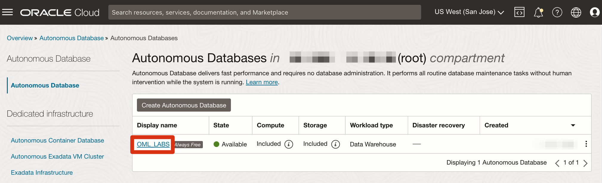        	  

3. On your Oracle Autonomous Database instance page, click the **Database Actions** pull-down menu, and then select the option `View all database actions`. Wait till the Database Actions opens.

	

4. On the Database Actions page, go to the **Development** tab and click **Oracle Machine Learning**. This opens the Oracle Machine Learning sign in page.

	

5. Enter your user credentials and click **Sign in**.

	> **Note:** The credential is what you have defined while creating the Oracle Machine Learning user.

	

	This opens the Oracle Machine Learning user interface home page.
	
</if>

<if type="livelabs">
1. On your workshop page, click **Launch Workshop** under **My Reservations**.

   

2. On the **Get Started - LiveLabs login** page, click **View Login Info** at the top left.

	

3. In the panel that opens with the **Reservation Information**, click at the bottom of the panel on the **OML Notebooks** link.

	

4. In the page that opens, enter your user credentials and click **Sign in**. This opens the Oracle Machine Learning user interface home page.

	> **Note:** The username is `OMLUSER`, and password is `AAbbcc123456`.

	

</if>
This completes the task of signing into Oracle Machine Learning user interface.

## Task 2: Access Oracle Machine Learning Notebooks 

You can access the Notebooks page from the left navigation pane of Oracle Machine Learning Notebook UI, or from the Notebooks listing page.
To access the Notebooks page:
1. Go to the Oracle Machine Learning UI left navigation pane, and click **Notebooks** under Projects.

	

	Alternatively, you can click **Notebooks** under Quick Actions on the home page to open the Notebooks page. 

2. This opens the OML Notebooks page.

	

Here, you have the option to:
* **Create:** Click Create to create a new notebook.
* **Edit:** Click on a notebook row to select it and click **Edit.** You can edit the notebook name, and add comments in the Edit Notebook dialog box.
* **Delete:** Click on a notebook row to select it and click **Delete.**
* **Duplicate:** Click on a notebook row to select it , and click **Duplicate.** This creates a copy of a notebook, and the duplicate copy of the is listed on the Notebooks page with the suffix `_1` in the notebook name.
* **Save as Template:** To save a notebook as a template, select the notebook and click **Save as Template.** In the Save as Template dialog, you can define the location of the template to save it in Personal or Shared under Templates.
* **Import:** To import a notebook, click **Import.** The following notebook formats are supported for import - ``.json`` , ``.zpln`` (Zeppelin notebook), ``.ipynb`` (Jupyter notebook) and ``.dsnb`` (native). Select the project and workspace in which to import the notebook.
* **Export:** To export a notebook, click **Export.** You can export Noteboooks in the `.dsnb` format, Zeppelin format (`.json` ) file and in Jupyter format (`.ipynb`), and later import them in to the same or a different environment. You can also export the notebook in HTML format, and optionally exclude paragraph code, results, and timestamps.
* **Version:** To create versions of a notebook, select it and click **Version.** The Versions page for that particular notebook opens. Here, you can create a new version of the notebook by clicking **+Version.** The Create Version dialog opens. Enter a name of the notebook version, a description, and click **OK.** The new version of the notebook gets created by the same name with a suffix `_2` for the second version. For subsequent versions, suffix (number) increments by one. To revert to an older version by clicking Revert Version. You also have the option to delete any version of the notebook. Click **Back to Notebooks** to go to the OML Notebooks page.

This completes the task of accessing Oracle Machine Learning Notebooks.

## Task 3: Create a Notebook and Define Paragraphs using the md, SQL, PL/SQL, Python, and R Interpreters

In this task, you will create a new notebook, and add paragraphs to connect to the Markdown, SQL, Script, Python, and R interpreters. Interpreters are independent backend engines. R and Python engines are stateful while the notebook is open, and database objects are valid for the duration the database connection is active. You can change the interpreter by explicitly specifying one of `%script`, `%python`, `%sql` , `%r` , `%md`, or `%conda` to connect to the respective interpreter.

To learn about Conda, refer to [Use the Conda Interpreter in a Notebook Paragraph](https://docs.oracle.com/en/database/oracle/machine-learning/oml-notebooks/omlug/run-notebook-conda-interpreter.html).

1. On the Notebooks page, click **Create.**
		
2. In the Create Notebook dialog, enter the name `Test Notebook` in the **Name** field and click **OK.** The notebook is created and it opens in the notebook editor.
		

	You can now use the **Test Notebook** to create a Markdown paragraph, SQL paragraph, Python, R and Conda paragraphs.   

### Task 3.1: Use the Markdown interpreter and display static html from Markdown plain text

In this task, you will use the Markdown interpreter, and display the formatted text in the output of the markdown paragraph.
>*Note:* The first time a given interpreter type is accessed, the interpreter is started, which may take a few seconds to initialize and establish a connection to the database. Subsequent uses of the interpreter in later paragraphs will be immediate.

1. In the first paragraph, type `%md` and press Enter.
2. Type the following:
	* To format the text in bold, type the text Hello World inside a double asterisk pair, and press Enter.
	* To format the text in italics, type the text Hello World either inside an asterisk pair or an underscore pair, and click the Run

	Alternatively, you may copy the code and paste it in the notebook just below %md, and click the Run icon run icon as shown in the screenshot:
	```
	<copy>
	**Hello World**
  *Hello World*
  _Hello World_
	</copy>
	```

	After running the paragraph, the output is displayed, and a new paragraph is automatically created. Also, you can manually create additional paragraphs.
	

3. Hover your cursor over the lower border of the paragraph and click  to add another Markdown paragraph.

	

4. To display the text in a bulleted list, prefix * (asterisk) to the text Hello World We welcome you, as shown in the screenshot below.

	```
	<copy>
	* Hello World
	* We welcome you
	</copy>

	```
5. Add another Markdown paragraph. Here, you will use Markdown tags to display the text in heading 1 (H1), heading 2 (H2) and heading 23 (H3). For H1, H2, and H3, add one, two, and three hashes before the text Hello World respectively.

	```
	<copy>
	# Hello World
	# Hello World
	### Hello World
	</copy>

	```
6. Now, scroll up the notebook and click the Run All icon present in the notebook toolbar, as shown in the screenshot here.

	

7. A message appears asking you to confirm whether to run all the paragraphs of the notebook. Click **Confirm.**
	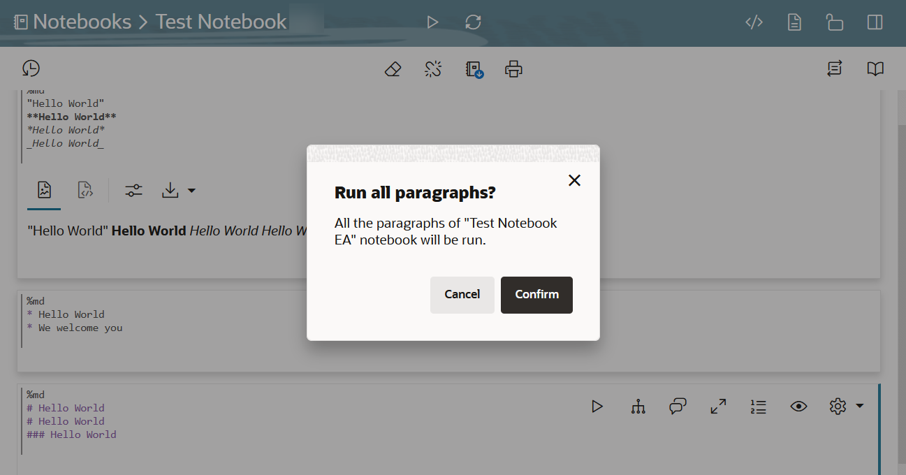

	The two paragraphs run and the output is displayed in the respective paragraphs, as shown in the screenshot.
		
This completes the task of using the Markdown interpreter to generate HTML in your notebook. 
### Task 3.2: Use the SQL Interpreter and run SQL Statements

Let’s create another paragraph to use the SQL interpreter and run SQL statements:

>*Note:* The first time a given interpreter type is accessed, the interpreter is started, which may take a few seconds to initialize and establish a connection to the database. Subsequent uses of the interpreter in later paragraphs will be immediate.

1. To create a SQL paragraph, hover your cursor over the lower border of the paragraph and click on the **Add sql Paragraph** icon to add a SQL paragraph.

	

	You may also choose to click on the Add Paragraph icon  to manually create a new paragraph. Then type ``%sql`` and press Enter to call the SQL interpreter.

2. Type the following command and click the run icon .

	```
	<copy>
	select * from SH.COUNTRIES
	</copy>
	```

	* The command returns the COUNTRIES table present in the SH schema in a tabular format, as shown in the screenshot. You can also view the data in various visual format by clicking on any of the chart icons, as highlighted in the screenshot here:
	

	* Click on the histogram icon to view the table in a histogram. Hover your cursor over each bar to view the details for each country:
	
	* You can adjust the settings and visual output by clicking on the **Settings** icon on the paragraph toolbar, highlighted in red. Clicking the settings icon opens the **Settings** dialog. Here, click on the **Setup** tab to customize the output to view.
	
	* Click on each of the fields to choose various output options. In this customized output, the COUNTRY REGION ID and COUNTRY NAME in the **Series to Show** and **Group By** fields respectively. The histogram now shows an additional series - country region and the full name of the country along with the country code.
	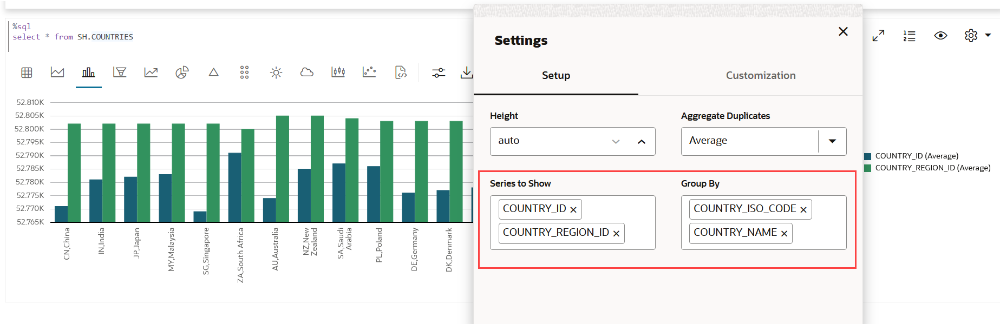
	* Click on the **Height** field and enter values as applicable to adjust the setting to allow scrolling and limit vertical height of the result.
	
	* Click on the **Customization** tab in the **Settings** dialog to customize the visualization. Here, the layout of the histogram is changed to horizontal and the color is changed to red for the series COUNTRY NAME.
	

This completes the task of connecting to the SQL interpreter and running SQL commands in your notebook. 
### Task 3.3: Use the PL/SQL Interpreter and run PL/SQL Scripts

In this task, you will create another paragraph to call the PL/SQL interpreter and run PL/SQL scripts:

1. To create a PL/SQL paragraph, hover your cursor over the lower border of the paragraph and click on the **Add sql Script Paragraph** icon to add a PL/SQL paragraph.
	

2. Type the following command and click the run icon. Alternatively, you can press Shift+Enter keys to run the paragraph.

	```
	<copy>
	CREATE TABLE small_table
	(
	NAME VARCHAR(200),
	ID1 INTEGER,
	ID2 VARCHAR(200),
	ID3 VARCHAR(200),
	ID4 VARCHAR(200),
	TEXT VARCHAR(200)
	);

	BEGIN
	FOR i IN 1..100 LOOP
	INSERT INTO small_table VALUES ('Name_'||i, i,'ID2_'||i,'ID3_'||i,'ID4_'||i,'TEXT_'||i);
	END LOOP;
	COMMIT;
	END;
	</copy>
	```
	The PL/SQL script successfully creates the table SMALL_TABLE. The PL/SQL script in this example contains two parts:
	* The first part of the script contains the SQL statement CREATE TABLE to create a table named small_table. It defines the table name, table column, data types, and size. In this example, the column names are NAME, ID1, ID2, ID3, ID4, and TEXT.

	* The second part of the script begins with the keyword BEGIN. It inserts 100 rows into the table small_table


	
This completes the task of connecting to the PL/SQL interpreter and running PL/SQL scripts in your notebook.  
### Task 3.4: Use the Python Interpreter and run Python Statements
Let’s create another paragraph to call the Python interpreter and run Python statements:

1. To connect to the Python interpreter, hover your cursor over the lower border of the paragraph and click on the **Add OML4Py Paragraph** icon.
	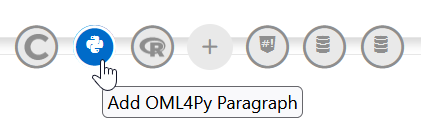

2. Type the following command and click the run icon.

	```
	<copy>
	import pandas as pd
	import oml
	DATA = oml.sync(table = "SUPPLEMENTARY_DEMOGRAPHICS", schema = "SH")
	z.show(DATA.head())
	</copy>
	```
	The z.show command displays the SUPPLEMENTARY_DEMOGRAPHICS table present in the SH schema, as shown in the screenshot here. Use the z.show command to display Python objects, proxy object content, and to display the desired data in the notebook. You will learn more about z.show in the lab on Oracle Machine Learning for Python.

	

This completes the task of connecting to the Python interpreter and running Python commands in your notebook.
### Task 3.5: Use the R Interpreter and run R Statements
Oracle Machine Learning for R (OML4R) makes the open source R scripting language and environment ready for the enterprise and big data. OML4R integrates R with Oracle Autonomous Database. It allows you to run R commands and scripts for statistical, machine learning, and visualization analyses on database tables and views using R syntax.

In this task, you will use the R interpreter and run R statements:

* Import R Libraries
* Create a database table
* Explore and visualize the data

>*Note:* The ORE library is pre-loaded and available.

1. To connect to the R interpreter, hover your cursor over the lower border of the paragraph and click on the **Add OML4R Paragraph** icon.
	
2. To import R Libraries, run the following command:

 	```
	<copy>
	%r
	library(ORE)
	library(lattice)

	options(ore.warn.order=FALSE)
	</copy>
	```
	

3. In this step, run the following script in an R paragraph to create the Iris dataset:

	```
	<copy>
	%r
	library(ORE)

	if (ore.exists("IRIS_R")) ore.drop(table="IRIS_R")

	ore.create(iris, table = "IRIS_R", overwrite=TRUE)

	ore.exec("ANALYZE TABLE IRIS_R COMPUTE STATISTICS")

	z.show(cat("Shape:", dim(IRIS_R)))
	</copy>
	```
	

	
4. 	Run the following SQL command to view the dataset:

	```
	<copy>
	%sql
	select * from OMLUSER.IRIS_R
	</copy>
	```
	


This completes the task of connecting to the R interpreter and running R commands in your notebook.

## Task 4: Create a Notebook using a Template Example

This task demonstrates how to create notebooks based on Example templates. You will learn how to:
* Create the OML4Py Classification notebook based on the OML4Py Classification DT example template. The template builds and applies the classification Decision Tree algorithm to build a classification model based on the relationships between the predictor values and the target values. The template uses the Sales History (`SH`) schema.
* Create the Time Series notebook based on the OML4SQL Time Series ESM example template. This template forecasts sales by using the Exponential Smoothing Algorithm for Time Series Data. It also used the `Sales` table in the SH schema.

### Task 4.1: Create an OML4Py Notebook using the Classification DT Template Example

This step demonstrates how to create the OML4Py Classification notebook based on the OML4Py Classification DT (Decision Tree) Example template:

1. Go to the Examples page by clicking the Cloud menu icon   on the top left corner of the page to open the left navigation menu. On the left navigation menu, click **Templates** and then click **Examples**.

	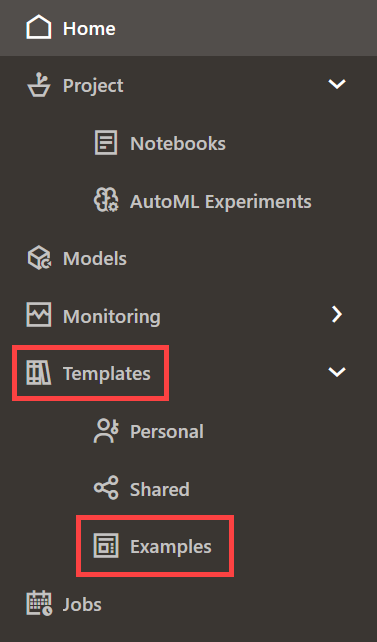

  Alternatively, on the Oracle Machine Learning home page, click **Examples** in the Quick Actions section to go Examples.

	


2. Navigate to the **OML4Py Classification DT** example template notebook. You can search for the notebook by typing in the name in the search box on the upper right corner of the page. Click on the grey box around the notebook. This highlights the notebook and enables the **Create Notebook** button. Click **Create Notebook**.

	

3. The Create Notebook dialog opens. The Name field displays the same name as the template with the suffix `(1)`. You can edit this name. In this example, we will retain the original name `OML4PY Classification DT`. Delete the suffix (1) and click **OK**.

	> **Note:** In the Project field, the current user, project, and workspace is selected by default. You have the option to choose a different project or a workspace by clicking the edit icon here.  

	

4. Once the notebook is created, the message _This Notebook was created in project "OMLUSER Project" and will appear under the Notebooks Listing "_ is displayed, as shown in the screenshot. The notebook is now available on the Notebooks page. You may also click **Open Notebook** in the message dialog to open the notebook directly from here.

	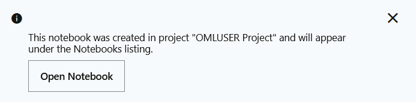

5. To view the notebook that you just created, click the Cloud menu icon  on the top left corner of the page to open the left navigation menu. Click **Notebooks** to go to the Notebooks page.

	

6. The OML4PY Classification DT notebook is now listed on the Notebooks page, as shown in the screenshot. Click it to open the notebook in the Notebooks editor. Note that you will run this notebook in the subsequent steps.

	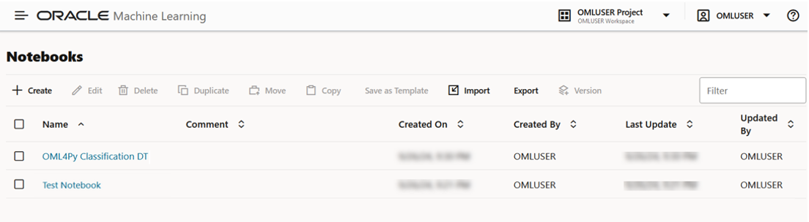
	

This completes the task of creating a notebook from an Example template.

### Task 4.2: Create a Time Series Notebook using the OML4SQL Time Series Template Example

These steps demonstrate how to create the Time Series notebook based on the Example template:

1. Click the Cloud menu icon  on the top left corner of the page to open the left navigation menu. Click **Examples** under Templates to open the Examples page. 

	

If you choose to go to the home page, then click **Home** on the left navigation pane, and then click **Examples**.	

2. Navigate to the **OML4SQL Time Series ESM** example template notebook. You may type ESM in the search box on the upper right corner of the page to get a list of the ESM-related notebooks. Click the grey box around the notebook. This highlights the notebook and enables the **Create Notebook** button. Click **Create Notebook**.

	

3. The Create Notebook dialog opens. By default, the **Name** field displays the same name as the template with the suffix `(1)`. You can edit this field. In this example, let's remove the suffix and retain the original name **OML4SQL Time Series ESM** and click **OK**.

	> **Note:** In the Project field, the current user, project and workspace is selected by default. You have the option to choose a different project or a workspace by clicking the edit icon here.  

	

4. Once the notebook is created, the message _This Notebook was created in project "OMLUSER Project" and will appear under the Notebooks Listing "_ is displayed. The notebook is now available on the Notebooks page. You may also click **Open Notebook** in the message dialog to open the notebook directly from here.

	

5. To view the notebook, click the Cloud menu icon  on the top left corner of the page to open the left navigation menu. Click **Notebooks** to go to the Notebooks page.

	


6. The notebook **Notebook "OML4SQL Time Series ESM** is now listed on the Notebooks page, as shown in the screenshot. Click on the notebook to open it in the Notebooks editor and work on it.

	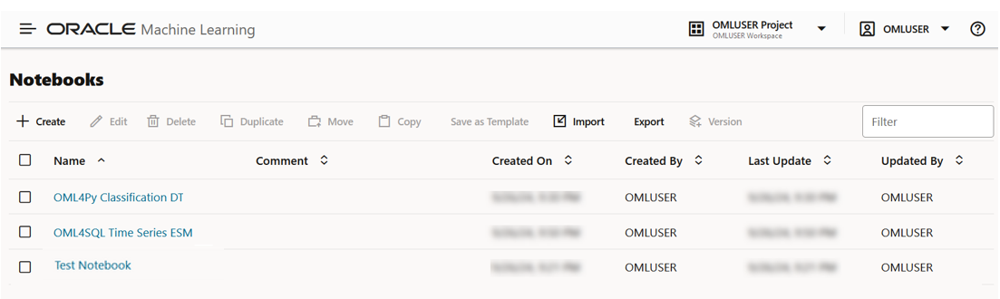


This completes the task of creating the Time Series notebook from the OML4SQL Time Series ESM Example template.


## Task 5: Work with Notebook Features

Upon creating a notebook, it opens automatically, presenting you with a single paragraph using the default ``%sql`` interpreter. You can change the interpreter by explicitly specifying one of ``%script``, ``%python``, ``%sql`` , ``%r`` , ``%md``, or ``%conda`` to connect to the respective interpreter.

To learn about Conda, refer to [Use the Conda Interpreter in a Notebook Paragraph](https://docs.oracle.com/en/database/oracle/machine-learning/oml-notebooks/omlug/run-notebook-conda-interpreter.html).

By default, you are assigned into a project. Select the project that contains the notebook you want to use.

To edit an existing notebook:

1. On the Oracle Machine Learning Notebook page, click the notebook name that you want to open. The selected notebook opens in the edit mode. 

2. When the notebook is open, you can use the following notebook features from the  toolbars:


* Click  to run all paragraphs in the notebook.
* Click  to invalidate and reset the notebook session.
* Click  to create a new version this notebook, or to view the earlier versions of the notebook.

	- **Create Version:** Click this option to create a new version of this notebook. You have the option to provide a new name for the version, and a description about it. When you create a new notebook version, the paragraph results of each run session are stored in the versioned notebook. When you restore a notebook, its paragraph results are also restored. You can also create notebook versions from the editor. For more information, see Work with Notebook Versions in the Notebook Editor.

	- **View Version History:** Click this option to view the earlier versions of the notebook. You have the option to restore any earlier version, compare versions, and delete any earlier version that you created.

	>**Note:**  You can also create notebook versions, view version history, and delete older versions from the Versions option on Notebooks page option on the Notebooks page.

* Click  to clear paragraph results.
* Click  clear paragraph dependencies to clear paragraph dependencies.
* Click  export notebook to export the notebook. You can export the notebook as a ``.dsnb`` file (OML Notebook), ``.zpln`` file (Zeppelin notebook) and ``.ipynb`` file (Jupyter notebook). You have these additional settings while exporting a notebook:

	- **Exclude code:** Click to exclude the code in the notebook paragraphs. The exported notebook will only contain the paragraph outputs.
	- **Exclude results:** Click to exclude the paragraph output. The exported notebook will only contain the codes in the paragraphs.
	- **Exclude timestamps:** Click to exclude the timestamps from each paragraph.
	- **Export Type:** Select an option from the drop-down list. The supported types are Native (.dsnb), Zeppelin, Zupyter, and HTML.
* Click  to print the notebook. You can also print the notebook in PDF format.
* Click  to hide the code of all paragraphs in the notebook.
* Click  to hide the results of all the paragraph in the notebook.
* Click   to enable read-only mode for this notebook.
	>**Note:** The read-only mode is available only for the Oracle Machine Learning Notebooks.

* Click  to open the settings option in the side panel. The settings option in the side panel are the same settings option available in the paragraph.
	- This is the screenshot of the settings option on the side panel that open when you click the Show Panel icon. Note that the settings option in the paragraph is hidden when the side panel is open. Click the close icon on the panel to close the pane.
	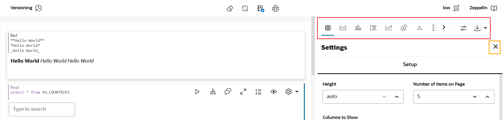
	- Once you close the edit pane on the right, the settings option in the paragraph are displayed, as shown in the screenshot here.
	

* Click  to change the interpreter binding to either low, medium, or high.
* Click  Zeppelin to switch the OML Notebook to either Zeppelin or Jupyter notebook.


### Paragraph level features:
* Click  to run the selected paragraph.
* Click 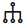 to enter into Dependency Mode. In Dependency Mode, you select and deselect paragraphs to add or remove them as dependents.

	>**Note:** The Paragraph Dependencies feature allows you to add dependencies between paragraphs. The dependents of a paragraph automatically run after the original paragraph is run.

* Click  to open the Comments dialog. Type in your comments here, and press Enter to add the comment. You can also delete any comments by clicking the corresponding **Delete** icon. Click the comments icon to close the dialog. You can provide comments for each paragraph in a notebook. Paragraphs with comments are indicated by a green dot on the comments icon.
* Click 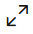 to view the notebook paragraph in full screen mode. To view the paragraph in the normal mode, click the collapse icon.
* Click  to show line numbers in the paragraph.
* Click  to view the paragraph title, code, results, and the paragraph settings.
* Click  to:
	- **Move up:** Click  to move the paragraph up in the notebook.
	- **Move down:** Click  to move the paragraph down in the notebook.
	- **Run all Above:** Click  to run all the paragraphs above the current paragraph.
	- **Run all Below:** Click  to run all the paragraphs below the current paragraph.
	- **Clear results:** Click  to clear the paragraph results.
	- **Open as Embedded Window:** Click  to view the current paragraph separately in your browser.
	- **Clone Paragraph:** Click  to clone the paragraph. The paragraph is cloned in the same notebook.
	- **Disable Run:** Click  to disable running of the paragraph. To enable run, go to **Settings** and click **Enable Run.**
	- **Delete Paragraph:** Click  to delete the paragraph.
* Click HTML to view the paragraph in HTML format.
* Click Text to view the paragraph in text format.
* Click Settings to adjust settings of the notebook paragraph output. This setting is specifically applicable to visualizations in graphs, charts, vertical height of paragraph output etc.
* Click download-as to download the paragraph as a text file, or as ``.png`` or ``.svg`` files, as applicable, for paragraphs that contains graphs or charts as output.

This completes the task of working with various notebook features. To learn more about advanced notebook features, see _Lab 6: Advanced Notebooks Options_ in the workshop [Oracle Machine Learning Notebooks](https://apexapps.oracle.com/pls/apex/r/dbpm/livelabs/run-workshop?p210_wid=891&p210_wec=&session=17495085944752).

## Task 6 Visualize your Data in OML Notebooks

OML Notebooks offer rich visualization capabilities of your data. The visualizations depend on the type of your dataset.
The following visualization options are available.  

* Table - A table is an arrangement of information or data in rows and columns. Using OML Notebooks, you can create database tables, and also view the information in a tabular format. 
* Area Chart - An area chart uses lines to connect the data points and fills the area below these lines to the x-axis. Each data series contributes to the formation of a distinct shaded region. This emphasizes its contribution to the overall trend. As the data points fluctuate, the shaded areas expand or contract.
* Bar Graph - A bar graph is a graphical representation of data in rectangular bars. The length and height  of the bars, depending on the horizontal or vertical orientation, depict the dataset distribution. One axis represents a category, while the other represents values or counts.
* Funnel Chart - A funnel chart is a graphical representation that resembles the shape of a funnel where each segment gets progressively narrower. The segments are arranged vertically and depict a hierarchy. Within the funnel chart, each segment corresponds to a step or stage in a sequential process.
* Line Chart - A line chart is a graphical representation used to display data points connected by straight lines.
* Pie Chart - A pie chart is a graphical representation of data in a circular form, with each slice of the circle representing a fraction that is a proportionate part of the whole.
* Pyramid Chart - Pyramid charts present your data in a distinctive triangular configuration, horizontally segmented into partitions. Each segment in the pyramid charts represents points or steps in ascending or descending order. 
* Box Plot - A box plot provides an overview of data distributions in numeric data. It provides general information about the symmetry, skewness, variance, and outliers in a dataset. The box plot uses boxes and lines to depict the data distribution. 
* Scatter Plot - Scatter plots represent the relationship between two numeric variables in a data set. It represents data points on a two-dimensional plane and show how much one variable is affected by another. The independent variable is plotted on the X-axis, while the dependent variable is plotted on the Y-axis. You can display points by one or more grouping variables such that each group has a distinct color and shape. 
* Tree Map - A treemap is a visualization composed of nested rectangles, that represent certain categories within a selected dimension and are ordered in a hierarchy, or “tree.” Quantities and patterns can be compared and displayed in a limited chart space. Treemaps also show the relationship of each part (or nested rectangles) to the whole (tree). 
* Sun-burst - The sunburst chart is typically used to visualize hierarchical data structures - with part-to-whole relationships in data depicted additionally.
* Tag Cloud - A tag cloud is a visual representation of the most popular words (or tags) found in free-form text.
* Maps - Map plots display data points on a geographical map.

To visualize your data, let's consider the _Test Notebook_ that you created in **Task 3-Create a Notebook and Define Paragraphs using the md, SQL, PL/SQL, Python, and R Interpreters** in this lab. 

1. Open the _Test Notebook_ and go to the paragraph where you created and viewed the Iris dataset in a table. The tabular format presents the data in rows and columns. The Iris data set contains:
	* Three classes (three different species of the Iris flower) - Setosa, Versicolor, and Virginica. 
	* Four numeric properties about those classes - Sepal Length, Sepal Width, Petal Length, and Petal Width. 

	

2. On the paragraph notebook toolbar, click on the pie chart icon. The tabular data is now rendered in a pie chart. The size of each slice of the pie chart represents a fraction that is proportionate to the whole. It also depicts the percentage of each class. Hover your cursor over each slice to view additional details about the respective class it represents. 	

	

3. You may also visualize this dataset in a box plot by clicking on the box plot icon. The box plot shows the data distribution of the 3 classes - Setosa, Versicolor, and Virginica. Hover your cursor over each slice to view additional details such as the inter-quartile ranges and quartiles, outliers (additional customization required) and so on for each class. This box plot displays the data for one property (sepal length) for the three classes. You can customize the box plot view all the properties of the three classes. 

	Visualization of the data in a box plot.  

	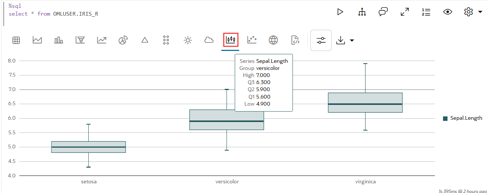
	 
4. The output in any of the visualization option depends on the default visualization behavior. The tool automatically selects the columns to show. You can change these settings. 

	Click the Settings icon  to open the Settings dialog. 
	* In the **Setup** tab, you have the option to increase or decrease the height of the box plot, select or deselect columns (series) to display, and so on.
	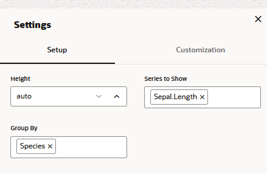

	* In the **Customization** tab, you have the option to customize the layout, define values for the interquartile range (specific to boxplot), define the maximum number of elements, add labels to X axis and Y axis, change the display color, and even add description to the chart.
	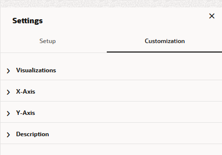

	For details about the Iris dataset visualization, and all the other visualization options, settings, and customizations, see [Lab 3: Visualize Data in Oracle Machine Learning Notebooks](https://oracle-livelabs.github.io/oml/oml/workshops/freetier/index.html?lab=oml-nb-visualizations) in the workshop _Introduction to Oracle Machine Learning Notebooks_.

This completes the task of visualizing your data in a notebook. 

To know more about the advanced options available in Oracle Machine Learning Notebook, see [Lab 6: Advanced Options in Oracle Machine Learning Notebooks](https://oracle-livelabs.github.io/oml/oml/workshops/freetier/index.html?lab=adv-notebooks-options) in the workshop _Introduction to Oracle Machine Learning Notebooks._ 

You may now **proceed to the next lab**.

## Learn More

* [Oracle Machine Learning UI](https://docs.oracle.com/en/database/oracle/machine-learning/oml-notebooks/)


## Acknowledgements

* **Author** -  Moitreyee Hazarika, Principal User Assistance Developer, Database User Assistance Development
* **Contributors** -   Mark Hornick, Senior Director, Data Science and Machine Learning; Marcos Arancibia Coddou, Product Manager, Oracle Data Science; Sherry LaMonica, Consulting Member of Tech Staff, Machine Learning
* **Last Updated By/Date** - Moitreyee Hazarika, April 2025
