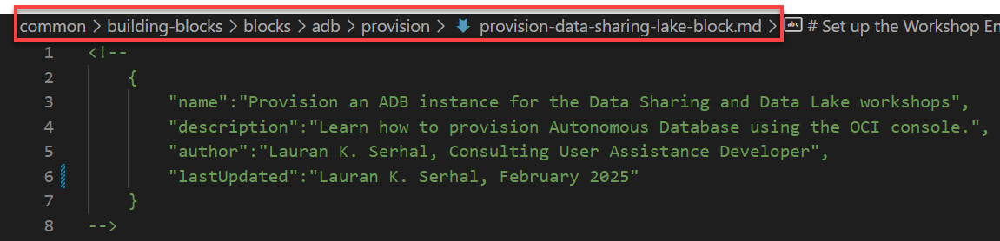
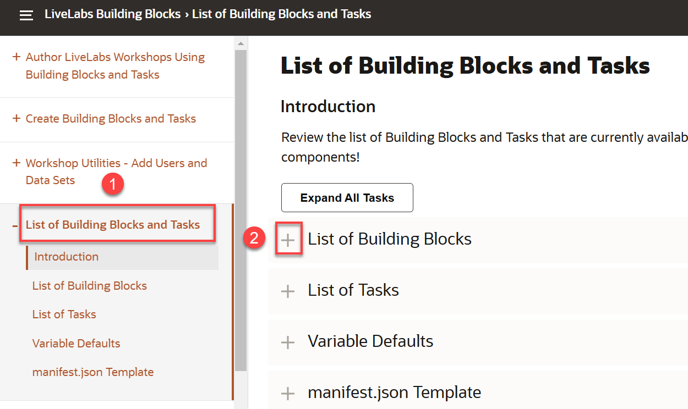
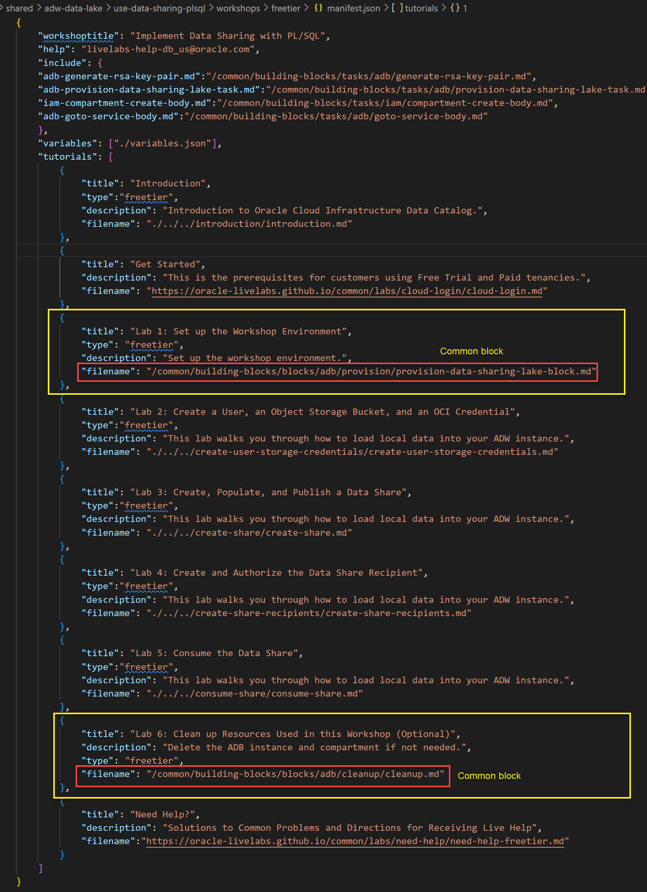

# Create Building (Common) Blocks and Tasks

## Introduction

**Everyone should contribute to Blocks and Tasks!** If you are creating a workshop and you have labs or tasks that you think will be useful to others - share them! It's easy - here's how.

### Create a block or task?

The block is equivalent to a lab. It may be difficult not to provide workshop specific information - especially in the introduction. If you can keep the content generic, then create a block!

Very frequently, a lab has tasks that are very generic. For example, Navigating to the object storage service is the same. So, make that a task and use variables to specify the compartment and bucket. Now, any lab that needs to navigate to the object store can simply include the task in their markdown. It's a one liner! And, when the UX changes, one update to the task will update all the workshops that use the task.

Don't forget to use tasks when creating your block :).

Let's review the process of creating and using building blocks at high level before we delve into the details.

  

### Prerequisites

Ensure that have met the pre-requisites covered in the **Author LiveLabs Workshops with Building (Common) Blocks and Tasks lab > Task 2: Pre-requisites to Using Building Blocks and Tasks**.

## Task 1: Create a building block

Create your workshop as you normally would. Try to keep content generic enough so that it can be used in multiple contexts. And, it may mean using variables instead of hardcoding names. Create the common block in the appropriate folder (repo). For example, if you are creating a common block for an ADB workshop, you'll create the common block in the **`common > building-blocks > blocks > adb`** folder.

1. To create a new folder or file for your building block in the your chosen folder such as the adb folder, click the **New File...** or the **New Folder...** icons in Visual Studio Code.

    

2. In our example, we will create a new common block named **`provision-data-sharing-lake-block.md`** in an existing folder named **provision**. This folder will eventually contain different variations of the the provisioning block.

    

3. Add the required comment block at the beginning of the new `.md` file. This comment block provides a name, description, author, and last updated fields for your block or task. **The documentation's master list of building blocks and tasks that is listed in this workshop is derived from these comment blocks**.

    

    **_Important:_** _You must use the exact spelling of the comment block fields names. Pay attention to the **`lastUpdated`** field where the camel case naming convention is used. If you don't use the exact spelling, your common block or task will not appear in the list of available blocks or tasks._

    The information that you provide in the comment block will be displayed in this **LiveLabs Building Blocks** workshop in the **List of Building Blocks and Tasks** lab under **List of Building Blocks**.

    

4. Enter the remaining content for the building block. Here's the complete building block. Notice that this building block uses two common tasks! We will cover how to create and use common tasks later.

    

5. Save your building block's `.md` file to the appropriate repo folder under the **building-blocks** root folder to which you already navigated. Each cloud service has its own folder in either the blocks or tasks parent folder. If your cloud service's folder doesn't exist yet, then simply add a new folder.

    ```
    common
    .. building-blocks
    .... blocks
    ........adb
    ........oac
    ........oml
    .... tasks
    ........adb
    ........iam
    ........oml
    ```

6. Preview the newly created building block using Live Server and make any necessary changes.

## Task 2: Use building blocks in other workshops

To use the building block in other workshops, simply add a reference to the building block in the workshop's `manifest.json` file as follows:


In the above example, you simply add an entry for the common block in the workshop's manifest.json file. The **filename** attribute points to the exact location of this common block in the common repo. That's all you need to do to use a common block!

Here's a complete example of the workshop that uses this common block and another common block named cleanup.md.



## Task 3: Regenerate the documentation

After you create (or modify or delete too) new blocks and tasks, regenerate the documentation by running the **generate-documentation.py** python script found in the `/common/building-blocks/scripts` folder. This script generates much of the how-to-author-with-blocks documentation.

1. Navigate to the `/common/building-blocks/scripts` folder.

2. Right-click the **generate-documentation.py** file name, and then select **Open in Integrated Terminal** from the context menu.

    

3. Run the script. Copy the following code and then paste it on the command prompt. Next, press the `[Enter]` key.

    ```
    <copy>
    python generate-documentation.py
    </copy>
    ```

    

    The script output is displayed.

    

4. Navigate to and review the following to display any additions, deletions, or edits that you might have made:

    * `adb.md`
    * `how-to-author-with-blocks.md`
    * `manifest.json`

## Task 4: Push your changes to your fork and production

1. Push your changes to the common repo to your fork. In this example, we are using GitHub Desktop.

    

    

2. Submit a Pull Request to move your changes to production.

    

3. Wait for your PR to be approved and merged and then use the following URL to this building blocks documentation workshop to confirm your changes.

    https://oracle-livelabs.github.io/common/building-blocks/how-to-author-with-blocks/workshop/index.html?lab=how-to-author-with-blocks

## Acknowledgements
* **Authors:**
    * Lauran K. Serhal, Consulting User Assistance Developer
    * Marty Gubar, Product Manager
* **Contributor:**
    * Kevin Lazarz, Senior Manager, Product Management
* **Last Updated By/Date:** Lauran K. Serhal, March 2025
