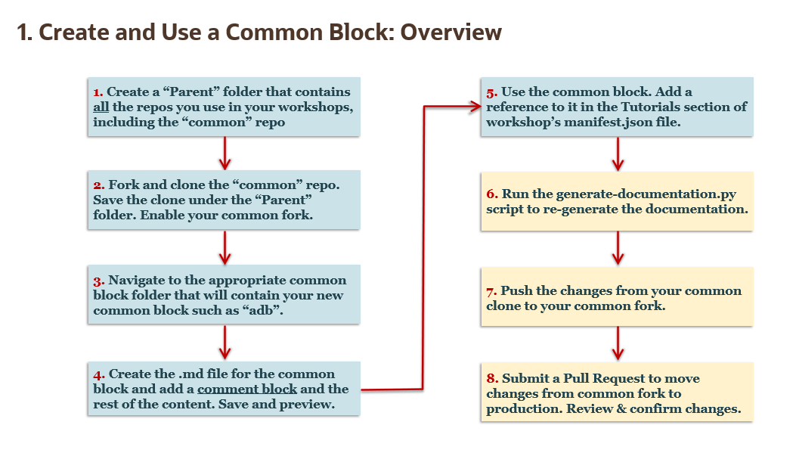
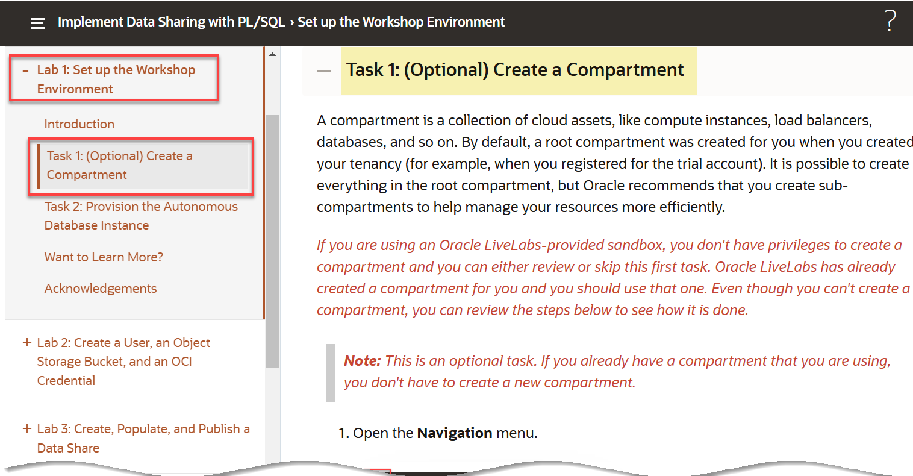
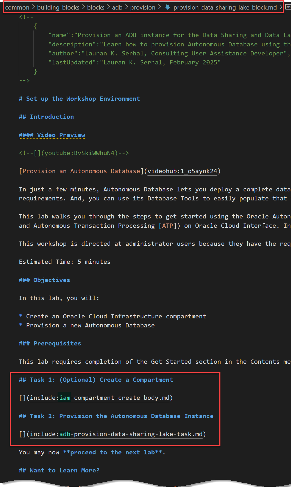
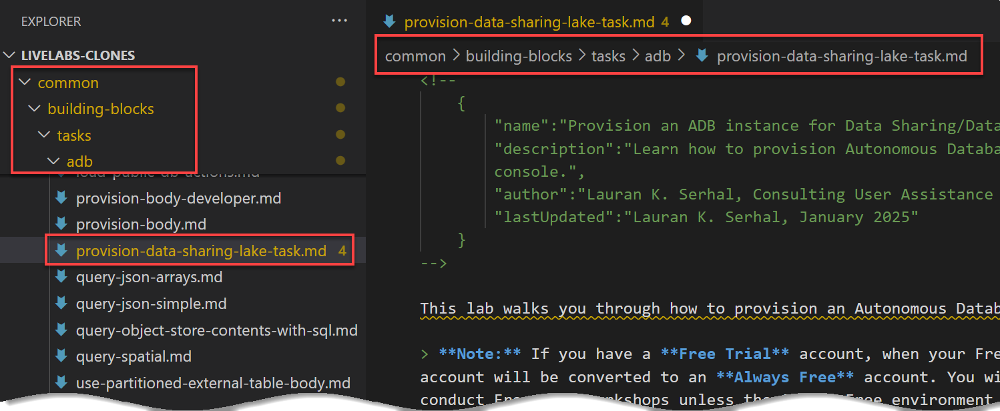

# Create Building (Common) Blocks and Tasks

## Introduction

**Everyone should contribute to Blocks and Tasks!** If you are creating a workshop and you have labs or tasks that you think will be useful to others - share them! It's easy - here's how.

### Create a block or task?

The block is equivalent to a lab. It may be difficult not to provide workshop specific information - especially in the introduction. If you can keep the content generic, then create a block!

Very frequently, a lab has tasks that are very generic. For example, Navigating to the object storage service is the same. So, make that a task and use variables to specify the compartment and bucket. Now, any lab that needs to navigate to the object store can simply include the task in their markdown. It's a one liner! And, when the UX changes, one update to the task will update all the workshops that use the task.

Don't forget to use tasks when creating your block :).

Let's review the process of creating building blocks at high level before we delve into the details.

  

Let's review the process of creating building tasks at high level before we delve into the details.

  

### Prerequisites

Ensure that you have met the pre-requisites listed in the **Author LiveLabs Workshops with Building (Common) Blocks and Tasks lab > Task 2: Pre-requisites to Using Building Blocks and Tasks**.

## Task 1: Use an existing building (common) block

Before you create a new building block, check to see if there is a similar block that already exists that you can use. Let's say you are looking for a building block on how to connect to Oracle Autonomous Database (ADB) using the SQL Worksheet.

1. In this **LiveLabs Building Blocks** workshop (documentation), drill-down on **List of Building Blocks and Tasks** and then drill-down on **List of Building Blocks**.

    
    
2. Look for a block on how to connect to ADB using the SQL Worksheet. Scroll-down the list of blocks. There is a common block named **Connect with SQL Worksheet**. Click the name link for that block to display its details.

    

    The following is the rendered building block:
    
    

3. If this is a block that you can use in your workshop, go to **Task 3** to learn how to use an existing building block in your workshop.

## Task 2: Create a new building (common) block

Create your workshop as you normally would. Try to keep content generic enough so that it can be used in multiple contexts. And, it may mean using variables instead of hardcoding names. Create the common block in the appropriate folder (repo). For example, if you are creating a common block for an ADB workshop, you'll create the common block in the **`common > building-blocks > blocks > adb`** folder.

1. To create a new folder or file for your building block in the your chosen folder such as the adb folder, click the **New File...** or the **New Folder...** icons in Visual Studio Code toolbar.

    

2. In our example, we will create a new common block named **`provision-data-sharing-lake-block.md`** in an existing folder named **provision**. This folder will eventually contain different variations of the the provisioning block. We will reference this new building block in several LiveLabs workshops. To create a new file in the current directory, click the **New File...** icon, and then enter the file's name and extension.

    

3. Add the required comment block at the beginning of the new `.md` file. This comment block provides a name, description, author, and last updated fields for your block or task. The LiveLabs Building Blocks documentation's (this workshop) master list of building blocks and tasks is derived from the comment blocks.

    

    **_Important:_** _You must use the exact spelling of the comment block fields names. Pay attention to the **`lastUpdated`** field where the camel case naming convention is used. If you don't use the exact spelling, your common block or task will not appear in the list of available blocks or tasks._

    The information that you provide in the building block comment block will be displayed in this **LiveLabs Building Blocks** workshop in the **List of Building Blocks and Tasks** lab under **List of Building Blocks**.

    

    

    

4. Enter the remaining content for the building block. Here's the complete building block. Notice that this building block uses two common tasks! We will cover how to create and use common tasks later.

    

5. Save your building block's `.md` file to the appropriate repo folder under the **building-blocks** root folder to which you already navigated. Each cloud service has its own folder in either the blocks or tasks parent folder. If your cloud service's folder doesn't exist yet, then simply add a new folder.

    ```
    common
    .. building-blocks
    .... blocks
    ........adb
    ........oac
    ........oml
    .... tasks
    ........adb
    ........iam
    ........oml
    ```

6. Preview the newly created building block using Live Server or Open Preview feature in VSC. Make any necessary changes; however, in this specific example, we can' submit the changes and review using Live Server yet since our building block is using two building tasks. We will have to create the tasks first. You will learn more about building tasks later.

    >**Important:** You can't display any common tasks using Live Server on your clone. You'll have to view those using Live Server on your fork; therefore, you must submit your changes to your fork before you can review them.

## Task 3: Use building blocks in workshops

To use the building block in other workshops, you simply add a reference to the building block in the workshop's **tutorials** section of the `manifest.json` file. In the following example, we want to use the **`provision-data-sharing-lake-block.md`** building block in the **Implement Data Sharing with PL/SQL** workshop. We simply added an entry for the building block in the workshop's **tutorials** section of the **`manifest.json`** file. The **filename** attribute for **Lab 1** points to the exact location of this common block in the common repo. That's all you need to do to use a common block! Notice that **Lab 6** in the `manifest.json` file also uses/references another building block named **`cleanup.md`**!


>**Note:** Although we have not covered common tasks yet, since the common block uses two common tasks, we must include the references to those two tasks in the **include** section of the **`manifest.json`** file.

The following is the rendered **Implement Data Sharing with PL/SQL** workshop with the highlighted **Set up the Workshop Environment** lab that contains the common block and tasks.


In the following screen capture, we drilled-down on the **Task 1: (Optional) Create a Compartment** common task.



## Task 4: Use an existing building task

Before you create a new building task, check to see if there is a similar task that already exists that you can use.

1. Navigate to **List of Building Blocks and Tasks > List of Building Tasks** in this workshop.

    

    You can also get the list of tasks by clicking **ADB Tasks** in the navigation menu.

    

2. In the preceding example, we are looking at the **Delete your workshop resources**
common task. Next, click the task name link. The **Tasks for OCI Service: ADB** page is displayed. This page shows you exactly what you need to use this common task in a workshop.

3. Add the common task reference to the **include** section in the `manifest.json` of the workshop.

4. Add the reference to this common task to your `.md` file. That's it!

## Task 5: Create a building (common) task

You create a building task just as you would normally create a task in a lab. Try to keep content generic enough so that it can be used in multiple contexts/workshops which may mean using variables instead of hardcoding names. Create the common task in the appropriate folder (repo). For example, if you are creating a common task for an ADB workshop, you would create the common task in the **`common > building-blocks > tasks > adb`** folder. You can also create common tasks in the **`iam`** and **`oml`** folders.


1. To create a new file for your building task, navigate to the folder that will contain this task such as **`common > building-blocks > tasks > adb`**. Next, click the **New File...** icon in Visual Studio Code toolbar.

    

2. In our example, the **`provision-data-sharing-lake-block.md`** building block that we created and reviewed earlier in this workshop uses two common tasks that we already created.

    >**Note:** Notice that the reference

    

3. The first **`compartment-create-body.md`** common task is in the **`iam`** folder. You must first add the required comment block at the beginning of the common task `.md` file just like you do when you create building blocks. The comment blocks provides a name, description, author, and last updated fields for your block or task. Next, enter the remaining content. The LiveLabs Building Blocks documentation's (this workshop) master list of building blocks and tasks is derived from the comment blocks.

    **_Important:_** _You must use the exact spelling of the comment block fields names. Pay attention to the **`lastUpdated`** field where the camel case naming convention is used. If you don't use the exact spelling, your common block or task will not appear in the list of available blocks or tasks._

    

4. The second **`provision-data-lake-sharing.md`** common task is in the **`adb`** folder. Add the required comment block at the beginning of the common task, and then enter the remaining content.

    

    > **Note:** You must add the required comment block at the beginning of the common tasks `.md` files just like you did when you created a building block. The comment blocks provides a name, description, author, and last updated fields for your block or task. The LiveLabs Building Blocks documentation's (this workshop) master list of building blocks and tasks is derived from the comment blocks.

    

    The information that you provide in the building task comment block will be displayed in this **LiveLabs Building Blocks** workshop in the **List of Building Blocks and Tasks** lab under **List of Building Tasks**.

    

    You can also get the list of tasks by clicking **ADB Tasks** in the navigation menu.

    

5. Enter the remaining content for the building block. Here's the complete building block. Notice that this building block uses two common tasks! We will cover how to create and use common tasks later.

    

6. Save your building block's `.md` file to the appropriate repo folder under the **building-blocks** root folder to which you already navigated. Each cloud service has its own folder in either the blocks or tasks parent folder. If your cloud service's folder doesn't exist yet, then simply add a new folder.

    ```
    common
    .. building-blocks
    .... blocks
    ........adb
    ........oac
    ........oml
    .... tasks
    ........adb
    ........iam
    ........oml
    ```

7. Preview the newly created building block using Live Server or Open Preview feature in VSC. Make any necessary changes; however, in this specific example, we can' submit the changes and review using Live Server yet since our building block is using two building tasks. We will have to create the tasks first. You will learn more about building tasks later.

    >**Important:** You can't display any common tasks using Live Server on your clone. You'll have to view those using Live Server on your fork; therefore, you must submit your changes to your fork before you can review them.

## Task 6: Regenerate the documentation

After you create (or modify or delete too) new blocks and tasks, regenerate the documentation by running the **generate-documentation.py** python script found in the `/common/building-blocks/scripts` folder. This script generates much of the how-to-author-with-blocks documentation.

1. Navigate to the `/common/building-blocks/scripts` folder.

2. Right-click the **generate-documentation.py** file name, and then select **Open in Integrated Terminal** from the context menu.

    

3. Run the script. Copy the following code and then paste it on the command prompt. Next, press the `[Enter]` key.

    ```
    <copy>
    python generate-documentation.py
    </copy>
    ```

    

    The script output is displayed.

    

4. Navigate to and review the following to display any additions, deletions, or edits that you might have made:

    * `adb.md`
    * `how-to-author-with-blocks.md`
    * `manifest.json`

## Task 7: Push your changes to your fork and production

1. Push your changes to the common repo to your fork. In this example, we are using GitHub Desktop.

    

    

2. Submit a Pull Request to move your changes to production.

    

3. Wait for your PR to be approved and merged and then use the following URL to this building blocks documentation workshop to confirm your changes.

    https://oracle-livelabs.github.io/common/building-blocks/how-to-author-with-blocks/workshop/index.html?lab=how-to-author-with-blocks

## Acknowledgements
* **Authors:**
    * Lauran K. Serhal, Consulting User Assistance Developer
    * Marty Gubar, Product Manager
* **Contributor:**
    * Kevin Lazarz, Senior Manager, Product Management
* **Last Updated By/Date:** Lauran K. Serhal, March 2025
