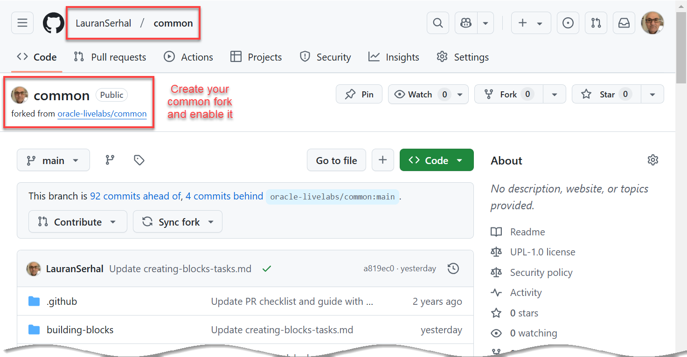
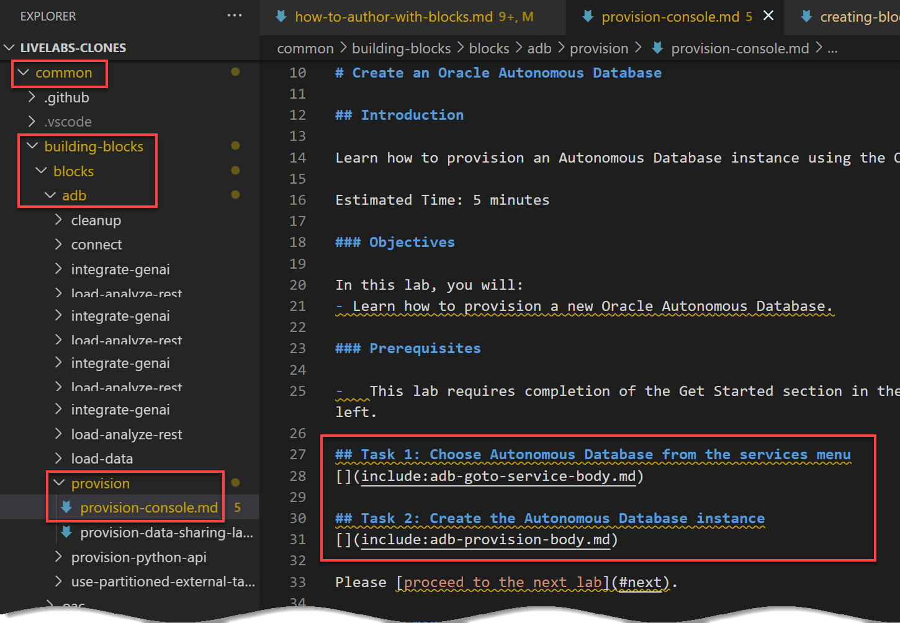

# Author LiveLabs Workshops with Building Blocks and Tasks

## Introduction

LiveLabs is a great environment for developing workshops. It promotes usability of content which in turn saves the authors time. There are a few things that we are addressing to satisfy the following requirements:

* Make it easy for customers to find and perform specific ADB and other tasks
* Simplify and accelerate the authoring of workshops through usability
* Improve on-going maintenance of workshops
* Promote consistency across workshops

Building (Common) Blocks are a way to enhance both the workshop development and customer experience. This workshop provides the details on how authors can use Building Blocks and Tasks to accelerate workshop development.

## Task 1: Building Blocks and Tasks Concepts

As a LiveLabs workshop author, there are two types of components you may want to take advantage of:

* Building **Block** (common block), and/or
* Building **Task** (common task)

>**Note:** Both Building **Blocks** and **Tasks** are located in the **`common`** repository; therefore, in this workshop we will refer to Building Blocks and Tasks as **`common`** **blocks** and **tasks** interchangeably.

As an example, let's say all of your ADB LiveLabs workshops will have a Setup Lab that shows how to navigate to the Oracle Database service and then how to provision a new ADB instance. If you don't use Building Blocks and Tasks, you'll have to create or use the same .md file in _all_ of your ADB workshops. If you need to make any changes to the lab and tasks, _you'll need to make the changes in every lab and task in every ADB workshop._

On the other hand, if you use Building Blocks and Tasks, you can create the Building Block and Tasks only once and then only _reference them_ in every workshop that uses them. If you need to make changes in the future, you only make the changes to the Building Block and Tasks once. _Any workshop that references the Building Block and Tasks_ will automatically reflect the new changes. That is Reusability with minimum effort!

Let's examine these two concepts and how they map to your workshop development. Just as a _lab_ in your workshop is comprised of _multiple tasks_, a _Block_ is comprised of _multiple Tasks_.

For example, we have a **provision-console.md** _common block_ which uses the following _two common tasks_:

* **goto-service-body.md:** Selects the ADB Service from the OCI navigation menu
* **provision-console-body.md:** Creates the ADB instance


>**Note:** Notice that the reference to the two common tasks also requires that you specify the repo in which they were created, **adb** in this example.

In this case, there is a **Building Block** that directly maps to this **lab**. You can simply take this Building Block, add it to your workshop's `manifest.json` file, update the LiveLab variables if needed (the database name, # CPUs, and so on) to match your lab's requirements, and your done! In the future, when you make updates to ADB provisioning, your lab will update automatically when the Building Block is updated.

**Tasks** map to the individual lab tasks. In this case, there are two Tasks in the Block. Because a Task is a component, it can be used in this or multiple Blocks. In addition, its usage is not limited to Blocks. You can use the Task directly in your lab.

Having this Task is really useful because numerous labs (including ADB Provisioning) navigate to the ADB Service. Since this is a common task, we've created a Task for it. When that navigation changes, the Task will be updated and all labs and Blocks that used that Task will be updated automatically.

**Blocks and Tasks will simplify your workshop authoring and on-going maintenance.**

Let's look at the folders structure for the Building Blocks and Tasks:

  

Let's examine the above folders structure:

* **`livelabs-clones`:**    
This is the root folder that contains all of your repositories that you use in your workshops. _The name of this folder is up to you_. In our example, this folder contains the **`adb`**, **`common`**, **`oci`**, and **`sprints`** repositories. Those are the repos that we use in our LiveLabs workshops. Having a root or parent folder that contains all of your cloned repos is a pre-requisite; _otherwise, you'll have issues implementing and running common blocks and tasks_.

* **`common` repository:**    
This is the the repo that contains the common Building Blocks and Tasks among other things.

* **`building-blocks`:**    
This is the root folder that contains all common blocks and tasks.

* **`blocks`:**    
This is the folder that contains all common blocks.

* **`tasks`:**    
This is the folder that contains all common tasks.

## Task 2: Prerequisites to Using Building Blocks and Tasks

### **Pre-requisite 1**

To use building blocks, your cloned repositories where you save your LiveLabs workshops (such as the adb, common, and other folders) must be under a root folder that contains all of the cloned repositories (repos) that you need for your workshops. You can choose your own root folder name. In our example, we created a parent folder named **livelabs-clones** folder under the **Documents** folder in MS-Windows. We will be creating workshops that will use the adb, common, oci, pts, and sprints repos.


_**Important:_** _Prior to using Building Blocks, most of us authoring LiveLabs workshops didn’t use the concept of a root folder to store all our clones (repos that we need); instead, we cloned each repo under the Documents folder (or some other folder of your choice) in Windows. If you have this folder structure, you'll need to delete your clones and re-clone the folders and save them under the same root folder._

### **Pre-requisite 2**

You need to _fork_ and _clone_ the **common** repo and save it under the parent folder as described in **Pre-requisite 1**. For detailed information on forking and cloning a repo, see the [Fork a repo, Set up fork pages, and Clone an oracle-livelabs Repository](https://otube.oracle.com/media/Fork+and+Clone+an+oracle-livelabs+Repository/1_5i73l958) video.

### **Pre-requisite 3**

You need to _enable_ your _common_ fork so that you can preview your changes on your fork using **Live Server**. For detailed information on enabling a fork, see the [Fork a repo, Set up fork pages, and Clone an oracle-livelabs Repository](https://otube.oracle.com/media/Fork+and+Clone+an+oracle-livelabs+Repository/1_5i73l958) video.



## Task 3: How common blocks use common tasks

Let's take a look at the markdown for a Provisioning an Autonomous Database common block named **`provision-console.md`** that uses two common tasks that we already created:

* **`goto-service-body.md`**
* **`provision-console-body.md`**



_The following is the markdown that is specific to this common block. We simply provided a title for the two tasks and then referenced the two existing common tasks._


>**Note:** When you reference a common task, in addition to its name, you must include in a prefix to the repository in which the task exists, **`adb`** in this example.

As you can see, the markdown for this block is pretty simple. It includes two common Tasks:

1. **Task 1: Choose Autonomous Database from the services menu**

2. **Task 2: Create the Autonomous Database instance**

It may be that the format of this Block does not meet your workshop requirements. No problem. Your workshop markdown can use these Tasks in a similar way to the Building Block. Simply include the Task within your markdown. You will learn how to create and use common task soon!

**The above markdown is rendered as follows:**

Let's create an ADB instance.

### Task 1: Choose Autonomous Database from the services menu

[](include:adb-goto-service-body.md)

### Task 2: Create the Autonomous Database instance

[](include:adb-provision-body.md)

## Task 4: The workshop manifest and variables files

### The variables.json file

Workshops have different requirements. Database names, OCPUs and other options may differ. LiveLabs uses variables to allow authors to update content. It may be that you need to make updates to the Task in order to make it more flexible; please share any required updates with the LiveLabs team.

The master list of all variables used in Blocks are stored in the [/common/building-blocks/variables/variables.json](../variables/variables.json) file.


Copy this **`variables.json`** file to your own workshop directory if you need to change the default variable values for your workshop.


The following is an example of the contents of the file which is a collection of variable names and values that you can reference in your workshop's .md file.

variables.json
```
{
    "db_name": "MYQUICKSTART",
    "db_display_name":"MyQuickStart",
    "db_ocpu": "1 OCPU",
    "db_storage": "1 TB",
    "db_name_livelabs": "MOVIE+your user id",
    "db_name_livelabs_example": "MOVIE2252",
    "db_workload_type":"Autonomous Data Warehouse"
 }
 ```

 Next, reference the variables in your workshop's `.md` file. In the following example, we reference the `db_display_name` and `db_name` variables.


 The **`provision-body.md`** building task uses variables in the markdown that are derived from the **`variables.json`** file. You must specify values for the variables that you use in your `.md` file in your `variables.json` file' otherwise, the rendered file would show blanks for the values.


### The manifest.json file

The **`manifest.json`** file describes the content of your workshop. It also contains references that will be used in your markdown. These references include:

* ```include```: these are markdown files that will be referenced. Tasks (or Blocks) will be listed here
* ```variables```: these are the variables that will be referenced in your markdown

 The following is an example ```manifest.json``` file for a workshop to show how the `include` and `variables` attributes are referenced:

```
 {
    "workshoptitle": "LiveLabs Building Blocks",
    "include": {
      "adb-provision-body.md":"/common/building-blocks/tasks/adb/provision-body.md",
      "adb-goto-service-body.md":"/common/building-blocks/tasks/adb/goto-service-body.md"
    },
    "variables": ["./variables.json"],
    "help": "livelabs-help-db_us@oracle.com",
    "tutorials": [
        {
          "title": "Authoring using Blocks", 
          "type":"freetier",        
          "filename": "/common/building-blocks/how-to-author-with-blocks/how-to-author-with-blocks.md"
        }
    ]
}
```

## Acknowledgements

* **Authors:** 
    * Lauran K. Serhal, Consulting User Assistance Developer
    * Marty Gubar, Product Manager
* **Last Updated By/Date:** Lauran K. Serhal, April 2025
