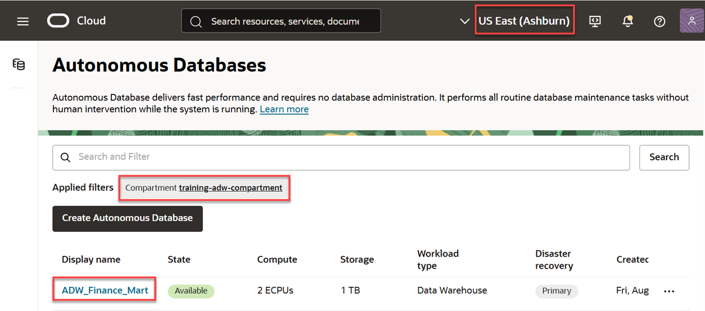
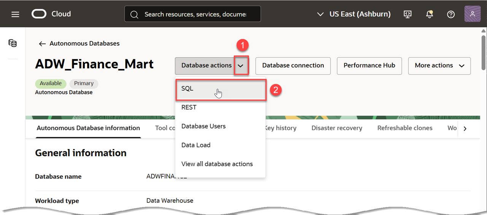
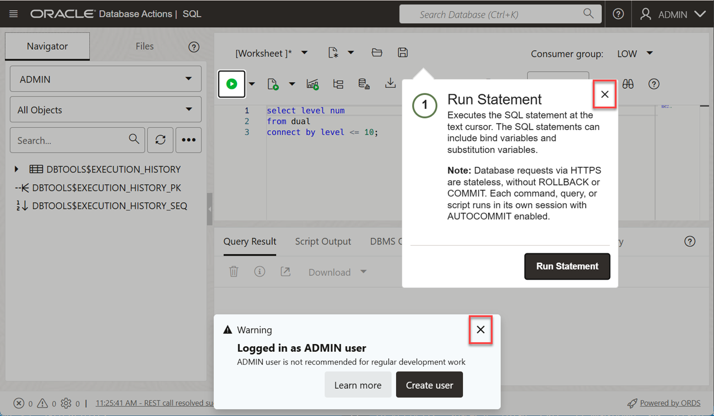

<!--
    {
        "name":"Connect with SQL Worksheet",
        "description":"Connect to Autonomous Database using the SQL Worksheet in Database Actions",
        "author": "Lauran K. Serhal",
        "lastUpdated": "August 2025"
    }
-->

Although you can connect to your Oracle Autonomous Database using desktop tools like Oracle SQL Developer, you can conveniently access the browser-based SQL Worksheet directly from your Autonomous Database console.
Although you can connect to your Oracle Autonomous Database using local PC desktop tools like Oracle SQL Developer, you can conveniently access the browser-based SQL Worksheet directly from your ADW or ATP console.

If you are still on the newly created database details page from the previous lab, you can skip to step 4 below; Otherwise, start with step 1.

1. Click the **Navigation** menu.

    

2. Click **Oracle Database**. Under **Oracle Database**, click **Autonomous Data Warehouse**.

    

3. On the **Autonomous Databases** page, click your **`ADW_Finance_Mart`** instance. Make sure you are in the right compartment and region where your autonomous database is provisioned. In this example, we used our own compartment, **`training-adw-compartment`**.

    

4. On the **Autonomous Database details** page, click the **Database actions** drop-down list, and then select **SQL**.

    

5. The first time you open the SQL Worksheet, a warning and an informational message boxes may appear. Close those boxes.

    

    The SQL Worksheet is displayed. You can click the **Tour** icon (binoculars) in the upper right corner to get a tour that introduces the main features.

    
