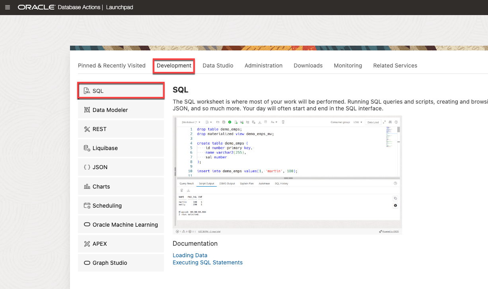

<!--
    {
        "name":"Connect with SQL Worksheet as non-admin user",
        "description":"Connect to Autonomous Database using the SQL Worksheet in Database Actions. Non-admin user."
    }
-->
Although you can connect to your Oracle Autonomous Database using desktop tools like Oracle SQL Developer, you can conveniently access the browser-based SQL Worksheet directly from your Autonomous Database console.

1. If you are not logged in to Oracle Cloud Console, log in and select **** from the navigation menu. Make sure you are in the right compartment where you ADB is provisioned and navigate into your **** instance.

    

    

2. In your **** details page, click the **Database Actions** button.

    

    Logging in from the OCI service console expects you are the ADMIN user. Log in as ADMIN if you are not automatically logged in.
    
    **Username:** ADMIN    
    **Password:** *your-password* (e.g. WlsAtpDb1234#)

3. The Database Actions page opens. In the **Development** box, click **SQL**.

    

4. The first time you open SQL Worksheet, a series of pop-up informational boxes may appear, providing you a tour that introduces the main features. If not, click the Tour button (labeled with binoculars symbol) in the upper right corner. Click **Next** to take a tour through the informational boxes.

    

5. We'll run the SQL analytics as the ****. Sign out of the worksheet:
    
    

    Then, login using the following credentials:
    
    **Username:**     
    **Password:** *your-password* (e.g. watchS0meMovies#)