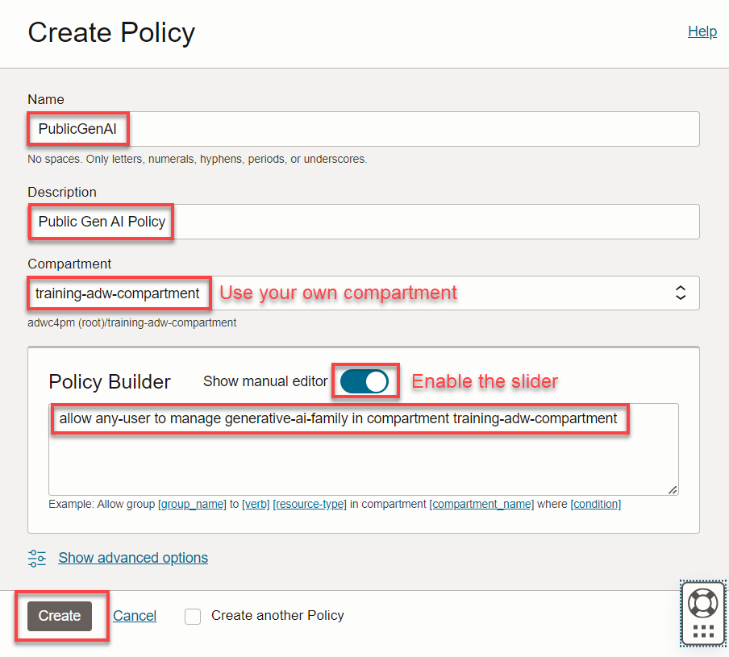

<!--
    {
        "name":"Create a policy enabling ADB access to OCI GenAI",
        "description":"Creates an IAM policy that enables ADB to use OCI GenAI using resource principals",
        "author": "Marty Gubar",
        "lastUpdated": "April 2025"
    }
-->
Your Autonomous Database is using a resource principal to access OCI services. Create a policy that will enable your Autonomous Database to use **OCI Generative AI**. The following policy will enable any Autonomous Database within the specified compartment to access the AI service. **Make sure your policy uses the compartment where your Autonomous Database is deployed.** 

1. From the **Console,** open the **Navigation** menu and click **Identity & Security.** Under **Identity,** click **Policies.**.

2. Click **Create policy** and specify the following into the appropriate fields:

    >**Note:** Slide the **Show manual editor** control to display the text field in order to paste the policy.

    * **Name:** `PublicGenAI`
    * **Description:** `Public Gen AI Policy`
    * **Compartment:** Select your own compartment
    * **Policy Builder:** **`allow any-user to manage generative-ai-family in compartment training-adw-compartment`**
    
        > **Note:** Substitute `training-adw-compartment` in the above policy with your own compartment's name.

3. Click **Create**.

    
    
>**Note:** This policy allows any Autonomous Database in the specified compartment to access OCI Generative AI. In a production environment, ensure your policy's scope is minimally inclusive.

