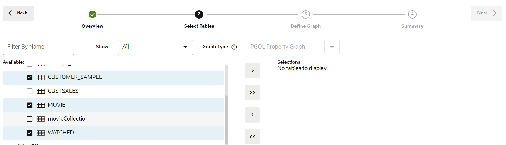
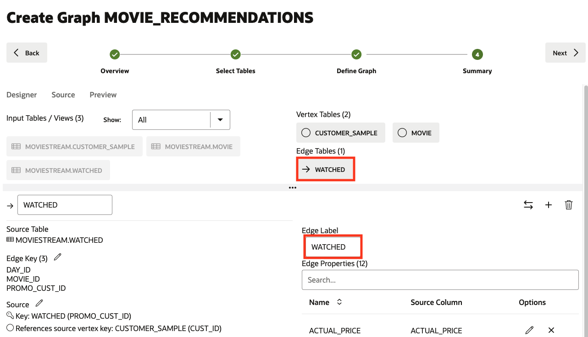
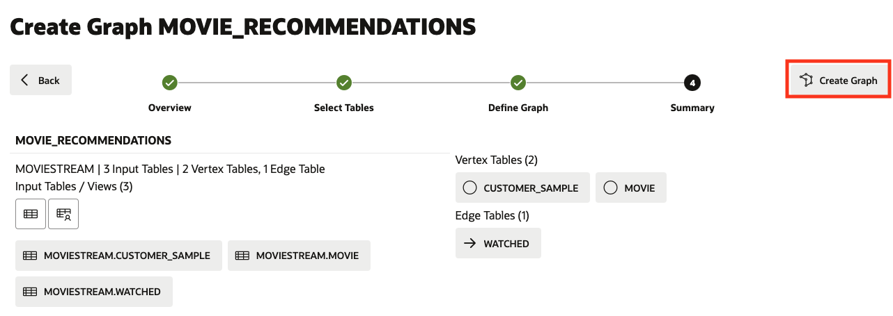

<!--
    {
        "name":"Create Graph",
        "description":"Create a bipartite Graph for MOVIESTREAM watched movies."
    }
-->


1. Click the **Graph** icon to navigate to create your graph. Then click **Create Graph**.  
    
      

2. Enter **`MOVIE_RECOMMENDATIONS`** as the graph name, then click **Next**. That graph name is used throughout the next lab.  
    Do not enter a different name because then the queries and code snippets in the next lab will fail. 

    

3. Expand **MOVIESTREAM** and select the `CUSTOMER_PROMOTIONS`, `CUSTSALES_PROMOTIONS` and `MOVIE` tables.

    Click to expand list of available items and then select the tables

    

4. Move them to the right, that is, click the first icon on the shuttle control.   

    

5.  Click **Next** to define the graph.  

    The suggested model has the `MOVIE` and `CUSTOMER_PROMOTIONS`, as a vertex table since there are foreign key constraints specified on `CUSTSALES_PROMOTIONS` that reference it.   

    And `CUSTSALES_PROMOTIONS` is a suggested edge table.

        


6.  Now let's change the default Edge label.   

    Click the `CUSTSALES_PROMOTIONS` edge table and rename the Edge Label from `CUSTSALES_PROMOTIONS` to **WATCHED**. Then click **Next**.  
    Then click outside the input box on confirm label and save the update.  

      

    This is **important** because we will use these edge labels in the next lab of this workshop when querying the graph.  
 

<!---
  **An alternate approach:** In the earlier Step 5 you could have just updated the CREATE PROPERTY GRAPH statement and saved the updates. That is, you could have just replaced the existing statement with the following one which specifies that the SOURCE KEY is  `from_acct_id`  and the DESTINATION KEY is `to_acct_id`.  

    ```
    -- This is not required if you used swap edge in UI to fix the edge direction.
    -- This is only to illustrate an alternate approach.
    <copy>
    CREATE PROPERTY GRAPH bank_graph
        VERTEX TABLES (
            BANK_ACCOUNTS as ACCOUNTS
            KEY (ACCT_ID)
            LABEL ACCOUNTS
            PROPERTIES (ACCT_ID, NAME)
        )
        EDGE TABLES (
            BANK_TXNS
            KEY (FROM_ACCT_ID, TO_ACCT_ID, AMOUNT)
            SOURCE KEY (FROM_ACCT_ID) REFERENCES ACCOUNTS
            DESTINATION KEY (TO_ACCT_ID) REFERENCES ACCOUNTS
            LABEL TRANSFERS
            PROPERTIES (AMOUNT, DESCRIPTION)
        )
    </copy>
    ```

     

   **Important:** Click the **Save** (floppy disk icon) to commit the changes.
--->

7. In the Summary step, click on **Create Graph**. This will open a Create Graph tab; click on **Create Graph**. 

      

    This will open a Create Graph tab, click on **Create Graph**. 

    

    After this, you will be taken to the Jobs page where the graph will be create it. Refresh the page to see how the status of the Graph is doing. 
