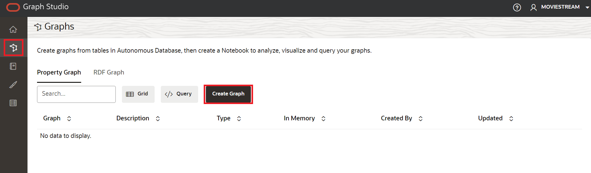
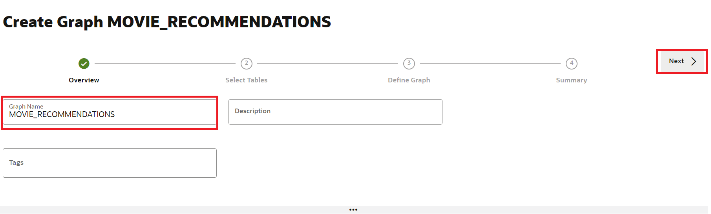
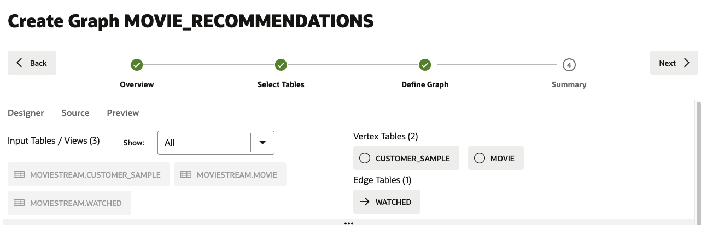
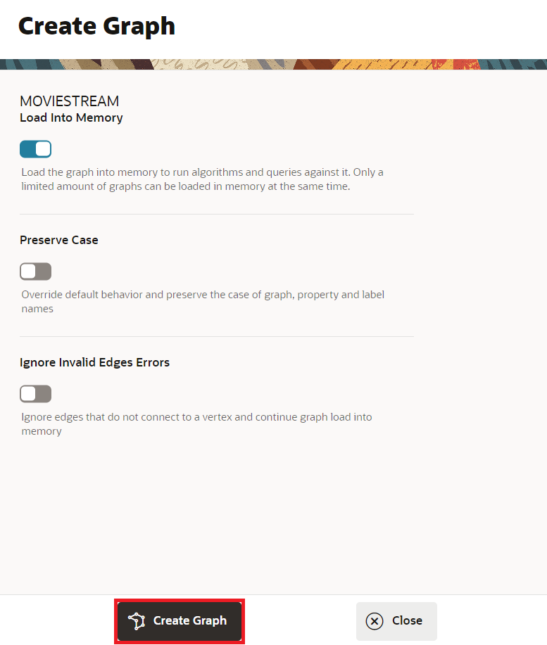

<!--
    {
        "name":"Create Graph",
        "description":"Create a bipartite Graph for MOVIESTREAM watched movies."
    }
-->


1. Click the **Graph** icon to navigate to create your graph. Then click **Create Graph**.  
    
      

2. Enter **`MOVIE_RECOMMENDATIONS`** as the graph name. That graph name is used throughout the next lab. Do not enter a different name because then the queries and code snippets in the next lab will fail. 

    

    Click **Next**.  

3. Expand **MOVIESTREAM** and select the `CUSTOMER_SAMPLE`, `WATCHED` and `MOVIE` tables.

    

    Shuttle them to the right using the first icon on the shuttle control.   

    

    Click **Next**.  

4.  The suggested model has the `MOVIE` and `CUSTOMER_SAMPLE`, as a vertex tables since there are foreign key constraints specified on table `WATCHED` that reference them.   


        


5.  You can view and change properties of the graph by clicking on one of the tables. For example, click `WATCHED` and notice the edge label. You will see this label when viewing and querying the graph. Keep the `WATCHED` label because it will be used in the next lab when querying the graph.  

      

    Click **Next**.        
 

<!---
  **An alternate approach:** In the earlier Step 5 you could have just updated the CREATE PROPERTY GRAPH statement and saved the updates. That is, you could have just replaced the existing statement with the following one which specifies that the SOURCE KEY is  `from_acct_id`  and the DESTINATION KEY is `to_acct_id`.  

    ```
    -- This is not required if you used swap edge in UI to fix the edge direction.
    -- This is only to illustrate an alternate approach.
    <copy>
    CREATE PROPERTY GRAPH bank_graph
        VERTEX TABLES (
            BANK_ACCOUNTS as ACCOUNTS
            KEY (ACCT_ID)
            LABEL ACCOUNTS
            PROPERTIES (ACCT_ID, NAME)
        )
        EDGE TABLES (
            BANK_TXNS
            KEY (FROM_ACCT_ID, TO_ACCT_ID, AMOUNT)
            SOURCE KEY (FROM_ACCT_ID) REFERENCES ACCOUNTS
            DESTINATION KEY (TO_ACCT_ID) REFERENCES ACCOUNTS
            LABEL TRANSFERS
            PROPERTIES (AMOUNT, DESCRIPTION)
        )
    </copy>
    ```

     

   **Important:** Click the **Save** (floppy disk icon) to commit the changes.
--->

6. In the Summary step, click on **Create Graph**:

      

    This will open a Create Graph tab. Click **Create Graph**. 

    

    Monitor the graph creation process. After a couple of minutes, you should see a successful **Completed** status and you'll be ready to start analyzing the graph!
