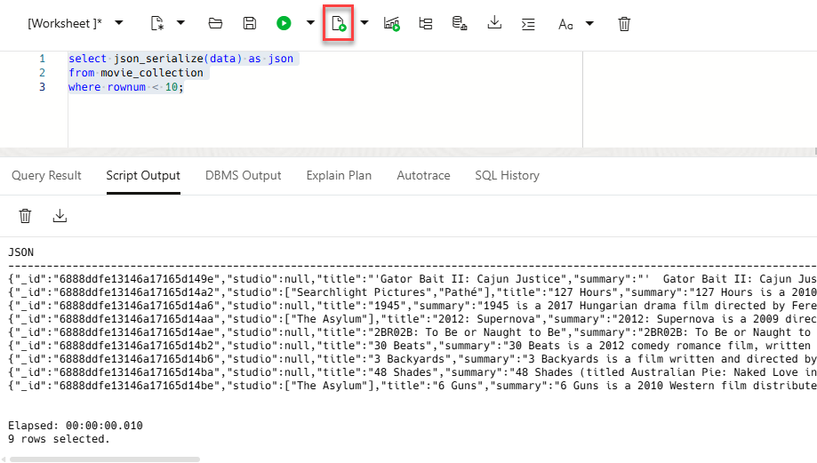

<!--
    {
        "name":"Create and load JSON Collection from object storage",
        "description":"(Redwood UI) Loads data using DBMS_CLOUD.COPY_COLLECTION. Introduces JSON_SERIALIZE, JSON_VALUE and JSON_QUERY .",
        "author":"Lauran K. Serhal, Consulting User Assistance Developer",
        "lastUpdated":"Lauran K. Serhal, July 2025"
    }
-->
### What is JSON?
JSON provides a language independent, flexible, and powerful data model. It was derived from JavaScript, but many modern programming languages include code to generate and parse JSON-format data. For more information see [https://en.wikipedia.org/wiki/JSON](https://en.wikipedia.org/wiki/JSON). No wonder that it is such a popular storage format for developers.

Oracle SQL allows you to analyze JSON data - including complex data types like arrays - in combination with structured tabular data.

### Movie JSON Data
Our movie data set has a series of columns that contain different types of details about movies. Each movie has a **crew** associated with it and that crew is comprised of **jobs**, such as **producer**, **director**,**writer**, along with the names of the individuals. Each movie also has a list of award nominations and wins. An example of how this information is organized is shown below:


JSON data is organized very differently than typical warehouse data. There is a single entry for **producer** but the corresponding key **names** actually has multiple values. This is referred to as an **array** - specifically a JSON array.

>**Note:**    
If you already have the SQL Worksheet open from the previous lab, skip to **step 5** below; otherwise, start with **step 1** below.

1. Log in to the **Oracle Cloud Console**, if you are not already logged as the Cloud Administrator.

2. Open the **Navigation** menu and click **Oracle Database**. Under **Oracle Database**, click **Autonomous Database**. On the **Autonomous Databases** page, click your ADB instance name.

3. On the **Autonomous Database details** page, click the **Database actions** drop-down list, and then click **SQL**.

4. The SQL Worksheet is displayed.

    

5. Use the Autonomous Database ``DBMS_CLOUD.COPY_COLLECTION`` procedure to create and load the movie collection from object storage. Copy and paste the following script into your SQL Worksheet, and then click the **Run Script (F5)** icon in the Worksheet toolbar.
    ```
    <copy>
    -- create and load movie json collection from a public bucket on object storage

    begin
    dbms_cloud.copy_collection (
        collection_name => 'MOVIE_COLLECTION',
        file_uri_list   => 'https://objectstorage.us-ashburn-1.oraclecloud.com/n/c4u04/b/moviestream_landing/o/movie/*.json',
        format          => '{ignoreblanklines:true}'
    );
    end;
    /
    </copy>
    ```

    

    This single step creates a table called **`MOVIE_COLLECTION`** and populates it with JSON documents. You can access this table thru SQL, Oracle Database API for MongoDB, SODA REST, and more.

    > **Note:** There is extra metadata captured for SODA collections that is not removed by dropping the table directly using SQL ``drop table``. To properly drop a collection, use PL/SQL function [`DMBS_SODA.DROP_COLLECTION`](https://docs.oracle.com/en/database/oracle/oracle-database/18/adsdp/using-soda-pl-sql.html#GUID-D29C4FFF-D093-4C1B-889A-5C29B63756C6).

6. Let's take a look at the documents. The documents are stored in a highly optimized binary format. Use the `JSON_SERIALIZE` function to view the JSON text. Copy and paste the following SQL code into the worksheet, and then click the **Run Script (F5)** icon in the Worksheet toolbar.    

    _**Note:** If you are using Autonomous Database `19c` when importing a JSON collection, the default column name for JSON is **`JSON_DOCUMENT`**. The default column name has changed to **`DATA`** in Autonomous Database `23ai`._

    ```
    <copy>
    select json_serialize(data) as json
    from movie_collection
    where rownum < 10;
    </copy>
    ```

    Your result will look similar to the following:

    
