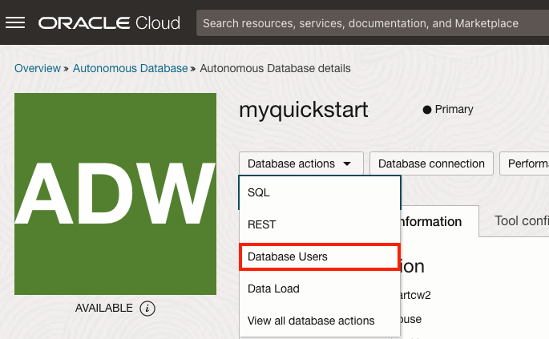
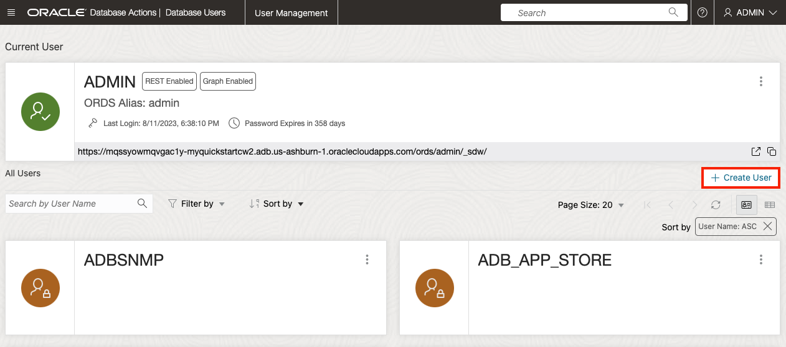
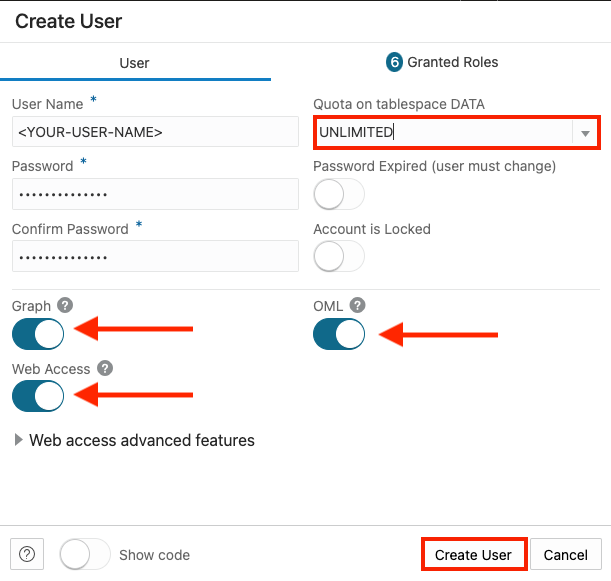

<!--
    {
        "name":"Create ADB User using Database Actions",
        "description":"Creates an ADB user using the new user database action"
    }
-->

When you create a new Autonomous Database, you automatically get an account called ADMIN that is your super administrator user. In the real world, you will definitely want to keep your data warehouse data separate from the administration processes. Therefore, you will need to know how to create separate new users and grant them access to your data warehouse. This section will guide you through this process using the "New User" wizard within the Database Actions set of tools.

1. Navigate to the Details page of the Autonomous Database you previously provisioned. In this example, the database name is "." Click the **Database Actions -> Database Users** button.

    

You will automatically log in as the ADMIN user, or you may be prompted to provide the username (admin) and password of the administrator you specified when you created the Autonomous Database instance.

2.  You can see that your ADMIN user appears as the current user. And, several other system users already exist. On the right-hand side, click the **+ Create User** button.

    

4. The **Create User** form will appear on the right-hand side of your browser window. Use the settings below to complete the form:

 - username: 
 - password: create a suitably strong password, and make note of it, as you will need to provide it in an upcoming step.

    >**Note:** Rules for User Passwords: Autonomous Database requires strong passwords. User passwords user must meet the following default password complexity rules:

    - Password must be between 12 and 30 characters long

    - Must include at least one uppercase letter, one lowercase letter, and one numeric character

    - Limit passwords to a maximum of 30 characters

    - Cannot contain the username

    - Cannot be one of the last four passwords used for the same username

    - Cannot contain the double quote (") or exclamation (!) characters

    There is more information available in the documentation about password rules and how to create your own password rules; see here: [Create Users on Autonomous Database](https://docs.oracle.com/en/cloud/paas/autonomous-database/adbsa/manage-users-create.html#GUID-B5846072-995B-4B81-BDCB-AF530BC42847)

- Toggle the **Graph** button to **On**.
- Toggle the **Web Access** button to **On**.
- Toggle the **OML** button to **On**.
- In the upper right section of the Create User dialog, select **UNLIMITED** from the drop down menu for Quota on tablespace DATA.

- Leave the **Password Expired** toggle button as off (Note: this controls whether the user is prompted to change their password when they next log in).
- Leave the **Account is Locked** toggle button as off. 

- Click **Create User** at the bottom of the form.

    
