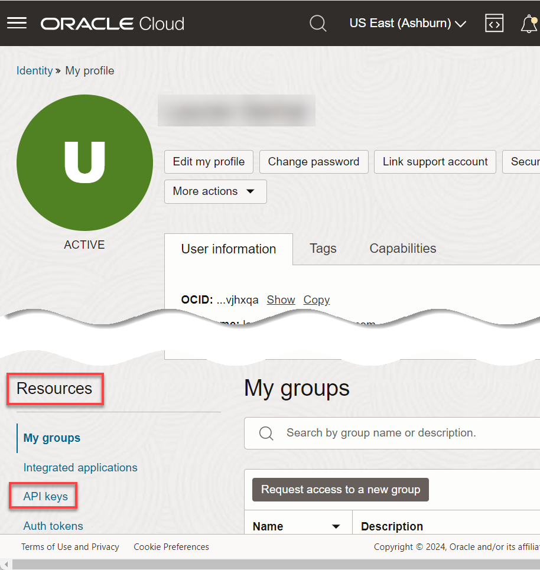
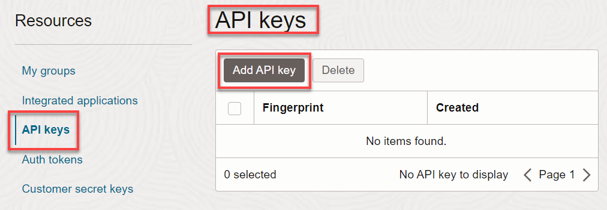
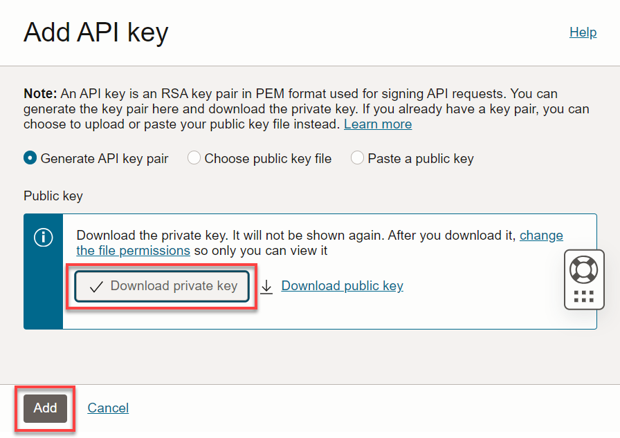
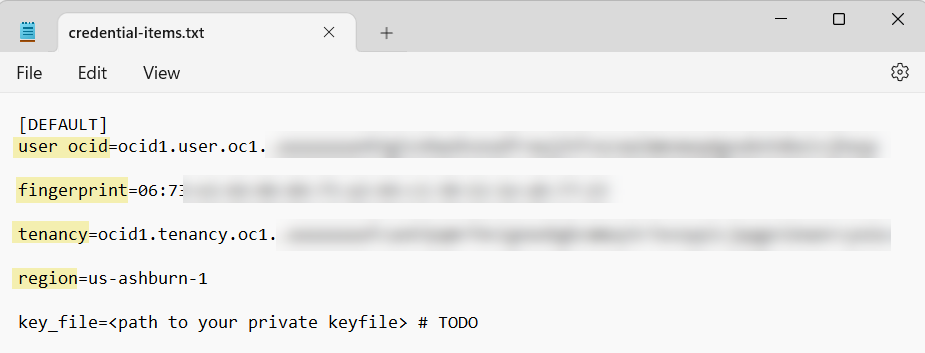

<!--
    {
        "name":"Generate an RSA key pair",
        "description":"Generate an RSA key pair and get the key's values and fingerprint",
        "author": "Lauran K. Serhal",
        "lastUpdated": "November 2024"
    }
-->

_**IMPORTANT:** If you already have an RSA key pair in PEM format (minimum 2048 bits) and a fingerprint of the public key, you can skip this optional task and proceed to the next task in the workshop; however, going through this entire task might be easier for you. The **Console** displays the **Configuration file preview** dialog box that shows the **user ocid**, **fingerprint**, **tenancy ocid**, and **region**._ For additional information see the [How to Generate an API Signing Key](https://docs.oracle.com/en-us/iaas/Content/API/Concepts/apisigningkey.htm#two), [How to Get the Key's Fingerprint](https://docs.oracle.com/en-us/iaas/Content/API/Concepts/apisigningkey.htm#four), and [Where to Get the Tenancy's OCID and User's OCID](https://docs.oracle.com/en-us/iaas/Content/API/Concepts/apisigningkey.htm#five) documentation resources.

In this optional task, you learn how to use the **Console** to generate the private/public key pair.

1. In the **Console** banner, click the **Profile** icon. From the drop-down menu, click your **My profile**.

    

2. The **My profile** page is displayed. In the **User Information** tab, you can click the **Copy** link next to the **OCID** field. Make a note of this username's OCID as you will need it in a later task. Scroll down the page to the **Resources** section, and then click **API Keys**.

    

3. In the **API Keys** section, click **Add API Key**. The **Add API Key** dialog box is displayed.

    

4. Click **Download private key**. The private key is downloaded to your Web browser's default directory such as the **Downloads** folder in MS-Windows. A checkmark is displayed next to the **Download private key**.

    

    The name of the downloaded private key is usually as follows:

    **`oraclecloudidentityservice_username-date.pem`**

    Rename your downloaded private key to something shorter such as:

    **`oci-api-private-key.pem`**

5. You can download the public key if you need it or for potential future use. click **Download Public Key**. The public key is downloaded to your Web browser's default directory such as the **Downloads** folder in MS-Windows. A checkmark is displayed next to the **Download Public Key**.

6. A checkmark should appear next to each button. Click **Add**. The key is added and the **Configuration File Preview** dialog box is displayed. The file snippet includes required parameters and values you'll need to create your configuration file.

    

    This dialog box contains all of the information that you will need in the next task to create a new Cloud location and credential. Click the **Copy** link to copy the **User's OCID**, **API Key Fingerprint**, and **Tenancy OCID** to your clipboard and then paste it into a text editor of your choice such as Notepad in MS-Windows. You will need those values in the next task.

    

    You can access the downloaded private key and then paste the key value in the above text editor file as you will need the value in the next task.

    

7. In the **Configuration File Preview** dialog box, click **Close**.