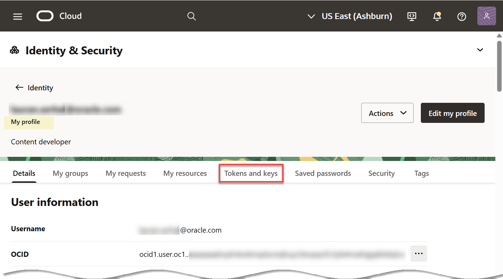
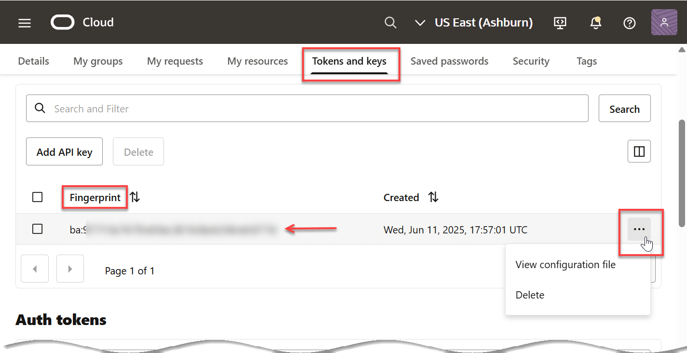

<!--
    {
        "name":"Generate an RSA key pair",
        "description":"Generate an RSA key pair and get the key's values and fingerprint",
        "author": "Lauran K. Serhal",
        "lastUpdated": "July 2025"
    }
-->

<if type="freetier">
_**IMPORTANT:** If you already have an RSA key pair in PEM format (minimum 2048 bits) and a fingerprint of the public key, you can skip this optional task and proceed to the next task in the workshop; however, going through this entire task might be easier for you. The **Console** displays the **Configuration file preview** dialog box that shows the **user ocid**, **fingerprint**, **tenancy ocid**, and **region**._ For additional information see the [How to Generate an API Signing Key](https://docs.oracle.com/en-us/iaas/Content/API/Concepts/apisigningkey.htm#two), [How to Get the Key's Fingerprint](https://docs.oracle.com/en-us/iaas/Content/API/Concepts/apisigningkey.htm#four), and [Where to Get the Tenancy's OCID and User's OCID](https://docs.oracle.com/en-us/iaas/Content/API/Concepts/apisigningkey.htm#five) documentation resources.
</if>
In this optional task, you learn how to use the **Console** to generate the private/public key pair.

1. In the **Console** banner, click the **Profile** icon. From the drop-down menu, click your **User settings**.

    

2. The **My profile** page is displayed. 

    

3. Click the **Tokens and keys** tab. In the **API keys** section of the page, click **Add API key**.

    

    The **Add API key** panel is displayed. 

    

4. Accept the default **Generate API key pair** option, and then click the **Download private key** tile. The private key is downloaded to your Web browser's default directory such as the **Downloads** folder in MS-Windows.

    

    >**Note:** You can also download the public key if you need it or for potential future use. click **Download Public Key**. Again, the public key is downloaded to your Web browser's default directory such as the **Downloads** folder in MS-Windows.

    The name of the downloaded private key is similar to the following:

    **`user-email-address-2025-06-11T17_43_34.851Z.pem`**

    You can rename your downloaded private key to something shorter such as:

    **`oci-api-private-key.pem`**

    Double-click the downloaded private key file to view its content. 

    

5. Click **Add**. The key is added and the **Configuration file preview** panel is displayed. The file snippet includes required parameters and values you'll need to create your configuration file. For additional information, see [How to Generate an API Signing Key](https://docs.oracle.com/en-us/iaas/Content/API/Concepts/apisigningkey.htm#two).

    

    This dialog box contains all of the information that you will need in the next task to create a new Cloud location and credential. Click the **Copy** link to copy the **User's OCID**, **API Key Fingerprint**, **Tenancy OCID**, and **Region** to your clipboard and then paste it into a text editor of your choice such as Notepad in MS-Windows. You will need those values in later tasks.

    

    You can also copy the value of the downloaded private key and then paste it in the above text editor file for easier and faster access.

6. In the **Configuration File Preview** dialog box, click **Close**. The newly created fingerprint is displayed on the **Tokens and keys** page. you can click the **Actions** icon (ellipsis) to view the configuration file or to delete the fingerprint.

    