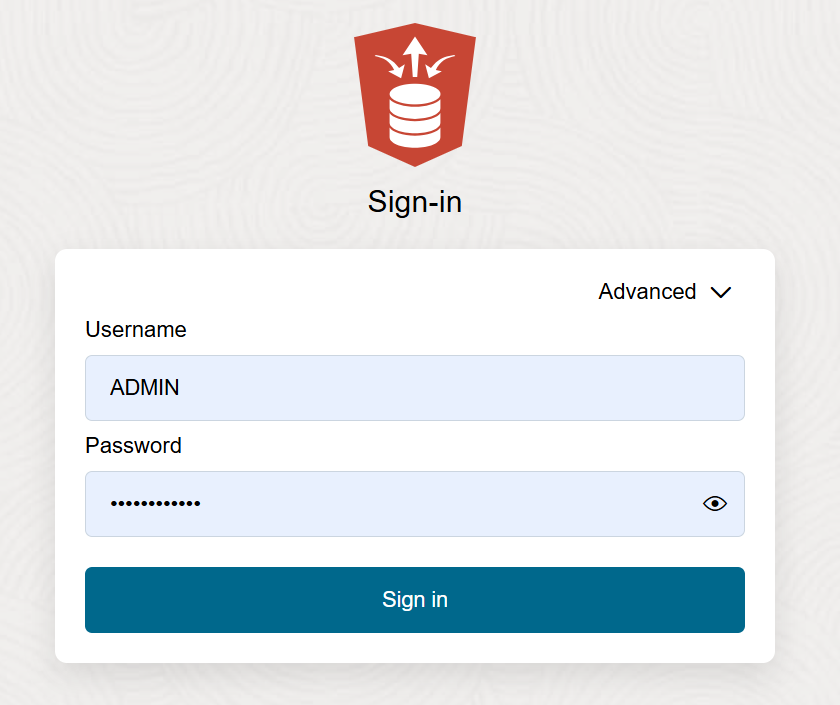

<!--
    {
        "name":"Go to Data Load Utility Database Action",
        "description":"Navigate to data loader. AUTHORS: For expediency, this task uses the ADMIN user/password to open Database Actions. In your workshop, you might want to substitute a different user/password to open Database Actions."
    }
-->

Navigate to the Data Load utility of Database Actions.

1. Go to the Details page of the Autonomous Database you provisioned. Click **Database Actions** and select **View all database actions** to go to the suite of Autonomous Database tools.

    

2. Logging into Database Actions from the OCI service console expects you to be the ADMIN user. Log in as ADMIN if you are not automatically logged into Database Actions. Enter the administrator **Password** you specified when creating the database. Click **Sign in**.

    

3. On the Database Actions Launchpad page, under **Data Studio**, click **DATA LOAD**.

    
