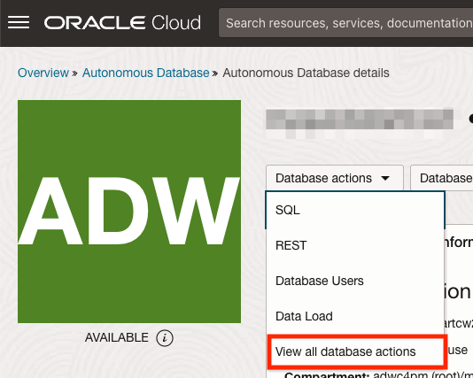
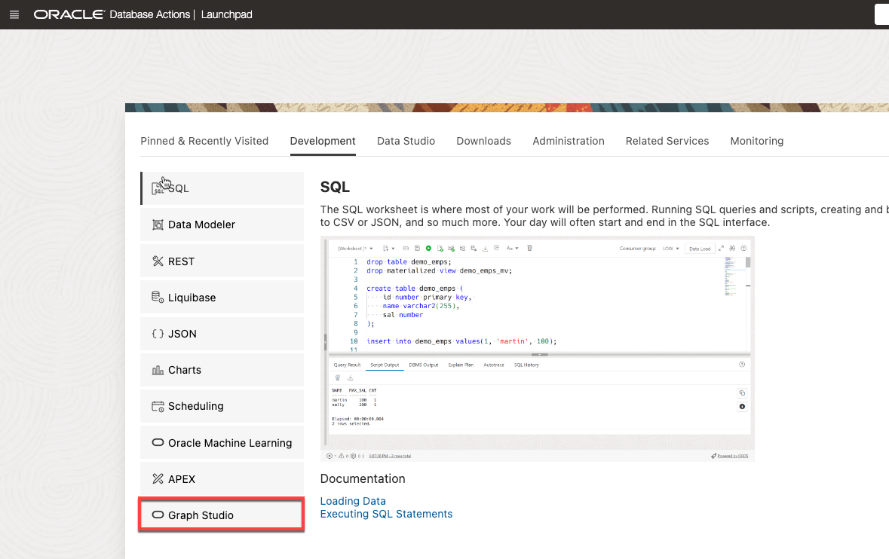

<!--
    {
        "name":"Go to Graph Studio",
        "description":"Login to Graph Studio from the Autonomous Database OCI console"
    }
-->

Graph Studio is a feature of Autonomous Database. It is available as an option on the Database Actions Launchpad. You need a graph-enabled user to log into Graph Studio. In this workshop, the graph user has already been created for you.

1. In your **Autonomous Database Details page** page, click the **Database Actions** button, and then select **View all database actions**.

     

    >**Note:** Use the Admin credentials to sign in if needed. (The Admin user password is located under **View Login Info** )   

2. On the Database Actions panel, click **Graph Studio**.

    

3. Log in to Graph Studio. Use the credentials for the graph user:

    The graph user credentials are: 

    **Username:**     
    **Password:** *your-password* (e.g. watchS0meMovies#)

    