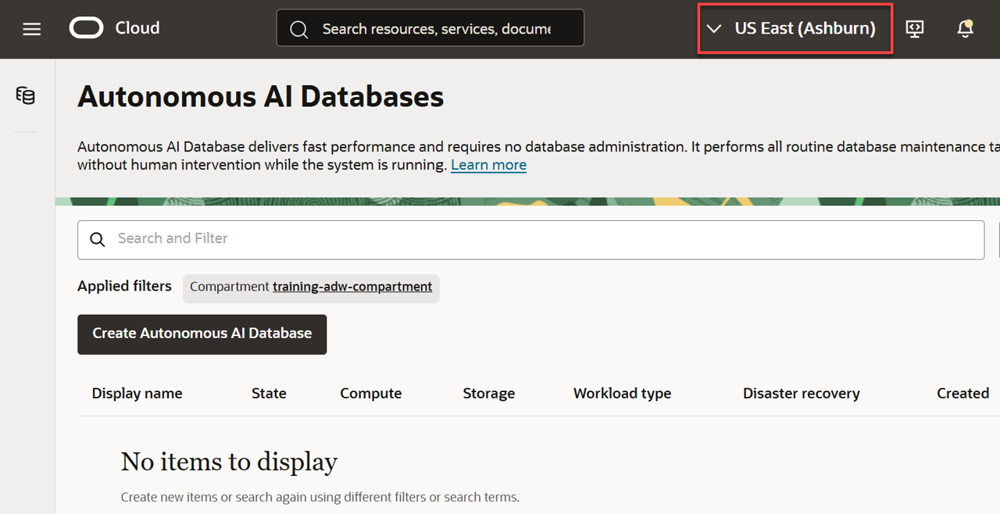

<!--
    {
        "name":"Go to Autonomous Database Service",
        "description":"Navigate to ADB using the OCI menu. AUTHORS: For expediency, this task uses the ADMIN user/password to open Database Actions. In your workshop, you might want to substitute a different user/password to open Database Actions."
    }
-->
1. Open the **Navigation** menu.

    

2. Under **Oracle Database**, click **Autonomous Data Warehouse**.

    

3. You can use the **List scope** and **Filters** sections on the left to control the list of Autonomous Databases that are displayed. This is useful when you are managing many Autonomous Databases.

    

    - **Compartment**: OCI resources are organized into compartments. Select the compartment where you want to create your Autonomous Database. <if type="livelabs">To quickly locate the compartment that has been assigned to you for this workshop, enter the first part of your user name such as `LL81481` (if that is your assigned username) in the **Compartment** field.</if>
    - **Workload Type**: Filter the Autonomous Database list by selecting your workload type. Select **All** to view all databases
    - **State**: View databases that are available, stopped, terminated and more.

<if type="freetier">

    > **Note:** Avoid the use of the `ManagedCompartmentforPaaS` compartment as this is an Oracle default used for Oracle Platform Services.

</if>

<if type="freetier">
3. If you are using a Free Trial or Always Free account, and you want to use Always Free Resources, you need to be in a region where Always Free Resources are available. You can see your current default **region** in the top, right hand corner of the page.

    
</if>
