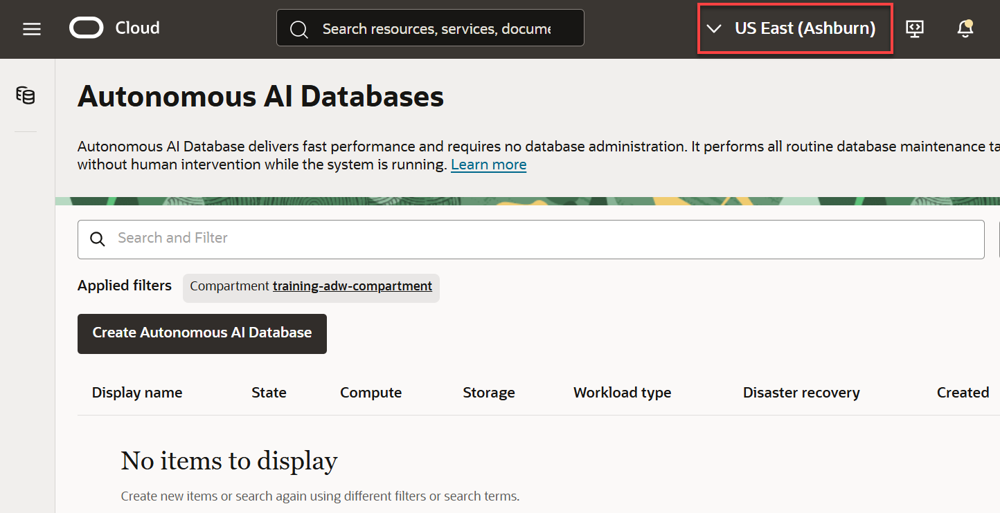

<!--
    {
        "name":"goto-service-body.md",
        "description":"Navigate to ADB using the OCI Navigation menu. AUTHORS: For expediency, this task uses the ADMIN user/password to open Database Actions. In your workshop, you might want to substitute a different user/password to open Database Actions.",
        "author":"Lauran K. Serhal, Consulting User Assistance Developer",
        "lastUpdated":"Lauran K. Serhal, June 2025"
    }
-->
1. Open the **Navigation** menu.

    

2. Under **Oracle Database**, click **Autonomous Database**.

    

    The **Autonomous Databases** page is displayed.

    

    OCI resources are organized into compartments. Click the **Compartment** field to select the compartment where you want to create your Autonomous Database. <if type="livelabs">To quickly locate the compartment that has been assigned to you for this workshop, enter the first part of your user name such as `LL81481` (if that is your assigned username) in the **Compartment** field.</if>

    <if type="freetier">
    > **Note:** Avoid the use of the `ManagedCompartmentforPaaS` compartment as this is an Oracle default used for Oracle Platform Services.
    </if>

3. You can use the **Search and Filter** field to control the list of Autonomous Databases that are displayed on the page. This is useful when you are managing many Autonomous Databases. For example, you can use **Workload type** to filter the Autonomous Database list by selecting your workload type. You can also use the **State** filter to view databases that are `available`, `stopped`, `terminated` and much more.

    

<if type="freetier">
3. If you are using a Free Trial or Always Free account, and you want to use Always Free Resources, you need to be in a region where Always Free Resources are available. You can see your current default **region** in the top, right hand corner of the page.

    
</if>
