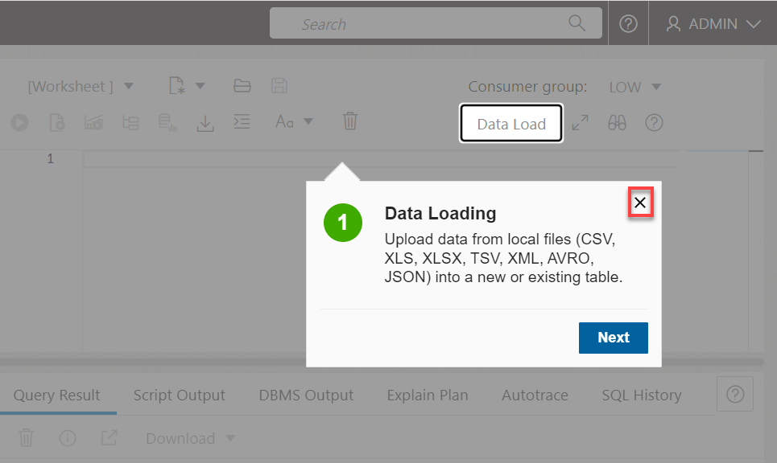

<!--
    {
        "name":"Go to SQL Worksheet in Database Actions",
        "description":"Navigate to SQL Worksheet from the OCI service console. "
    }
-->

Although you can connect to your Oracle Autonomous Database using desktop tools such as Oracle SQL Developer, you can conveniently access the browser-based SQL Worksheet directly from your Autonomous Database Console.

1. Log in to the **Oracle Cloud Console**, if you are not already logged as the Cloud Administrator, **`ADMIN`**.

2. Open the **Navigation** menu and click **Oracle Database**. Under **Oracle Database**, click **Autonomous Database**.

3. On the **Autonomous Databases** page, select your own compartment and region, and then click your ADB instance name, **`MyQuickStart`** in our example.

    

4. On the **Autonomous Database details** page, click the **Database actions** drop-down list, and then click **SQL**.

    

    The SQL Worksheet is displayed. A **Logged in as ADMIN user** warning box is displayed, close this box. The first time you access the SQL Worksheet, a series of pop-up informational boxes may appear, providing you a tour that introduces the main features. If not, click the Tour button (labeled with binoculars symbol) in the upper right corner. Click **Next** to take a tour through the informational boxes.

    

    In this example, close the **Data Loading** box.

    