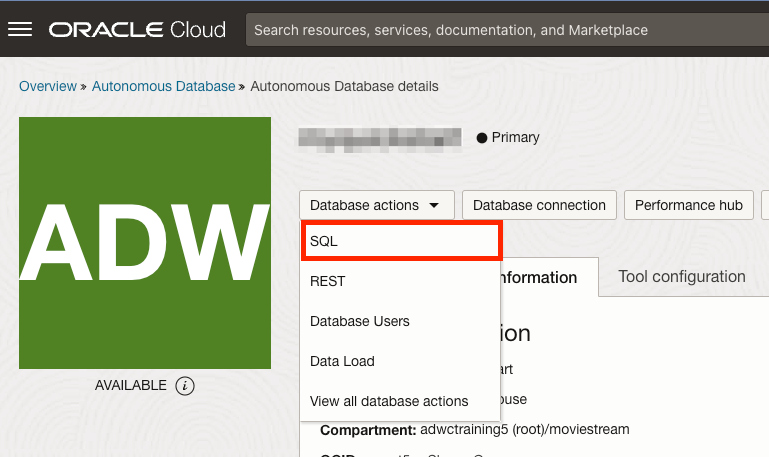

<!--
    {
        "name":"Go to SQL Worksheet in Database Actions",
        "description":"Navigate to SQL Worksheet from the OCI service console. "
    }
-->
1. Navigate to the SQL worksheet. From the Autonomous Database service console, select **Database Actions -> SQL**:
    

2. You will be presented with the SQL worksheet tour the first time the current database user accesses the worksheet. Dismiss the tour by clicking the X button:

    