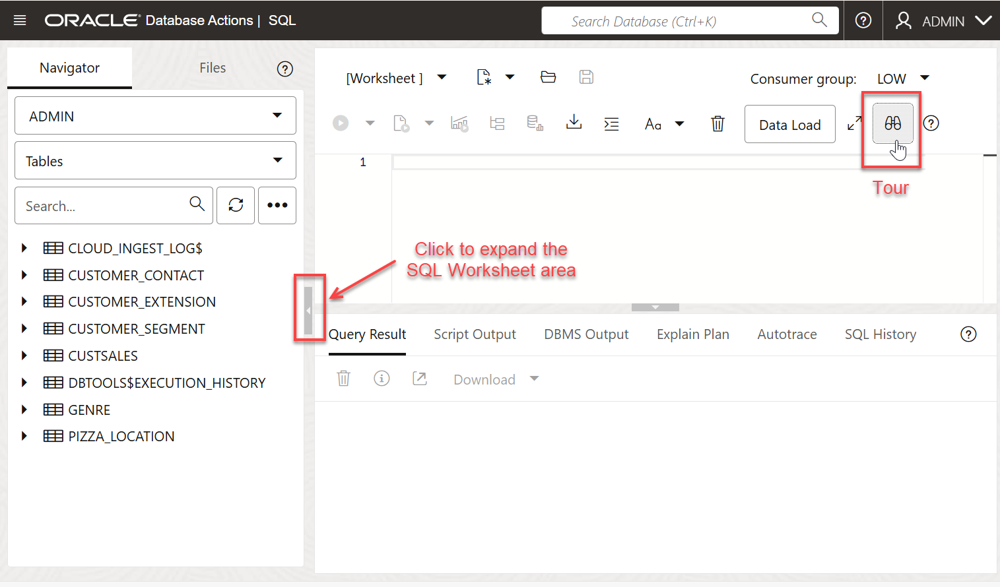

<!--
    {
        "name":"Go to SQL Worksheet in Database Actions",
        "description":"(Redwood UI+re-branding) Navigate to SQL Worksheet from the OCI service console.",
        "author":"Lauran K. Serhal, Consulting User Assistance Developer",
        "lastUpdated":"Lauran K. Serhal, October 2025"
    }
-->

Although you can connect to your Oracle Autonomous AI Database using desktop tools such as Oracle SQL Developer, you can conveniently access the browser-based SQL Worksheet directly from your Autonomous AI Database Console.

1. Log in to the **Oracle Cloud Console**, if you are not already logged as the Cloud Administrator, **`ADMIN`**.

2. Open the **Navigation** menu and click **Oracle AI Database**. Under **Oracle AI Database**, click **Autonomous AI Database**.

3. On the **Autonomous AI Databases** page, select your own compartment and region, and then click your ADB instance name, **`MyQuickStart`** in our example.

    

4. On the **Autonomous AI Database details** page, click the **Database actions** drop-down list, and then click **SQL**.

    

    The SQL Worksheet is displayed. The first time you access the SQL Worksheet, a **Logged in as ADMIN user** warning box and a **Run Statement** information box are displayed, close the boxes. 

    

    The SQL Worksheet is displayed. You can click the **Tour** icon (binoculars) in the upper right corner to get a tour that introduces the main features.

    

    >**Note:** The first time you try to paste text in your SQL Worksheet from your clipboard, an informational box is displayed. Click **Allow**.

    

