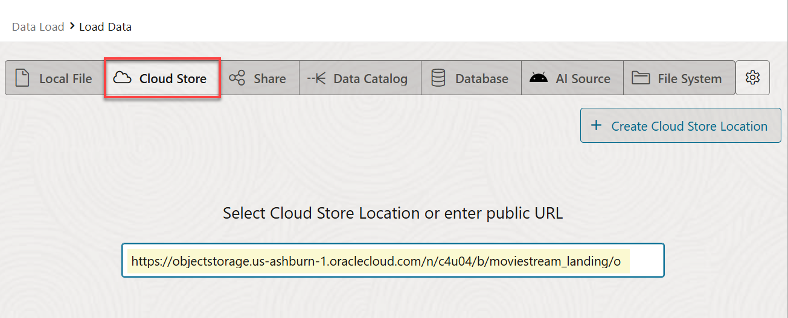
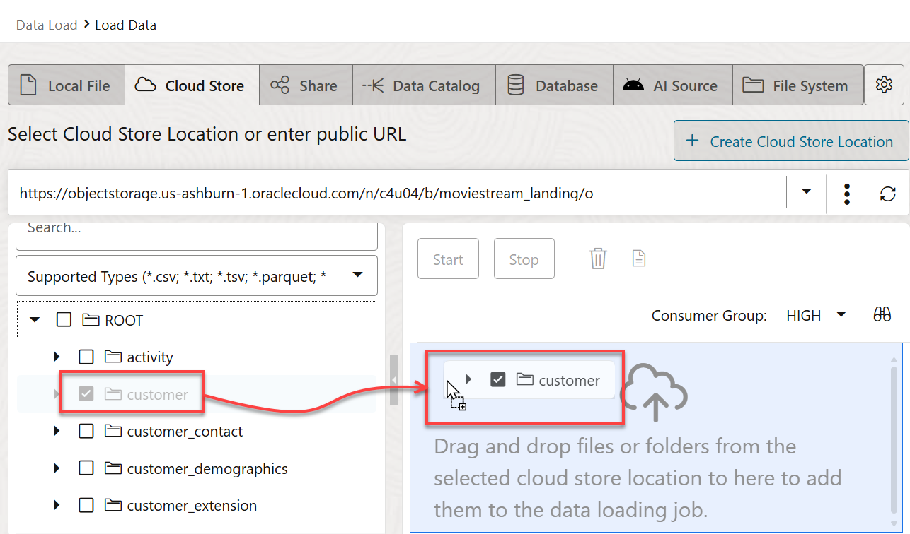
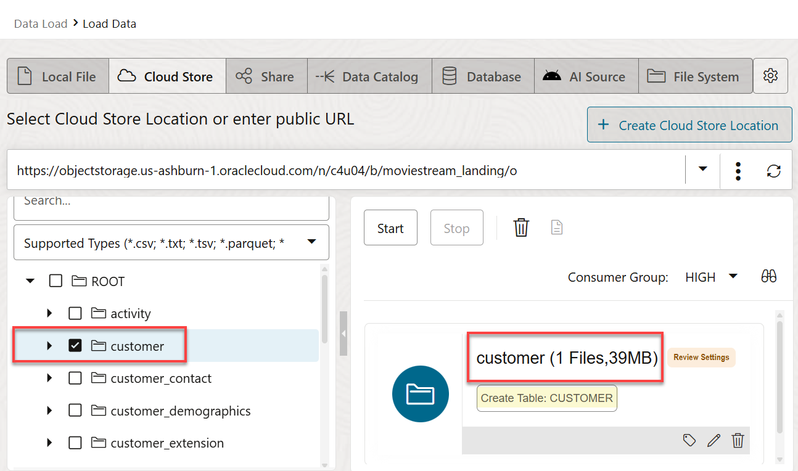
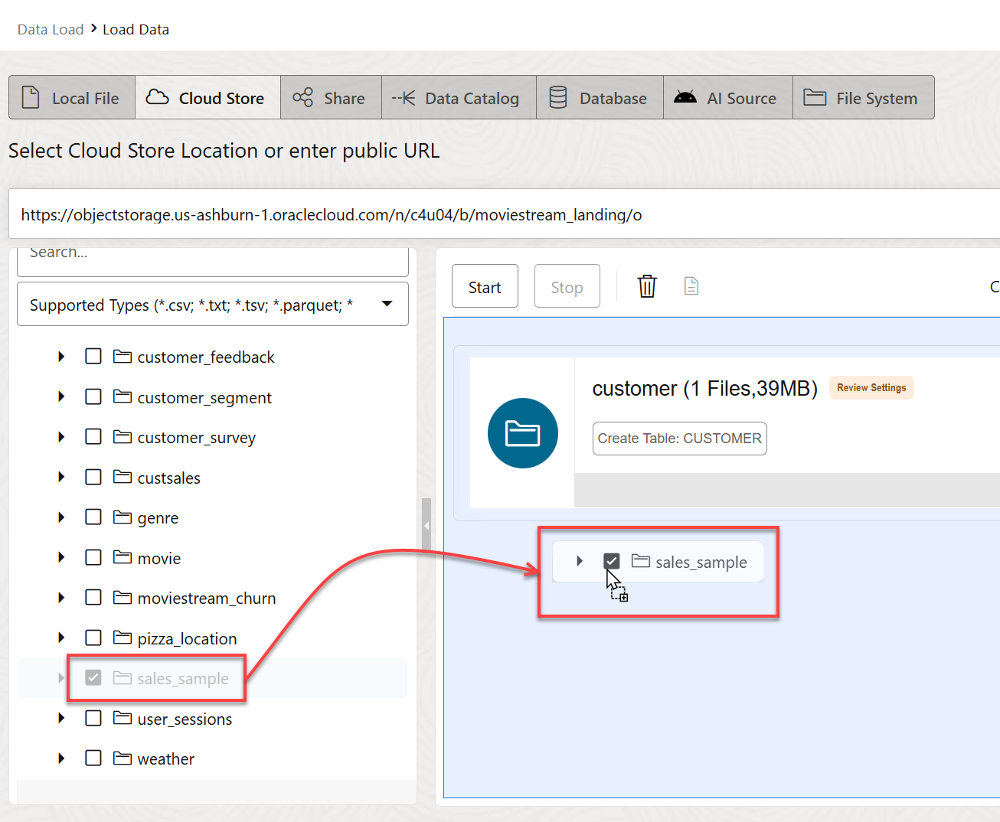
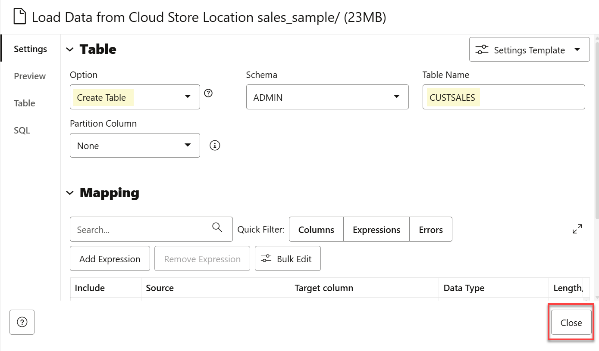
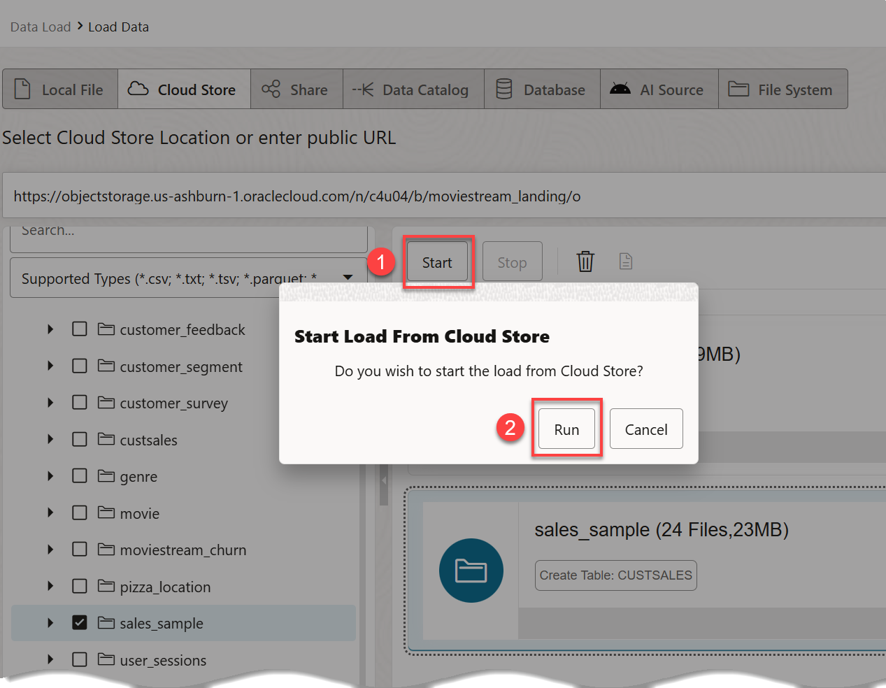
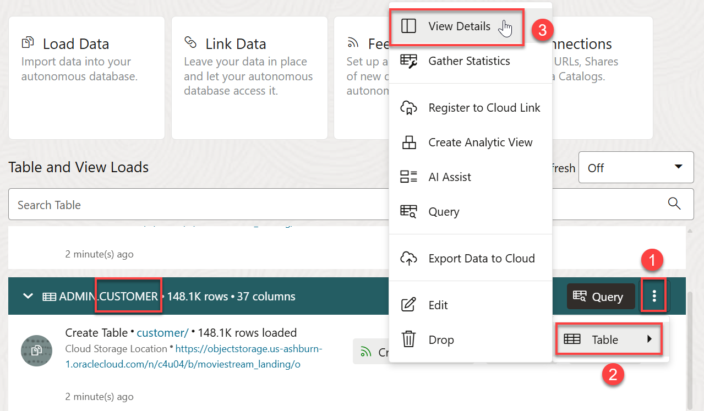
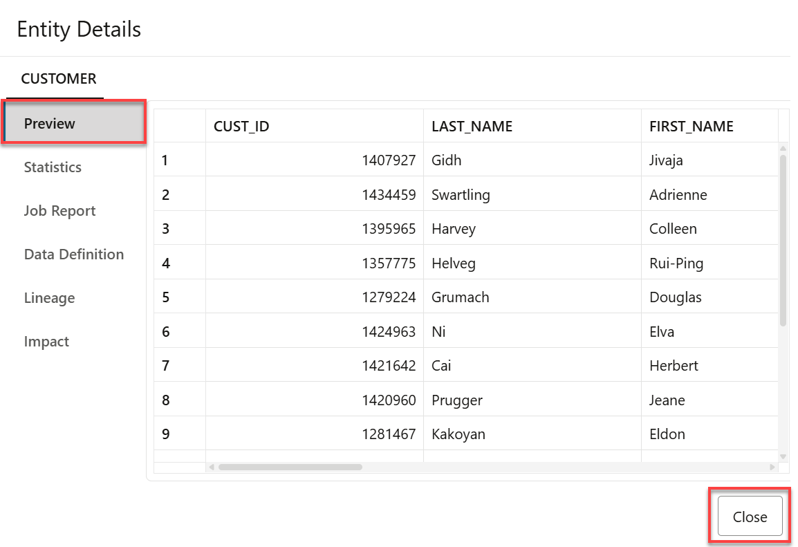

<!--
    {
        "name":"Load data from public buckets using Database Actions",
        "description":"Uses Database Actions to load data from public object storage buckets. It loads the customer and sales_sample tables",
        "author":"Lauran K. Serhal, Consulting User Assistance Developer",
        "lastUpdated":"Lauran K. Serhal, July 2025"
    }
-->
1. On the **Data Load** page, click the **LOAD DATA** card.

    

2. On the **Load Data** page, click the **Cloud Store** tab.

    

3. Copy the following object storage URL and paste it in the **Select Cloud Store Location or enter public URL** field. The **`moviestream_landing`** Oracle Object Storage bucket that contains the data is located in a different tenancy than yours, **`c4u04`**; therefore, you will use the following URL.

    ```
    <copy>
    https://objectstorage.us-ashburn-1.oraclecloud.com/n/c4u04/b/moviestream_landing/o
    </copy>
    ```

    

4. A list of the folders in the selected Object Storage bucket is displayed on left side section of the page. You can **drag and drop** the desired folders from this public bucket from this section to the data loading job section on the right.

    

5. Drag the **`customer`** folder and drop it onto the data loading job section.

    

6. A **Load to Single Target Table** dialog box is displayed to prompt you whether or not you want to load all objects in this folder matching **`.csv`** to a single target table. This folder contains a single file, `customer.csv`. In general, data lake folders contain many files of the same type, as you will see with sales data. Click **Yes**.

    

    The **`customer`** target table to be created for the selected `.csv` file is displayed in the data loading job section.

    

7. Drag and drop the **`sales_sample`** folder onto the data loading job section. Click **Yes** when prompted to load all objects in this folder matching **.csv** to a single target table.

    

8. Click the **Settings** icon (pencil) for the **`customer`** load task to view its settings.

    

    The **Load Data from Cloud Store Location customer** settings panel is displayed.

9. The **Database Actions** load job will create a **`CUSTOMER`** table with the listed columns and data types that are based on the selected *.csv file. Review the information and the loading options. In the **Mapping** section, notice that you can change the target column names, data types, and length/precision. Click **Close** to close the settings viewer panel.

    

10. Click the **Settings** icon (pencil) for the **`sales_sample`** load task to view its settings.

    

11. The Load tool makes intelligent choices for the target table name and properties. Since this is an initial load, accept the default option of **Create Table**, which conveniently creates the target table in the Autonomous Database instance, without the need to predefine the table in SQL. Change the name of the target table to be created from **`SALES_SAMPLE`** to **`CUSTSALES`**. Next, click **Close**.

    

12. Click **Start** to run the data load job. In the **Start Load From Cloud Store** dialog box, click **Run**.

    

    > **Note:** The load job can take about 2 minutes to complete.

13. After the load job is completed, make sure that all of the data load cards have the copy icons next to them. You can click the **Report** button for each load job to view a report of total rows processed successfully and failed for the selected table.

    

14. Click the **Report** button for the **`CUSTOMER`** load job. The details about the successful load job is displayed. Click **Close**.

    

15. Let's do a quick review of the loaded **`customer`** data. Click the **ellipsis** icon for the **`customer`** load task to view its settings. Next, click **Table** > **View Details** from the context menu.

    

16. The **Preview** tab is selected by default. This shows the **`customer`** data.

    

17. The data looks good! Click **Close** to exit the **`customer`** task preview and return to the Data Load dashboard.

     
