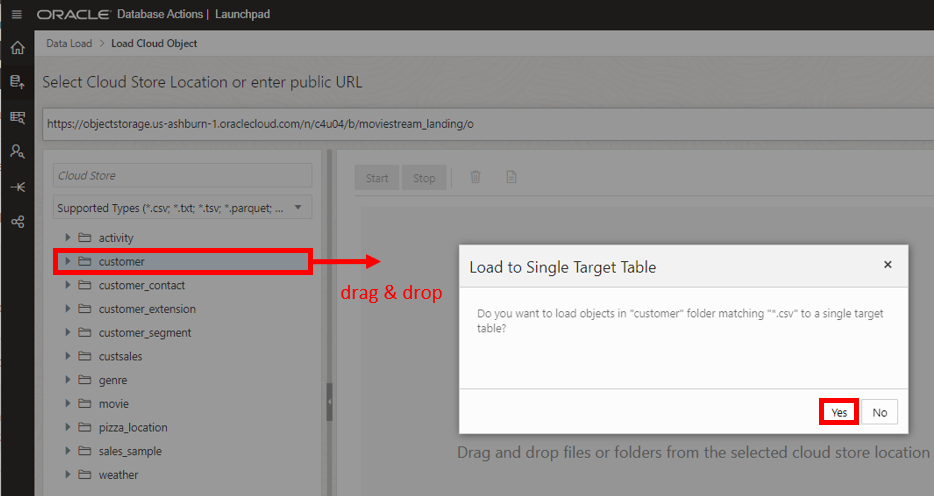
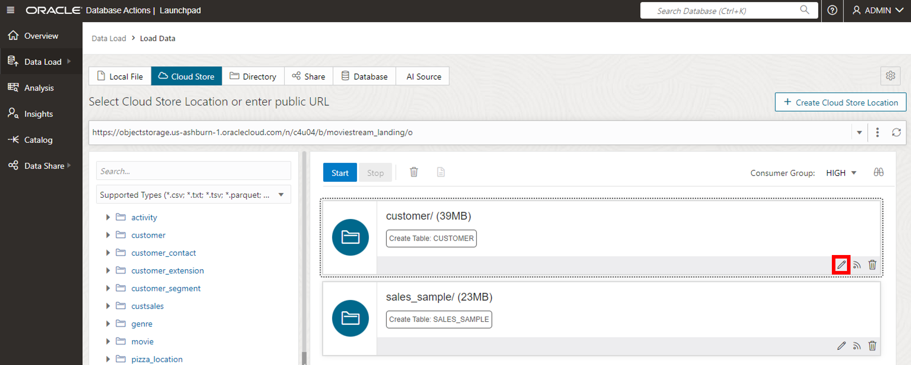
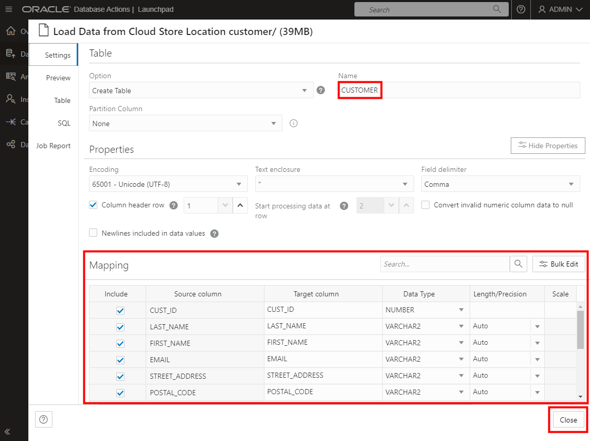
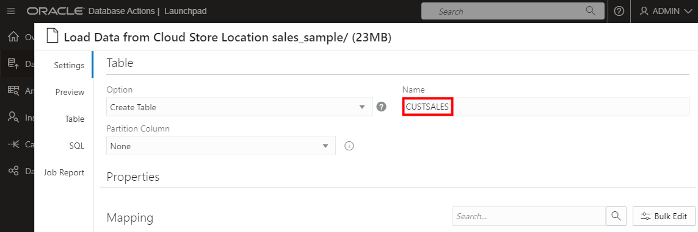

<!--
    {
        "name":"Load data from public buckets using Database Actions",
        "description":"Uses Database Actions to load data from public object storage buckets. It loads the following two tables:<ul><li>customer</li><li>sales_sample</li></ul>"
    }
-->
1. Under **Data Load** select **LOAD DATA**.

    

2. The **Load Data** page appears. Click **Cloud Store** and copy the following object storage URL to the **Select Cloud Store Location or enter public URL field**:

    ```
    <copy>
    https://objectstorage.us-ashburn-1.oraclecloud.com/n/c4u04/b/moviestream_landing/o
    </copy>
    ```

    Click ENTER on your keyboard. You will see a list of folders on the left side from which you can drag and drop to the data loading job.

    

    

3. You will select multiple folders. First, drag the **customer** folder over to the right hand panel. Note that a dialog box appears asking if you want to load all the files in this folder to a single target table. In this case, the folder has only a single file, `customer.csv`. Frequently, data lake folders contain many files of the same type, as you will see with sales data. Click **Yes**.

    

4. Perform the same drag and drop steps for **sales\_sample**.

5. Click the pencil icon for the **customer** load task to view the settings for this task.

    

6. In the settings viewer, you can see that Database Actions will create a **CUSTOMER** table with the list of columns and data types that will be created from the csv file. They all look correct, so click **Close** to close the settings viewer.

    

7. Click the pencil icon for the **sales\_sample** task to view its settings. In this case, update the name of the table to **CUSTSALES**.

    

    Click **Close**.

8. Now click the **Start** button to run the data load job. In the pop-up dialog, click **Run**.

    

    The job should take about 2 minutes to run.

9. Check that the two data load cards have green tick marks in them, indicating that the data load tasks have completed successfully. Click the pencil icon for the **customer** load task:

    

10. Let's do a quick review of the loaded data. Click the **Table** tab to view the **customer** data:

    

    The data looks good! Click **Close** to exit the **customer** load task and then click **Done** to exit the DATA LOAD tool and return to the Database Actions Launchpad.
