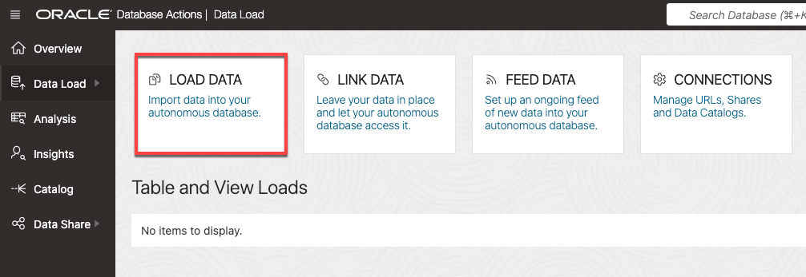
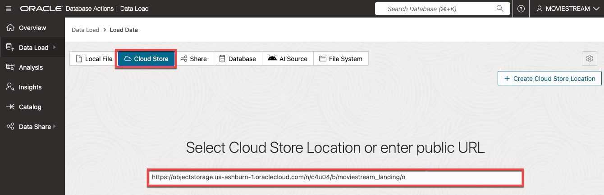
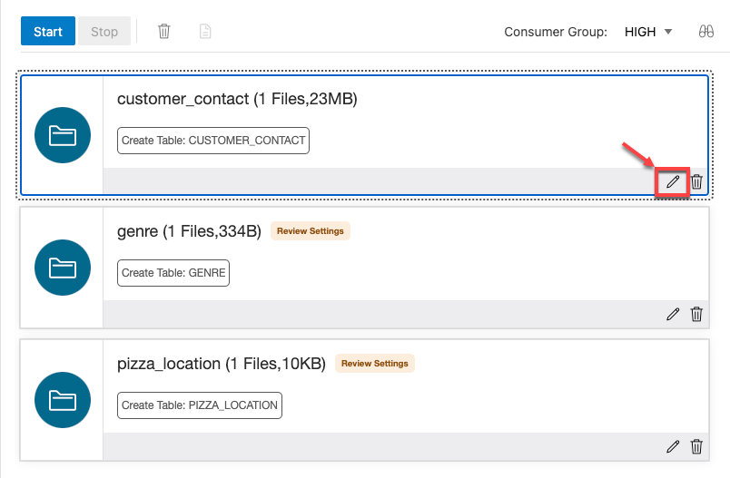
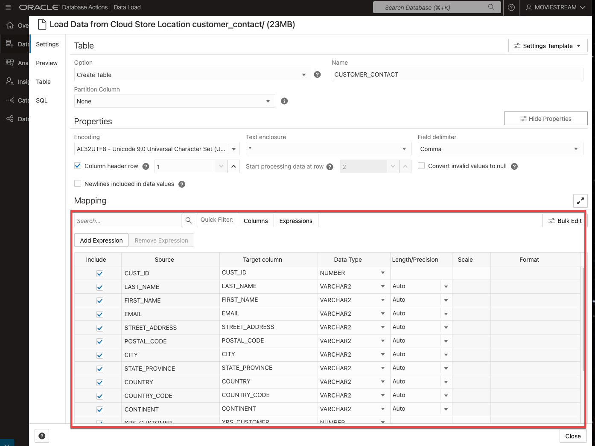
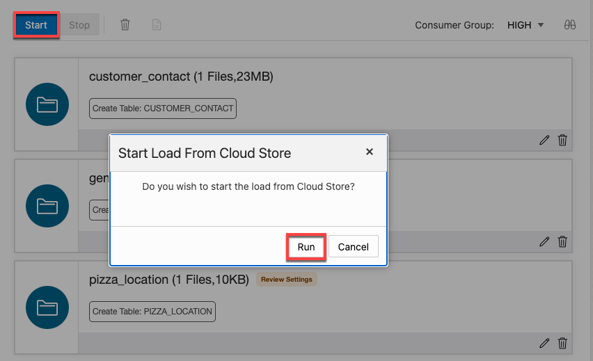
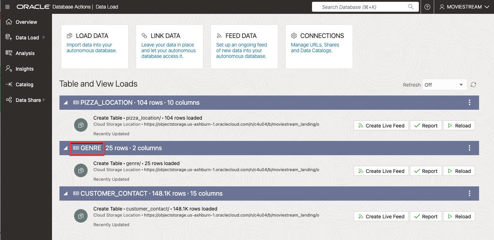
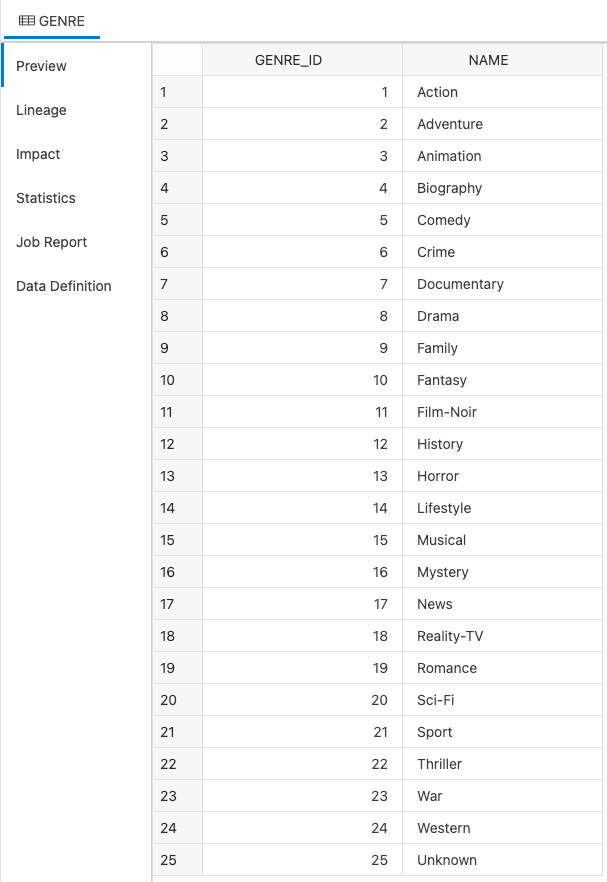

<!--
    {
        "name":"Load data from public buckets using Database Actions. Sales data not included.",
        "description":"Uses Database Actions to load data from public object storage buckets. It loads the following tables:<ul><li>customer_contact</li><li>genre</li><li>pizza location</li></ul><p>To load sales_sample, use task **Load data from public buckets using Database Actions**"
    }
-->
1. In the **Database Actions Launchpad** home page, under the **Data Studio** section, select the **DATA LOAD** card. Under **What do you want to do with your data?** select **LOAD DATA**, and under **Where is your data?** select **CLOUD STORE**, then click **Next**

    

2. The **Load Cloud Object** page appears. Use this page to drag and drop tables from the public object storage bucket to the data loading job. Copy the following object storage URL to the **Select Cloud Store Link or enter public URL field**:

    ```
    <copy>
    https://objectstorage.us-ashburn-1.oraclecloud.com/n/c4u04/b/moviestream_landing/o
    </copy>
    ```

    

    Click ENTER on your keyboard. This will take you to the data loading tool. You will see a list of folders on the left side from which you can drag and drop to the data loading job.

    

3. You will select multiple folders. First, drag the **customer\_contact** folder over to the right hand pane. Note that a dialog box appears asking if you want to load all the files in this folder to a single target table. In this case, the folder has only a single file, `customer-contact.csv`. Frequently, data lake folders contain many files of the same type, as you will see with sales data. Click **Yes**.

    

4. Perform the same drag and drop steps for **genre**, and **pizza\_location**.


5. Click the 3-dot ellipsis menu for the **customer\_contact** load task. In the pop-up menu, click **Settings** to view the settings for this task.

    

6. In the settings viewer, you can see that Database Actions will create a **CUSTOMER_CONTACT** table with the list of columns and data types that will be created from the csv file. Take a moment to examine the preview information and loading options. In the Mapping section, notice that you can change the target column names and data types. They all look correct, so click **Close** to close the settings viewer.

    

7. Now click the **Start** button to run the data load job.

    

    The job should take about 2 minutes to run.

8. Check that all of the data load cards have green tick marks in them, indicating that the data load tasks have completed successfully. Click the on the **genre** task link to view the results:

    

9. Let's do a quick review of the loaded data. Click the **Table** tab to view the **genre** data:

    

    The data looks good! Click **Close** to exit the **genre** task and then click **Done** to exit the DATA LOAD tool and return to the Database Actions Launchpad.
