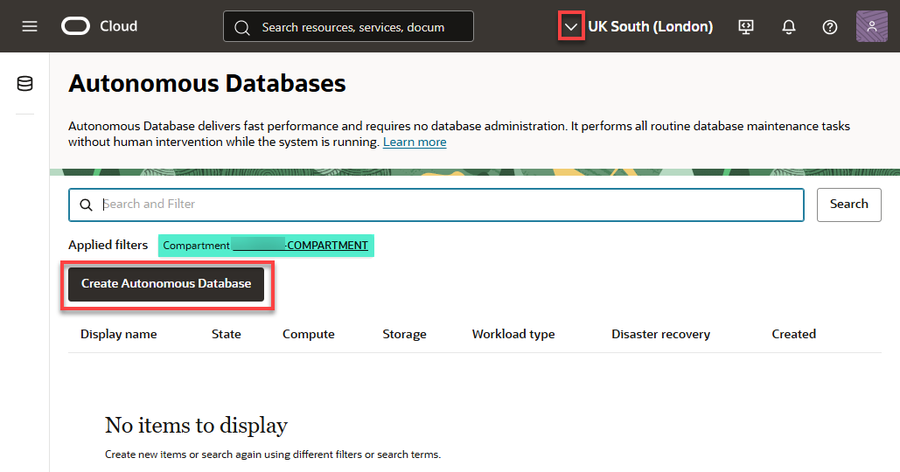
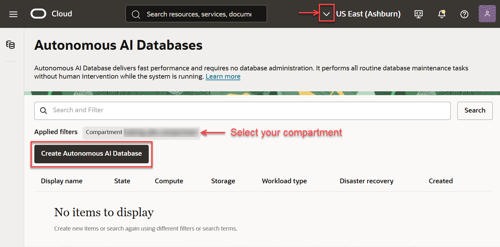
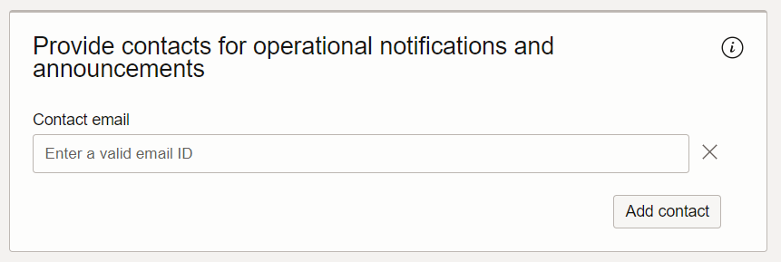
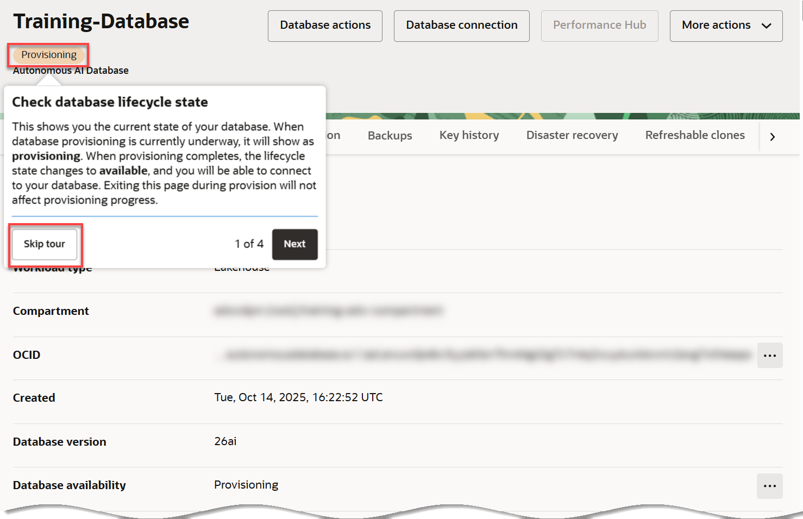
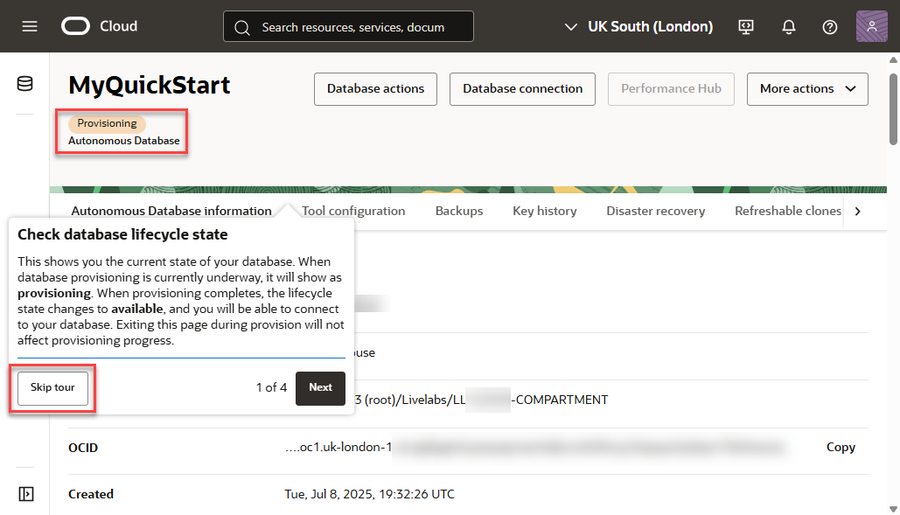
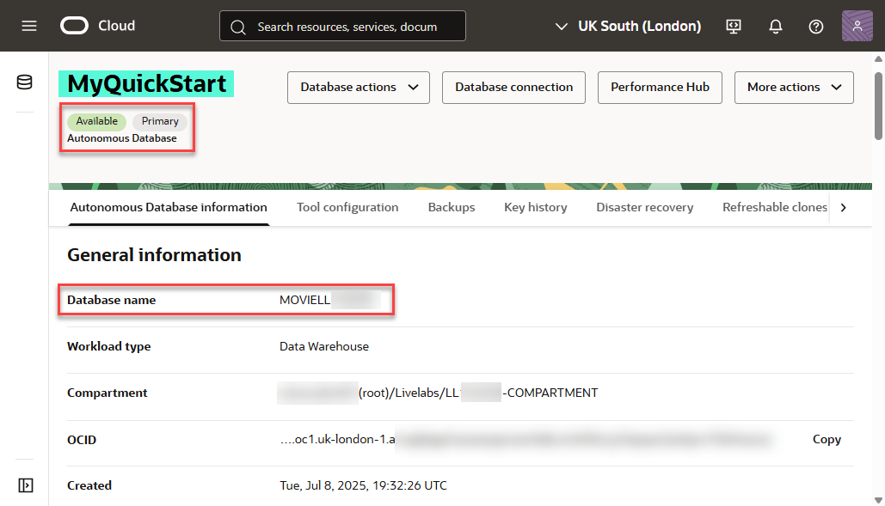
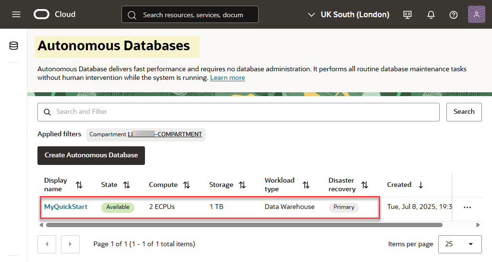

<!--
    {
        "name":"Provision Autonomous Database - Developer",
        "description":"Provision an ADB. Use the `variables.json` file to update provisioning parameters, including database name, ECPUs, storage and more.",
        "author":"Lauran K. Serhal",
        "lastUpdated":"June 2025"
    }
-->
1. Click **Create Autonomous Database** to start the instance creation process. The **Create Autonomous Database** page is displayed. Select your desired **region** and **compartment**. If you are using a sandbox environment (green button) and get a **Forbidden** message, that indicates you are in the wrong compartment. In the **Compartment** drop-down list, select your assigned compartment that is listed on the **Reservation Information** page.

    <if type="livelabs">
    
    </if>

    <if type="freetier">
    
    </if>

2. On the **Create Autonomous Database Serverless** page, specify the following:

<if type="freetier">
    - **Display name**: Enter a memorable name for the database for display purposes. For this lab, use ****.
    - **Database Name**: Use letters and numbers only, starting with a letter. Maximum length is 14 characters. _Underscores not supported_. For this lab, use ****.
     - **Compartment**: Select the your compartment.

        

    >**Note:** Ensure that you use the suggested database names as instructed in this step, and not those shown in the screenshots.
</if>

<if type="livelabs">
    - **Display Name**: Enter a memorable name for the database for display purposes. For this lab, use ****.
    - **Database Name**: Use letters and numbers only, starting with a letter. Maximum length is 14 characters. _Underscores not supported_. For this lab, use ****.
    - **Compartment**: Use the default compartment created for you.

    

> **Note:** Ensure that you use the suggested database names as instructed in this step, and not those shown in the screenshots.
</if>

3. In the **Choose a workload type** section, choose a workload type. Select the workload type for your database from the following choices:

    - **Data Warehouse**: Designed to support all standard SQL and business intelligence (BI) tools, and provides all of the performance of the market-leading Oracle Database in an environment that is tuned and optimized for data warehouse workloads
    - **Transaction Processing**: Provides all of the performance of the market-leading Oracle Database in an environment that is tuned and optimized to meet the demands of a variety of applications, including: mission-critical transaction processing, mixed transactions and analytics, IoT, and JSON document store
    - **JSON**: It is Oracle Autonomous Transaction Processing, but designed for developing NoSQL-style applications that use JavaScript Object Notation (JSON) documents. You can store up to 20 GB of data other than JSON document collections. There is no storage limit for JSON collections.
    - **APEX**: It is a low cost, Oracle Cloud service offering convenient access to the Oracle APEX platform for rapidly building and deploying low-code applications

    For this workshop, accept the **Data Warehouse** default selection.

    

4. In the **Choose a deployment type** section, accept the **Serverless** default selection.

    

5. In the **Configure the database** section, accept the default selections as follows:

    - **Always Free**: An Always Free databases are especially useful for development and trying new features. You can deploy an Always Free instance in an Always Free account or paid account. However, it must be deployed in the home region of your tenancy. The only option you specify in an Always Free database is the database version. For this lab, we recommend you leave **Always Free** unchecked unless you are in an Always Free account.
    - **Developer**: Developer databases provide a great low cost option for developing apps with Autonomous Database. You have similar features to Always Free - but are not limited in terms of region deployments or the number of databases in your tenancy. You can upgrade your Developer Database to a full paid version later and benefit from greater control over resources, backups and more.
    - **Choose database version**: Select your database version from this drop-down list.
    - **ECPU count**: Choose the number of ECPUs for your service. For this lab, specify ****. If you choose an Always Free database, you do not need to specify this option.
    - **Storage (TB)**: Select your storage capacity in terabytes. For this lab, specify **** of storage. Or, if you choose an Always Free database, it comes with 20 GB of storage.
    - **Compute auto scaling**: Accept the default which is enabled. This enables the system to automatically use up to three times more compute and IO resources to meet workload demand.
    - **Storage auto scaling**: For this lab, there is no need to enable storage auto scaling, which would allow the system to expand up to three times the reserved storage.

        > **Note:** You cannot scale up/down an Always Free autonomous database.

        

        >**Note:** You can click the **Show advanced options** link to use your organization's on-premise licenses with **bring your own license** or to take advantage of database consolidation savings with **elastic pools**.

6. In the **Backup retention** section, you can either accept the default value or specify your own preferred backup retention days value. Accept the default 60 days default value.

     

7. In the **Create administrator** credentials section, specify the following:

    - **Username:** This read-only field displays the default administrator username, **`ADMIN`**. _**Important:** Make a note of this **username** as you will need it to perform later tasks._
    - **Password:** Enter a password for the **`ADMIN`** user of the service instance choice such as **`Training4ADW`**. _**Important:** Make a note of this **password** as you will need it to perform later tasks._
    - **Confirm password:** Confirm your password.

        > **Note:** The password must meet the following requirements:    
            - Must be between 12 and 30 characters long and must include at least one uppercase letter, one lowercase letter, and one numeric character.    
            - Cannot contain the username.    
            - Cannot contain the double quote (") character.    
            - Must be different from the last 4 passwords used.    
            - Must not be the same password that you set less than 24 hours ago.

        

8. In the **Choose network access** section, select one of the following options:
    - For this lab, accept the default, **Secure access from everywhere**.
    - If you want to allow traffic only from the IP addresses and VCNs you specify - where access to the database from all public IPs or VCNs is blocked, select **Secure access from allowed IPs and VCNs only** in the Choose network access area.
    - If you want to restrict access to a private endpoint within an OCI VCN, select **Private endpoint access only** in the Choose network access area.
    - If the **Require mutual TLS (mTLS) authentication** option is selected, mTLS will be required to authenticate connections to your Autonomous Database. TLS connections allow you to connect to your Autonomous Database without a wallet, if you use a JDBC thin driver with JDK8 or above. See the [documentation for network options](https://docs.oracle.com/en/cloud/paas/autonomous-database/adbsa/support-tls-mtls-authentication.html#GUID-3F3F1FA4-DD7D-4211-A1D3-A74ED35C0AF5) for options to allow TLS, or to require only mutual TLS (mTLS) authentication.

        

9. In the **Provide contacts for operational notifications and announcements** section, do not provide a contact email address. The **Contact email** field allows you to list contacts to receive operational notices and announcements as well as unplanned maintenance notifications.

    

10. Click **Create Autonomous Database**.

    

11.  The **Autonomous Database details** page is displayed. The status of your ADB instance is **PROVISIONING**.

    <if type="freetier">
    
    </if>

    <if type="livelabs">
    
    </if>

    A **Check database lifecycle state** informational box is displayed. You can navigate through this tour or choose to skip it. Click **Skip tour**. A **Skip guided tour** dialog box is displayed. Click **Skip**.

    In a few minutes, the instance status changes to **AVAILABLE**. At this point, your Autonomous Data Warehouse database instance is ready to use! Review your instance's details including its name, database version, ECPU count, and storage size.

    <if type="livelabs">
    
    </if>

    <if type="freetier">
    
    </if>

12. Click the **Autonomous Database** link in the breadcrumbs. The **Autonomous Database** page is displayed. The new Autonomous Database instance is displayed. In the following screen capture, the instance display name is **MyQuickStart**.

    <if type="livelabs">
    
    </if>

    <if type="freetier">
    
    </if>