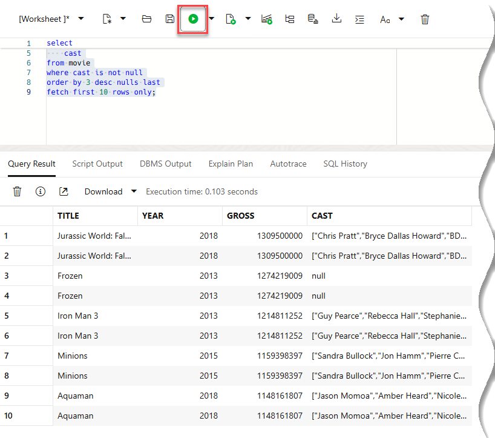
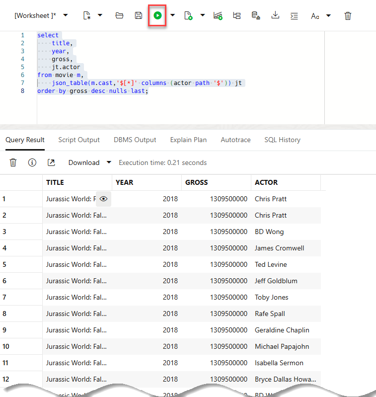
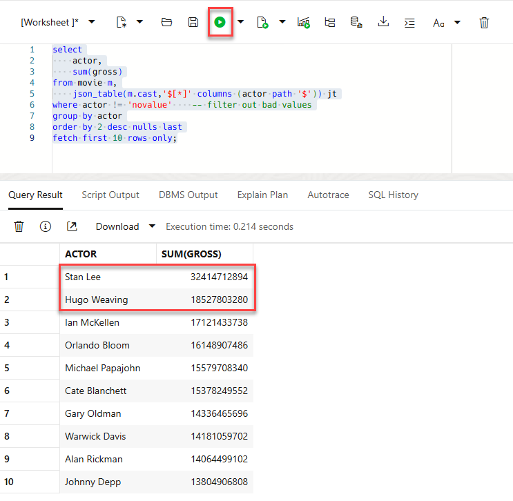

<!--
    {
        "name":"Query JSON arrays",
        "description":"Use JSON_TABLE to convert arrays into rows."
    }
-->
### Query JSON Arrays
An array of cast members is stored for each movie. Here, you can see that Tom Hanks, Elizabeth Perkins, Robert Loggia were all a part of the cast for the movie **Big**.


In order to find the top grossing actors across movies, the arrays for each movie need to be expanded into rows: _One row for each **movie**-**cast** members combination_. The `JSON_TABLE` function is designed for this purpose. The following will illustrate how to use the function. See [SQL/JSON Function JSON_TABLE](https://docs.oracle.com/en/database/oracle/oracle-database/19/adjsn/function-JSON_TABLE.html#GUID-0172660F-CE29-4765-BF2C-C405BDE8369A).

1. Find the top grossing movies. Copy and paste the following SQL statement into the worksheet, and then click the **Run Statement** icon in the Worksheet.

    ```
    <copy>
    select
        title,
        year,
        gross,
        cast
    from movie
    where cast is not null
    order by 3 desc nulls last
    fetch first 10 rows only;
    </copy>
    ```

    The top 10 grossing movies in descending order and the list of actors for each movie are displayed.

    

2. Finding the top movies is easy. It's not quite as simple to find the top grossing actors because actors are stored in the cast array. Let's break this down into a couple of steps. First, use `JSON_TABLE` to perform a lateral join; a row will be created for each **cast member-movie combination**. Copy and paste the following SQL statement into the worksheet, and then click the **Run Statement** icon in the Worksheet.

    ```
    <copy>
    select
        title,
        year,
        gross,
        jt.actor
    from movie m,
        json_table(m.cast,'$[*]' columns (actor path '$')) jt
    order by gross desc nulls last;
    </copy>
    ```
    The result will look similar to the image below:

    

    Step one is complete! A JSON table is created with a row for each actor and movie combination.

3. The next step will find the top 10 actors based on box office receipts across all their movies. Copy and paste the following SQL statement into the worksheet, and then click the **Run Statement** icon in the Worksheet.

    ```
    <copy>
    select
        actor,
        sum(gross)
    from movie m,
        json_table(m.cast,'$[*]' columns (actor path '$')) jt
    where actor != 'novalue'    -- filter out bad values
    group by actor
    order by 2 desc nulls last
    fetch first 10 rows only;
    </copy>
    ```

    Stan Lee and Hugo Weaving are leading the pack!

    
