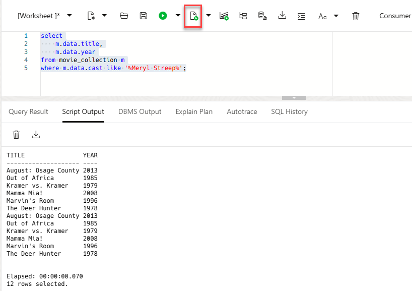
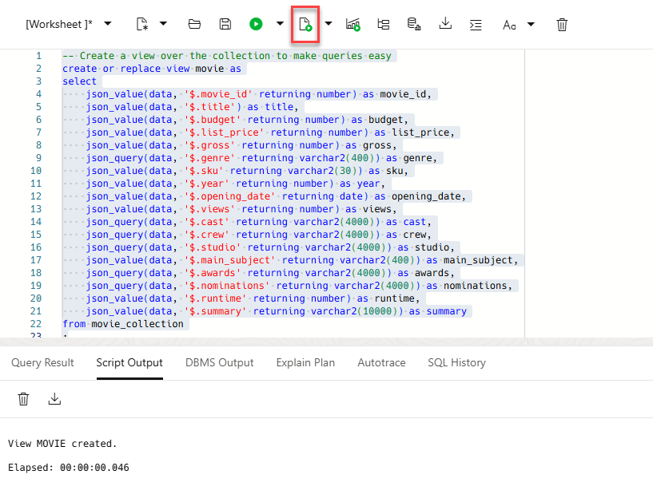
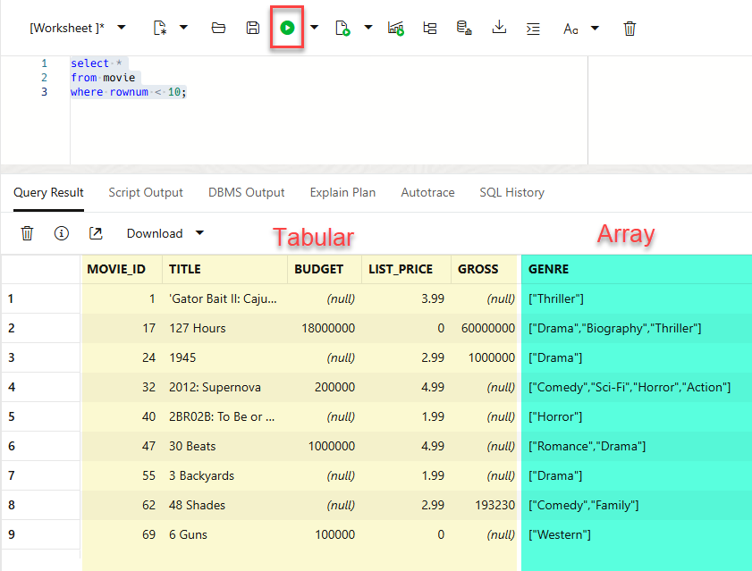
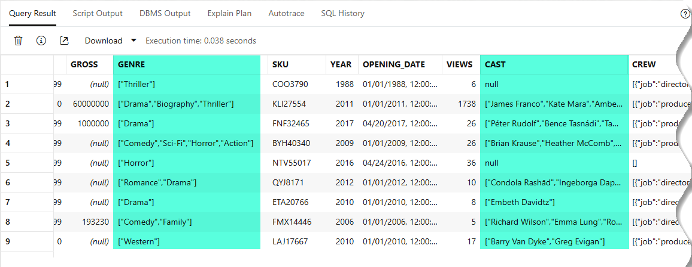

<!--
    {
        "name":"Query simple JSON attributes",
        "description":"(Redwood UI) Use dot notation and JSON_VALUE to query JSON documents. Creates a view to simplify subsequent access.",
        "author":"Lauran K. Serhal, Consulting User Assistance Developer",
        "lastUpdated":"Lauran K. Serhal, July 2025"
    }
-->

Oracle Database offers a wide range of SQL functions that help you analyze JSON data ([see Query JSON Data](https://docs.oracle.com/en/database/oracle/oracle-database/19/adjsn/query-json-data.html#GUID-119E5069-77F2-45DC-B6F0-A1B312945590) for details). The SQL capabilities include simple extraction of JSON attributes using dot notation, array and object manipulation, JSON aggregations and more.

_**Note:** If you are using Autonomous Database `19c` when importing a JSON collection, the default column name for JSON is **`JSON_DOCUMENT`**. The default column name has changed to **`DATA`** in Autonomous Database `23ai`._

1. Use the simple dot (.) notation to extract fields in a tabular format.

    The movie collection includes **`title`** and **`year`** attributes. Your SQL statements can use the dot notation to navigate through the JSON path. For example, **`m.data.title`** refers to table **`m` (`movie_collection`)**, the **`data`** column, and the **`title`** JSON attribute. Copy and paste the following SQL statement into the worksheet, and then click the **Run Script (F5)** icon in the Worksheet toolbar to view **Meryl Streep's** movies.
    
    ```
    <copy>
    select
        m.data.title,
        m.data.year
    from movie_collection m
    where m.data.cast like '%Meryl Streep%';
    </copy>
    ```

    Meryl Streep movies and the years that they were released are displayed.

    

2. You can simplify subsequent queries against the movie collection by using a view. The view will allow tools and applications to access JSON data as if it were tabular data. The view definition extracts from the JSON documents both simple fields (using the `JSON_VALUE` function) and complex arrays (using the `JSON_QUERY` function). Copy and paste the following SQL code into the worksheet, and then click the **Run Statement** icon in the Worksheet toolbar.

    ```
    <copy>
    -- Create a view over the collection to make queries easy
    create or replace view movie as
    select
        json_value(data, '$.movie_id' returning number) as movie_id,
        json_value(data, '$.title') as title,
        json_value(data, '$.budget' returning number) as budget,
        json_value(data, '$.list_price' returning number) as list_price,
        json_value(data, '$.gross' returning number) as gross,
        json_query(data, '$.genre' returning varchar2(400)) as genre,
        json_value(data, '$.sku' returning varchar2(30)) as sku,
        json_value(data, '$.year' returning number) as year,
        json_value(data, '$.opening_date' returning date) as opening_date,
        json_value(data, '$.views' returning number) as views,
        json_query(data, '$.cast' returning varchar2(4000)) as cast,
        json_query(data, '$.crew' returning varchar2(4000)) as crew,
        json_query(data, '$.studio' returning varchar2(4000)) as studio,
        json_value(data, '$.main_subject' returning varchar2(400)) as main_subject,
        json_query(data, '$.awards' returning varchar2(4000)) as awards,
        json_query(data, '$.nominations' returning varchar2(4000)) as nominations,
        json_value(data, '$.runtime' returning number) as runtime,
        json_value(data, '$.summary' returning varchar2(10000)) as summary
    from movie_collection
    ;
    </copy>
    ```
    Each JSON attribute is now exposed as a column - similar to any table column.

    

3. Query the newly created by view. Copy and paste the following SQL code into the worksheet, and then click the **Run Statement** icon in the Worksheet toolbar.

    ```
    <copy>
    select *
    from movie
    where rownum < 10;
    </copy>
    ```

    

    Most of the data is in tabular format. However, several of the fields are arrays. For example, there are multiple **genres** and **cast members** associated with each movie.

    