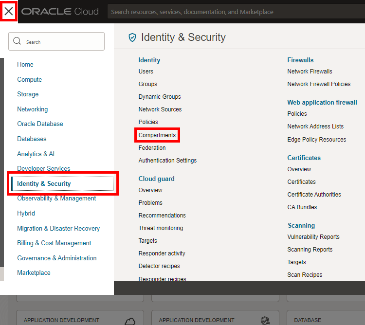
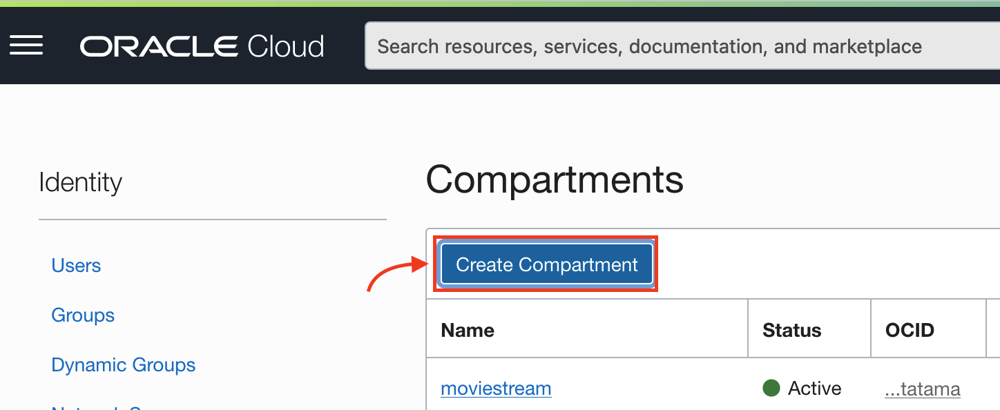
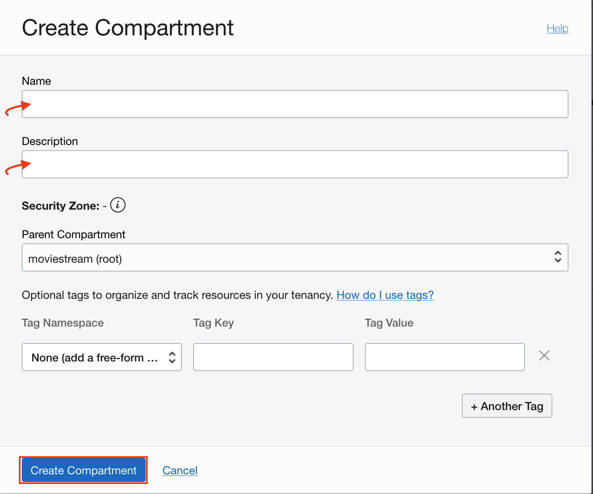

<!--
    {
        "name":"Create an OCI Compartment",
        "description":"Create a new compartment using the OCI service console"
    }
-->
A compartment is a collection of cloud assets, like compute instances, load balancers, databases, and so on. By default, a root compartment was created for you when you created your tenancy (for example, when you registered for the trial account). It is possible to create everything in the root compartment, but Oracle recommends that you create sub-compartments to help manage your resources more efficiently.

If you are using an Oracle LiveLabs-provided sandbox, you don't have privileges to create a compartment and should skip this first task. Oracle LiveLabs has already created a compartment for you and you should use that one. Even though you can't create a compartment, you can review the steps below to see how it is done.

1. Click the three-line menu on the top left of the console. Scroll down to the bottom of the menu, click **Identity & Security -> Compartments**.

    

    Then, click the **Create Compartment** button to create a sub-compartment.

    

2. Give the compartment a name and description. Be sure your root compartment appears as the parent compartment. Press the blue **Create Compartment** button.

    

    The compartment is created and you can use it for your cloud services!
