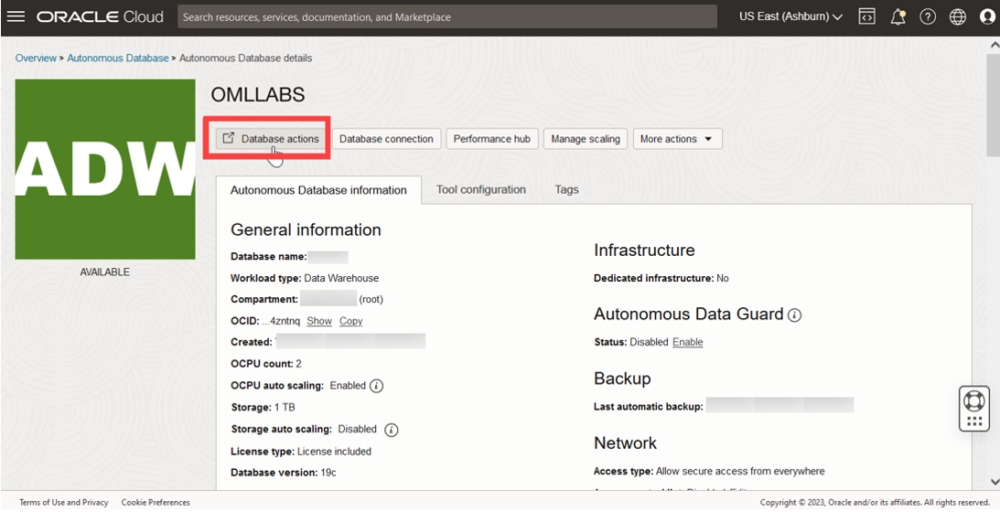

<!--
    {
        "name":"Sign into Oracle Machine Learning UI",
        "description":"Steps to sign into Oracle Machine Learning UI"
    }
-->

A notebook is a web-based interface for data analysis, data discovery, data visualization, and collaboration. You create and run notebooks in Oracle Machine Learning user interface. You can access Oracle Machine Learning user interface from Autonomous Database.

1. On your Oracle ADW instance, click **Database Actions**.

	

	 If you had it already open in the Database Users section, you can go to Database Actions home page clicking in the **Database Actions** on the top left corner of the page, as shown in the screenshot below.

	

2. On the Database Actions page, go to the Development section and click **Oracle Machine Learning**. This opens the Oracle Machine Learning sign in page.

	 

3. Enter your user credentials and click **Sign in**.

	> **Note:** The credential is what you have defined while creating the Oracle Machine Learning user.

	

  This opens the Oracle Machine Learning user interface home page.

	

This completes the task of signing into Oracle Machine Learning user interface.

