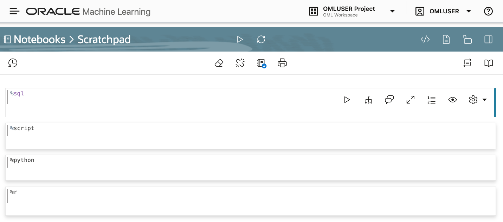
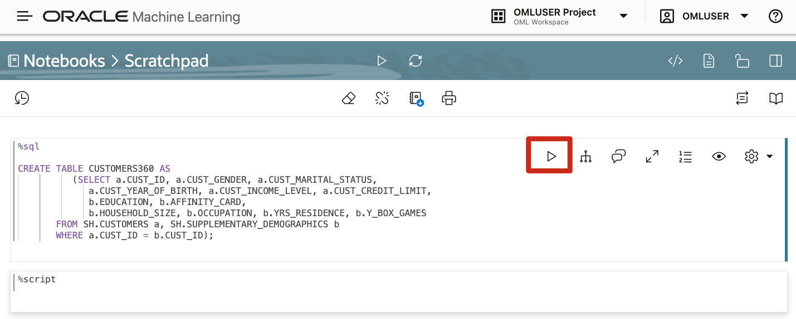

<!--
    {
        "name":"Create the Customer360 table",
        "description":"Steps to create the Customer360 table"
    }
-->

In this step, you will create the table ``CUSTOMERS360`` by using the Scratchpad. The Scratchpad is available on the Oracle Machine Learning Notebooks home page. The Scratchpad is a one-click access to a notebook for running SQL statements, PL/SQL scripts, and Python scripts. After you run your scripts, the Scratchpad is automatically saved as a notebook by the default name _Scratchpad_ in the Notebooks page. You can access it later in the Notebooks page. You will learn more about notebooks in Lab 1.

> **Note:** You will be using the table CUSTOMERS360 in the _Using Oracle Machine Learning AutoML UI_ lab and _Using Oracle Machine Learning Services_ lab.

To create the table:

1. On the Oracle Machine Learning home page, click **Scratchpad**.

	

2. By default, the Scratchpad opens with four paragraphs: `%sql` (to run SQL statements), `%script` (to run PL/SQL scripts), `%python` (to run Python scripts), and `%r` (to run R scripts). Here, you will use the SQL paragraph to run a SQL statement to create the CUSTOMER360 table. On the SQL paragraph, click after the `%sql` tag, and press enter.

	

3. In the SQL paragraph, enter the following script and click the Run icon :

    ```
    <copy>
		CREATE TABLE CUSTOMERS360 AS
              (SELECT a.CUST_ID, a.CUST_GENDER, a.CUST_MARITAL_STATUS,
                 a.CUST_YEAR_OF_BIRTH, a.CUST_INCOME_LEVEL, a.CUST_CREDIT_LIMIT,
                 b.EDUCATION, b.AFFINITY_CARD,
                 b.HOUSEHOLD_SIZE, b.OCCUPATION, b.YRS_RESIDENCE, b.Y_BOX_GAMES
           FROM SH.CUSTOMERS a, SH.SUPPLEMENTARY_DEMOGRAPHICS b
           WHERE a.CUST_ID = b.CUST_ID);
		</copy>
    ```

	

	After the script runs successfully, the phrase **"Successful run: No result returned"** is shown at the bottom of the paragraph, as shown in the screenshot:

	

4. In the next paragraph, edit the paragraph tag to change it to `%sql`, and run the following statement to view the data:

	```
		<copy>
		select * from CUSTOMERS360
			where rownum < 10;
		 </copy>
	 ```

	

If the listing shows the columns and rows from the dataset as indicated in the image, you have completed the task of creating the `CUSTOMERS360` table. 