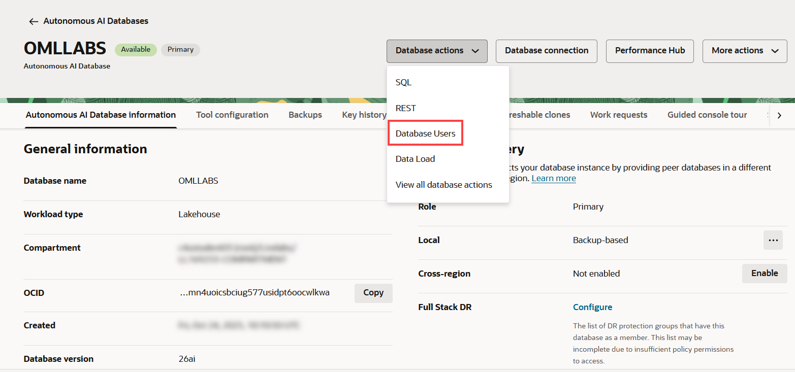
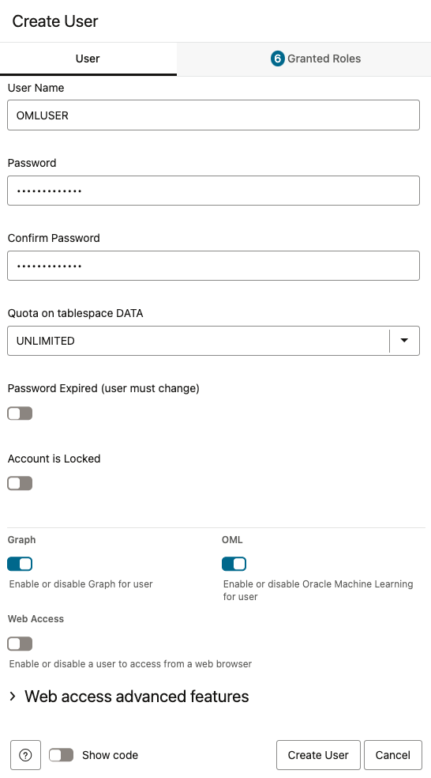

<!--
    {
        "name":"Create an OML User",
        "description":"Steps to create an OML user by the name OMLUSER"
    }
-->

An administrator creates a new user account and user credentials for Oracle Machine Learning in the Database Users user management interface.

> **Note:** You must have the administrator role to access the Database Actions Database Users interface.

To create a user account:

1. If you are not already signed in, sign into your OCI account, click the cloud menu on the left to open the left navigation pane, and click **Oracle Database**. On the right, click **Autonomous Database**.

	

2. The Autonomous Databases dashboard lists all the databases that are provisioned in the tenancy. Click the Oracle Autonomous Database that you have provisioned for this workshop. Here, click the instance **OMLLABS**.

	

3. On the Autonomous Database details page, click **Database Actions**, and then select the **Database Users** option.

	

4. Before you get to the Oracle Database Actions Launchpad page, you might be asked to log in, depending on the browser you are using.  If this is the case make sure to enter **ADMIN** and the password you gave the administrator user in Task 1, Step 7.
   
    

5. Click **Create User**. The Create User dialog opens.

	

6. On the Create User dialog, enter the following details and click **Create User**:	  

	

	* **User Name:** Enter the user name `OMLUSER`.
	* **Password:** Enter a password for this user. The password must be 12 to 30 characters and contain at least one uppercase letter, one lowercase letter, and one number. The password cannot contain the double quote (") character or the username itself.
	* **Confirm Password:** Re-enter the password that you entered in the **Password** field.
	* **Quota of tablespace data:** Click on the drop-down list and select an option. For this lab and a typical Always Free ADB, `UNLIMITED` is selected.
	* **Password Expired:** Select this option if you want the user to reset their own password.
	* **Account is locked:** Use this option to lock the account.
	* **OML:** Select this option to allow this user to access Oracle Machine Learning. This is a required field.
	* **Graph:** Optionally, select this option to enable graph for this user.
	* **Web Access:** Select this option to allow Web and DB Actions access to this user via its own url. This is an optional field.
	* **Show Code:** Click this option to view the code to create the user and grant roles to the user. You also have the option to copy the code.

7. After the user is created successfully, the message _User OMLUSER created successfully_ is displayed.

	

	Scroll down the page to view the user. The OMLUSER is listed along with all details. Click the three-dots menu  to edit, delete, or disable any of the privileges granted to the user.
	

8. Repeat the same process and create a second user named _OMLUSER2_ . You can repeat the same exact steps and password as well, since we will only use this user to demonstrate the privilege grants for acessing Python scripts and objects in the Repository.

	Once this is done, you should have the following users available.
	

	This completes the task of creating OML-enabled users.
