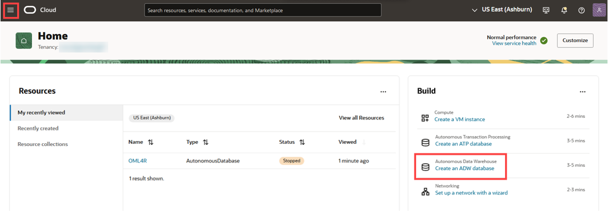
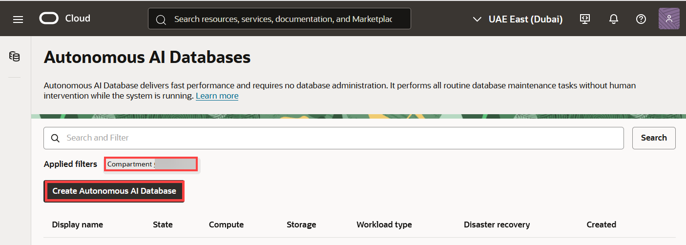
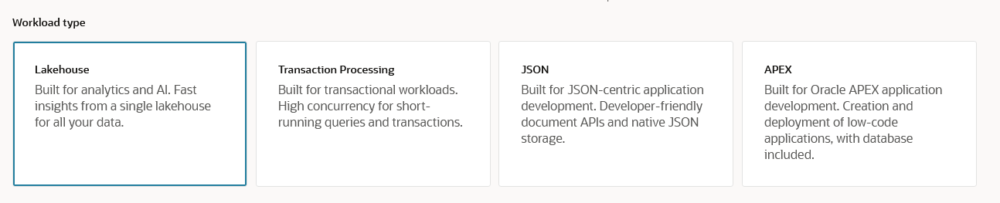
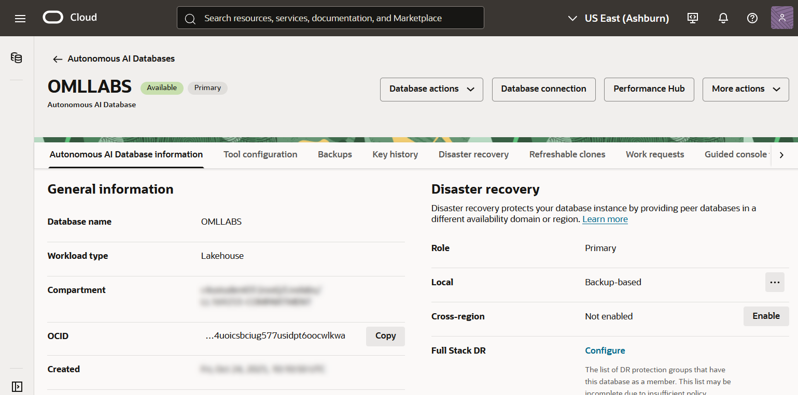

<!--
    {
        "name":"Provision an Autonomous Database",
        "description":"Steps to provision an autonomous database"
    }
-->

To provision an Oracle Autonomous Database:

1. Sign into your OCI account, and under the Build section, click **Create an ADW database**.

	

	 Alternatively, you may click the left navigation pane on the upper left corner, click **Oracle Database** and then click **Autonomous Database**.

	

2. From the Oracle Cloud Infrastructure console, on the Oracle Autonomous Database page choose your region and optionally select a compartment. By default, it will show the root compartment. Click **Create Autonomous Database**. This opens the _Create Autonomous Database Serverless_ page.

   

    > **Note:** You must select your **OCI Home Region** if you intend on creating an Always-Free Autonomous Database.

     

3. On the *Create Autonomous Database Serverless* page, provide the basic information about the database. By default, a database name and a display name for the database are provided. You can modify these names to enter a user-friendly display name for the ADB instance to easily identify the resource. The display name does not have to be unique.    

   > **Note:** We will choose the Display Name *OMLLABS* and the Database Name *OMLLABS* for our example.  You can use the same or create your own, but neither supports blank spaces in the name

   

4. For Workload Type, select **Data Warehouse**.

   

5. For Database Configuration, select **Always Free**. For the Always Free option, both releases 19c and 23ai are available.  Let’s use the default **23ai**.  You can create **Always Free** resources both in Free Tier and Paid accounts, with the requirement of it being created in your **OCI Home Region** as mentioned above in Task 2.

   
   
    > **Note:** If you are using a standard **Paid Account** and decide to provision a **paid database** instead of an **Always-Free**, you will see more options available that include ECPU count, Compute auto scaling and Storage auto scaling. For this workshop **the minimum compute unit of 2 ECPUs with auto scaling is sufficient**.  If you decide to use a **Developer Database** option, it already has the configuration necessary for this workshop.

    > 

	> You will also be offered a **immutable Backup Retention** plan billed separately. This option is not available in the Always-Free Autonomous Database, that you can adjust as you see necessary.  We will not be using backups in this workshop, so you can easily put it to a minimum of 1 day without issues.

    > 

6. Click to expand **Advanced options**. The Elastic Pool options - **Compute Model** and **Bring your own license** are available only for a paid version.  

    
        * **Compute Model** - Click **Change compute model** to select either **ECPU** or **OCPU**
        * **Bring your own license** - You have the option to click Enable to activate this option. 

7. Create your Autonomous Database administrator credentials by providing a password. You will need these credentials to sign into this Autonomous Database instance.   

	> **Note:** The default administrator username is ADMIN. The ADMIN password must be 12 to 30 characters and contain at least one uppercase letter, one lowercase letter, and one number. The password cannot contain the double quote (") character or the username "admin".

	

8. For network access, select **Allow secure access from everywhere.**

    

9. In the **Contacts for operational notifications and announcements** section, provide your email ID for any notifications and announcements. You also have the option to click **Add customer contact** in the additional field that gets added. . Then click **Create Autonomous Database**.

	 

10. Under Advanced Options:

11. Click **Create**. 
    

    The Oracle Autonomous Database instance starts provisioning. It will show the status **Provisioning** and once it is complete, it will be listed on the Autonomous Databases page. 

      

12. Click on the ADB instance to view the ADB details. 

	  

This completes the task of provisioning an Oracle Autonomous Database.

