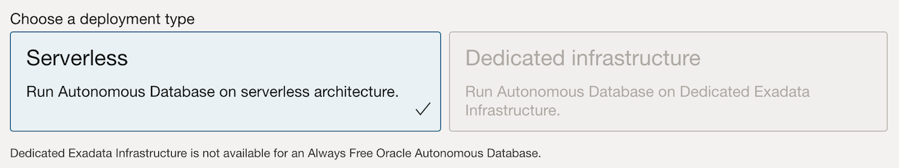

<!--
    {
        "name":"Provision an Autonomous Database",
        "description":"Steps to provision an autonomous database"
    }
-->

To provision an Oracle Autonomous Database:

1. Sign into your OCI account, and under the Launch Resources section, click **Create an ADW database**.

	

	 Alternatively, you may click the left navigation pane on the upper left corner, and click **Autonomous Data Warehouse** under **Oracle Database**.

	

2. From the Oracle Cloud Infrastructure console, on the Oracle Autonomous Database page choose your region and optionally select a compartment (by default it will show the root compartment). Click **Create Autonomous Database**. This opens the Create Autonomous Database page.

   

    > **Note:** You will need to make sure to select your **OCI Home Region** if you intend on creating an Always-Free Autonomous Database.

     

3. On the Create Autonomous Database page, provide the basic information about the database. By default, a database name and a display name for the database are provided. You can modify these names to enter a user-friendly display name for the ADB instance to easily identify the resource. The display name does not have to be unique.    

   > **Note:** We will choose the Display Name *OMLLABS* and the Database Name *OMLLABS* for our example.  You can use the same or create your own, but neither supports blank spaces in the name

   

4. For Workload Type, select **Data Warehouse**.

   

5. For Deployment type, select **Serverless**. 

   

   > **Note:** Oracle Machine Learning Notebooks is available only on Autonomous Database Serverless. 

6. For Database Configuration, select Always Free. For the Always Free option, both release 19c and 23ai are available.  Let’s use the default **23ai**.  You can create **Always Free** resources both in Free Tier and Paid accounts, with the requirement of it being created in your **OCI Home Region** as mentioned above on Task 2.

   
   
    > **Note:** If you are using a standard **Paid Account** and decide to provision a **paid database** instead of an **Always-Free**, you will see more options available that include compute and storage sizing and auto scaling. For this workshop **the minimum compute unit of 2 ECPUs with auto scaling is sufficient**.  If you decide to use a **Developer Database** option, it already has the configuration necessary for this workshop.

    > 

	> You will also be offered a **customizable Backup Plan** billed separately, not available in the Always-Free Autonomous Database, that you can adjust as you see necessary.  We will not be using backups in this workshop, so you can easily put it to a minimum of 1 day without issues.

    > 

7. Create your Autonomous Database administrator credentials by providing a password. You will need these credentials to sign into this Autonomous Database instance.   

	> **Note:** The default administrator username is ADMIN. The ADMIN password must be 12 to 30 characters and contain at least one uppercase letter, one lowercase letter, and one number. The password cannot contain the double quote (") character or the username "admin".

	

8. For network access, select **Allow secure access from everywhere.**

    

9. For License type, by default both the **Always Free** databases as well as the Developer Databases are provisioned with **License Included** and you cannot change this option. If you provision a standard **Paid Account** you can switch it to BYOL if this is your case.

    

10. Provide your email ID for any notifications and announcements, and click **Add Contact**. Then click **Create Autonomous Database**.

	 

	 The Oracle Autonomous Data Warehouse instance starts provisioning. It will show the status **Provisioning** and will start a **Guided Tour** that you can skip for now.
	 
	 

	 
	 Once your Autonomous Database is created (it should take a few minutes), the database details are listed with the status Available.

	  

This completes the task of provisioning an Oracle Autonomous Database.

