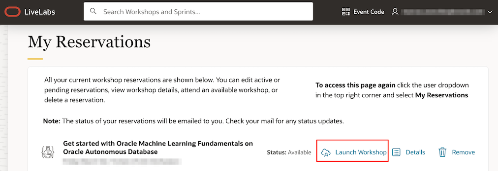
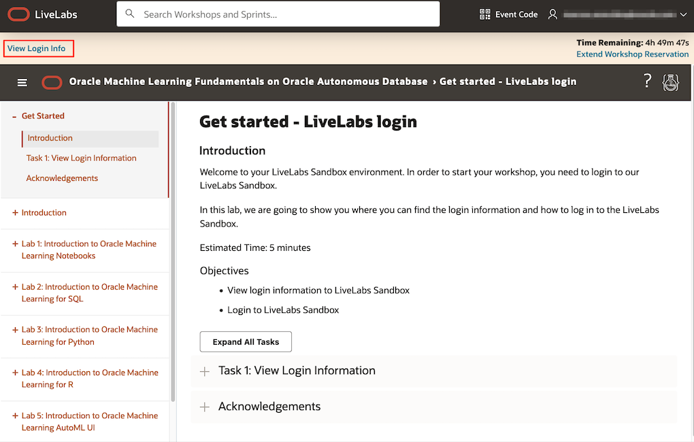
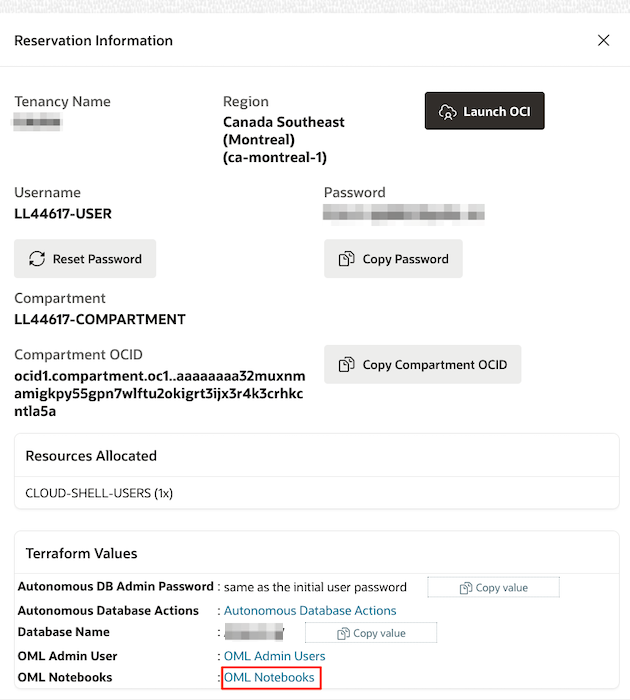
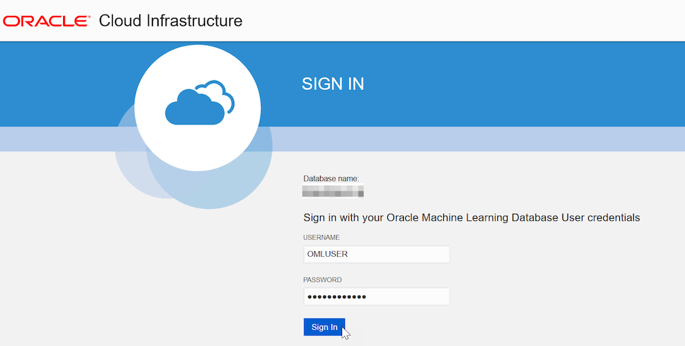

<!--
    {
        "name":"Sign into Oracle Machine Learning UI - green button",
        "description":"Steps to sign into Oracle Machine Learning UI"
    }
-->

A notebook is a web-based interface for data analysis, data discovery, data visualization, and collaboration. You create and run notebooks in Oracle Machine Learning user interface. You can access Oracle Machine Learning user interface from Autonomous Database.

1. On your workshop page, click **Launch Workshop** under **My Reservations**.
	
2. On the **Get Started - LiveLabs login** page, click **View Login Info** at the top left.
	
3. In the panel that opens with the **Reservation Information**, click at the bottom of the panel on the **OML Notebooks** link.
	
4. In the page that opens, enter your user credentials and click **Sign in**. This opens the Oracle Machine Learning user interface home page.
	> **Note:** The username is `OMLUSER`, and password is `AAbbcc123456`.

	

	
This completes the task of signing into Oracle Machine Learning user interface.

