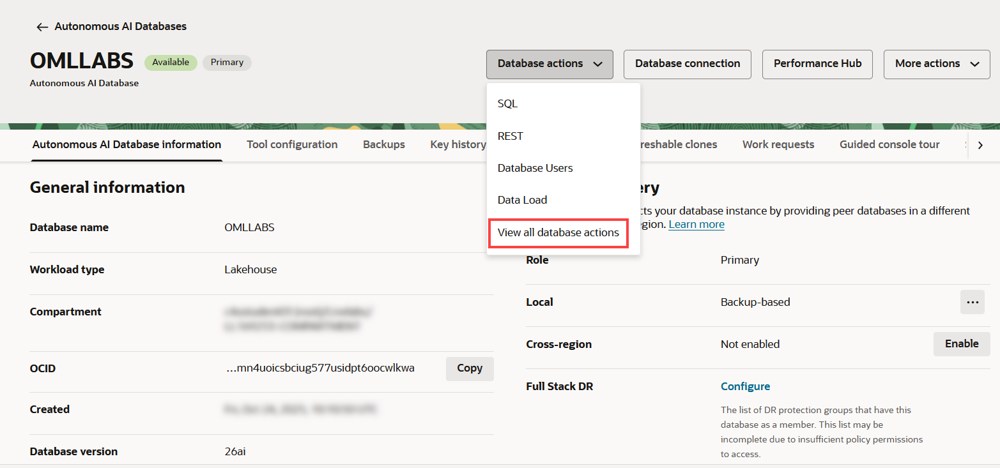
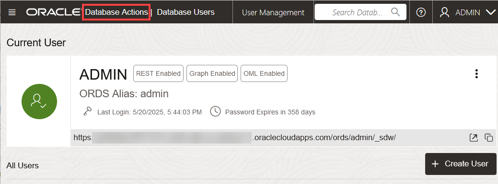
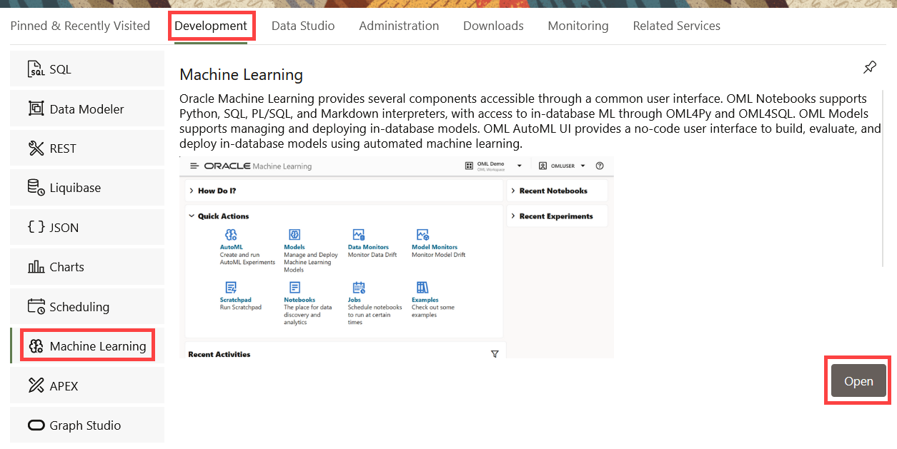
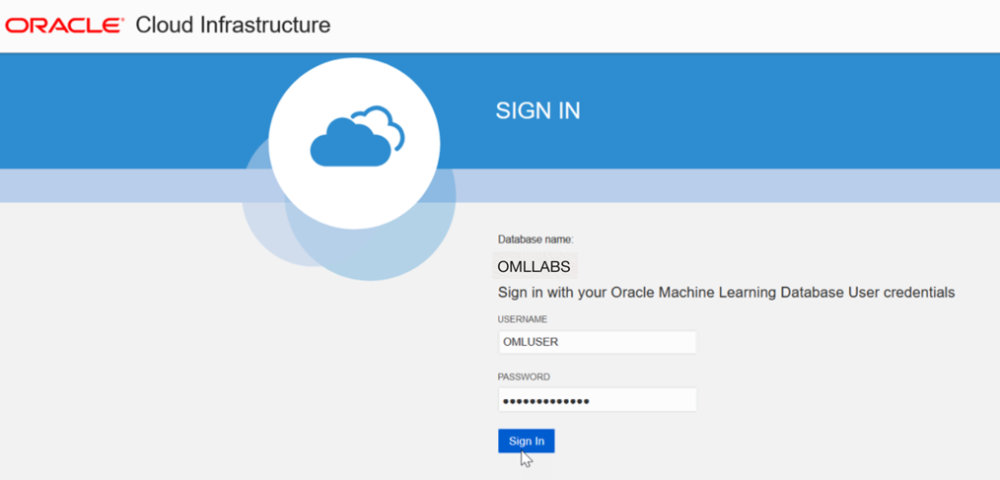
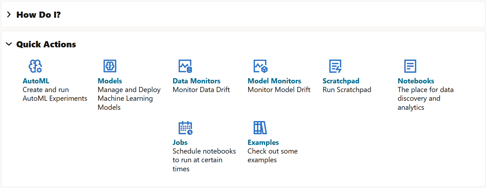
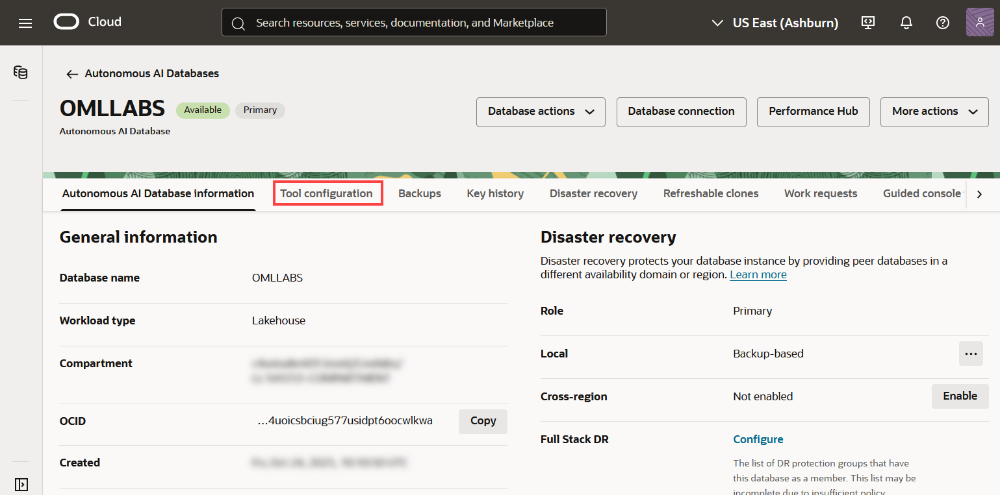

<!--
    {
        "name":"Sign into Oracle Machine Learning UI from databae actions",
        "description":"Steps to sign into Oracle Machine Learning UI from database actions"
    }
-->

You can access Oracle Machine Learning User Interface from Autonomous Database. Oracle Machine Learning User Interface provides you the following functionalities: 

* Notebooks - A web-based interface for data analysis, data discovery, data visualization, and collaboration
* AutoML UI - An interface for no-code automated machine learning modeling and model deployment
* Models - For model deployment
* Monitoring - For data monitoring and model monitoring
* Templates - A repository of example template notebooks, and a space to store your notebooks as personal templates, and share notebooks
* Jobs - An interface to create jobs to schedule your notebooks

To access Oracle Machine Learning User Interface:

1. On your Oracle Autonomous Database console, click **Database actions**, and then select the option **View all database actions**.

	

	 If you had it already open in the Database Users section, you can go to Database Actions home page by clicking **Database Actions** on the top left corner of the page, as shown in the screenshot below.

	

2. On the Database Actions page, go to **Development** and then go to **Machine Learning**. Click **Open.** You may also click directly on **Machine Learning.** This opens the Oracle Machine Learning user interface sign in page.

	 

3. Enter your user credentials and click **Sign in**.

	> **Note:** The credential is what you have defined while creating the Oracle Machine Learning user.

	

  This opens the Oracle Machine Learning user interface home page.

	

>**Note:**  Alternatively, you can also access the URL for the Oracle Machine Learning sign in page directly from the ADB Console Tool configuration tab. 

To access the URL for the Oracle Machine Learning sign in page directly from the ADB Console **Tool configuration** tab:

1. Go to your Autonomous Database details page and click **Tool configuration**. 

	

2. Go to the **Oracle Machine Learning user interface** section and click **Copy.** Paste the URL on the browser to sign into Oracle Machine Learning user interface.

	

This completes the task of signing into Oracle Machine Learning user interface.

