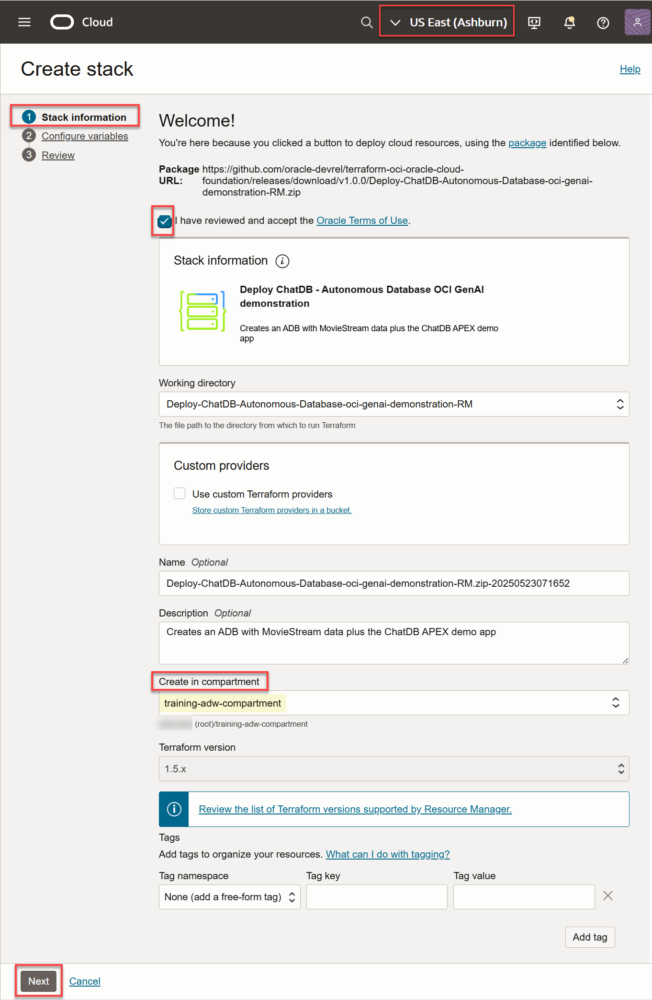
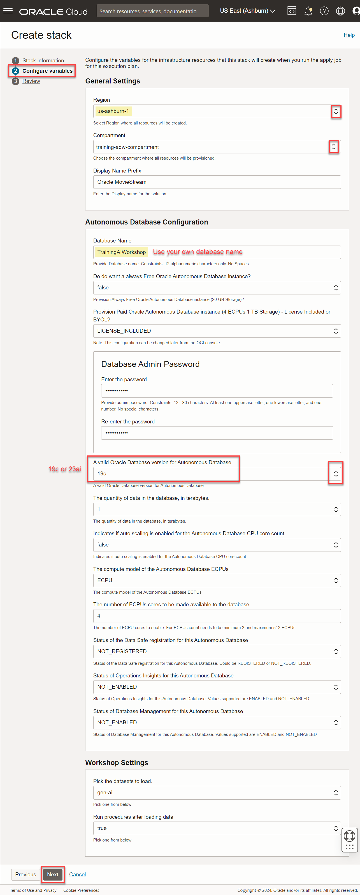
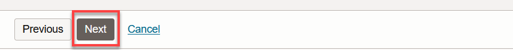
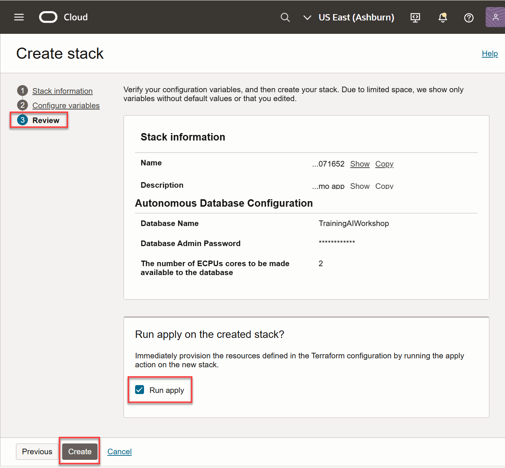
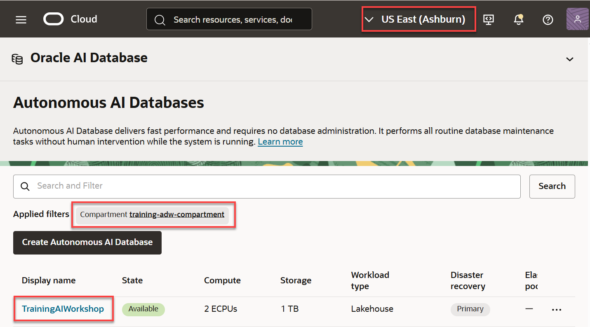

<!--
    {
        "name":"Provision ADB with Select AI using Resource Manager Stack",
        "description":"Deploys a database and data using a stack. Specify variable 'terraform_url' for the pointer to the stack",
        "author": "Marty Gubar",
        "lastUpdated": "April 2025"
    }
-->

Use an OCI Cloud Stack to set up your workshop environment by creating an ADB instance, upload the data to the instance, and install the Select AI demo application that was built using APEX.

1. Deploy the required cloud resources for this workshop using the OCI Resource Manager. Click the button below:
    
    <a href="" class="tryit-button">Deploy workshop</a>

    The automation uses a predefined OCI Cloud Stack Template that contains all of the resources that you will need in this workshop. You'll use OCI Resource Manager to deploy this template and make your environment available in just a few minutes. Your first step will be to log in to Oracle Cloud. Next, you will land on the Resource Manager page where you will kick off a job that will do the following:
    * Create a new Autonomous Database named **** by default; however, you can replace the database name with your own name.
    * Create a new user named **`moviestream`**
    * Create movie related tables and views in the **`moviestream`** schema
    * Grant the required privileges to perform various actions in the workshop
    * Download the **Autonomous Database Select AI** APEX application

    >**Note:** For detailed information about Resource Manager and managing stacks in Resource Manager, see the [Overview of Resource Manager](https://docs.oracle.com/en-us/iaas/Content/ResourceManager/Concepts/resourcemanager.htm#concepts__package) and [Managing Stacks](https://docs.oracle.com/en-us/iaas/Content/ResourceManager/Tasks/stacks.htm) documentation.

2. After you log in to your Oracle Cloud account, the **Create stack** page is displayed. In the **Stack information** step 1 of the wizard, select the **I have reviewed and accept the Oracle Terms of Use** check box. In the **Create in compartment** drop-down list, select your desired compartment. Accept the default values for the rest of the fields, and then click **Next**.

    >**Note:** When you access the **Create Stack** page, the **US East (Ashburn)** region is selected by default. This is where the stack will be created. If you want to create the stack in a different region, select that region from the **Regions** drop-down list in the Console's banner.

    

3. In the **Configure variables** step 2 of the wizard, provide the following:
    * **Region:** Select the target region for the new Autonomous Database instance. In our example, we chose the `us-ashburn-1` region.
    * **Compartment:** Select the target compartment for the new Autonomous Database instance.
    * **Database Name:** The default database name is ****. _Replace this name with your own database name_. In our example, we changed the database name to **``TrainingAIWorkshop``**. The database name must contain only letters and numbers, starting with a letter, and between 12 and 30 characters long. The name cannot contain the double quote (") character, space, underscore "_", or the username `admin`.

        >**Note:** Your database name that you choose must be unique in the tenancy that you are using; otherwise, you will get an error message.

    * **Do you want an always Free Oracle Autonomous Database instance?** Accept the default **`false`** value. Select **`true`** from the drop-down list if you want to deploy an Always Free database.

        

    * **Password:** Enter a password for the `ADMIN` user of your choice such as **`Training4ADW`**. **Important**: Make a note of this password as you will need it to perform later tasks.
    
        >**Note:** In the **Workshop Settings** section, if a **Secret API key used to connect to AI model** field is displayed, that is not **_not Required_** for this Lab since OCI Generative AI does not use a secret key for Resource Operations.
   
    * For the other fields, accept the default selections. For the **A valid Oracle Database version for Autonomous Database** field, you can click the drop-down list and select the database version as either **19c** or **23ai**.
    
        

4. Click **Next**. If clicking **Next** does not take you to the page 3 of the wizard, check the **Region** field. It may have been reset.

    

5. In the **Review** step 3 of the wizard, review your configuration variables and make any necessary changes on the previous pages. If everything looks good, then it's time for you to create and apply your stack! Ensure that the **Run apply** check box is checked, and then click **Create**.

    

6. The **Job details** page is displayed. The initial status (in orange color) is **ACCEPTED** and then **IN PROGRESS**.

  

  If the job completes successfully, the status changes to **SUCCEEDED** (in green color). This process can take 5 to 10 minutes to complete.

  

7. Scroll-down to the **Resources** section at the bottom of **Job details** page, and then click **Outputs**. The keys and values are displayed in the **Outputs** section.

    

8. Save the values for the following keys in a text editor of your choice as you will need this information later. For the **`select_ai_demo_url`** value, click the **Copy** button in that row to copy the value into the clipboard, and then paste it into your text editor. _This is the URL that you will use later to launch the **Autonomous Database Select AI** demo application._

    * **`adb_user_name`**
    * **`adb_user_password`**
    * **`select_ai_demo_url`**

      

## Task 4: Review Your Deployment

1. Let's view the newly created stack and job. From the Console, open the **Navigation** menu.

    

2. Click **Developer Services**. Under **Resource Manager**, click **Stacks**.

    

    The newly created stack is displayed in the **Stacks** page. Select the region and compartment that you specified when you deployed the stack.
    
    
    
3.  Click the stack name. The **Stack details** page is displayed.

    

4.  In the **Jobs** section, click the job name. The **Job details** page is displayed.

    

    You can use the **Logs** section to view the created resources such as the **moviestream** user. You can also use the **Output** link in the **Resources** section to find out the values of different keys.

    The **Logs** section is useful when you have a failed job and you try to find out why it failed. In the following failed job example, we scrolled down the log and then searched for text in red font color which describes the potential problem. In this specific example, we specified a database name with an underscore which does not meet the requirements for a database name.

    

## Task 5: Navigate to Your New Autonomous Database Instance

Let's view the newly provisioned ADB instance.

1. From the Console, open the **Navigation** menu and click **Oracle Database**. Under **Autonomous Database**, click **Autonomous Data Warehouse**.

2. On the **Autonomous Databases** page, select the _compartment and region_ that you specified in the **Configure variables** step 2 of the wizard. The Autonomous Database that was provisioned by the stack is displayed, **``TrainingAIWorkshop``**.

    