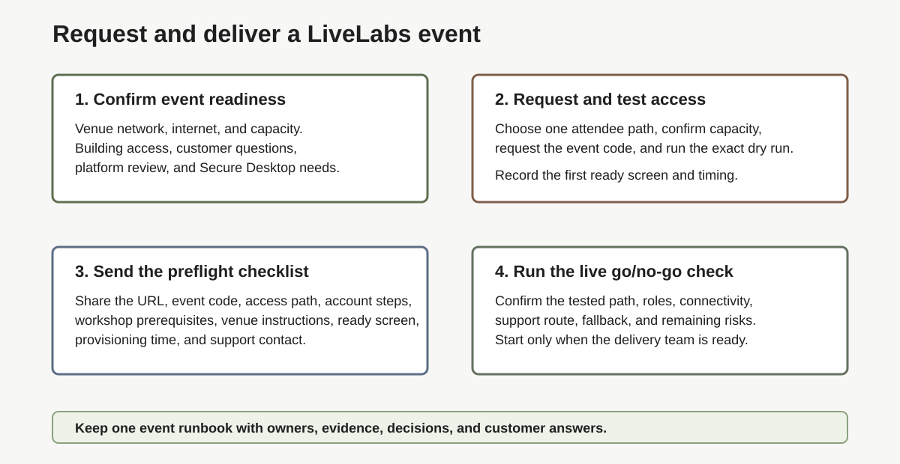

# Request and Deliver a LiveLabs Event

## Introduction

Use this guide to request, prepare, test, deliver, and document a customer-facing Oracle LiveLabs event without searching through repeated checklists.

### Objectives

In this workshop, you will:

- Build one event delivery plan.
- Test the attendee path before the event.
- Confirm the final readiness decision before delivery.

## Delivery Path Summary

Use this table when you need the delivery plan quickly.

| Lab | Quick Check | What You Need To Do |
| --- | --- | --- |
| [Lab 1](?lab=lab-1-build-facilitation-runbook) | Build the facilitation runbook. | Confirm venue network, internet, capacity, building access, customer questions, platform-team coordination, and Secure Desktop needs. Then assign the facilitator, screen driver, chat/support owner, technical SME, and event coordinator. |
| [Lab 2](?lab=lab-2-request-livelabs-event-code) | Confirm event code, access, and capacity. | Request or verify the event code, choose Sandbox or Own tenancy, confirm the date, time zone, attendee count, provisioning plan, and support details. For 50 or more attendees, contact the Oracle LiveLabs Team. |
| [Lab 3](?lab=lab-3-run-workshop-test-green-button-path) | Test the attendee path. | Run the workshop like an attendee with the same account, URL, network, browser, and access path. Record the first ready screen, provisioning time, and issues. |
| [Lab 4](?lab=lab-4-send-attendee-preflight-prerequisites) | Prepare attendees. | Send the verified attendee URL, event code, access path, author-provided prerequisites, venue/access requirements, Oracle account steps, first ready screen, expected provisioning time, and support contact early. |
| [Lab 5](?lab=lab-5-run-live-prep-checks) | Run the live opening check. | Confirm the verified event values, roles, support route, fallback, and final readiness state before hands-on work starts. |
| [Lab 6](?lab=lab-6-how-to-troubleshoot-common-issues) | Keep troubleshooting ready. | Use the symptom table, route issues, capture evidence, and keep individual blockers from stopping the main session. |

## Account Rules

- Do not share a personal Oracle account with attendees.
- Confirm the account-team representative understands the delivery plan and owns any remaining account-team actions.
- Store final delivery notes in the approved event system so the team can find the decision later.

## Acknowledgements

- **Author:** Oracle LiveLabs Team, July 2026
