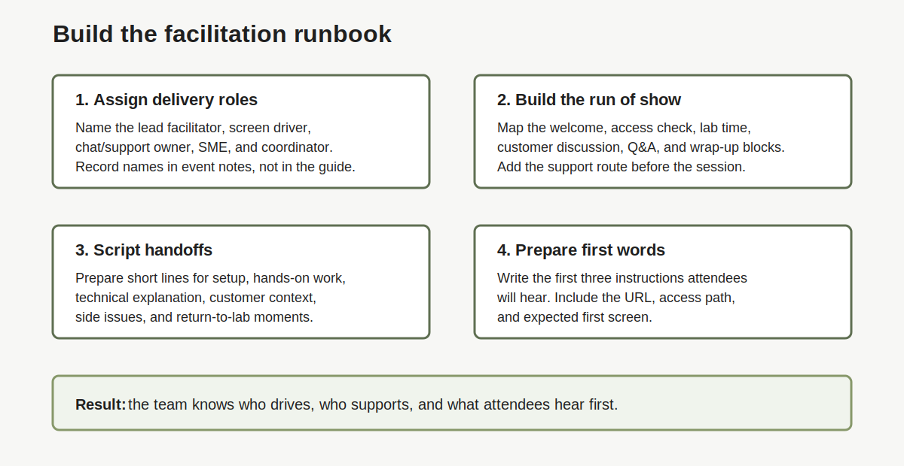

# Lab 1: Build the Facilitation Runbook

## Introduction

A LiveLab delivery team needs one clear flow. The customer should not watch presenters decide who drives, who speaks, or where to click.

In this lab, you confirm the [delivery roles](#legend), session flow, and handoff lines that keep the event moving.

### Objectives

In this lab, you will:

- Confirm delivery roles.
- Define the session flow.
- Script handoffs between talk, setup, hands-on lab, custom demo, Q&A, and wrap-up.
- Route side issues to chat or a parking lot.
- Prepare the first three instructions attendees will hear.



## Task 1: Confirm Roles

1. Review the [role map](#legend).

    | Role | What This Role Does |
    | --- | --- |
    | [Lead facilitator](#legend) | Owns flow, timing, handoffs, and spoken lines. |
    | [Screen driver](#legend) | Shares screen and performs lab steps. |
    | [Chat/support owner](#legend) | Watches chat, answers access topics, and escalates common blockers. |
    | [Technical SME](#legend) | Handles deeper architecture and workshop-specific topics. |
    | [Event coordinator](#legend) | Sends prerequisites, confirms event code, and tracks readiness. |

2. Name the people for these roles in your event notes, not in this guide.

3. For a small event, one person may cover more than one role.

4. Confirm that no one plans to hand attendees a personal Oracle account.

## Task 2: Build the Run of Show

1. Start with this flow.

    | Time | Block | Purpose |
    | --- | --- | --- |
    | 0:00-0:10 | Welcome, roles, and prep check | Confirm access state and first screen. |
    | 0:10-0:20 | Access and lab space start | Start event code, sandbox, or tenancy path. |
    | 0:20-0:35 | Introduction while lab spaces build | Use provisioning time productively. |
    | 0:35-1:15 | Hands-on lab | Complete core lab steps. |
    | 1:15-1:35 | Customer discussion or demo | Connect the lab to the event scenario. |
    | 1:35-1:45 | Wrap-up and next steps | Close and assign follow-up. |

2. Adjust this sequence in your event runbook.

3. Mark blocks that change when the lab space starts early.

4. Add a [support channel](#legend) for blocked attendees.

## Task 3: Script Handoffs

1. Write the [handoff](#legend) lines before the session.

    ```text
    We are leaving setup and starting the hands-on lab.
    We are switching from the official lab to a short customer-specific example.
    We are pausing hands-on work for a technical explanation.
    We are returning to the lab steps.
    We are moving individual access issues to chat so the group can continue.
    ```

2. Add event-specific handoff lines.

3. Make the lead facilitator responsible for calling each handoff.

## Task 4: Prepare the First Three Instructions

1. Write the first three instructions attendees will hear.

    ```text
    1. Please open [LiveLab URL] in your browser.
    2. Click [event code path, sandbox path, or tenancy path].
    3. Confirm in chat when you see [expected first screen].
    ```

2. Confirm that the chat/support owner knows how to triage responses.

3. Keep these instructions visible to the presenter team.

## Legend

| Term | Meaning | Why It Matters |
| --- | --- | --- |
| Chat/support owner | Person who watches chat and routes access issues. | Keeps side issues from stopping the main flow. |
| Delivery role | Assigned work for the live session. | Prevents presenters from negotiating ownership live. |
| Event coordinator | Person who tracks ready state and event-code logistics. | Keeps prep, invites, and status updates moving. |
| Handoff | Short line that moves the group from one segment to another. | Makes transitions clear for attendees. |
| Lead facilitator | Person who owns flow, timing, and spoken guidance. | Keeps the session coordinated. |
| Role map | Table that lists each delivery role and work area. | Shows gaps before the event starts. |
| Run of show | Time-based session plan. | Helps the team manage access checks, lab time, and wrap-up. |
| Screen driver | Person who shares screen and performs lab steps. | Gives attendees one visible path to follow. |
| Support channel | Chat, bridge, or other route for blocked attendees. | Lets support continue while the session moves. |
| Technical SME | Subject matter expert for deeper technical questions. | Routes advanced questions to the right owner. |

## Acknowledgements

- **Author:** Oracle LiveLabs Team, July 2026
