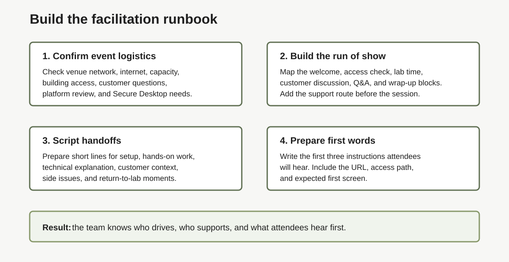

# Lab 1: Build the Facilitation Runbook

## Introduction

Assign the delivery team, set the session flow, and script the handoffs before attendees join. Confirm the [delivery roles](#legend) before the live session starts.

### Objectives

In this lab, you will:

- Confirm delivery roles.
- Build the run of show.
- Script handoffs and the first three attendee prompts.

Estimated Time: 15 minutes



Use this lab to record the event-specific people, timing, backups, status, venue logistics, and delivery notes.

## Task 0: Confirm Venue and Customer Logistics

1. Confirm with the venue team, before the event:

    - The room has a working network connection;
    - The network has access to the internet and permits the LiveLabs attendee path, including any required browser, noVNC, or Secure Desktop traffic;
    - The network has enough capacity for the planned number of workshop students; and
    - Building access, visitor registration, room access times, badges, parking, and other arrival details are arranged for the delivery team and attendees.

    Record who confirmed each item, when it was confirmed, and what fallback applies if a check fails.

2. Ask the customer what they need to know before the event. Capture answers in the event runbook, including any requested agenda, architecture, security, account, access, or support information.

3. Ask the platform team to review the event, including smaller events, so they can check that another event is not consuming the required shared capacity. Record the review owner and outcome.

4. Determine in advance whether attendees require Secure Desktops. If they do, confirm availability, access instructions, network requirements, and the tested fallback before sending the attendee message.

## Task 1: Confirm Roles

1. Assign every role in this [role map](#legend).

    | Role | What This Role Does |
    | --- | --- |
    | [Lead facilitator](#legend) | Owns flow, timing, handoffs, and spoken lines. |
    | [Screen driver](#legend) | Shares screen and performs lab steps. |
    | [Chat/support owner](#legend) | Watches chat, answers access topics, and escalates common blockers. |
    | [Technical SME](#legend) | Handles deeper architecture and workshop-specific topics. |
    | [Event coordinator](#legend) | Sends prerequisites, confirms event code, and tracks the go/no-go state. |

2. One person may cover several roles for a small event, but every role must have an owner.

3. Record each owner and backup in the event runbook.

## Task 2: Build the Run of Show

1. Adapt this flow to the event.

    | Time | Block | Purpose |
    | --- | --- | --- |
    | First 10 minutes | Welcome and access check | Confirm the attendee path and first screen. |
    | Setup | Launch and context | Start lab spaces; use the wait for product context. |
    | Main session | Hands-on lab and discussion | Complete core work and connect it to the event scenario. |
    | Final 10 minutes | Wrap-up | Close and assign follow-up. |

2. Record the event timing, owners, and backups in the event runbook.

3. Mark what changes if lab spaces start early, and name the [support channel](#legend) for blocked attendees.

## Task 3: Script Handoffs

1. Write each [handoff](#legend) as a next step and target owner.

    ```text
    We are leaving setup and starting the hands-on lab at [step].
    We are moving individual access issues to chat so the group can continue.
    We are returning to the lab at [step].
    ```

2. Make the lead facilitator own every handoff. Record the event-specific lines in the event runbook.

## Task 4: Prepare the First Three Instructions

1. Complete these lines with the values tested in Labs 2 and 3.

    ```text
    1. Please open [LiveLab URL] in your browser.
    2. Click [event code path, sandbox path, or tenancy path].
    3. Confirm in chat when you see [expected first screen].
    ```

2. Record the final lines in the event runbook and keep them visible to the presenter team.

3. Confirm that the chat/support owner can triage responses without stopping the main session.

## Legend

| Term | Meaning |
| --- | --- |
| Chat/support owner | Person who watches chat and routes access issues. |
| Delivery role | Assigned work for the live session. |
| Event coordinator | Person who tracks ready state and event-code logistics. |
| Handoff | Short prompt that moves the group to the next step or support route. |
| Lead facilitator | Person who owns flow, timing, and spoken help. |
| Role map | Table that lists each delivery role and work area. |
| Run of show | Time-based delivery plan. |
| Screen driver | Person who shares screen and performs lab steps. |
| Support channel | Chat, bridge, or other route for blocked attendees. |
| Support route | Chat, bridge, or other path for individual blockers. |
| Technical SME | Subject matter expert for deeper technical questions. |

## Acknowledgements

- **Author:** Oracle LiveLabs Team, July 2026
