# Lab 2: Request a LiveLabs Event Code

## Introduction

A LiveLabs [event code](#legend) creates a managed [event page](#legend). It captures dates, user counts, links, and approvals before attendees see the path.

### Objectives

In this lab, you will:

- Collect the workshop details required for an event-code request.
- Request an event code.
- Populate workshop fields and verify workshop links.
- Set [green button](#legend) user counts and time values when needed.
- Capture approval and handoff details for attendee messages.

<!-- Estimated Time: intentionally not shown in this readiness guide. -->

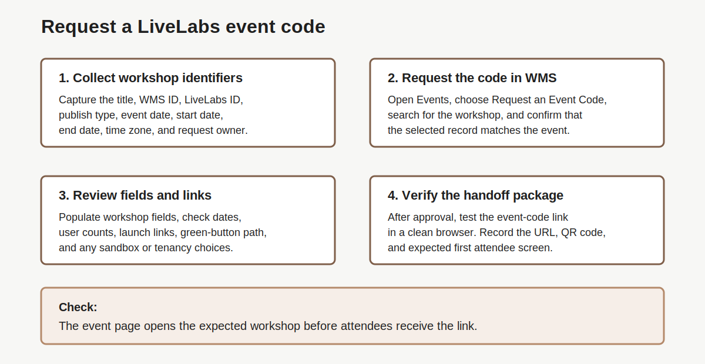

## Task 1: Review event request flow and collect inputs

1. Review the event-code request flow.

    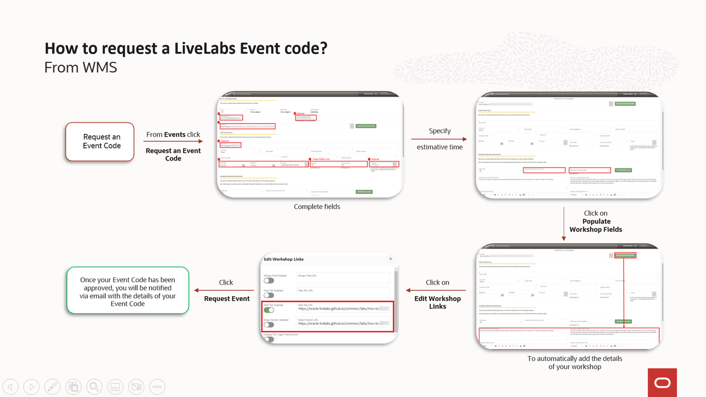

2. Record the workshop you want to use for the event.

    Capture the identifier the workshop owner can confirm.

    | ID | Example |
    | --- | --- |
    | Workshop Title | Load And Analyze Your Data With Oracle Autonomous AI Database |
    | [WMS ID](#legend) | 141 |
    | [LiveLabs ID](#legend) | 582 |

3. Confirm the workshop is ready for an event-code request.

    Before anyone creates the request, confirm the workshop status with the owner, author notes, or WMS record. The workshop must use **Completed** status and an eligible [publish type](#legend).

    | Publish Type | Meaning | Event-Code Eligible? |
    | --- | --- | --- |
    | Public | Appears in the public LiveLabs catalog. Users can find it through normal LiveLabs discovery. | Yes |
    | Event | Supports controlled event-code access. Use it when the workshop should not rely on broad catalog discovery. | Yes |
    | Private | Has a WMS entry. Public and event-code discovery do not show it. | No |
    | Disabled | Removes the WMS entry from live access until the team republishes it. | No |

    The publish-type dropdown shows the available values.

    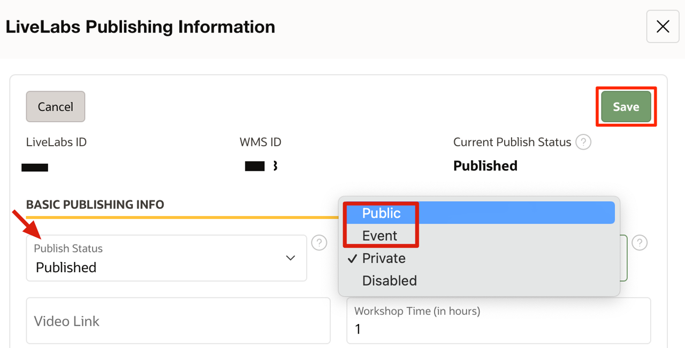

4. Capture the basic event request details.

    Gather these author-side values before the delivery-prep meeting.

    | Field | Meaning | Details |
    | --- | --- | --- |
    | Event requestor | Person who submits the request. | Name and email address. |
    | Contacts to notify | Other people who should receive event request updates. | Names, email addresses, or team aliases. |
    | Event title | Customer-facing or internal event name. | Use the title attendees or coordinators will recognize. |
    | [Event date](#legend) | Actual day the event starts. | Use the confirmed calendar date for the customer or internal event. |
    | [Start date](#legend) | Date when the event-code [cron job](#legend) should run and create the code. | Set this at least one day before the event date. |
    | [End date](#legend) | Date when the event-code cron job should end the event safely. | Set this one day after the actual event ends. |
    | Time zone | Time zone that applies to the event window. | Use the confirmed event time zone. |
    | Workshop title, WMS ID, or LiveLabs ID | Workshop that the event code should launch. | Provide the clearest identifier available. |

## Task 2: Request the Event Code in WMS

1. Open the [Workshop Management System (WMS)](#legend), go to **Events**, and click **Request an Event Code**.

    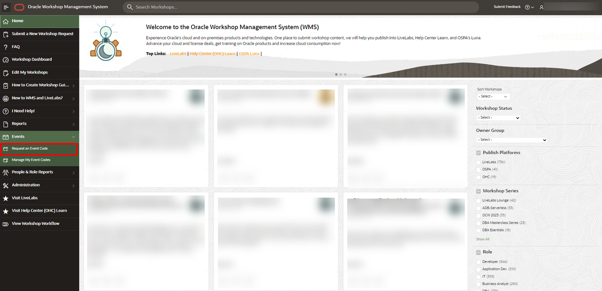

2. Search for the workshop in the request form.

    Use the workshop title, WMS ID, or LiveLabs ID from Task 1. Confirm the selected workshop matches the author-side IDs before you continue.

    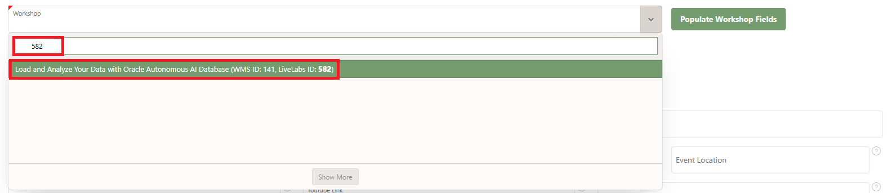

3. Complete the event request form.

    Use this table while you fill out the WMS form.

    | Field | Meaning | Example |
    | --- | --- | --- |
    | Event requestor | Person responsible for the event-code request and follow-up. Use an Oracle email address. | `event-requestor@oracle.com` |
    | Other people to notify | Oracle people or aliases who should receive request updates and approval emails. Separate email addresses with commas. | `event-support-team-member@oracle.com` |
    | Workshop | Workshop that the event code should launch. Search by workshop title, WMS ID, or LiveLabs ID. | `Load and Analyze Your Data with Oracle Autonomous AI Database (WMS ID: 141, LiveLabs ID: 582)` |
    | Event title | Title attendees or coordinators will recognize on the event page. | `Load and Analyze Your Data with Oracle Autonomous AI Database` |
    | Event date | Actual day the event starts. Attendees join on this date. | `7/15/2026` |
    | Start date | Event-code cron job launch date. Set it at least one day before the event date. This gives you time to verify the code. | `7/14/2026` for a `7/15/2026` event |
    | End date | Event-code cron job end date. Set it one day after the actual event ends. This keeps resources from ending early. | `7/16/2026` for a one-day event on `7/15/2026` |
    | Time zone | Time zone for the event window. Use the confirmed local event time zone. | `UTC (+00:00)` |
    | [Tenancy](#legend) | OCI tenancy for the event. Leave blank unless LiveLabs confirms one. [LiveLabs Sandbox](#legend) chooses tenancy automatically. A wrong tenancy can break the workshop. | Leave blank, or select only the tenancy LiveLabs confirms. |

    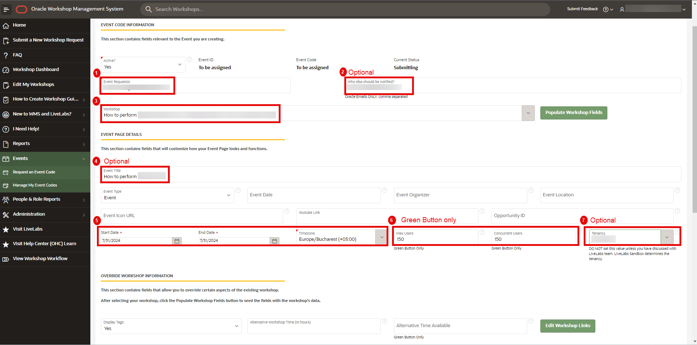

    WMS shows the event date, start date, end date, time zone, user counts, and tenancy fields together.

4. Add green-button user counts only when the event uses the green-button flow.

    Record two values: [maximum users](#legend) and [concurrent users](#legend).

5. Set the participant completion window.

    Enter the time a participant needs to complete the workshop. For green-button events, also enter how long users have to finish.

    The maximum value is 8 hours. If the event needs more time, explain why in **Remarks to the LiveLabs team**.

    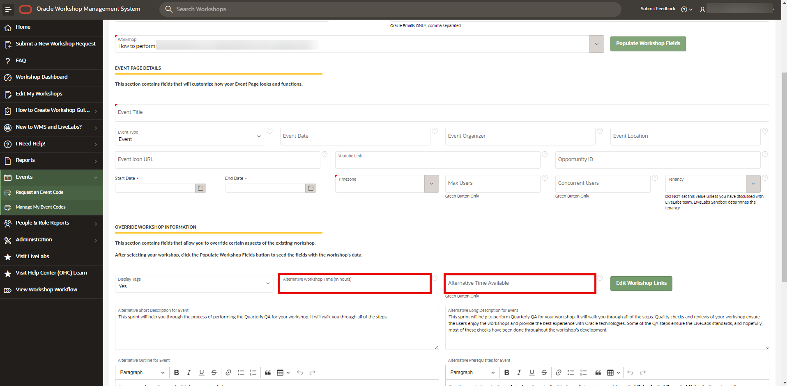

## Task 3: Choose the Attendee Access Path and Account Setup

1. Choose one primary attendee path and put it in the invite. Do not ask attendees to choose between paths during the event.

    | Path | Use It When | Facilitator Check |
    | --- | --- | --- |
    | Event code | Attendees need the event-specific LiveLabs page. | Test the verified event-code link in a clean browser. |
    | Green button: LiveLabs Sandbox | Attendees need an Oracle-provided, managed lab environment. | Test reservation, launch, and the expected first screen. |
    | Brown button: Run on your own tenancy | Attendees have an approved OCI tenancy and can create their own resources. | Confirm region, compartment, policies, quotas, and required OCI access. |

2. Explain the buttons before anyone clicks them. The **green button** reserves a managed LiveLabs Sandbox. The attendee selects the supplied credentials, launches the OCI environment, then opens the application or APEX when the workshop directs them there. The **brown button** uses the attendee or customer OCI tenancy; it does not reserve a sandbox and needs tenancy preparation.

3. Include this Oracle-account tutorial in the attendee preflight message:

    1. Go to the verified event or workshop URL and select the required sign-in option.
    2. Select **Create Account** if the attendee has no Oracle account. Use an email address the attendee can open during the session.
    3. Complete the verification email and return to the same event link.
    4. Sign in before the event and confirm the expected event page. Route account failures to support; do not share a facilitator's personal account.

4. List only the credentials that the selected path needs. Remove **Database user** unless the workshop explicitly requires a database schema or user. Add an **application user** only when attendees must sign in to a demo application after the OCI or APEX environment starts; state the app URL, who provides the user, and the first screen it should open.

## Task 4: Plan Capacity, Provisioning, and Presentation Time

1. Use this decision before you submit the event request.

    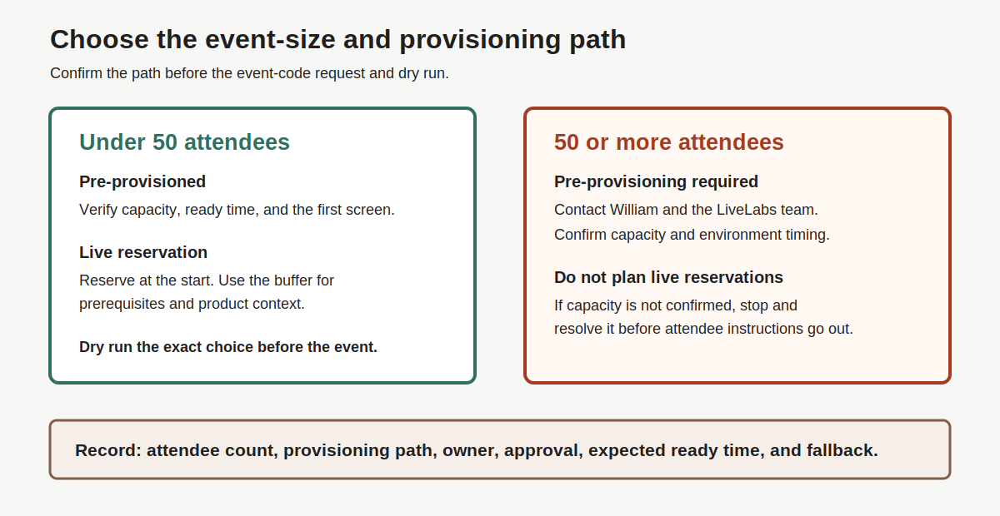

2. For an event of **50 or more attendees**, contact William and the LiveLabs team before submitting the event request. Confirm capacity and pre-provision the green-button lab spaces; do not rely on live reservations at that scale.

3. Choose the provisioning model.

    | Model | Use When | Presentation Plan |
    | --- | --- | --- |
    | Pre-provisioned | Capacity is approved, especially for 50+ attendees. | Verify access before the event; begin hands-on work after the opening. |
    | Live reservation | The workshop is not pre-provisioned. | Reserve first, then use the wait time for product context. |
    | Watch-only fallback | An attendee cannot reserve or access the path. | Keep the attendee with the presentation and follow up after the event. |

4. Put a reservation buffer in the run of show. For example, at a 9:00 AM start, use the first 10 minutes to explain prerequisites and have attendees sign in, connect, and reserve the workshop. If the environment takes the stated number of minutes to provision, present the product or architecture while reservations finish. Start the hands-on presentation only after reservations have completed and the expected environment is available.

5. Record the selected path, estimated reservation time, first presentation topic, network/WiFi readiness, Secure Desktop need, and watch-only fallback in the facilitation runbook.
## Task 5: Populate and Verify Workshop Details

1. Click **[Populate Workshop Fields](#legend)**.

    WMS adds the workshop details from the selected workshop.

    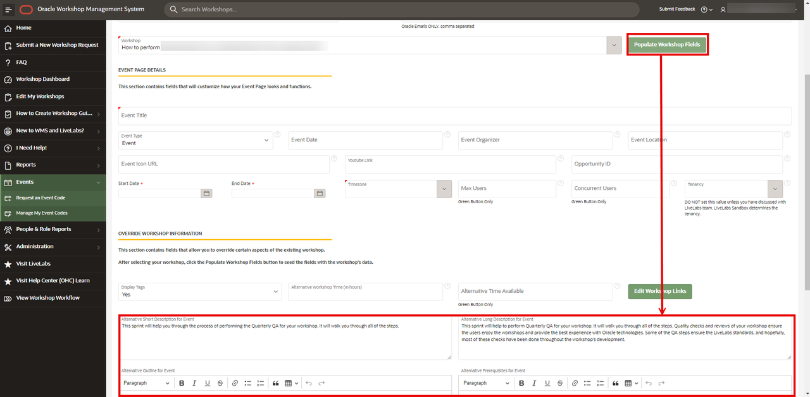

2. Review the populated workshop fields.

    Confirm the title, summary, outline, prerequisites, time, and links match the event.

3. Click **[Edit Workshop Links](#legend)**.

    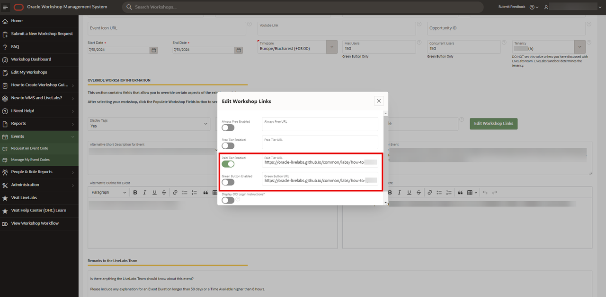

4. Verify each URL works.

    Check the attendee URLs. Include the event page, workshop page, and [green-button URL](#legend) when applicable.

    If the event page offers [Run on your own tenancy](#legend) ([brown button](#legend)) or LiveLabs Sandbox, verify each path.

5. Record the link checks.

    - Event page URL.
    - Workshop URL.
    - Green-button URL.
    - Links verified by.
    - Check date.

## Task 6: Submit the Event Request

1. Review the full request before submission.

    Confirm the dates, time zone, workshop ID, user counts, tenancy field, time, and remarks.

2. Click **Request Event**.

    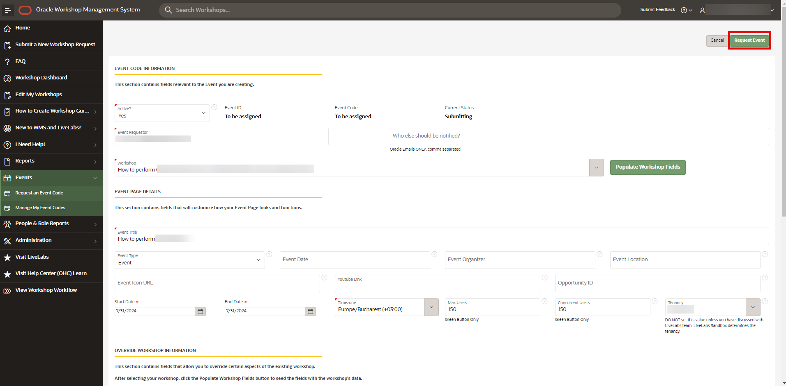

3. Record the request details.

    - Event code request date.
    - Target approval date.
    - WMS request owner.
    - Remarks added for the LiveLabs team.

4. Wait for approval.

    When the LiveLabs team approves the request, WMS sends an email with the event-code details.

## Task 7: Capture the Event Handoff

1. Record the approved event code details.

    - Event code.
    - [Event-code link](#legend).
    - QR code available: Yes / No.

2. Verify the event code before sharing it with attendees.

    Use a clean browser profile and confirm the event-code link opens the expected LiveLabs event page.

3. Record the attendee starting screen.

    - Expected first attendee screen.
    - Required sign-in: Yes / No.
    - Event code accepted: Yes / No.
    - Correct workshop shown: Yes / No.

4. Add the event code, event-code link, QR code, and first screen to the preflight email in Lab 4.

5. Add the same event path to the attendee invite or follow-up message.

## Legend

| Term | Meaning | Why It Matters |
| --- | --- | --- |
| Brown button | Launch choice for an attendee-owned tenancy. | It runs on demand and does not reserve a sandbox. |
| Concurrent users | Users expected to run the workshop at the same time. | Helps LiveLabs plan sandbox user count. |
| Cron job | Scheduled background process that creates, activates, or ends the event code. | Date fields control when this process runs. |
| Edit Workshop Links | WMS step for attendee URLs. | Use it when the event needs custom paths. |
| End date | Date when the event-code cron job ends the event. | Set it one day after the event ends so resources are not removed too early. |
| Event code | Custom access code and link for a focused LiveLabs event page. | Attendees use it to reach the event-specific workshop page. |
| Event date | Actual day the event starts. | This is the customer or internal session date. |
| Event page | LiveLabs page for the event code. It can show custom title, outline, prerequisites, video, and links. | This is the attendee starting point. |
| Event-code link | Direct URL that opens the approved event page. | Share this with attendees after you verify it. |
| Green button | Launch choice that reserves a LiveLabs Sandbox lab space. | Use it when attendees need managed resources. |
| Green-button URL | URL for the LiveLabs Sandbox launch path. | Verify it when the event uses green button. |
| LiveLabs ID | Unique production identifier for a LiveLabs workshop. | Use it to confirm the event points to the right workshop. |
| LiveLabs Sandbox | Pre-provisioned LiveLabs lab space. | Users can run a workshop without OCI Free Tier. |
| Maximum users | Total users expected for the event code. | Helps LiveLabs plan event size. |
| Populate Workshop Fields | WMS step that copies selected workshop metadata. | Use it before reviewing event page details. |
| Publish type | WMS publishing value for LiveLabs exposure. | Event-code requests can use Public or Event workshops. |
| Run on your own tenancy | Choice where attendees use their own OCI tenancy. | Also called the brown button path. |
| Start date | Date when the event-code cron job starts and creates the event code. | Set it at least one day before the event date. |
| Tenancy | OCI account boundary for resources, compartments, users, and policies. | Select one only when LiveLabs confirms the need. |
| WMS ID | Unique workshop identifier in WMS. | Use it when the workshop title looks similar to others. |
| Workshop Management System (WMS) | Internal system for workshops, publishing, and event-code requests. | Use WMS to request, review, and track the event code. |

## Acknowledgements

- **Author:** Oracle LiveLabs Team, July 2026
