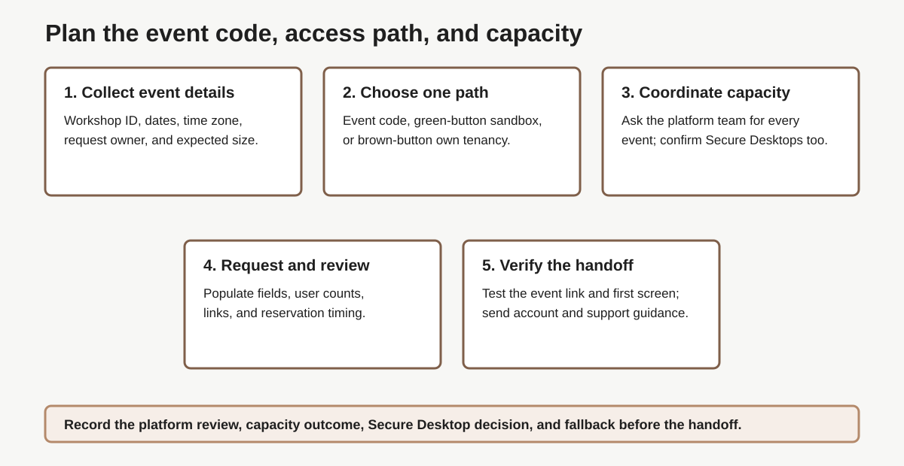
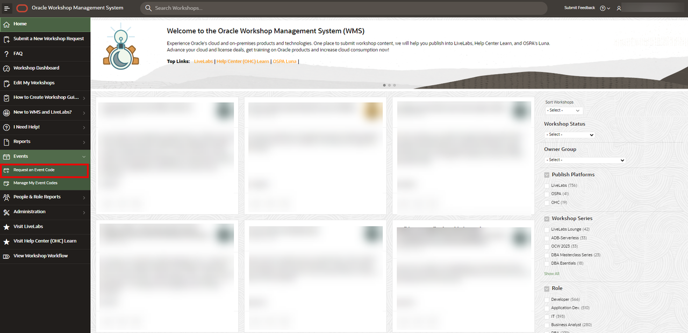
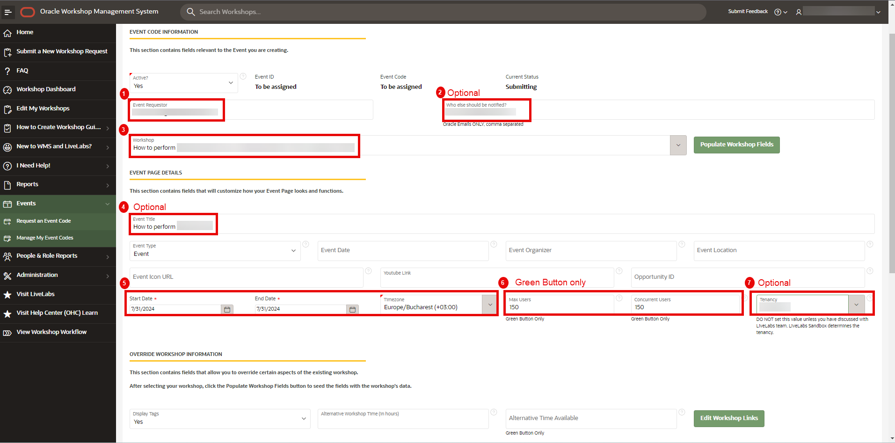
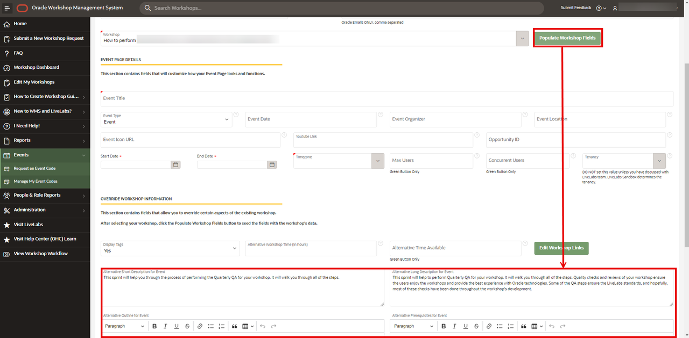
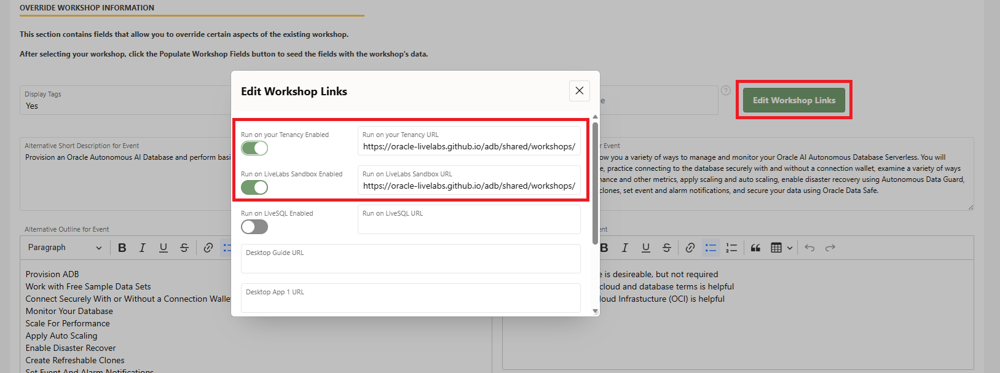

# Lab 2: Request a LiveLabs Event Code

## Introduction

Choose access, scale, and [WMS](#legend) values once. The approved [event code](#legend) values feed the path test, attendee message, and event notes.

### Objectives

In this lab, you will:

- Confirm that the workshop supports an event.
- Choose one attendee access and scale plan.
- Request and verify a LiveLabs event code in WMS.
- Hand the approved values to the next preparation steps.

Estimated Time: 20 minutes

## Task 1: Confirm Status, Access, and Scale

1. Confirm the workshop is ready.

    The workshop must have **Completed** status and an event-code-eligible [publish type](#legend):

    - **Public** and **Event** are eligible.
    - **Private** and **Disabled** are not eligible. Stop and ask the workshop owner to correct the status or publish type before you request an event code.

2. Choose one primary attendee path.

    - **[Event code](#legend):** Attendees start from the event-specific LiveLabs page.
    - **[Green button](#legend) - [LiveLabs Sandbox](#legend):** Attendees reserve an Oracle-managed lab environment.
    - **[Brown button](#legend) - [Run on your own tenancy](#legend):** Attendees use an approved OCI tenancy with the required region, compartment, policies, quotas, and access.

    Put only the selected path in the attendee instructions. Do not ask attendees to choose during the event.

3. Decide how lab spaces will be ready.

    For **50 or more attendees**, contact the **Oracle LiveLabs Team** before submitting the request. Confirm scale and pre-provision the green-button lab spaces. Do not rely on live reservations at this scale.

    For a smaller event that uses live reservations, allow time at the start for sign-in and provisioning. Plan a watch-only fallback for anyone who cannot obtain access.

4. Confirm the account model.

    Attendees must use an account they can verify and access during the event. Never share a personal Oracle account that belongs to a facilitator. List only the credentials required by the selected workshop path.

## Task 2: Complete the Event Request in WMS

1. In the [Workshop Management System (WMS)](#legend), open **Events** and select **Request an Event Code**. Click [here](https://livelabs.oracle.com/wms) to go to the WMS Platform.

    

2. Find the workshop by title, [WMS ID](#legend), or [LiveLabs ID](#legend). Check the selected record against the confirmed identifier from the workshop owner.

3. Complete the request from this single set of values.

    | Field or Value | Rule |
    | --- | --- |
    | Workshop | Use the confirmed title, [WMS ID](#legend), or [LiveLabs ID](#legend). The workshop must have **Completed** status and **Public** or **Event** [publish type](#legend). |
    | Event requestor | Use the Oracle name and email address of the person responsible for the request. |
    | Other people to notify | Add the Oracle people or team aliases that need approval updates. Separate addresses with commas. |
    | Event title | Use the title attendees and coordinators will recognize. |
    | [Event date](#legend) | Enter the actual start day. |
    | [Start date](#legend) | Set it **one day before** the event date so the team can verify the event code. |
    | [End date](#legend) | Set it **one day after** the actual event ends so the event does not close early. |
    | Time zone | Use the confirmed event time zone. |
    | [Tenancy](#legend) | Leave this blank unless the **Oracle LiveLabs Team** confirms a tenancy. [LiveLabs Sandbox](#legend) selects tenancy automatically; a wrong tenancy can break the workshop. |
    | Primary attendee path | Record the event-code, green-button, or brown-button path selected in Task 1. |
    | [Maximum users](#legend) and [concurrent users](#legend) | Enter these values when the event uses the green-button flow. Use the confirmed scale plan. |
    | Participant completion window | Enter the time needed to finish the workshop. The maximum is **8 hours**. |
    | Remarks to the LiveLabs team | Explain any time-window override and record scale or pre-provisioning details. |

    

4. Review the dates, time zone, workshop identifier, user counts, tenancy, completion window, and remarks before continuing.

## Task 3: Populate and Check the Workshop Details

1. Select **[Populate Workshop Fields](#legend)**.

    

2. Confirm that the title, summary, outline, prerequisites, expected time, and links match the selected workshop.

3. Select **[Edit Workshop Links](#legend)**.

    

4. Check that each applicable attendee URL opens the expected page:

    - [Event page](#legend).
    - Workshop page.
    - [Green-button URL](#legend).
    - [Brown-button](#legend) path.

    This is a WMS setup check. Complete the clean-browser, end-to-end path test in [Lab 3: Run the Workshop and Test the Green-Button Path](?lab=lab-3-run-workshop-test-green-button-path).

## Task 4: Submit and Hand Off the Approved Values

1. Select **Request Event** after the final review.

2. Record the request owner, request date, target approval date, and any remarks. WMS sends the event-code details by email after approval.

3. When approval arrives, confirm the event code, [event-code link](#legend), QR-code availability, and expected first attendee screen.

4. Keep those approved values for the Lab 3 test, the Lab 4 attendee preflight message, and the final event notes.

## Legend

| Term | Meaning |
| --- | --- |
| Brown button | Launch choice for an attendee-owned tenancy. |
| Concurrent users | Attendees who run the workshop at the same time. |
| Cron job | Scheduled background process that creates, activates, or ends the event code. |
| Edit Workshop Links | WMS step for attendee URLs. |
| End date | Date when the event-code cron job ends the event. |
| Event code | Custom access code and link for a focused LiveLabs event page. |
| Event date | Actual day the event starts. |
| Event page | LiveLabs page for the event code. |
| Event-code link | Direct URL that opens the approved event page. |
| Green button | Launch choice that reserves a LiveLabs Sandbox lab space. |
| Green-button URL | URL for the LiveLabs Sandbox launch path. |
| LiveLabs ID | Unique production identifier for a LiveLabs workshop. |
| LiveLabs Sandbox | Oracle-managed LiveLabs lab space. |
| Maximum users | Total users expected for the event code. |
| Populate Workshop Fields | WMS step that copies selected workshop metadata. |
| Publish type | WMS publishing value for LiveLabs exposure. |
| Run on your own tenancy | Choice where attendees use their own OCI tenancy. |
| Start date | Date when the event-code cron job starts and creates the event code. |
| Tenancy | OCI account boundary for resources, compartments, users, and policies. |
| WMS ID | Unique workshop identifier in WMS. |
| Workshop Management System (WMS) | Internal system for workshops, publishing, and event-code requests. |

## Acknowledgements

- **Author:** Oracle LiveLabs Team, July 2026
