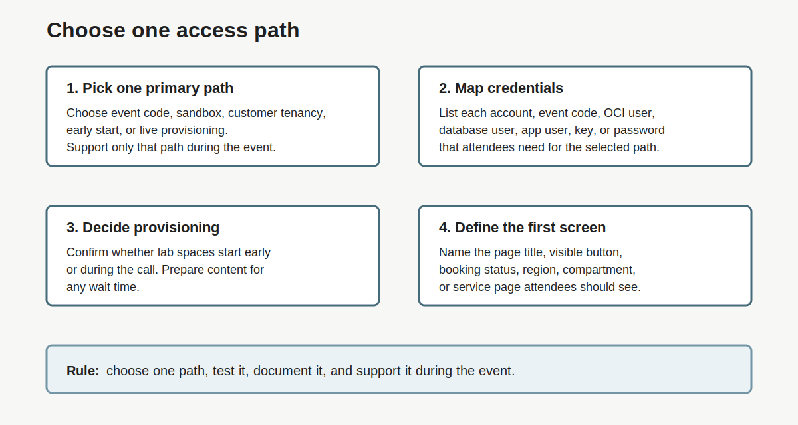

# Lab 3: Choose the Access Path Before the Event

## Introduction

The [access path](#legend) tells attendees how to enter the lab. Do not let attendees choose from several paths during the live session. Pick one path, test it, document it, and support that path during the event.

### Objectives

In this lab, you will:

- Choose the attendee access path.
- Map required accounts and credentials.
- Decide whether provisioning happens before or during the session.
- Record the expected first screen for attendees.
- Identify the support path for blocked attendees.

<!-- Estimated Time: intentionally not shown in this readiness guide. -->



## Task 1: Select One Primary Access Path

1. Choose and record the [primary access path](#legend) for this event.

    | Access Path | Use When | Prep Check |
    | --- | --- | --- |
    | Event code only | Attendees need a hidden or customized workshop page. | Test the event code link and login flow. |
    | LiveLabs sandbox | Attendees should reserve an Oracle-provided lab space. | Test the green-button or sandbox booking path. |
    | [Customer tenancy](#legend) | Attendees use their own OCI tenancy. | Confirm policies, compartments, regions, and quotas. |
    | [Early-start lab](#legend) | The team starts lab spaces before the event. | Confirm that this workshop supports early start. |
    | [Live provisioning](#legend) | Attendees start provisioning during the session. | Reserve time and plan content while lab spaces build. |

    Choose one row as the path the delivery team will support. Record the selected path in your delivery notes.

## Task 2: Map Accounts and Credentials

1. Create a [credential map](#legend) for this event.

    Use this checklist to keep the credential list current.

    | Checklist Item | What To Track |
    | --- | --- |
    | Create the credential map. | List each account, code, user, or password source attendees need. |
    | Remove credentials that do not apply. | Delete unused rows before you share instructions. |
    | Add workshop-specific credentials. | Add lab-specific schemas, demo users, keys, or application accounts. |
    | Mark the credential attendees must use first. | Make the first sign-in or access step obvious. |

2. Fill in the credential map.

    | Credential | Used For | Provided By | Use First? | Notes |
    | --- | --- | --- | --- | --- |
    | Oracle account | Sign in to Oracle LiveLabs | Attendee | Yes / No | Attendees create it and check email before the session. |
    | Event code | Join the event workshop page | Event team | Yes / No | Send before the session. |
    | OCI user | Access OCI tenancy or sandbox | Lab or tenancy owner | Yes / No | Confirm region, compartment, and permissions. |
    | Database user | Complete database steps | Lab instructions | Yes / No | Explain whether learners use ADMIN or another schema. |
    | App user | Use a demo app | Demo owner | Yes / No | Provide only if needed. |

## Task 3: Decide the Provisioning Model

1. Determine whether the workshop supports early start.

    Not every lab supports early start. Treat this as a workshop-specific choice.

2. Choose one [provisioning model](#legend).

    | Model | When To Use | Live Session Impact |
    | --- | --- | --- |
    | Early start | The team starts lab spaces before the call. | Use the opening only for access checks. |
    | Live provisioning | Attendees must reserve or start lab spaces themselves. | Start provisioning first, then present while lab spaces build. |
    | [Watch-only fallback](#legend) | Attendees cannot complete access during the call. | Keep them learning, then follow up after the event. |

3. Record expected timing.

    ```text
    Provisioning model:
    Expected provisioning time:
    First content to cover while provisioning runs:
    Watch-only fallback ready: Yes / No
    ```

## Task 4: Define the Expected Starting Screen

1. Write the [expected starting screen](#legend) attendees should see first.

2. Include the visible button, page title, or booking status.

3. Add this to the attendee preflight email.

4. If attendees use their own OCI tenancy, capture the region, compartment, and first service page.

5. Add this to the first 5 to 10 minutes of the run of show.

## Legend

| Term | Meaning | Why It Matters |
| --- | --- | --- |
| Access path | The single route attendees use to enter the workshop. | Keeps attendees from choosing different flows during the event. |
| Credential map | A list of accounts, codes, users, and password sources needed for the event. | Helps the delivery team remove unused credentials and highlight the first one attendees need. |
| Customer tenancy | Customer-owned OCI environment used for the workshop. | Requires policy, compartment, region, and quota checks before the event. |
| Early-start lab | Workshop setup where lab spaces start before attendees join. | Reduces live wait time when the workshop supports it. |
| Expected starting screen | Exact screen attendees should see after they follow the chosen path. | Helps facilitators spot wrong-path issues quickly. |
| Live provisioning | Workshop setup where attendees start lab spaces during the session. | Requires agenda time while resources build. |
| Primary access path | Main entry route the team chooses and supports for the event. | Prevents split instructions and mixed troubleshooting. |
| Provisioning model | Timing choice for when lab spaces start. | Drives agenda planning and attendee instructions. |
| Watch-only fallback | Backup learning mode for attendees who cannot complete access live. | Keeps blocked attendees engaged without stopping the group. |

## Acknowledgements

- **Author:** Oracle LiveLabs Team, July 2026
