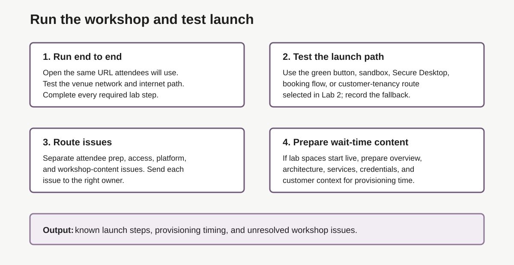

# Lab 3: Run the Workshop and Test the Green-Button Path

## Introduction

Test the exact attendee path selected in [Lab 2](?lab=lab-2-request-livelabs-event-code). Do not choose a new URL, access path, or [launch model](#legend) here. Prove the selected path, record what attendees will see, and capture proof for anything that fails.

### Objectives

In this lab, you will:

- Complete the workshop through the attendee URL and access path.
- Record every attendee step, the first ready screen, actual provisioning time, and [lab space](#legend) behavior.
- Capture repeatable defect proof for each [workshop-content issue](#legend).

Estimated Time: 20 minutes



## Task 1: Run the Attendee Path End to End

1. Copy the verified attendee URL, event code, access path, and provisioning model from Lab 2.

2. Start with a fresh attendee browser session. Follow every prompt, including account sign-in, event code, [booking](#legend), [consent checkbox](#legend), tenancy, region, compartment, credentials, or [SSH-key](#legend) steps that apply.

3. Complete every required workshop step. Record the exact attendee path and the first screen that confirms the lab space is ready.

4. Never use or share an Oracle account or credentials that belong to another person during the test.

## Task 2: Measure the Launch

1. Record:

    ```text
    Attendee URL:
    Access path:
    Start time:
    Ready time:
    Total provisioning time:
    First ready screen:
    Every attendee step:
    ```

2. Compare the measured time with the event agenda. If spaces start during the event, prepare a short opening block that covers the workshop goal, architecture, customer context, expected wait, and next attendee step.

## Task 3: Capture Defect Proof

1. For each failure, record:

    ```text
    Workshop, lab, and step:
    Attendee URL and access path:
    Expected result:
    Actual result:
    Timestamp:
    Impact:
    Screenshot or error text:
    Repeat steps:
    ```

2. Redact passwords, tokens, tenancy details, and personal data. If the workshop has an **[Acknowledgements section](#legend)**, note the owning team or contact with the proof.

3. Follow [Lab 6: How to Troubleshoot Common Issues](?lab=lab-6-how-to-troubleshoot-common-issues) for the standard diagnosis and support path. Do not duplicate those steps here.

4. Keep the verified URL, access path, first ready screen, measured time, and unresolved risks with the event notes.

## Legend

| Term | Meaning |
| --- | --- |
| Acknowledgements section | Workshop note that may list the owning team or contact. |
| Booking | Step that reserves a managed lab space. |
| Consent checkbox | Required check in some launch flows. |
| Dry run | Full practice run before the live event. |
| Lab space | Environment attendees use to complete hands-on tasks. |
| Launch model | Workshop-specific way to start the attendee lab space. |
| LiveLabs Authors Help Slack channel | [#livelabs-authors-help](https://oracle.enterprise.slack.com/archives/CTUPZQ5HA) Slack channel for LiveLabs authors and delivery teams. |
| Secure desktop | Browser-based desktop or remote workspace for a lab. |
| SSH key | Key pair used for secure command-line access. |
| Workshop-content issue | Problem in the lab instructions, screenshots, or steps. |

## Acknowledgements

- **Author:** Oracle LiveLabs Team, July 2026
