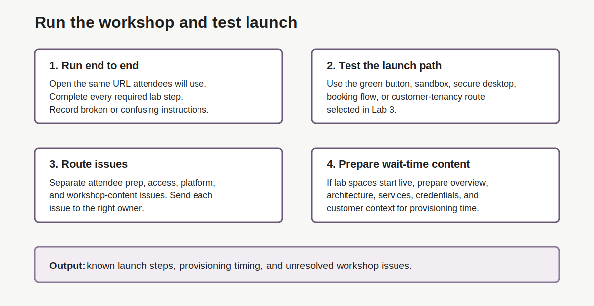

# Lab 4: Run the Workshop and Test the Green-Button Path

## Introduction

The speaker must run the workshop before the customer event. This [dry run](#legend) proves the steps, launch path, credentials, timing, and support notes.

In this lab, green button means the LiveLabs sandbox or launch path for the workshop. If the workshop uses a different [launch model](#legend), run that model instead.

### Objectives

In this lab, you will:

- Run the workshop as an attendee.
- Test the green-button or launch path.
- Capture provisioning time and broken steps.
- Escalate workshop issues through the right owner.
- Decide what to cover while [lab spaces](#legend) build.



## Task 1: Run the Workshop End to End

1. Open the workshop from the same URL attendees will use.

2. Use the same access path attendees will use.

3. Start at the first lab and complete every required step.

4. Record issues as you go.

    ```text
    Broken step:
    Confusing instruction:
    Missing permission:
    Credential issue:
    Provisioning issue:
    Screenshot mismatch:
    Time risk:
    ```

5. If the lab has an **[Acks section](#legend)**, record the workshop team or contact listed there.

## Task 2: Test the Green-Button or Lab space Path

1. Launch the lab space through the green-button, sandbox, [secure desktop](#legend), [booking](#legend), or customer-tenancy path selected in Lab 3.

2. Record the steps attendees must follow.

3. Record whether the flow asks for an [SSH key](#legend), booking time, [consent checkbox](#legend), tenancy selection, region, compartment, or user credentials.

4. Record actual provisioning time.

    ```text
    Launch path:
    Start time:
    Ready time:
    Total provisioning time:
    First ready screen:
    ```

5. Compare actual timing with the event agenda.

## Task 3: Escalate Workshop Issues

1. Separate delivery issues from [workshop-content issues](#legend).

    | Issue Type | Example | Route |
    | --- | --- | --- |
    | Delivery issue | Attendees did not receive event code. | Event team |
    | Access issue | Oracle account not verified. | Attendee or account team |
    | Workshop issue | Lab step broken or screenshot stale. | Workshop team and [LiveLabs Authors Help Slack channel](https://oracle.enterprise.slack.com/archives/CTUPZQ5HA) |
    | Platform issue | Sandbox provisioning fails. | LiveLabs support path |

2. Report workshop-content issues in the [LiveLabs Authors Help Slack channel](#legend), [#livelabs-authors-help](https://oracle.enterprise.slack.com/archives/CTUPZQ5HA).

3. Contact the workshop team for broken lab content.

4. Contact the event owner or account team for attendee prep issues.

5. Update the runbook with the current risk.

## Task 4: Prepare Content for Provisioning Time

1. If lab spaces start live, prepare a 10 to 20 minute speaking block.

2. Include:

    - workshop goals
    - architecture overview
    - services used
    - credential map
    - customer-specific context
    - known wait time
    - what attendees will do once the lab space is ready

3. If lab spaces start early, prepare a shorter access-check block.

4. Record which version applies.

## Legend

| Term | Meaning | Why It Matters |
| --- | --- | --- |
| Acks section | Workshop note that may list the owning team or contact. | Gives you a route for broken lab content. |
| Booking | Step that reserves a managed lab space. | Confirms the attendee can reserve the lab space before the event. |
| Consent checkbox | Required check in some launch flows. | Blocks progress if attendees miss it. |
| Dry run | Full practice run before the live event. | Proves instructions, timing, and support notes before attendees arrive. |
| Lab space | Environment attendees use to complete hands-on tasks. | Its startup time affects the live agenda. |
| Launch model | Workshop-specific way to start the attendee lab space. | Tells the team which path to test. |
| LiveLabs Authors Help Slack channel | [#livelabs-authors-help](https://oracle.enterprise.slack.com/archives/CTUPZQ5HA) Slack channel for LiveLabs authors and delivery teams. | Use it to ask for help or report issues found during dry runs. |
| Secure desktop | Browser-based desktop or remote workspace for a lab. | May require network checks and extra launch time. |
| SSH key | Key pair used for secure command-line access. | Attendees may need it before resources are ready. |
| Workshop-content issue | Problem in the lab instructions, screenshots, or steps. | Send these issues to the workshop team, not the event owner. |

## Acknowledgements

- **Author:** Oracle LiveLabs Team, July 2026
