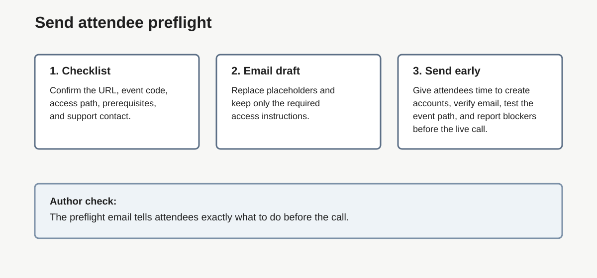
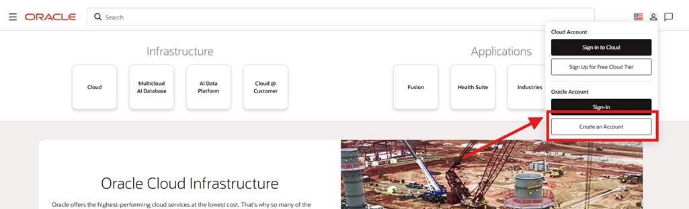
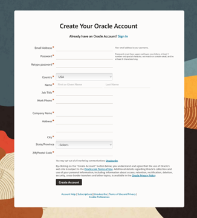

# Lab 4: Send Attendee Preflight Prerequisites

## Introduction

Send attendees only the values verified in [Lab 2](?lab=lab-2-request-livelabs-event-code) and [Lab 3](?lab=lab-3-run-workshop-test-green-button-path). This lab owns the [attendee checklist](#legend) and [preflight email](#legend); it does not redefine the access path.

### Objectives

In this lab, you will:

- Build one concise attendee [prerequisite](#legend) checklist.
- Send a preflight email with the verified URL, event code, and first ready screen.

Estimated Time: 10 minutes



## Task 1: Confirm the Message Contents

1. Include:

    - the exact attendee URL and event code
    - the selected access path
    - Oracle account creation, email verification, and sign-in
    - workshop-specific [prerequisites](#legend) or [connectivity check](#legend) links
    - the expected first ready screen
    - expected provisioning time
    - a [pre-event support contact](#legend)

2. Require each attendee to use their own verified Oracle account. Never share a personal Oracle account or credentials. You can share the instruction below with the customer in the preflight email.
    - How to create an Oracle Account?

    Creating an Oracle account can be summarized in the following two simple steps.
    1.	Navigate to [oracle.com](https://www.oracle.com), click the Account icon, and select Create an Account

    

    2.	Fill out the form and click Create Account

    

3. Tell attendees not to wait until the workshop to create or verify their account.

## Task 2: Send the Preflight Email

1. Copy, complete, and shorten this template as needed:

    ```text
    Subject: Action Required Before the LiveLab: Account and Access Check

    Hello,

    Before the workshop:
    1. Create or confirm your Oracle account and verify its email address.
    2. Sign in to Oracle LiveLabs.
    3. Open [verified attendee URL].
    4. Enter event code [event code].
    5. Follow this access path: [verified attendee steps].
    6. Confirm that you see [first ready screen].
    7. Complete [workshop prerequisite or connectivity check, if required].

    Lab spaces should be ready in [measured time]. [Explain whether they
    start before or during the event and what happens while attendees wait.]

    Do not wait until the workshop to create or verify your Oracle account. [Add the instruction on how to create an Oracle account]
    If a check fails, contact [pre-event support contact] before the session.
    ```

2. Replace every bracketed value and remove anything that does not apply.

3. Send the message early enough for attendees to report blockers.

## Task 3: Record the Handoff

1. Keep the send date, message owner, verified attendee URL, event code, first ready screen, and support contact with the event notes.

## Legend

| Term | Meaning |
| --- | --- |
| Attendee checklist | List of attendee actions required before the event. |
| Connectivity check | Test or link that confirms the attendee network can reach required workshop resources. |
| Connectivity check link | URL attendees can use to test network reachability. |
| Network check | Test that confirms the attendee network can reach required resources. |
| Passkey | Browser or device sign-in method for an Oracle account. |
| Pre-event support contact | Person or alias attendees contact before the session starts. |
| Preflight email | Message sent before the event with required access steps. |
| Prerequisite | Required task or condition attendees complete before the event. |

## Acknowledgements

- **Author:** Oracle LiveLabs Team, July 2026
